# <center>COURSE PROJECT</center>

<p align="center">
    <strong>Universidad Peruana de Ciencias Aplicadas</strong><br>
    </img><br>
    <strong>Ingeniería de Software</strong><br>
    <strong>Aplicaciones Web - 4395</strong><br>
    <strong>Profesor: Angel Augusto Velasquez Nuñez </strong><br>
    <br>INFORME TRABAJO FINAL
</p>

<center>

#### Startup: **SoftCore**
#### Product: **CustomHost**

</center>

### <center>Team  Members:</center>
<center>

| Member                           | Code       |
|----------------------------------|------------|
| Ordoñez Ricaldi, Axel Randall    | U202216827 |
| Panta Castro, Fabrizio Martin    | U20231A810 |
| Ccarita Cruz, Brayan Roberto     | U20221C218 |
| Arrieta Quispe, Alison Jimena    | U202312031 |
| Santiago Peña, Andreow Jomark    | U202317362 |

<br> ABRIL 2025
</center>  

# Registro de Versiones del Informe
<center>

| Version | Fecha | Autor | Descripcion de Modificacion |
| ----------- | ----------- | ----------- | ----------- |
| TB1 | 23/04/2025 | Axel Randall Ordoñez Ricaldi | - Product baclog<br> - Imapct Mapping<br> - Domain Driver Software Architecture |  
| TB1 | 23/04/2025 | Fabrizio Martin Panta Castro | - To-be Scenario Mapping<br> - User Stories<br> - Style Guidelines<br> - Information Architecture |  
| TB1 | 23/04/2025 | Brayan Roberto Ccarita Cruz | - Startup Profile<br> - Solution Profile<br> - Segmentos objetivos<br> - Software Object-Priented Design |  
| TB1 | 23/04/2025 | Alison Jimena Arrieta Quispe | - Competidores<br> - Entrevistas<br> - Landing Page UI Design<br> -  Landing Page|  
| TB1 | 23/04/2025 | Andreow Jomark Santiago Peña | - Needfinding<br> - Ubiquitous Language<br> - Web Application UX/UI Design |

</center>

# Project Report Collaboration Insights
URL del repositorio: https://github.com/SoftCore-App-Web-1ASI0730-2510-4395/CustomHost


# Contenido


[Registro de Versiones del Informe](#registro-de-versiones-del-informe)

[Project Report Collaboration Insights](#project-report-collaboration-insights)

[Student Outcome](#student-outcome)

[Capítulo I: Introducción](#capítulo-i-introducción)

[1.1 Startup Profile](#11-startup-profile)  
[1.1.1. Descripción de la Startup](#111-descripción-de-la-startup)  
[1.1.2. Perfiles de integrantes del equipo](#112-perfiles-de-integrantes-del-equipo)  

[1.2. Solution Profile](#12-solution-profile)  
[1.2.1 Antecedentes y problemática](#121-antecedentes-y-problemática)  
[1.2.2 Lean UX Process.](#122-lean-ux-process)  
[1.2.2.1. Lean UX Problem Statements.](#1221-lean-ux-problem-statements)  
[1.2.2.2. Lean UX Assumptions.](#1222-lean-ux-assumptions)  
[1.2.2.3. Lean UX Hypothesis Statements.](#1223-lean-ux-hypothesis-statements)  
[1.2.2.4. Lean UX Canvas.](#1224-lean-ux-canvas)  

[1.3. Segmentos objetivo.](#13-segmentos-objetivo)  

[Capítulo II: Requirements Elicitation & Analysi](#capítulo-ii-requirements-elicitation--analysis)  

[2.1. Competidores](#21-competidores)  
[2.1.1. Análisis competitivo](#211-análisis-competitivo)  
[2.1.2. Estrategias y tácticas frente a competidores](#211-análisis-competitivo)  

[2.2. Entrevistas](#22-entrevistas)  
[2.2.1. Diseño de entrevistas](#221-diseño-de-entrevistas)  
[2.2.2. Registro de entrevistas](#222-registro-de-entrevistas)  
[2.2.3. Análisis de entrevistas](#223-análisis-de-entrevistas)  

[2.3. Needfinding](#23-needfinding)  
[2.3.1. User Personas](#231-user-personas)  
[2.3.2. User Task Matrix](#232-user-task-matrix)  
[2.3.3. User Journey Mapping](#233-user-journey-mapping)  
[2.3.4. Empathy Mapping](#234-empathy-mapping)  
[2.3.5. As-is Scenario Mapping](#235-as-is-scenario-mapping) 

[2.4. Ubiquitous Language](#24-ubiquitous-language)  

[Capítulo III: Requirements Specificatio](#capítulo-iii-requirements-specification)  

[3.1. To-Be Scenario Mapping](#31-to-be-scenario-mapping)    
[3.2. User Stories](#32-user-stories)  
[3.3. Impact Mapping](#33-impact-mapping)  
[3.4. Product Backlog](#34-product-backlog)  

[Capítulo IV: Product Desig](#capítulo-iv-product-design)  

[4.1. Style Guidelines](#41-style-guidelines)  
[4.1.1. General Style Guidelines](#411-general-style-guidelines)  
[4.1.2. Web Style Guidelines](#412-web-style-guidelines)  

[4.2. Information Architecture](#42-information-architecture)  
[4.2.1. Organization Systems](#421-organization-systems)  
[4.2.2. Labeling Systems](#422-labeling-systems)  
[4.2.3. SEO Tags and Meta Tag](#423-seo-tags-and-meta-tags)  
[4.2.4. Searching Systems](#424-searching-systems)   
[4.2.5. Navigation Systems](#425-navigation-systems)  

[4.3. Landing Page UI Design](#43-landing-page-ui-design)   
[4.3.1. Landing Page Wireframe](#431-landing-page-wireframe)  
[4.3.2. Landing Page Mock-up](#432-landing-page-mock-up) 

[4.4. Web Applications UX/UI Design](#44-web-applications-uxui-design)  
[4.4.1. Web Applications Wireframes](#441-web-applications-wireframes)  
[4.4.2. Web Applications Wireflow Diagrams](#442-web-applications-wireflow-diagrams)  
[4.4.2. Web Applications Mock-ups](#442-web-applications-mock-ups)   
[4.4.3. Web Applications User Flow Diagrams](#443-web-applications-user-flow-diagrams)  

[4.5. Web Applications Prototyping](#45-web-applications-prototyping)  

[4.6. Domain-Driven Software Architecture](#46-domain-driven-software-architecture)  
[4.6.1. Software Architecture Context Diagram](#461-software-architecture-context-diagram)  
[4.6.2. Software Architecture Container Diagrams](#462-software-architecture-container-diagrams)  
[4.6.3. Software Architecture Components Diagrams](#463-software-architecture-components-diagrams)  

[4.7. Software Object-Oriented Design](#47-software-object-oriented-design)  
[4.7.1. Class Diagrams](#471-class-diagrams)  
[4.7.2. Class Dictionary](#472-class-dictionary)  

[4.8. Database Design](#48-database-design)  
[4.8.1. Database Diagram](#481-database-diagram)  

[Capítulo V: Product Implementation, Validation & Deploymen](#capítulo-v-product-implementation-validation--deployment)  

[5.1. Software Configuration Management](#51-software-configuration-management)  
[5.1.1. Software Development Environment Configuration](#511-software-development-environment-configuration)  
[5.1.2. Source Code Management](#512-source-code-management)  
[5.1.3. Source Code Style Guide & Conventions](#513-source-code-style-guide--conventions)  
[5.1.4. Software Deployment Configuration](#514-software-deployment-configuration)  

[5.2. Landing Page, Services & Applications Implementation](#52-landing-page-services--applications-implementation)  
[5.2.X. Sprint ](#52x-sprint-n)  
[5.2.X.1. Sprint Planning n](#52x1-sprint-planning-n)  
[5.2.X.2. Sprint Backlog n](#52x2-sprint-backlog-n)  
[5.2.X.3. Development Evidence for Sprint Review](#52x3-development-evidence-for-sprint-review)  
[5.2.X.4. Testing Suite Evidence for Sprint Review](#52x4-testing-suite-evidence-for-sprint-review)  
[5.2.X.5. Execution Evidence for Sprint Review](#52x5-execution-evidence-for-sprint-review)  
[5.2.X.6. Services Documentation Evidence for Sprint Review](#52x6-services-documentation-evidence-for-sprint-review)  
[5.2.X.7. Software Deployment Evidence for Sprint Review](#52x7-software-deployment-evidence-for-sprint-review)  
[5.2.X.8. Team Collaboration Insights during Sprint](#52x8-team-collaboration-insights-during-sprint)  

[5.3. Validation Interviews](#53-validation-interviews)  
[5.3.1. Diseño de Entrevistas](#531-diseño-de-entrevistas)  
[5.3.2. Registro de Entrevistas](#532-registro-de-entrevistas)  
[5.3.3. Evaluaciones según heurísticas](#533-evaluaciones-según-heurísticas)  

[5.4. Video About-the-Product](#54-video-about-the-product)  

[Conclusiones](#conclusiones)  
[Conclusiones y recomendaciones](#conclusiones-y-recomendaciones)  
[Video About-the-Team](#video-about-the-team)  
[Bibliografía](#bibliografía)  
[Anexos](#anexos)  

# Student Outcome
|Criterio Especifico|Acciones Realizadas|Conclusiones|
|-|-|-|
|Trabaja en equipo para proporcionar liderazgo en forma conjunta.|Compañero Axel Ordoñez:<br> *TB1:*  Colaboró activamente en la planificación del proyecto, especialmente en las secciones relacionadas con Lean UX Process, análisis de competidores, To-Be Scenario Mapping y diagramas técnicos (contenedores, contexto y base de datos). Ayudó a revisar y mejorar partes del informe antes de la entrega final.*TP1:* Participó en el desarrollo frontend del sistema, colaboró en la versión corregida y mejorada de artefactos previos, y apoyó en la documentación técnica del producto. Además, contribuyó en la evidencia de desarrollo, ejecución y despliegue del sistema. Compañero Fabrizio Panta:<br> *TB1:*  Realizó entrevistas, empathy map, user task matrix, product backlog e impact map. También participó en la definición de style guidelines, diseño de wireframes y mockups del frontend web application.  *TP1:* Desarrolló componentes clave del frontend, implementó correcciones basadas en retroalimentación recibida, y trabajó en la documentación visual del diseño UX/UI, incluyendo wireframes actualizados y user flow mejorados. Compañero Roberto Ccarita:<br> *TB1:* Contribuyó en la elaboración de User Personas, Empathy Map y análisis competitivo. Apoyó en el diseño del landing page y su posterior despliegue.  *TP1:* Desarrolló componentes asignados del frontend, aplicó correcciones al report project y ayudó a mantener una dinámica colaborativa dentro del equipo durante el desarrollo del TP1.Compañero Alison Arrieta:<br> *TB1:* Participó en la investigación de competidores, redacción de entrevistas, diseño del landing page y su despliegue inicial.  *TP1:* Lideró la mejora del landing page, integró feedback del TB1 y colaboró en la conexión entre diseño UX/UI y funcionalidades desarrolladas en el frontend. Compañero Andreow Santiago:<br> *TB1:*Contribuyó en la definición de Needfinding, Ubiquitous Language y diseño UX/UI del sistema. Participó en la planificación de sprints iniciales y en la organización de tareas.*TP1:*Implementó user stories en el frontend, trabajó en la conexión entre diseño y lógica funcional, y aplicó correcciones técnicas para mejorar la calidad del producto entregado.|Durante los entregables TB1 y TP1, todos los integrantes demostraron habilidades efectivas de trabajo en equipo, combinando esfuerzos individuales para lograr un liderazgo compartido. Si bien uno de los miembros asumió formalmente el rol de coordinador, todos aportaron desde sus áreas de especialización, promoviendo una dinámica colaborativa que permitió avanzar ordenadamente en el desarrollo del proyecto. La capacidad de escuchar, delegar y apoyarse mutuamente fue clave para superar desafíos técnicos y organizativos.|
|Crea un entorno colaborativo e inclusivo, establece metas, planifica tareas y cumple objetivos.|Compañero Axel Ordoñez:<br> *TB1:* Estableció metas claras en el área técnica del proyecto, especialmente en la parte de arquitectura del software. Ayudó a distribuir tareas entre los compañeros y aseguró que todos tuvieran acceso a información relevante.   *TP1:*Revisó y actualizó la planificación del equipo tras recibir retroalimentación, asegurándose de que se cumplieran los plazos y se alcanzaran los objetivos técnicos del Sprint 2. Compañero Fabrizio Panta:<br> *TB1:*Colaboró en la definición de objetivos del proyecto, especialmente en el diseño UX/UI y creación de artefactos visuales. Su participación fue clave para estructurar las primeras versiones del frontend. *TP1:*Ajustó la planificación del equipo para adaptarse a nuevas necesidades, supervisó el cumplimiento de tareas asignadas y reforzó el ambiente colaborativo mediante reuniones constantes y revisiones grupales. Compañero Brayan Ccarita:<br> *TB1:*Ayudó en la planificación de aspectos visuales del producto y colaboró en la mejora del landing page. Participó en reuniones de seguimiento para asegurar el avance del equipo *TP1:*Cumplió con sus tareas técnicas asignadas, ayudó a mantener reuniones efectivas y propuso soluciones prácticas durante el desarrollo frontend, lo cual contribuyó al cumplimiento de objetivos comunes. Compañero Alison Arrieta:<br> *TB1:*Fue clave en la definición de metas relacionadas con la experiencia de usuario. Trabajó en la planificación del diseño del sistema y aseguró que cada miembro comprendiera su rol en el avance del proyecto.  *TP1:*Refinó el diseño del landing page, ayudó a priorizar tareas del frontend y fomentó un entorno colaborativo y respetuoso dentro del equipo.Compañero Andreow Santiago:<br> *TB1:*Ayudó a establecer objetivos generales del proyecto, especialmente en la conexión entre diseño UX/UI y desarrollo técnico. Participó en la planificación de sprints iniciales. *TP1:*Se encargó de priorizar tareas técnicas, aplicó correcciones del TB1 y mantuvo una actitud proactiva en la búsqueda de soluciones técnicas que permitieran cumplir los objetivos del sprint.|El equipo logró crear un entorno colaborativo e inclusivo donde cada miembro pudo participar activamente en la planificación y ejecución de tareas. Las metas fueron claramente definidas desde el inicio y se trabajó con compromiso para alcanzarlas. La distribución equitativa de roles, el seguimiento constante y la adaptación a nuevas necesidades permitieron cumplir los objetivos establecidos tanto en TB1 como en TP1. Este enfoque colaborativo sentó las bases para futuros entregables, consolidando una dinámica sólida y profesional dentro del equipo|
# Capítulo I: Introducción
## 1.1. Startup Profile
### 1.1.1. Descripción de la Startup

SoftCore es una prometedora startup conformada por estudiantes de la Universidad Peruana de Ciencia Aplicadas (UPC) en Lima, Perú, unidos por la visión de transformar la experiencia hotelera a través de la tecnología. Este equipo combina su conocimiento en desarrollo de software, diseño de interfaces y gran interes en la industria hotelera para crear una innovadora aplicación de gestión. Su objetivo principal es empoderar a los huéspedes, permitiéndoles personalizar su estadía y convertir cada habitación en un espacio inteligente y adaptado a sus preferencias individuales.

La propuesta de SoftCore se centra en la integración de tecnologías emergentes como el Internet de las Cosas (IoT), la biometría y la domótica. A través de su aplicación, los usuarios podrán definir sus preferencias antes o durante su llegada al hotel, lo que se traducirá en un entorno de habitación que responda automáticamente a sus necesidades. Esta solución no solo busca mejorar la comodidad y satisfacción del huésped, sino también proporcionar al personal administrativo herramientas eficientes para gestionar estas preferencias y optimizar las operaciones del hotel.

Con un enfoque inicial en el mercado hotelero de Lima, SoftCore aspira a convertirse en un referente de la innovación en el sector. La mentalidad disruptiva forma parte de nuestra filosofía y gracias a esto es posible abordar los desafíos de la industria con soluciones creativas y centradas en el usuario. La startup busca demostrar cómo la tecnología puede elevar la experiencia del cliente y generar valor tanto para los huéspedes como para los establecimientos hoteleros, marcando el camino hacia una nueva era de "hoteles inteligentes" en la capital peruana.

#### 1.1.2. Perfiles de integrantes del equipo
|Miembros del equipo | Codigo Estudiante | Carrera | Conocimientos / Habilidades |
|-|-|-|-|
|Ordoñez Ricaldi, Axel Randall 	|U202216827|Ingenieria de software|C++, SQL, MongoDB, Python. Paciencia y buen trabajo en equipo|
|Panta Castro, Fabrizio Martin 	|U20231A810|Ingenieria de software|SQL, Pyhton, C++. Compañerismo y responsable con las entregas.|
|Ccarita Cruz, Brayan Roberto 	|U20221C218|Ingenieria de software|Astro.js, Svelte, Golang, Design Sprint. Perseverante y puntual|
| Arrieta Quispe, Alison Jimena  | U202312031 |  Ingeniería de Software |  MySql, C++, C#, Docker, Java, JavaScript. Responsable y Trabajadora. |
| Santiago Peña, Andrew Joamrk | U202317362 |Ingenieria de software | MySql, C++, C#, Docker, Perseverante y buen trabajo en equipo. |


## 1.2. Solution Profile
### 1.2.1 Antecedentes y problemática

La industria hotelera ha experimentado una notable evolución tecnológica, donde la implementación de soluciones digitales se ha vuelto crucial para mejorar tanto la eficiencia operativa como la experiencia del cliente. Inicialmente, los sistemas eran manuales, progresando hacia los Sistemas de Gestión de Propiedades (PMS) y, más tarde, a soluciones en la nube. Hoy en día, la inteligencia artificial (IA) está transformando el sector, optimizando procesos y personalizando la interacción con los huéspedes. Sin embargo, la adopción de estas tecnologías, especialmente en lugares como Lima, enfrenta desafíos relacionados con la inversión y la infraestructura (Analysis of Eco-Innovations in Peruvian Accommodation Establishments, 2023).

La personalización se ha convertido en una expectativa fundamental para los viajeros, quienes buscan experiencias adaptadas a sus preferencias. El Internet de las Cosas (IoT) juega un papel esencial al permitir la adaptación de las habitaciones a las necesidades individuales y al agilizar procesos como el check-in y el servicio en la habitación. A pesar de los beneficios, la implementación de IoT presenta retos como los costos iniciales y las preocupaciones de seguridad (Analysis of Eco-Innovations in Peruvian Accommodation Establishments, 2023).

La pandemia de COVID-19 generó una drástica caída en el turismo peruano, evidenciada en el desplome de las llegadas de huéspedes tanto nacionales como extranjeros en el año 2020. Los datos del MINCETUR muestran que los arribos de turistas nacionales se redujeron significativamente de 54.9 millones en 2019 a tan solo 34.6 millones en 2020, mientras que el turismo extranjero experimentó un descenso aún más alarmante, pasando de 8.3 millones a un mínimo histórico de 1.8 millones en el mismo periodo (MINCETUR, 2024). Si bien en los años posteriores se observa una tendencia de recuperación gradual en ambos segmentos, con un aumento constante en las cifras de arribos, aún no se alcanzan los niveles prepandemia, especialmente en el caso del turismo internacional. Esta situación resalta la necesidad de revitalizar el sector a través de la innovación, donde la Inteligencia Artificial (IA) y la domótica emergen como herramientas clave. La IA puede personalizar la experiencia del viajero, optimizar la gestión de recursos y predecir tendencias, mientras que la domótica puede mejorar la eficiencia y el confort en los alojamientos, ofreciendo experiencias más seguras, personalizadas y atractivas para los visitantes en la nueva normalidad.

Por lo tanto, existe una necesidad continua de que los hoteles en Lima adopten e integren tecnologías avanzadas para personalizar la experiencia del huésped y mejorar la eficiencia. A pesar de los desafíos económicos y de infraestructura, la transformación digital y la adopción de IoT son fundamentales para satisfacer las expectativas de los turistas y mantener la competitividad en el mercado hotelero.

### 1.2.2 Lean UX Process.
#### 1.2.2.1. Lean UX Problem Statements.
Nuestro contexto demanda soluciones tecnológicas innovadoras para optimizar la experiencia hotelera de los huéspedes, permitiéndoles personalizar su entorno y disfrutar de una estadía adaptada a sus necesidades individuales. A través de nuestra aplicación de gestión hotelera, buscamos brindar una plataforma integral que permita a los usuarios ingresar sus preferencias y que estas se traduzcan en una habitación inteligente y personalizada desde el momento en que reciben la llave.

Hemos observado un factor importante que afecta la satisfacción de los huéspedes, el cual se manifiesta en la falta de personalización y adaptación de las habitaciones a sus gustos y requerimientos específicos, limitando la sensación de confort y exclusividad durante su estadía.

¿Cómo podemos desarrollar una aplicación de gestión hotelera que se adapte a las necesidades individuales de cada huésped, integrando tecnologías como IoT, biometría y domótica para ofrecer una experiencia personalizada y optimizada en hoteles inteligentes de Lima?
#### 1.2.2.2. Lean UX Assumptions.
##### Business Assumptions

|Assumption|Description|
|-|-|
| Aumento de satisfacción      | La aplicación incrementará la satisfacción del cliente, promoviendo su fidelización y recomendaciones.        |
| Rentabilidad de IoT          | La inversión en domótica e IoT será rentable a mediano plazo por la diferenciación y optimización de recursos.|
| Adaptación del personal      | El personal administrativo podrá adaptarse fácilmente al dashboard y usarlo en su rutina diaria.              | 
| Colaboración con proveedores | Habrá una cooperación fluida con proveedores de domótica para integración y mantenimiento.                    |
| Diferenciación competitiva   | La idea de un "hotel inteligente" destacará frente a otros hoteles en Lima.                                   |
| Versión móvil eficiente      | La versión móvil facilitará la interacción del huésped en todas las etapas de su experiencia.                 |


##### User Assumptions
|Assumption|Description|
|-|-|
| Interés en personalización | Los turistas estarán interesados en la propuesta de personalización vía app.           |
| Valoración del control     | Los huéspedes valorarán poder manejar aspectos como luz o temperatura desde su celular.|
| Facilidad de uso           | Los usuarios verán la app como intuitiva y fácil de usar.                              |
| Confianza en biometría     | Habrá confianza en el uso de tecnología biométrica para acceso y personalización.      |
| Tiempo para configurar     | Los turistas estarán dispuestos a configurar preferencias antes o al llegar.           |
| Percepción de valor        | Los huéspedes verán el hotel inteligente como un valor agregado significativo.         |
#### 1.2.2.3. Lean UX Hypothesis Statements.
1. Creemos que ofrecer a los huéspedes la capacidad de personalizar su habitación a través de una aplicación móvil antes de su llegada aumentará su satisfacción general con la estadía.
Sabremos que hemos tenido éxito cuando observemos un aumento del 15% en las puntuaciones de satisfacción del cliente relacionadas con la comodidad y personalización de la habitación en las encuestas post-estancia.

2. Creemos que la implementación de un dashboard intuitivo para el personal administrativo que centralice las preferencias de los huéspedes optimizará la gestión del hotel y reducirá el tiempo dedicado a tareas relacionadas con la personalización de habitaciones.
Sabremos que hemos tenido éxito cuando el personal administrativo reporte una reducción del 10% en el tiempo promedio dedicado a la preparación y ajuste de las habitaciones según las preferencias de los huéspedes.

3. Creemos que la integración de tecnología biométrica para el acceso a la habitación y la personalización del entorno aumentará la percepción de seguridad y exclusividad entre los huéspedes.
Sabremos que hemos tenido éxito cuando al menos el 80% de los huéspedes que utilicen la función biométrica la califiquen positivamente en términos de seguridad y conveniencia en las encuestas post-estancia.

4. Creemos que ofrecer control domótico de la habitación a través de la aplicación (iluminación, temperatura, etc.) mejorará la comodidad y la experiencia general de los huéspedes durante su estadía.
Sabremos que hemos tenido éxito cuando observemos un aumento del 20% en el uso de las funciones de control domótico dentro de la aplicación por parte de los huéspedes activos.

5. Creemos que al proporcionar una plataforma que permite a los proveedores de domótica monitorear el funcionamiento de sus dispositivos en tiempo real, se facilitará el mantenimiento preventivo y se minimizarán los problemas técnicos en las habitaciones.
Sabremos que hemos tenido éxito cuando se registre una disminución del 5% en el número de reportes de fallas de los dispositivos de domótica en las habitaciones inteligentes.

6. Creemos que la disponibilidad de una versión móvil de la aplicación aumentará la interacción de los huéspedes con la plataforma antes, durante y después de su estadía, fomentando la exploración de los servicios del hotel y posibles reservas futuras.
Sabremos que hemos tenido éxito cuando observemos un aumento del 10% en el número de usuarios activos en la versión móvil de la aplicación y un incremento del 5% en las consultas o reservas realizadas a través de la misma.
#### 1.2.2.4. Lean UX Canvas.


## 1.3. Segmentos objetivo.
##### Segmento 1: Huéspedes que desean hospedarse en un hotel

Este segmento incluye a individuos de diversos perfiles demográficos y socioeconómicos que tienen la necesidad o el deseo de alojarse en un hotel en Lima, ya sea por motivos de turismo, negocios u otros.

**Características demográficas:**

- **Rango de edad:** Amplio, desde jóvenes adultos hasta personas mayores.
- **Geografía:** Principalmente turistas nacionales e internacionales que visitan Lima, así como residentes locales que buscan una experiencia diferente.
- **Intereses:** Búsqueda de comodidad, conveniencia, experiencias personalizadas y, específicamente para nuestro caso, interés en la innovación tecnológica y la domótica en hoteles.

**Problema:** Estos huéspedes buscan una experiencia hotelera que vaya más allá de la simple pernoctación, deseando un entorno que se adapte a sus preferencias individuales para una estadía más confortable y memorable.

##### Segmento 2: Personal administrativo del hotel

Este segmento comprende a los empleados del hotel encargados de la gestión operativa, la atención al cliente y el mantenimiento de las instalaciones.

**Características demográficas:**

- **Roles:** Gerentes, recepcionistas, personal de mantenimiento, personal de limpieza, etc.
- **Necesidades:** Herramientas eficientes para la gestión de reservas, la atención a los huéspedes, la organización de las habitaciones y el seguimiento del estado de los dispositivos.
- **Objetivos:** Optimizar la eficiencia operativa, mejorar la satisfacción del cliente y reducir la carga de trabajo manual.

**Problema:** El personal del hotel tiene problemas para saber qué le gusta a cada huésped y asegurarse de que su estadía sea tal como la prefieren. Esto es difícil porque no tienen un sistema fácil y único para guardar y usar esa información.

##### Segmento 3: Proveedores de dispositivos de domótica

Este segmento incluye a las empresas que desarrollan, fabrican y distribuyen dispositivos y sistemas de domótica (iluminación inteligente, control de temperatura, cerraduras electrónicas, etc.).

**Características demográficas:**

- **Tipo de empresas:** Desde startups tecnológicas hasta grandes corporaciones especializadas en IoT y automatización del hogar/edificios.
- **Intereses:** Expandir su mercado, integrar sus productos en nuevos entornos (como hoteles), obtener datos sobre el rendimiento de sus dispositivos en un contexto de uso real y establecer alianzas estratégicas.

**Problema:** Estos proveedores buscan canales efectivos para introducir sus tecnologías en el sector hotelero y necesitan plataformas que faciliten la integración y el monitoreo de sus dispositivos en las instalaciones de sus clientes.

---

# Capítulo II: Requirements Elicitation & Analysis
## 2.1. Competidores.
### 2.1.1. Análisis competitivo.

| Competitive Analysis Landscape                          |  |
| ------------------------------------------------------- | -|
| ¿Por qué llevar a cabo este análisis?                   | Para identificar cómo Custom Host puede diferenciarse en el mercado de hotelería inteligente en Lima, aprovechando su enfoque único en personalización con IoT/biométrica - algo que competidores como INTELITY (solo software) y Cloudbeds (gestión genérica) no ofrecen. El análisis revela oportunidades clave: dominar el nicho de hoteles boutique tecnológicos y crear alianzas estratégicas con proveedores de domótica, mientras se evitan los altos costos de competir directamente con soluciones masivas ya establecidas. |


| |  | Custom Host (Nosotros) | INTELITY | ALICE Platform |Cloudbeds |
|-|-|-|-|-|-|
| PERFIL| Overview | Custom Host es una plataforma innovadora que utiliza IoT y biométrica para personalizar la experiencia hotelera, ajustando automáticamente las habitaciones según las preferencias del huésped. | INTELITY es una plataforma de gestión hotelera enfocada en mejorar el engagement con los huéspedes a través de una app móvil y automatización de servicios.	 | ALICE es un software diseñado para optimizar las operaciones hoteleras, desde reservas hasta mantenimiento, mejorando la eficiencia del personal.	 | Cloudbeds es una solución de gestión hotelera en la nube que combina administración de propiedades, reservas y distribución en una sola plataforma.|
|| Ventaja competitiva ¿Qué valor ofrece a los clientes? | Ofrece adaptación en tiempo real mediante domótica, creando un entorno único que mejora la satisfacción del cliente y simplifica la gestión para los hoteles.| Su integración con sistemas PMS líderes la hace ideal para cadenas hoteleras que buscan una solución tecnológica robusta y escalable.|Su fortaleza radica en la gestión interna, ayudando a hoteles a organizar tareas y comunicarse mejor con empleados y huéspedes.|Destaca por su interfaz intuitiva y su capacidad para integrarse con más de 500 canales de distribución, como Booking y Expedia.|
|| Mercado Objetivo                                        |Se dirige a hoteles boutique y de lujo en Lima, especialmente aquellos que atraen a huéspedes interesados en tecnología y experiencias personalizadas.| Cadenas hoteleras internacionales que necesitan herramientas para gestionar múltiples propiedades de manera eficiente.| Hoteles medianos y grandes, principalmente en EE.UU. y Europa, que buscan simplificar sus procesos operativos. | Hoteles boutique y propiedades independientes que necesitan una herramienta completa y fácil de usar.|
| Perfil de marketing                                     | Estrategia de Marketing | Se centra en alianzas con proveedores de IoT y en destacar su propuesta de "experiencia única" a través de redes sociales y demostraciones interactivas. | Enfoque B2B, con ventas directas a grandes hoteles y participación en ferias del sector. |Webinars y casos de éxito para demostrar su impacto en la productividad hotelera. | Marketing digital y presencia en eventos de la industria para promover sus soluciones. |
| Perfil del producto| Productos y servicios | Incluye una app móvil para huéspedes, un dashboard administrativo y dispositivos IoT para habitaciones inteligentes. | App para huéspedes, API para integraciones personalizadas y herramientas de gestión operativa. | Software para staff, app de huésped y herramientas de coordinación de equipos. |Gestión de reservas, distribución multicanal, informes de desempeño y herramientas de revenue management.|
|| Precios y costos                                        |  Modelo freemium con opciones de suscripción basadas en el número de habitaciones adaptadas. | Licencia anual por hotel, con costos que varían según el tamaño y necesidades de la propiedad. | Basado en el número de habitaciones, con planes adaptables a diferentes tamaños de propiedades. | Tarifa dinámica con planes "Pro" y "360", ajustables según las necesidades del hotel. |
|| Canales de distribución (Web y/o Móvil)                 | Disponible en web y móvil (iOS/Android), facilitando el acceso tanto para huéspedes como para el personal del hotel. | App propia y compatibilidad con sistemas PMS existentes. | Plataforma web y app móvil para acceso remoto. | Plataforma web y móvil, accesible desde cualquier dispositivo.|
### 2.1.2. Estrategias y tácticas frente a competidores.


|Competidores ->|  | Custom Host (Nosotros) | INTELITY| ALICE Platform| Cloudbeds |
|-|-|-|-|-|-|
| Análisis SWOT | Fortalezas | Custom Host destaca por su uso de IoT y biométrica para personalizar automáticamente las habitaciones, junto con un dashboard que simplifica la gestión hotelera, ofreciendo una ventaja competitiva en el mercado de hotelería personalizada | INTELITY es líder en soluciones de guest engagement, con una app móvil robusta y alta integración con sistemas de gestión hotelera (PMS). Su presencia global lo hace atractivo para cadenas internacionales. | ALICE se especializa en optimizar operaciones hoteleras, ayudando al personal con gestión de tareas, mantenimiento y comunicación interna. Es una solución eficiente para hoteles medianos y grandes. | Cloudbeds destaca por su interfaz intuitiva y su capacidad de integración con múltiples canales de distribución (Booking, Expedia). Es ideal para hoteles boutique que buscan una solución todo-en-uno. |
|| Debilidades   | El alto costo de implementación de dispositivos IoT puede ser una barrera para hoteles pequeños. Además, al ser un modelo nuevo, requiere convencer a los hoteles de adoptar tecnología avanzada, lo que puede ralentizar su expansión inicial. | No ofrece personalización física de habitaciones (domótica avanzada), y sus precios pueden ser prohibitivos para hoteles pequeños o independientes. | No se enfoca en la experiencia directa del huésped, lo que limita su atractivo frente a competidores como Custom Host. | No incluye personalización física (IoT), y su modelo de tarifas dinámicas puede ser menos accesible para propiedades pequeñas. | 
|| Oportunidades | El creciente interés en hoteles inteligentes en Lima y la demanda de experiencias personalizadas representan una ventana clave para posicionarse. Alianzas con proveedores de domótica y cadenas boutique podrían acelerar su adopción. | Podría expandirse en mercados emergentes como Latinoamérica, donde la hotelería de lujo busca innovación tecnológica. | La automatización con IA y la expansión en hoteles corporativos podrían fortalecer su propuesta. | El mercado de hoteles independientes sigue creciendo, y su flexibilidad le permite adaptarse a nuevas demandas, como herramientas de revenue management. | 
|| Amenazas      | Competidores establecidos como INTELITY y Cloudbeds ya tienen presencia en el mercado, y la resistencia al cambio en hoteles tradicionales podría limitar su crecimiento. | La creciente competencia en software hotelero y el avance de soluciones basadas en voz (como Volara) podrían reducir su ventaja. | La saturación de PMS genéricos y el surgimiento de plataformas más especializadas representan riesgos para su crecimiento. | Las grandes OTAs (como Booking.com) están desarrollando sus propios sistemas de gestión, lo que podría reducir su participación en el mercado. |

## 2.2. Entrevistas.
### 2.2.1. Diseño de entrevistas.
**Preguntas generales:**
En esta sección realizamos preguntas simples para obtener datos demográficos e información de comportamientos clave, como el navegador y dispositivos que utilizan los entrevistados.

1. ¿Cuál es su nombre? 
2. ¿Qué edad tiene? 
3. ¿A qué se dedica? 
4. ¿Qué navegador y dispositivos utiliza con mayor frecuencia? 

Las siguientes preguntas buscan responder nuestra hipótesis central, mencionada en el capítulo anterior:
"¿Los usuarios estarán interesados en nuestra propuesta innovadora, considerando que existen alternativas similares y que realmente la necesitan?"
(Previo a las entrevistas, se recopiló información básica como el distrito de residencia o procedencia de los usuarios para facilitar el contacto).

**Entrevistas usuario segmento (Huéspedes de hoteles)**
Esta sección de preguntas se enfoca en el punto de vista de los usuarios del segmento huéspedes que desean hospedarse en un hotel.

1. ¿Con qué frecuencia se hospeda en hoteles?
2. ¿Qué aspectos valora más al elegir un hotel?
3. ¿Ha utilizado hoteles con sistemas innovadores?
4. ¿Qué frustraciones ha tenido en sus estadías?
5. ¿Cómo preferiría interactuar con los servicios del hotel?
6. ¿Estaría dispuesto a pagar más por una experiencia adaptada a sus preferencias?  

**Entrevistas usuario segmento (Personal administrativo del hotel)**
Esta sección de preguntas se enfoca en el punto de vista de los usuarios del segmento personal administrativo del hotel.

1. ¿Qué rol desempeña en el hotel?  
2. ¿Cómo registran actualmente las preferencias de los huéspedes?
3. ¿Qué dificultades enfrentan para ofrecer una experiencia personalizada?
4. ¿Cómo gestionan la comunicación entre áreas?
5. ¿Qué tecnologías les gustaría implementar para optimizar procesos?
6. ¿Qué obstáculos ven para adoptar soluciones innovadoras? 
7. ¿Creen que los huéspedes demandan más personalización?

### 2.2.2. Registro de entrevistas.
**Segmento 1**  
Nombre: Fernando San José Zamora Solís 
Edad: 24 años 
Ocupación: Practicante de ingenieria de software
Browser: GoogleChrome y OperaGX
Device: Celular y computadora
Distrito: Jesus Maria
Timing:    


**[Entrevista a Uri (Anexo 2.2.1.1)](https://upcedupe-my.sharepoint.com/:v:/g/personal/u202317362_upc_edu_pe/ETQAkMt6M7VHppn0V_2yowMB4lImpb1OLwaovBnNoPKKhg?e=qYLctj&nav=eyJyZWZlcnJhbEluZm8iOnsicmVmZXJyYWxBcHAiOiJTdHJlYW1XZWJBcHAiLCJyZWZlcnJhbFZpZXciOiJTaGFyZURpYWxvZy1MaW5rIiwicmVmZXJyYWxBcHBQbGF0Zm9ybSI6IldlYiIsInJlZmVycmFsTW9kZSI6InZpZXcifX0%3D)**  
 minuto [00:00]

Fernando San José, estudiante de ingeniería de software, valora en los hoteles la comodidad y buena relación calidad-precio. Aunque no ha usado hoteles con tecnología avanzada, critica los sistemas anticuados de comunicación, como cuando el teléfono de su habitación no funcionó y tuvieron que enviar personal.

Prefiere interactuar con el hotel mediante una app móvil y le interesaría probar pantallas táctiles en la habitación. Estaría dispuesto a pagar más por personalización (clima, iluminación) y sería cliente recurrente si un hotel ofreciera estas innovaciones.

---
Nombre: Alessandra Becerra
Edad: 18 años 
Ocupación: estudiante de ingenieria de software
Browser: Safari y windows
Device: Celular Iphone y laptop
Distrito: San miguel
Timing:   


[Uri entrevista [Anexo 2.2.1.2]](https://upcedupe-my.sharepoint.com/:v:/g/personal/u202317362_upc_edu_pe/EW8bbyowHHNGvrGNiIjfFlwB-Q3bTBRaSvZlTXGKRC2L7w?e=R9zBK3&nav=eyJyZWZlcnJhbEluZm8iOnsicmVmZXJyYWxBcHAiOiJTdHJlYW1XZWJBcHAiLCJyZWZlcnJhbFZpZXciOiJTaGFyZURpYWxvZy1MaW5rIiwicmVmZXJyYWxBcHBQbGF0Zm9ybSI6IldlYiIsInJlZmVycmFsTW9kZSI6InZpZXcifX0%3D) minuto [00:01]

Alessandra Becerra busca hoteles limpios, con buen WiFi y que acepten mascotas. Critica los sistemas anticuados, especialmente las demoras en check-in y la mala señal de internet. Preferiría usar una app para servicios básicos, pero manteniendo atención humana cuando sea necesario. Le interesaría probar tecnologías como tablets en las habitaciones y pagaría más por servicios que ahorren tiempo y ofrezcan mayor comodidad. Sus experiencias reflejan problemas comunes en hoteles tradicionales que podrían solucionarse con mejor tecnología.

---
Nombre: Luis Cordova
Edad: 25 años 
Ocupación: Data Science 
Browser: Google chrome
Device: computadora y celular
Distrito: San Borja
Timing:   


[Uri entrevista [Anexo 2.2.1.2]](https://upcedupe-my.sharepoint.com/personal/u202317362_upc_edu_pe/_layouts/15/stream.aspx?id=%2Fpersonal%2Fu202317362%5Fupc%5Fedu%5Fpe%2FDocuments%2FSegmento%201%20%2D%20Luis%20Cordova%2Emp4&nav=eyJyZWZlcnJhbEluZm8iOnsicmVmZXJyYWxBcHAiOiJTdHJlYW1XZWJBcHAiLCJyZWZlcnJhbFZpZXciOiJTaGFyZURpYWxvZy1MaW5rIiwicmVmZXJyYWxBcHBQbGF0Zm9ybSI6IldlYiIsInJlZmVycmFsTW9kZSI6InZpZXcifX0&ga=1&referrer=StreamWebApp%2EWeb&referrerScenario=AddressBarCopied%2Eview%2Ee82cd9e2%2D078e%2D4cb0%2D80cf%2D3200ebfdab04) minuto [00:03]

Luis, profesional de Data Science de 25 años, busca hoteles con comodidad y precios razonables para sus viajes de trabajo. Critica los sistemas obsoletos que usan cuadernos físicos y WhatsApp para gestiones, y relata problemas con reservas no cumplidas. Preferiría controlar los servicios mediante asistentes de voz o pantallas táctiles en lugar de los métodos tradicionales. Estaría dispuesto a pagar más por una verdadera personalización que optimice su experiencia como viajero frecuente. Sus experiencias destacan la necesidad urgente de modernizar los sistemas hoteleros con tecnología práctica.

---
**Segmento 2**  
Nombre: David Gallo
Edad: 22 años 
Ocupación: Administracion hotelera
Browser: Safari
Device: Macbook y Iphone
Distrito: San Isidro
Timing:     


[Uri entrevista [Anexo 2.2.1.2]](https://upcedupe-my.sharepoint.com/:v:/g/personal/u202317362_upc_edu_pe/ETgSUSNEantAraWk1atoAa4BjISZsufjnztzz_iJVxGXAg?e=oxnXyR&nav=eyJyZWZlcnJhbEluZm8iOnsicmVmZXJyYWxBcHAiOiJTdHJlYW1XZWJBcHAiLCJyZWZlcnJhbFZpZXciOiJTaGFyZURpYWxvZy1MaW5rIiwicmVmZXJyYWxBcHBQbGF0Zm9ybSI6IldlYiIsInJlZmVycmFsTW9kZSI6InZpZXcifX0%3D) minuto [00:04]

David trabaja en front desk y atención al cliente, usando principalmente Safari en sus dispositivos Apple. Actualmente, registran las preferencias de los huéspedes (como vista al mar o tipo de cama) de forma manual, memorizando datos o anotando en libretas, lo que genera errores en temporadas altas. La comunicación entre áreas se gestiona mediante grupos de WhatsApp, un sistema que considera limitado.

Reconoce que los huéspedes demandan más personalización y que un sistema digitalizado agilizaría las reservas y preferencias. Le gustaría implementar una plataforma centralizada, pero identifica el costo como principal obstáculo. Aún así, confía en que su equipo (mayormente joven) podría adaptarse fácilmente a nuevas tecnologías que mejoren la experiencia del cliente y optimicen sus procesos internos.

---
Nombre: Alex Avila
Edad: 20 años 
Ocupación: Administrador hotelero
Browser: Opera gx y windows
Device: laptop y telefono android
Distrito: Jesus Maria
Timing:  


[Uri entrevista [Anexo 2.2.1.2]](https://upcedupe-my.sharepoint.com/:v:/g/personal/u202317362_upc_edu_pe/EU9qNutqfIdAlN0FVSU5avIBOmL9Y3mwIx2kCBAuGyURhw?e=Vb6lwq&nav=eyJyZWZlcnJhbEluZm8iOnsicmVmZXJyYWxBcHAiOiJTdHJlYW1XZWJBcHAiLCJyZWZlcnJhbFZpZXciOiJTaGFyZURpYWxvZy1MaW5rIiwicmVmZXJyYWxBcHBQbGF0Zm9ybSI6IldlYiIsInJlZmVycmFsTW9kZSI6InZpZXcifX0%3D) minuto [00:02]

Alex trabaja en la administración de un hotel donde actualmente no existe un sistema para registrar preferencias de huéspedes, solo asignan habitaciones básicas (como vista a la calle) sin personalización. La comunicación entre áreas se maneja de forma tradicional, con asignación verbal de tareas y llamadas directas, sin plataformas digitales.

Reconoce que los huéspedes demandan más personalización, pero enfrentan dos obstáculos principales: sistemas anticuados y resistencia al cambio por parte del personal. Le gustaría implementar mejor control de empleados y actualizar su webcam, pero señala que la adaptación a nuevas tecnologías es lenta. Aunque algunos clientes frecuentes reciben trato personalizado (por memoria del staff), nuevos huéspedes no acceden a estos beneficios por falta de sistemas digitales.

---

Nombre: Claudia Sifuentes
Edad: 28 años 
Ocupación: Gerente de operaciones hotelera  
Browser: Firefox
Device: Laptop
Distrito: Lince
Timing:  


[Uri entrevista [Anexo 2.2.1.2]](https://upcedupe-my.sharepoint.com/:v:/g/personal/u202317362_upc_edu_pe/EY3QHbePejVFhy4Lxa49_84BAwjrm9Pk8aQZWCyGwuz63Q?e=BSpEnp&nav=eyJyZWZlcnJhbEluZm8iOnsicmVmZXJyYWxBcHAiOiJTdHJlYW1XZWJBcHAiLCJyZWZlcnJhbFZpZXciOiJTaGFyZURpYWxvZy1MaW5rIiwicmVmZXJyYWxBcHBQbGF0Zm9ybSI6IldlYiIsInJlZmVycmFsTW9kZSI6InZpZXcifX0%3D) minuto [00:02]

Claudia Cifuentes, supervisora de operaciones en hotelería, revela los desafíos tecnológicos de su establecimiento. Aunque utilizan un CRM básico para registrar preferencias de huéspedes, admite que su implementación es irregular y que el personal carece de capacitación adecuada para aprovecharlo. La comunicación interna sigue siendo arcaica, dependiendo principalmente de correos electrónicos y reuniones presenciales.

Claudia identifica dos soluciones clave: implementar un sistema de gestión de habitaciones más robusto y adoptar herramientas de predictibilidad. Sin embargo, señala que los altos costos iniciales y la resistencia al cambio entre el personal son obstáculos significativos. Un dato revelador: los huéspedes, acostumbrados a experiencias personalizadas como las de Airbnb, están demandando cada vez más este tipo de servicios, lo que presiona al hotel a modernizarse a pesar de las dificultades internas. 


---


### 2.2.3. Análisis de entrevistas.
**Segmento 1:** : (Huéspedes):
Estadisticas y Aspectos comunes: En las entrevistas realizadas encontramos que 67% del segmento utiliza el browser de google, asimismo se
muestra que todos los entrevistados usan WhatsApp para su comunicacion, adicionalmente el 100% de los entrevistados mencionan almenos una
discomformidad con la comunicacion que se mantiene con sus superiores. Observamos que piensan en sus demas colegas del area laboral.
Caracteristicas Objetivas: Se requiere un sistema de comunicacion para este segmento, hay una necesidad en saber que hacer solicitando una
entrega de tareas o avisos si es que estas cambian, discomformidad con sistemas lentos. Hacer más, con menos. todos utilizan dispositivos moviles.
Caracteristicas Subjetivas: Todos los entrevistados tienen una fuerte opinion respecto a la comunicacion como un problema comun, seguido de la
falta de servicios actualizados o la falta total de estos que afecta su eficiencia. Todos estan de acuerdo con un cambio parecido al que estaremos
desarollando satisfaciendo nuestro supuesto mas importante por el lado del segmento 1.

**Segmento 2:** (Personal Administrativo):
Estadísticas y Aspectos comunes: El 100% usa WhatsApp o métodos manuales (libretas/Excel) para registrar preferencias, solo el 40% tiene sistemas integrados, y el 90% identifica la comunicación interna como barrera principal. El 80% señala que la falta de capacitación limita la innovación. Características Objetivas: Necesitan un dashboard centralizado para gestionar reservas, preferencias y comunicación entre áreas, con herramientas que reduzcan carga operativa. Características Subjetivas: Coinciden en que la digitalización mejoraría eficiencia, pero preocupan costos iniciales y resistencia al cambio. Reconocen que los huéspedes exigen más personalización (ej. influencia de Airbnb), lo que valida la urgencia de implementar sistemas como Custom Host.

Con esta informacion estamos sustentando los supuestos por el lado del segmento 2 y segmento 1

## 2.3. Needfinding.
### 2.3.1. User Personas.
**Segmento 1:**  

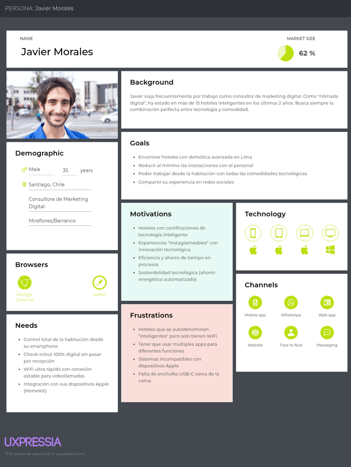

**Segmento 2:**

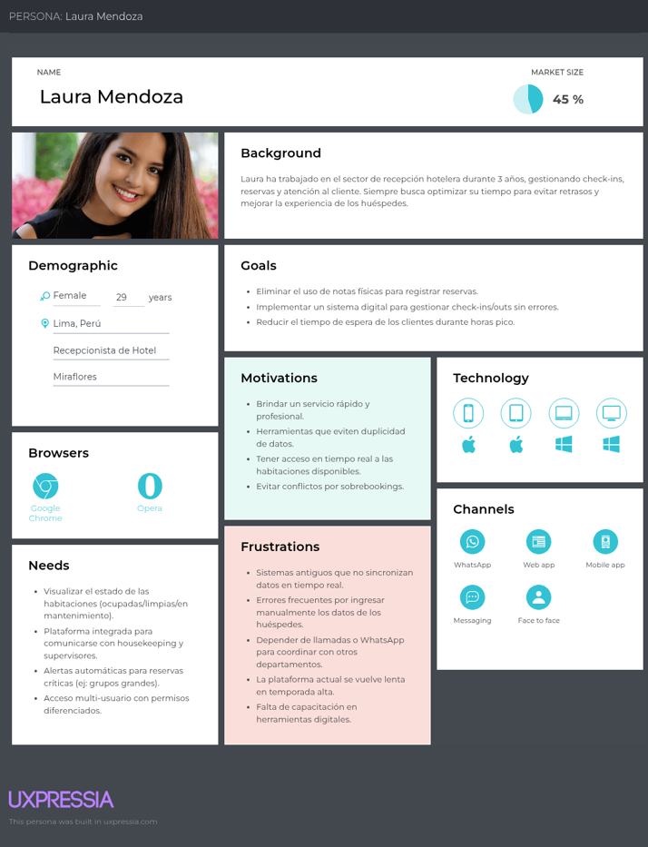


### 2.3.2. User Task Matrix.
| --- | ------ | Segmento 1  | Huespedes | Segmento 2  | ---------- |
| --- | ------ | ----------- | ------------ | ----------- | ---------- |
| ID  | Titulo | Importancia | Frecuencia   | Importancia | Frecuencia |
| U01|Personalizar ambiente de la habitación| Alta | Media| Alta  | Alta |
| U02|Realizar check-in/check-out digital| Alta | Baja | Alta  | Alta  |  
| U03| Controlar dispositivos IoT (luz, clima, TV) | Alta| Alta| Media | Alta  | 
| U04|Solicitar servicios adicionales | Media | Media | Alta  | Alta  |
| U05|   Reportar problemas técnicos  | Alta | Baja | Alta  | Media |  
| U06|  Gestionar reservas y modificaciones | Alta   |Baja | Alta  | Alta | 
| U07|  Coordinar limpieza de habitaciones | -| - | Alta | Alta  |
| U08|  Actualizar inventario de amenidades| - | - | Alta | Alta  |  
| U09|  Gestionar comunicación entre áreas  | -  | -  | Alta| Alta  | 
| U10| Registrar preferencias recurrentes | Media  | Baja  | Alta | Media  |

### 2.3.3. User Journey Mapping.
**Registration:**
Why would they trust us?
- Diseño profesional y consistente en la interfaz.
- Integración con cuentas existentes (Google, Apple ID) para registro rápido y confiable.
- Incluir testimonios reales de usuarios verificados
  
**Onboarding and first use:**
How can they feel successful?
- Diseñar un tutorial interactivo guiado paso a paso
- Confirmaciones visuales (animaciones, notificaciones) al realizar acciones.
- Soporte rápido (chat en vivo o bot inteligente para preguntas frecuentes).  
  
**Sharing:**
Why would they invite others?
- Integración con redes sociales para compartir experiencias fácilmente (ej: "Comparte tu habitación personalizada").
- Funciones exclusivas para grupos (ej: "Planifica un viaje con amigos y obtén descuento").
- Sistema de referidos con recompensas para ambos (ej: "Invita a un amigo y ambos ganan 20% de descuento").

**Segmento 1:**  


**Segmento 2:**


### 2.3.4. Empathy Mapping.

**Segmento 1:**


**Segmento 2:**


### 2.3.5. As-is Scenario Mapping.


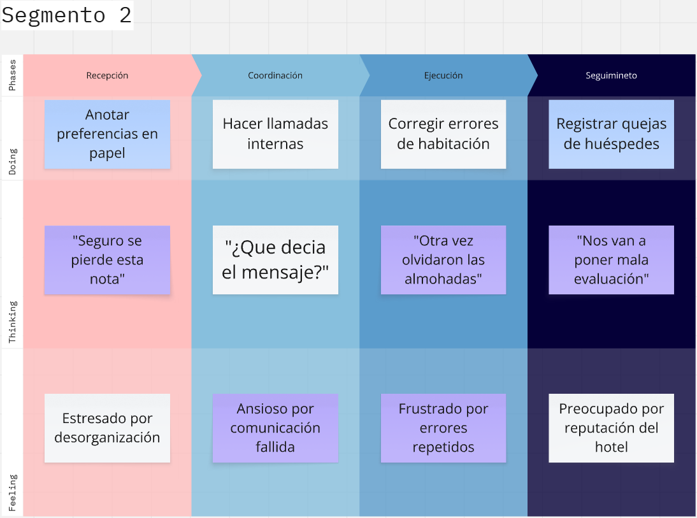

## 2.4. Ubiquitous Language.
```
Vacant (Disponible): Estado de una habitación que se encuentra libre y lista para ser ocupada por un nuevo huésped.

InService (En Servicio): Estado en el que una habitación se encuentra en proceso de limpieza, mantenimiento o reposición de productos. Durante este estado, la habitación no está disponible para huéspedes.

Occupied (Ocupada): Estado de una habitación que actualmente está siendo utilizada por un huésped registrado.

Manager (Gerente): Persona encargada de supervisar y coordinar las tareas, el personal (empleados) y la gestión de habitaciones e inventario del hotel.

Employees (Empleados): Personal operativo del hotel cuya función puede variar entre limpieza, atención a la habitación (room service) o reposición de insumos (restocking). Reciben y ejecutan tareas asignadas por el gerente.

Tasks (Tareas): Actividades operativas asignadas a los empleados, como la limpieza de habitaciones, el restocking de productos consumibles, o el mantenimiento de instalaciones.

Items (Ítems o Productos): Bienes consumibles utilizados en las habitaciones, como jabones, toallas, champú, entre otros. Cada ítem debe estar registrado en el inventario con su respectivo nivel de stock para facilitar su control y reposición.

Provider (Proveedor): Entidad que suministra los ítems al hotel. Cada ítem está asociado a un proveedor, lo cual permite realizar filtros y gestiones según el origen del producto.

```

---

# Capítulo III: Requirements Specification
## 3.1. To-Be Scenario Mapping.


## 3.2. User Stories.

| HUX  |    Historia de Usuario / Epica    | Descripción  | Criterios de Aceptación | Relacionado con (Epic ID) |
|------|-----------------------------------|--------------|-------------------------|---------------------------|
| EP01 |Crear cuenta|Como huésped o personal administrativo, quiero crear una cuenta para acceder a las funcionalidades de la aplicación|  **Escenario 1:**<br> Dado que el usuario aún no tiene una cuenta, <br> Cuando completa el formulario de registro con sus datos válidos <br>Y pulsa el botón "Registrarse",<br>Entonces debe crearse su cuenta y redirigirse a la pantalla principal de su perfil. <br><br>**Escenario 2:** <br> Dado que el usuario ya está registrado, <br> Cuando ingresa su correo y contraseña correctamente en la pantalla de inicio de sesión, <br> Entonces debe acceder a la plataforma con su sesión iniciada según su rol (huésped o personal)                       |                           |
| EP02 |Configuración de Preferencias del Huésped|Como huésped, quiero establecer mis preferencias de iluminación y temperatura, para que mi habitación se adapte automáticamente.|**Escenario 1:** <br> Dado que el huésped accede a la sección de preferencias en su perfil, <br> Cuando selecciona su temperatura, tipo de luz y guarda los cambios, <br> Entonces la plataforma debe almacenar estas preferencias de forma personalizada. <br><br> **Escenario 2:** <br> Dado que el huésped ingresa a su habitación con sesión activa, <br> Cuando se detecta su presencia en la habitación, <br> Entonces los dispositivos deben ajustarse automáticamente según las preferencias registradas.|                           |
| EP03 |Gestión de Solicitudes de Servicios|Como huésped, quiero poder solicitar servicios desde la aplicación para tener una atención personalizada a mis gustos.|**Escenario 1:** <br>Dado que el huésped desea solicitar un servicio,<br>Cuando accede a la sección de "Solicitudes" y selecciona el tipo de servicio requerido,<br>Entonces debe enviarse la solicitud <br> Y mostrar una confirmación con el estado "Pendiente".<br><br>**Escenario 2:** <br>Dado que el huésped quiere revisar el estado de su solicitud, <br>Cuando abre la sección de solicitudes activas en la aplicación,<br>Entonces debe poder visualizar el estado actualizado (pendiente, en proceso, completado) de cada solicitud.|                           |
| EP04 |Panel de control|Como personal administrativo, quiero tener un dashboard con información en tiempo real sobre las solicitudes de los huéspedes, para  poder gestionarlos mejor.|**Escenario 1:** <br>Dado que el personal administrativo está en el panel de control, <br>Cuando accede a la sección de solicitudes de los huéspedes <br>Entonces debe visualizar en tiempo real las nuevas solicitudes recibidas y su estado actual. <br><br>**Escenario 2:** <br>Dado que el personal está gestionando una solicitud, <br>Cuando cambia el estado de una solicitud a “En proceso” o “Completado”,<br>Entonces el huésped debe recibir una notificación con el nuevo estado actualizado.|                           |
| EP05 |Notificaciones en tiempo real|Como huésped o personal del hotel, quiero recibir notificaciones en tiempo real, para poder saber sobre eventos importantes o problemas técnicos.|**Escenario 1:**<br>Dado que el huésped está conectado a la aplicación móvil,<br>Cuando se genera un evento importante (como una promoción o evento del hotel),<br>Entonces debe recibir una notificación en tiempo real con el contenido del evento.|                           |
| EP06 |Seguimiento de Historial de Preferencias|Como developer, quiero tener acceso al historial de preferencia de los huéspedes, para mejorar la aplicación en base a las preferencias de los usuarios.| **Escenario 1:** <br> Dado que un huésped modifica sus preferencias,<br>Cuando guarda los cambios,<br>Entonces el sistema debe registrar los cambios<br><br>**Escenario 2:**<br>Dado que el desarrollador accede al panel de administración,<br>Cuando selecciona el perfil de un huésped,<br>Entonces debe visualizar el historial de preferencias registradas y fechas de modificación.|                           |
| EP07 |Gestión de habitaciones|Como developer, quiero implementar un sistema de gestión de habitaciones, para que permita modificar y asignar habitaciones disponibles.|**Escenario 1:**<br>Dado que el administrador accede al sistema de gestión de habitaciones,<br>Cuando selecciona una habitación ocupada,<br>Entonces debe visualizar sus datos, estado actual y tener la opción de reasignar a otro huésped.<br><br>**Escenario 2:** <br>Dado que hay habitaciones nuevas disponibles,<br>Cuando el personal técnico o administrativo actualiza su estado en el sistema,<br>Entonces estas deben mostrarse como disponibles para nuevas reservas|                           |1
| EP08 |Implementacion de la landing page informativa|Como huésped, quiero tener acceso a una plataforma web, para conocer los servicios que brindan en el hotel.|**Escenario 1:** <br>Dado que el visitante se encuentra en la página principal de la plataforma, <br>Cuando accede a la sección inferior del sitio, <br>Entonces debe visualizar la información de contacto, incluyendo dirección, teléfono, correo y enlaces a redes sociales. <br><br>**Escenario 2:** <br>Dado que el visitante necesita hacer una consulta, <br>Cuando accede al icono de contacto disponible en la interfaz, <br>Entonces se debe mostrar un formulario emergente para que pueda enviar su mensaje directamente desde la landing.|                           |
| EP09 |Gestión de Reservas|Como developer, quiero desarrollar un sistema de gestión de reservas, para que los huéspedes puedan realizar, modificar o cancelar la reserva de sus habitaciones.|**Escenario 1:** <br>Dado que el huésped desea reservar una habitación, <br>Cuando selecciona una fecha y habitación disponible y confirma la reserva, <br>Entonces el sistema debe registrar la reserva y mostrar un resumen con los detalles. <br><br>**Escenario 2:** <br>Dado que el huésped ya tiene una reserva confirmada, <br>Cuando accede a la sección de “Mis reservas” y selecciona la opción de modificar o cancelar, <br>Entonces debe poder editar la información o anular la reserva según disponibilidad.|                           |
| EP10 |Evaluación de la Experiencia del Huésped|Como huésped, quiero poder calificar mi experiencia, para compartir mis opiniones sobre el servicio recibido.|**Escenario 1:** <br>Dado que el huésped ha finalizado su estadía, <br>Cuando recibe la notificación para calificar el servicio, <br>Entonces debe poder acceder a un formulario con estrellas y comentarios para evaluar su experiencia. <br><br>**Escenario 2:** <br>Dado que el huésped ya completó una evaluación, <br>Cuando accede a su historial de reservas, <br>Entonces debe poder visualizar sus calificaciones anteriores y los comentarios registrados.|                           |
| EP11 |Gestión Multilingüe de la Plataforma|Como huésped quiero que la plataforma esté disponible en más de un idioma para poder usar el idioma de mi preferencia.|**Escenario 1:** <br>Dado que el huésped está en la pantalla principal, <br>Cuando accede al selector de idioma y elige otro idioma disponible, <br>Entonces toda la interfaz debe traducirse automáticamente al idioma seleccionado. <br><br>**Escenario 2:** <br>Dado que el huésped configura su idioma preferido en el perfil, <br>Cuando inicia sesión en una nueva ocasión, <br>Entonces la plataforma debe cargar automáticamente en su idioma predeterminado.|                           |
| EP12 |Seguridad y Privacidad de Datos|Como developer, quiero implementar, mecanismos de seguridad y privacidad de datos, para proteger la información de los usuarios.|**Escenario 1:** <br>Dado que el usuario está ingresando sus datos personales, <br>Cuando completa el formulario de registro, <br>Entonces el sistema debe asegurar la transmisión cifrada de los datos mediante protocolo HTTPS. <br><br>**Escenario 2:** <br>Dado que un usuario desea eliminar su cuenta, <br>Cuando confirma la eliminación desde la configuración, <br>Entonces todos sus datos personales deben eliminarse según la política de privacidad.|                           |
| EP13 |Soporte en Línea para el Usuario|Como huésped quiero tener un soporte personalizado y que responda inmediatamente para poder resolver mis problemas o mis consultas.|**Escenario 1:** <br>Dado que el huésped tiene una consulta relacionada con su experiencia en el hotel, <br>Cuando accede a la funcionalidad de soporte, <br>Entonces debe iniciarse una conversación en tiempo real con un agente disponible. <br><br>**Escenario 2:** <br>Dado que no hay agentes disponibles, <br>Cuando el huésped solicita asistencia fuera del horario de atención, <br>Entonces debe visualizarse un formulario para dejar su consulta y recibir una respuesta por correo electrónico.|                           |
| EP14 |Gestión de perfiles|Como developer, quiero implementar un sistema de gestión de perfiles de usuario que permita editar la información y preferencias, para que cada tipo de usuario tenga una experiencia personalizada.|**Escenario 1:** <br>Dado que el usuario desea actualizar su información, <br>Cuando accede a su perfil y edita su nombre, correo o preferencias, <br>Entonces los cambios deben guardarse y reflejarse inmediatamente en su cuenta. <br><br>**Escenario 2:** <br>Dado que el sistema tiene diferentes tipos de usuarios, <br>Cuando un administrador crea un nuevo perfil, <br>Entonces debe poder asignar el rol (huésped, técnico, administrativo) para determinar su acceso y permisos.|                           |
| US01 |Visualización de Información de Servicios.|Como visitante del sitio, quiero visualizar los servicios que ofrece el hotel, para saber lo que ofrece antes de hacer una reserva.|**Escenario 1:** <br>Dado que el visitante ha accedido a la landing page del sitio web, <br>Cuando navega hacia la sección de servicios en la página, <br>Entonces el sistema debe mostrar un listado claro de los principales servicios.| EP08 |
| US02 |Acceso a Información de Contacto.|Como visitante del sitio, quiero acceder fácilmente a los datos de contacto del hotel, para poder comunicarme si tengo dudas o necesito ayuda.|**Escenario 1:** <br>Dado que el visitante visualiza la plataforma del hotel, <br>Cuando revisa la parte inferior del sitio, <br>Entonces debe encontrar la información de contacto completa del hotel. <br><br>**Escenario 2:** <br>Dado que el visitante necesita realizar una consulta rápida, <br>Cuando utiliza la opción de contacto en la interfaz, <br>Entonces debe mostrarse un formulario emergente para enviar su mensaje.| EP08 |
| US03 |Acceso a Testimonios de Huéspedes.|Como visitante del sitio, quiero leer opiniones de otros huéspedes, para tener mayor confianza al momento de decidir si reservar.|**Escenario 1:** <br>Dado que el visitante está explorando la página de inicio, <br>Cuando visualiza la sección de testimonios, <br>Entonces debe encontrar opiniones ordenadas cronológicamente, con nombre, fecha de estadía y contenido. <br><br>**Escenario 2:** <br>Dado que hay múltiples testimonios disponibles, <br>Cuando el visitante solicita ver más opiniones, <br>Entonces el sistema debe cargar contenido adicional dinámicamente, sin recargar la página.| EP08 |
| US04 |Acceso Rápido al Formulario de Reserva.|Como visitante del sitio, quiero encontrar fácilmente un botón para reservar una habitación, para iniciar rápidamente el proceso si me interesa.|**Escenario 1:** <br>Dado que el visitante se encuentra en la landing page del sitio web, <br>Cuando llega a la sección de servicios o al final de la página, <br>Entonces debe ver un botón fijo "Reservar ahora" que redirige al formulario de reservas.| EP08 |
| US05 |Sección "Sobre Nosotros".|Como visitante del sitio, quiero conocer la historia y valores del hotel, para tener mayor conexión y confianza con la empresa.|**Escenario 1:** <br>Dado que el visitante está explorando la landing page, <br>Cuando llega a la sección “Sobre Nosotros”, <br>Entonces debe visualizar una descripción breve de la historia del hotel, su equipo y valores, acompañada de imágenes. <br><br>**Escenario 2:** <br>Dado que hay contenido multimedia sobre la historia del hotel, <br>Cuando el visitante interactúa con el video informativo, <br>Entonces el video debe reproducirse en el mismo entorno visual, sin redirigir a otras páginas.| EP08 |
| US06 |Visualización del Formulario de Registro.|Como huésped, quiero ver un formulario de registro bien estructurado, para poder registrarme en el sistema.|**Escenario 1:** <br>Dado que el huésped nuevo accede a la plataforma web, <br>Cuando decide registrarse como nuevo usuario, <br>Entonces el sistema debe mostrar un formulario de registro claro, accesible y fácil de completar. <br><br>**Escenario 2:** <br>Dado que el huésped ha accedido al formulario de registro, <br>Cuando intenta enviar los datos sin completar todos los campos obligatorios, <br>Entonces el sistema debe mostrar un mensaje que indique qué campos deben completarse.| EP01 |
| US07 |Validación de Datos de Registro.|Como huésped, quiero que el sistema valide mis datos al registrarme, para evitar errores en mi cuenta.|**Escenario 1:** <br>Dado que el huésped ha completado correctamente todos los campos del formulario de registro, <br>Cuando envía los datos para su registro, <br>Entonces el sistema debe validar la información y redirigirlo a la página de confirmación de cuenta. <br><br>**Escenario 2:** <br>Dado que el huésped ha ingresado un correo electrónico ya registrado, <br>Cuando intenta registrar su cuenta, <br>Entonces el sistema debe notificar que el correo electrónico ya está en uso y sugerir opciones para recuperar la cuenta o cambiar el correo.| EP01 |
| US08 |Configuración de Preferencias de habitación.|Como huésped, quiero seleccionar mis preferencias de habitación desde la plataforma web, para personalizar mi estadía.|**Escenario 1:** <br>Dado que el huésped accede a la sección de configuración personal, <br>Cuando define sus preferencias de temperatura y luz, <br>Entonces el sistema debe guardar las configuraciones y reflejarlas en su perfil de usuario. <br><br>**Escenario 2:** <br>Dado que el huésped accede a la configuración de preferencias, <br>Cuando elige restablecer los valores personalizados, <br>Entonces el sistema debe restablecer todas las opciones a sus valores predeterminados.| EP02 |
| US09 |Personalización de Horarios de Servicio.|Como huésped, quiero establecer mis horarios de preferencia para servicios como limpieza o desayuno.|**Escenario 1:** <br>Dado que el huésped accede a la sección de "Preferencias", <br>Cuando selecciona el horario de limpieza para la mañana, <br>Entonces el sistema debe actualizar sus preferencias con el nuevo horario. <br><br>**Escenario 2:** <br>Dado que el huésped selecciona un horario para el servicio de desayuno, <br>Cuando guarda los cambios, <br>Entonces el sistema debe confirmar la actualización.| EP02 |
| US10 |Solicitud de Servicios de Limpieza.|Como huésped, quiero solicitar un servicio de limpieza directamente desde la plataforma web, para mantener mi habitación limpia.|**Escenario 1:** <br>Dado que el huésped accede a la sección de "Servicios", <br>Cuando selecciona "Solicitar limpieza", <br>Entonces el sistema debe enviar una solicitud de limpieza y confirmar la solicitud con un mensaje.<br><br>**Escenario 2:** <br>Dado que el huésped intenta solicitar un servicio fuera de horario, <br>Cuando seleccione "Solicitar limpieza", <br>Entonces el sistema debe mostrar un mensaje informando sobre los horarios.| EP03 |
| US11 |Solicitud de Desayuno en la Habitación.|Como huésped, quiero poder solicitar un desayuno en mi habitación a través de la plataforma web.|**Escenario 1:** <br>Dado que el huésped entra a la sección "Solicitar desayuno", <br>Cuando elige "Desayuno en la habitación" y selecciona el horario, <br>Entonces el sistema debe procesar la solicitud y confirmar el envío. <br><br>**Escenario 2:** <br>Dado que el huésped selecciona "Desayuno en la habitación", <br>Cuando selecciona un horario fuera de los disponibles, <br>Entonces el sistema debe mostrar un mensaje de error.| EP03 |
| US12 |Gestión de Solicitudes Pendientes.|Como personal administrativo, quiero poder ver las solicitudes pendientes para atenderlas rápidamente.|**Escenario 1:** <br>Dado que el miembro del personal administrativo accede a la sección de "Solicitudes", <br>Cuando ve una lista de solicitudes, <br>Entonces el sistema debe mostrar las solicitudes ordenadas por urgencia y fecha. <br><br>**Escenario 2:** <br>Dado que el miembro del personal administrativo tiene una solicitud nueva, <br>Cuando selecciona "Ver detalles", <br>Entonces el sistema debe mostrar la información completa de la solicitud.| EP04 |
| US13 |Modificación de Estado de la Solicitud.|Como personal administrativo, quiero poder cambiar el estado de una solicitud, para gestionarla mejor.|**Escenario 1:** <br>Dado que el miembro del personal accede a la solicitud de un huésped, <br>Cuando selecciona "Marcar como atendida", <br>Entonces el sistema debe cambiar el estado de la solicitud y mostrar el mensaje de confirmación. <br><br>**Escenario 2:** <br>Dado que el miembro del personal ve que una solicitud está pendiente, <br>Cuando selecciona "Marcar como pendiente", <br>Entonces el sistema debe confirmar el cambio de estado.| EP04 |
| US14 |Notificación de solicitud atendida.|Como huésped, quiero recibir alertas cuando mi solicitud se atienda, para estar informado.|**Escenario 1:** <br>Dado que el personal completa una solicitud, <br>Cuando el estado cambia es atendido, <br>Entonces el huésped recibe una notificación inmediata. <br><br>**Escenario 2:** <br>Dado que el sistema tiene un error, <br>Cuando el estado cambia, <br>Entonces el huésped no recibe ninguna notificación.| EP05 |
| US15 |Alerta de emergencia en el hotel.|Como personal, quiero recibir alertas inmediatas sobre emergencias, para reaccionar rápido.|**Escenario 1:** <br>Dado que se activa una alerta de emergencia como un incendio, <br>Cuando se emite desde el sistema, <br>Entonces todo el personal recibe una notificación urgente. <br><br>**Escenario 2:** <br>Dado que se realiza una prueba del sistema, <br>Cuando se lanza la alerta, <br>Entonces el mensaje indica claramente "Simulación de emergencia".| EP05 |
| US16 |Enviar evaluación de estadía.|Como huésped, quiero calificar mi experiencia al final de la estadía, para dar retroalimentación al hotel.|**Escenario 1:** <br>Dado que el huésped ha finalizado su estadía, <br>Cuando completa el formulario de evaluación y lo envía, <br>Entonces el sistema registra la evaluación y muestra "Gracias por tu opinión". <br><br>**Escenario 2:** <br>Dado que el huésped no llena todos los campos, <br>Cuando intenta enviar, <br>Entonces el sistema muestra un mensaje indicando que debe completar todos los campos obligatorios.| EP10 |
| US17 |Ver historial de evaluaciones.|Como personal administrativo, quiero consultar las evaluaciones recibidas, para mejorar la calidad del servicio.|**Escenario 1:** <br>Dado que el personal accede a la sección de evaluaciones, <br>Cuando selecciona un rango de fechas, <br>Entonces se muestran las evaluaciones correspondientes. <br><br>**Escenario 2:** <br>Dado que no existen evaluaciones en ese periodo, <br>Cuando consulta, <br>Entonces el sistema muestra "No se encontraron evaluaciones en este periodo".| EP10 |
| US18 |Cambiar el idioma de la interfaz.|Como huésped internacional, quiero cambiar el idioma de la interfaz, para comprender mejor la plataforma web.|**Escenario 1:** <br>Dado que el huésped se encuentra en la configuración de idioma, <br>Cuando selecciona “inglés”, <br>Entonces toda la interfaz se traduce automáticamente. <br><br>**Escenario 2:** <br>Dado que el huésped intenta seleccionar un idioma no disponible, <br>Cuando realiza el cambio, <br>Entonces el sistema muestra "Idioma no disponible actualmente".| EP11 |
| US19 |Recordar el idioma seleccionado.|Como huésped, quiero que la plataforma recuerde mi idioma preferido, para no tener que cambiarlo cada vez.|**Escenario 1:** <br>Dado que el huésped ha seleccionado un idioma, <br>Cuando vuelve a iniciar sesión, <br>Entonces la plataforma carga directamente en ese idioma. <br><br>**Escenario 2:** <br>Dado un problema técnico, <br>Cuando el huésped cambia el idioma, <br>Entonces la plataforma vuelve a aparecer con el idioma predeterminado.| EP11 |
| US20 |Iniciar chat con soporte.|Como huésped, quiero iniciar un chat con soporte, para resolver dudas rápidamente.|**Escenario 1:** <br>Dado que el huésped accede a la sección de ayuda, <br>Cuando presiona el botón de chat, <br>Entonces se abre una ventana con un agente disponible. <br><br>**Escenario 2:** <br>Dado que no hay agentes en línea, <br>Cuando intenta iniciar el chat, <br>Entonces el sistema muestra "No hay agentes disponibles, por favor inténtelo más tarde".| EP13 |
| US21 |Consultar preguntas frecuentes.|Como huésped, quiero revisar preguntas frecuentes, para resolver dudas sin contactar soporte.|**Escenario 1:** <br>Dado que el huésped accede al FAQ, <br>Cuando busca “cómo solicitar limpieza”, <br>Entonces el sistema muestra artículos relacionados. <br><br>**Escenario 2:** <br>Dado que busca una pregunta no registrada, <br>Cuando realiza la búsqueda, <br>Entonces el sistema le mostrará preguntas similares a la realizada.| EP13 |
| TS01 |Modificar preferencias|Como desarrollador, quiero que el sistema guarde los cambios de preferencias de los huéspedes en una base de datos, para tener un registro de sus elecciones.|**Escenario 1:** <br>Dado que un huésped modifica su preferencia ,<br> Cuando el sistema recibe la solicitud de actualización  <br>Y el sistema valida los datos modificados <br>Y verifica que el huesped esta registrado<br>Entonces el sistema guarda los datos modificados en la tabla preferencias <br>Y devuelve el mensaje: "Preferencias actualizadas correctamente" <br><br>**Escenario 2:** <br>Dado que un huesped deja un campo vacio,<br>Cuando el sistema recibe la sulicitud de guardar,<br>Y detecta que algún campo es vacio o null<br>Entonces el sistema no guarda los cambios en la base de datos <br>Y envia un mensaje de error: "Completar todos los campos"|EP06|
|TS02|Consultar historial de preferencias|Como desarrollador, quiero que el sistema muestre el historial cambios de preferencias de un huésped, para mejorar la experiencia de usuario basado en sus elecciones pasadas|**Escenario 1:** <br> Dado que un administrador accede al perfil de un huésped registrado,<br>Cuando el sistema recibe la solicitud para mostrar el historial de un usuario <br> Entonces el sistema devuelve la información de preferencias del usuario seleccionado <br>Y tambien muestra la fecha en la que se modifico por ultima vez <br><br>**Escenario 2:**<br>Dado que el huésped aun no ha realizado una modificación en sus preferencias,<br> Cuando el sistema solicita su historial, <br> Entonces el sistema devuelve el mensaje: "Aun no se han registrado modificaciones" |EP06|
|TS03|Eliminar preferencias obsoletas|Como desarrollador, quiero que el sistema permita eliminar preferencias antiguas o incorrectas de un huésped, para mantener la base de datos limpia y actualizada.|**Escenario 1:**<br>Dado que un administrador identifica una preferencia que no es valida <br>Cuando el sistema recibe una solicitud de eliminar preferencia <br>Y el sistema verifica que el id le pertenece a un huesped <br>Entonces elimina el registro de las preferencias del usuario <br> Y registra las acciones realizadas en una tabla auditoria <br> Y devuelve un mensaje: "Preferencia eliminada correctamente"<br><br>**Escenario 2:** <br>Dado que un usuario que no tiene rol de administrador intenta eliminar una preferencia,<br>Cuando el sistema valida sus permisos,<br>Entonces el sistema rechaza la acción con: "Acceso no autorizado".|EP06|
|TS04|Actualización de estado de habitaciones|Como desarrollador, quiero que el sistema permita actualizar el estado de las habitaciones (disponible / ocupado / en mantenimiento), para reflejar la disponibilidad de las reservar.|**Escenario 1:** <br>Dado que el administrador selecciona una habitación, <br>Cuando modifica su estado a "en mantenimiento" <br>Y confirma la acción, <br>Entonces el sistema actualiza el estado en la base de datos, <br> Y el sistema notifica: "Actualizado correctamente". <br><br> **Escenario 2:**<br>Dado que se ingresa una habitación que no existe en la,<br>Cuando el sistema busca el registro, <br>Y no encuentra la habitación, <br>Entonces muestra el error: "Habitación no registrada".|EP07|
|TS05|Reasignación de habitaciones|Como desarrollador, quiero que el sistema permita reasignar una habitación ocupada a otro huésped, para optimizar el uso de espacios según necesidades cambiantes.|**Escenario 1:**<br>Dado que el administrador selecciona una habitación ocupada,<br>Cuando se asigna la habitación a un nuevo huésped y confirma, <br> Entonces el sistema libera la habitación del huésped previo, <br>Y se registra al nuevo huésped, <br> Y el sistema actualiza el historial de cambios. <br><br>**Escenario 2:** <br>Dado que se ingresa un ID de huésped no registrado,<br>Cuando el sistema valida si el huesped esta registrado en la base de datos, <br>Entonces se cancela la acción y notifica el error: "Huesped no encontrado".|EP07|
|TS06|Consulta de disponibilidad de habitaciones|Como desarrollador, quiero implementar un sistema de consulta de habitaciones disponibles con filtros, para que el personal pueda encontrar rápidamente espacios según filtros específicos.|**Escenario 1:** <br>Dado que el administrador ingresa filtros de busqueda <br> Cuando el sistema recibe los filtros de busqueda, <br> Entonces devuelve una lista de habitaciones disponibles que coincidan con los filtros,<br>Y muestra las caracteristicas de la habitación.<br><br>**Escenario 2:**<br>Dado que no hay habitaciones disponibles para los filtros aplicados,<br>Cuando el sistema completa la búsqueda,<br>Y no encuentra los filtros aplicados<br>Entonces devuelve un mensaje: "No se encontraron habitaciones con esos criterios".|EP07|
|TS07|Sistema de Registro de Reservas en Base de Datos|Como desarrollador, quiero una funcionalidad para almacenar nuevas reservas en la base de datos, para que el sistema pueda gestionar las reservas de los huéspedes.|**Escenario 1:** <br>Dado que un huésped selecciona una habitación disponible y completa el formulario de reserva, <br>Cuando el sistema valida que las fechas están disponibles, <br>Y todos llos campos fueron completados, <br>Y el huesped existe en el sistema,<br> Entonces el sistema guarda la reserva en la base de datos, <br>Y actualiza el estado de la habitación, <br>Y muestra al huésped un mensaje de confirmación con su número de reserva. <br><br> **Escenario 2:** <br> Dado que un huésped intenta reservar una habitación ya ocupada para las fechas seleccionadas, <br> Cuando el sistema verifica la disponibilidad de la habitación, <br>Entonces el sistema no guarda la reserva, <br>Y muestra el mensaje: "Habitación no disponible", <br>Y sugiere otras habitaciones disponibles|EP09|
|TS08|Módulo de Modificación de Reservas|Como desarrollador, quiero modificar las reservas existentes, para permitir a los huéspedes ajustar sus reservas según cambios en sus planes.|**Escenario 1:** <br> Dado que un huésped solicita modificar una reserva confirmada, <br>Cuando el sistema verifica que la nueva habitación está disponible,<br>Y las nuevas fechas están disponibles,<br> Y la reserva no ha sido cancelada previamente,<br>Entonces el sistema actualiza los datos de la reserva, <br>Envía un correo de confirmación con los nuevos detalles. <br><br> **Escenario 2:**<br>Dado que un huésped intenta modificar una reserva pero no hay disponibilidad,<br>Cuando el sistema valida los nuevos datos y no encuentra alguna coincidencia,<br>Entonces se mostrara el siguiente mensaje: "No hay disponibilidad para los cambios solicitados",<br>Y ofrece opciones alternativas.|EP09|
|TS09|Consulta de reservas activas|Como desarrollador, quiero implementar la funcionalidad para consultar reservas activas, para que los huéspedes y administradores puedan ver el estado de las reservas.|**Escenario 1:** <br> Dado que huésped o administrador accede al sistema, <br>Cuando solicita ver las reservas que se encuntran activas, <br> Entonces el sistema muestra los detalles de la habitación junto al número de la reserva <br>Y muestra el estado de la reserva ("Confirmada","Cancelada")<br><br>**Escenario 2:** <br> Dado que un huésped no tiene reservas activas, <br>Cuando xonsulta el historial de reservas, <br>Entonces el sistema muestra el mensaje: "No tiene reservas activas actualmente"|EP09|
|TS10|Eliminación Segura de Datos de Usuarios|Como desarrollador, quiero implementar una opción para eliminar todos los datos personales de un usuario, para cumplir con políticas de privacidad|**Escenario 1:** <br>Dado que un usuario solicita eliminar su cuenta, <br>Cuando se confirma el envio de la acción, <br>Entonces el sistema borra los datos de la tabla, <br>Y conserva los registros en estado anónimo. <br><br>**Escenario 2:** <br>Dado que un administrador intenta eliminar manualmente una cuenta, <br> Cuando el sistema detecta que tiene datos de reserva asociados, <br>Entonces se solicita una confirmación adicional antes de eliminar la cuenta.|EP12|
|TS11|Registro de Actividades Sospechosas|Como desarrollador, quiero registrar intentos de acceso fallidos y actividades inusuales, para detectar y responder a posibles brechas de seguridad.|**Escenario 1:** <br>Dado que un usuario falla al ingresar su contraseña 3 veces, <br>Cuando el sistema registra el evento, <br>Entonces bloquea temporalmente la cuenta y notifica al administrador.|EP12|
|TS12|Implementación de Políticas de Cookies y Consentimiento|Como desarrollador, quiero implementar un sistema de gestión de cookies, para informar a los usuarios y obtener su consentimiento antes de almacenar datos.|**Escenario 1:** <br> Dado que un usuario visita el sitio por primera vez, <br> Cuando el sistema detecta que no hay preferencias guardadas, <br>Entonces muestra un banner preguntando al usuario para usar sus cookies,<br>Y le muestra opciones para aceptar/rechazar.|EP13|
|TS13|Encriptación de Datos Sensibles en Base de Datos|Como desarrollador, quiero encriptrar información sensible del usuario, para mantener la información segura de los usuarios.|**Escenario 1:** <br>Dado que un usuario ingresa su número de tarjeta en un formulario,<br>Cuando el sistema guarda los datos,<br>Entonces almacena los datos y los encripta en la base de datos. <br><br> **Escenario 2:** <br> Dado que un administrador consulta la base de datos directamente, <br>Cuando revisa los campos encriptados,<br>Entonces ve valores cifrados en lugar de datos originales. |EP12|
|TS14| Actualización de Perfiles de Usuario|Como desarrollador,<br>quiero implementar un sistema seguro para actualizar información de perfiles,<br>para que los usuarios puedan modificar sus datos personales y preferencias.|**Escenario 1:**<br>Dado que un usuario autenticado envía una solicitud para actualizar los datos perfil,<br>Cuando el sistema valida los nuevos datos, <br>Entonces actualiza la información en la base de datos,<br>Y devuelve una confirmación al frontend. <br><br>**Escenario 2:** <br>Dado que un usuario intenta actualizar su perfil con un correo ya registrado, <br>Cuando el sistema detecta el duplicado, <br>Entonces el sistema rechaza la actualización y notifica con el mensaje: "El correo ya está en uso". |EP14|
|TS15|Gestión de Roles y Permisos|Como desarrollador, quiero crear un sistema de asignación de roles, para controlar accesos y funcionalidades según el tipo de usuario.|**Escenario 1:** <br>Dado que un administrador asigna un rol a un nuevo usuario, <br>Cuando el sistema procesa la solicitud,<br>Entonces guarda el rol en la base de datos, <br>Y aplica automáticamente los permisos asociados. <br><br>**Escenario 2:** <br>Dado que un usuario sin privilegios intenta asignar roles,<br>Cuando el sistema verifica sus permisos,<br>Entonces bloquea la acción y registra el intento en logs. |EP14|
|TS16|Visualización Condicional de Interfaces|Como desarrollador, quiero adaptar la interfaz según el rol del usuario, para mostrar solo las opciones relevantes a cada perfil.|**Escenario 1:** <br> Dado que un huésped inicia sesión,<br>Cuando el sistema carga su perfil,<br>Entonces muestra solo secciones como "Mis reservas" y "Preferencias". <br><br>**Escenario 2:** <br>Dado que un administrador accede al sistema, <br>Cuando se renderiza la interfaz, <br>Entonces incluye pestañas como "Gestión de usuarios" y "Reportes". |EP14|

## 3.3. Impact Mapping.


## 3.4. Product Backlog.

Link Trello: https://trello.com/invite/b/6807e09feff6aab74b684127/ATTI98b87d9f903a3b4af1efa73604221d6aE9912258/customhost-product-backlog

| #Orden | User Story ID | Titulo| Descripción| Story Points (1/2/3/5/8) |
| ------ | ------------- | ----- | ---------- | ------------------------ |
|1|US01|Visualización de servicios del hotel|Como visitante del sitio, quiero visualizar los servicios que ofrece el hotel, para saber lo que ofrece antes de hacer una reserva.|2|
|2|US02|Acceso a información de contacto|	Como visitante del sitio, quiero acceder fácilmente a los datos de contacto del hotel, para poder comunicarme si tengo dudas o necesito ayuda.|1|
|3|US03|Acceso a Testimonios de Huéspedes|	Como visitante del sitio, quiero leer opiniones de otros huéspedes, para tener mayor confianza al momento de decidir si reservar.|3|
|4|US04|Acceso Rápido al Formulario de Reserva|Como visitante del sitio, quiero encontrar fácilmente un botón para reservar una habitación, para iniciar rápidamente el proceso si me interesa.|2|
|5|US05|Sección "Sobre Nosotros"|	Como visitante del sitio, quiero conocer la historia y valores del hotel, para tener mayor conexión y confianza con la empresa.|2|
|6|US06|Visualización del Formulario de Registro|Como huésped, quiero ver un formulario de registro bien estructurado, para poder registrarme en el sistema.|2|
|7|US07|Validación de Datos de Registro|Como huésped, quiero que el sistema valide mis datos al registrarme, para evitar errores en mi cuenta.|3|
|8|US08|Configuración de Preferencias de habitación|Como huésped, quiero seleccionar mis preferencias de habitación desde la plataforma web, para personalizar mi estadía.|5|
|9|US09|Personalización de Horarios de Servicio|Como huésped, quiero establecer mis horarios de preferencia para servicios como limpieza o desayuno.|5|
|10|US10|Solicitud de Servicios de Limpieza|Como huésped, quiero solicitar un servicio de limpieza directamente desde la plataforma web, para mantener mi habitación limpia.|3|
|11|US11|Solicitud de Desayuno en la Habitación|Como huésped, quiero poder solicitar un desayuno en mi habitación a través de la plataforma web.|3|
|12|US14|Notificación de solicitud atendida|Como huésped, quiero recibir alertas cuando mi solicitud se atienda, para estar informado.|5|
|13|US16|Enviar evaluación de estadía|Como huésped, quiero calificar mi experiencia al final de la estadía, para dar retroalimentación al hotel.|2|
|14|US18|Visualizar puntos acumulados|Como huésped, quiero ver cuántos puntos de fidelidad tengo, para saber qué recompensas puedo obtener.|3|
|15|US19|Canjear puntos por recompensa|Como huésped, quiero canjear mis puntos por beneficios, para aprovechar el programa de fidelidad.|5|
|16|US20|Cambiar el idioma de la interfaz|Como huésped internacional, quiero cambiar el idioma de la interfaz, para comprender mejor la plataforma web.|2|
|17|US21|Recordar el idioma seleccionado|Como huésped, quiero que la plataforma recuerde mi idioma preferido, para no tener que cambiarlo cada vez.|2|
|18|US22|Iniciar chat con soporte|Como huésped, quiero iniciar un chat con soporte, para resolver dudas rápidamente.|5|
|19|US23|Consultar preguntas frecuentes|Como huésped, quiero revisar preguntas frecuentes, para resolver dudas sin contactar soporte.|2|
|20|US12|Gestión de Solicitudes Pendientes|Como personal administrativo, quiero poder ver las solicitudes pendientes para atenderlas rápidamente.|3|
|21|US13|Modificación de Estado de la Solicitud|	Como personal administrativo, quiero poder cambiar el estado de una solicitud, para gestionarla mejor.|2|
|22|US15|Alerta de emergencia en el hotel|Como personal, quiero recibir alertas inmediatas sobre emergencias, para reaccionar rápido.|5|
|23|US17|Ver historial de evaluaciones|Como personal administrativo, quiero consultar las evaluaciones recibidas, para mejorar la calidad del servicio.|3|
|24|TS01|Modificar preferencias|Como desarrollador, quiero que el sistema guarde los cambios de preferencias de los huéspedes en una base de datos, para tener un registro de sus elecciones.|3|
|25|TS02|Consultar historial de preferencias|Como desarrollador, quiero que el sistema muestre el historial de cambios de preferencias de un huésped, para mejorar la experiencia de usuario basado en sus elecciones pasadas.|3|
|26|TS03|Eliminar preferencias obsoletas|Como desarrollador, quiero que el sistema permita eliminar preferencias antiguas o incorrectas de un huésped, para mantener la base de datos limpia y actualizada.|2|
|27|TS04|Actualización de estado de habitaciones|Como desarrollador, quiero que el sistema permita actualizar el estado de las habitaciones (disponible / ocupado / en mantenimiento), para reflejar la disponibilidad de las reservas.|5|
|28|TS05|Reasignación de habitaciones|Como desarrollador, quiero que el sistema permita reasignar una habitación ocupada a otro huésped, para optimizar el uso de espacios según necesidades cambiantes.|5|
|29|TS06|Consulta de disponibilidad de habitaciones|Como desarrollador, quiero implementar un sistema de consulta de habitaciones disponibles con filtros, para que el personal pueda encontrar rápidamente espacios según filtros específicos.|5|
|30|TS07|Sistema de Registro de Reservas|Como desarrollador, quiero una funcionalidad para almacenar nuevas reservas en la base de datos, para que el sistema pueda gestionar las reservas de los huéspedes.|5|
|31|TS08|Módulo de Modificación de Reservas|Como desarrollador, quiero modificar las reservas existentes, para permitir a los huéspedes ajustar sus reservas según cambios en sus planes.|5|
|32|TS09|Consulta de reservas activas|Como desarrollador, quiero implementar la funcionalidad para consultar reservas activas, para que los huéspedes y administradores puedan ver el estado de las reservas.|3|
|33|TS10|Eliminación Segura de Datos de Usuarios|Como desarrollador, quiero implementar una opción para eliminar todos los datos personales de un usuario, para cumplir con políticas de privacidad.|5|
|34|TS11|Registro de Actividades Sospechosas|Como desarrollador, quiero registrar intentos de acceso fallidos y actividades inusuales, para detectar y responder a posibles brechas de seguridad.|3|
|35|TS12|Implementación de Políticas de Cookies y Consentimiento|Como desarrollador, quiero implementar un sistema de gestión de cookies, para informar a los usuarios y obtener su consentimiento antes de almacenar datos.|3|
|36|TS13|Encriptación de Datos Sensibles en Base de Datos|Como desarrollador, quiero encriptar información sensible del usuario, para mantener la información segura de los usuarios.|5|
|37|TS14|Actualización de Perfiles de Usuario|Como desarrollador, quiero implementar un sistema seguro para actualizar información de perfiles, para que los usuarios puedan modificar sus datos personales y preferencias.|3|
|38|TS15|Gestión de Roles y Permisos|Como desarrollador, quiero crear un sistema de asignación de roles, para controlar accesos y funcionalidades según el tipo de usuario.|5|
|39|TS16|Visualización Condicional de Interfaces|Como desarrollador, quiero adaptar la interfaz según el rol del usuario, para mostrar solo las opciones relevantes a cada perfil.|5|

# Capítulo IV: Product Design
## 4.1. Style Guidelines.
### 4.1.1. General Style Guidelines.

#### **Tipografía (Inter)**
La tipografía elegida para nuestra marca es Inter, por su estilo moderno, funcional y altamente legible. Su diseño limpio se adapta a distintos formatos, tanto digitales como impresos, garantizando una comunicación clara y profesional.

Gracias a su versatilidad, Inter funciona bien en títulos y textos extensos, reflejando los valores de innovación y accesibilidad de nuestra marca. Al ser de código abierto, también refuerza nuestro compromiso con soluciones sostenibles y colaborativas en un entorno digital dinámico.

#### **Colores**
La selección de nuestra paleta de colores para nuestro proyecto responde a una estrategia visual cuidadosamente diseñada para transmitir tecnología, confianza y sofisticación, elementos esenciales en la propuesta de valor de SoftCore.

- **Landing Page** <br>
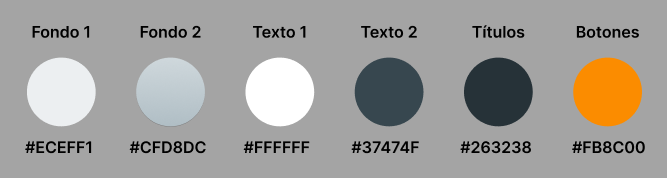

En la pantalla de inicio, el blanco puro **(#FFFFFF)** se emplea estratégicamente para los textos que necesitan máxima claridad y contraste, especialmente cuando se superponen sobre fondos oscuros. Su neutralidad transmite limpieza, simplicidad y enfoque, permitiendo que el mensaje principal resalte sin distracciones y facilite la primera interacción del usuario con la aplicación.

Complementando esto, se incorpora el azul grafito **(#263238)** en los títulos principales, tanto en la pantalla de bienvenida como en otras áreas destacadas. Este tono oscuro proyecta autoridad y estructura, guiando visualmente al usuario con jerarquía clara y coherente. Su alto contraste con los fondos claros permite marcar secciones clave y transmitir una sensación de profesionalismo desde el primer momento.

En el cuerpo general, el azul grisáceo **(#37474F)** asume un rol protagonista en los textos informativos y títulos secundarios. Este color mantiene una legibilidad excelente sin resultar demasiado rígido, lo que lo convierte en una opción ideal para contenidos extensos. Su carácter neutro aporta equilibrio y favorece una estética sobria y tecnológica, ajustándose perfectamente a entornos que requieren claridad y funcionalidad.

Como color de acento, el naranja vibrante **(#FB8C00)** aporta dinamismo y atención. Se reserva para botones principales, notificaciones urgentes y elementos que requieren una acción inmediata por parte del usuario. Su brillo genera un contraste fuerte con el resto de la paleta, facilitando la toma de decisiones rápidas sin romper la armonía visual.

Para estructurar visualmente el fondo de la aplicación web, se utilizan dos tonos complementarios. El gris azulado **(#ECEFF1)** funciona como base principal en pantallas, tarjetas y formularios, generando una atmósfera limpia, aireada y sin distracciones. Este fondo neutral mejora la legibilidad y permite que los componentes destacados brillen con claridad. Por su parte, el gris claro **(#CFD8DC)**, ligeramente más oscuro, se emplea para crear contraste entre secciones, encabezados secundarios o áreas informativas. Esta variación sutil mantiene la jerarquía y el orden visual, aportando dinamismo sin romper la cohesión estética general.

Finalmente, el uso coordinado de estos seis colores garantiza una experiencia visual agradable, estructurada y efectiva. La combinación de tonos neutros, contrastes cuidadosamente definidos y acentos vibrantes permite construir una interfaz clara, moderna y adaptable, que guía al usuario con naturalidad mientras transmite profesionalismo, eficiencia y confianza.

- **Front-End** <br>
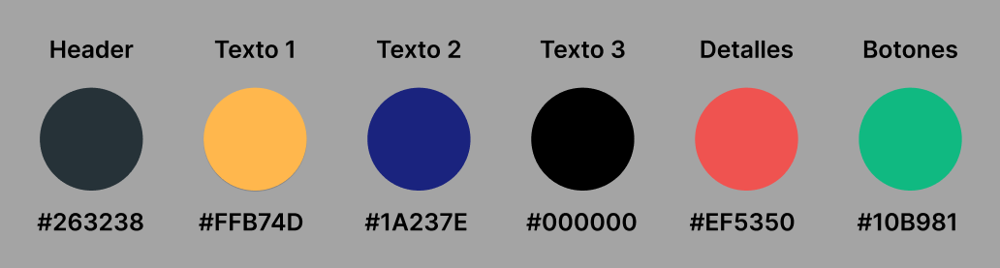

En la pantalla de inicio, el azul grafito profundo **(#263238)** se emplea estratégicamente como color de fondo del encabezado, aportando una sensación de solidez, enfoque y profesionalismo desde el primer momento. Su intensidad transmite autoridad y seriedad, lo que permite estructurar visualmente la interfaz con jerarquía clara y coherente.

Complementando esta base, el naranja suave **(#FFB74D)** destaca como color principal en los títulos, el nombre de usuario y el pie de página. Este tono cálido y luminoso introduce cercanía y vitalidad, equilibrando la sobriedad del fondo con una energía accesible. Su presencia aporta dinamismo sin resultar invasiva, ayudando a guiar la atención del usuario hacia elementos clave de navegación e identidad.

Para los subtítulos y elementos secundarios, se recurre al azul oscuro intenso **(#1A237E)**, un color que proyecta estabilidad y profundidad. Este tono se emplea en encabezados intermedios, etiquetas y bloques de contenido que necesitan diferenciarse sin competir visualmente con los títulos principales. Gracias a su contraste y elegancia, mantiene la coherencia visual y refuerza la sensación de estructura.

El negro absoluto **(#000000)** se reserva para el texto general en la interfaz. Su claridad sobre fondos claros o coloridos garantiza una lectura nítida y sin esfuerzo, facilitando la comprensión de información extensa o técnica. Esta elección subraya la importancia del contenido textual en la experiencia del usuario.

Como color de acento, el rojo coral vibrante **(#EF5350)** se aplica a detalles relevantes como íconos de advertencia, enlaces activos o indicadores visuales. Su intensidad introduce contraste y urgencia cuando es necesario captar la atención del usuario rápidamente, sin saturar la interfaz ni romper la armonía cromática general.

Finalmente, el verde esmeralda **(#10B981)** se utiliza en botones interactivos y llamadas a la acción. Este color transmite una sensación de progreso, aprobación y accesibilidad, invitando al usuario a interactuar con confianza. Su luminosidad y frescura lo convierten en un acento funcional que estimula la acción sin imponerse.


#### **Lenguaje**
En SoftCore, utilizaremos un lenguaje que refleje nuestra visión y dedicación para transformar la experiencia hotelera mediante tecnología inteligente. Buscamos conectar tanto con huéspedes como con profesionales del sector, manteniendo una comunicación clara, cercana y profesional. La combinación de tonos que emplearemos es la siguiente:

1. **Profesional pero accesible:** Queremos transmitir seriedad y conocimiento en el desarrollo de soluciones tecnológicas aplicadas a la hotelería, sin dejar de ser comprensibles para todos los usuarios. Nuestra comunicación mostrará dominio técnico, pero con un lenguaje claro y cercano que invite a explorar nuestra propuesta sin barreras.
2. **Formal pero cálido:** Aunque mantenemos un tono formal que refleje el compromiso y la confiabilidad de nuestra marca, también nos dirigimos a nuestros usuarios con cercanía. Nuestra intención es establecer una conexión humana y auténtica, transmitiendo confianza y empatía desde el primer contacto.
3. **Respetuoso y empático:** Nos comunicamos con respeto hacia todos nuestros usuarios, reconociendo la diversidad de necesidades de huéspedes, administradores y personal hotelero. Nuestro lenguaje será inclusivo y considerado, promoviendo una relación de colaboración y apoyo constante.
4. **Inspirador y optimista:** En SoftCore creemos que la tecnología puede mejorar profundamente la experiencia de hospedaje. Por ello, hablaremos con entusiasmo y convicción, motivando a nuestros usuarios a imaginar y vivir una nueva forma de hospedarse: más cómoda, personalizada e inteligente.

### 4.1.2. Web Style Guidelines.

#### **Descripción General**
Este diseño corresponde a la aplicación web de CustomHost, una plataforma inteligente que permite a los huéspedes personalizar su estadía y a los hoteles optimizar su gestión mediante tecnologías como domótica y biometría. El diseño incluye la pantalla de inicio, la cual mantiene un estilo visual coherente utilizando una paleta de colores sobrios y tecnológicos como el azul petróleo y el verde oscuro. Además, se aplica una tipografía definida que refuerza la imagen moderna y profesional de la marca.
<br>

#### **1. Pantalla de Inicio**
**Header:**
- Logo (esquina superior izquierda).
- Menú de navegación con las opciones: Nosotros, Servicios, Habitaciones y Contact Us.
- Selector de idioma (inglés y español), número y correo de contacto.
- Botones "Inicia sesión" y "Registrate".


<br>

**Home:**
- Frase de bienvedida a nuestra aplicación web junto al botón "Ver habitaciones" que te mostrará el tipo de habitaciones con las que contamos.
- Menú horizontal donde podrás elegir el hotel en el que te ospedarás, fecha de llegada y salida, cantidad de adultos y niños que se ospedarán, código promocional y el botón de "Reservar ahora".

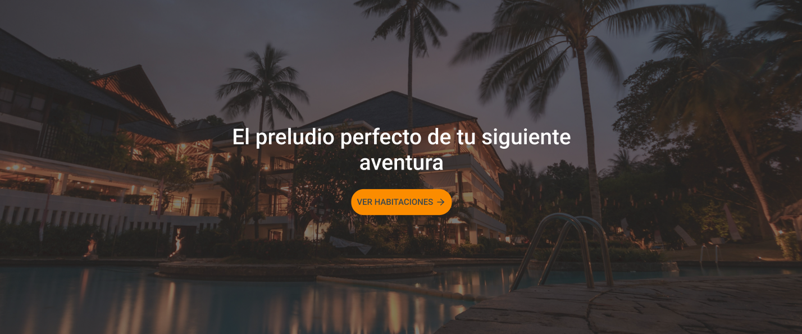
<br>

**About Us:** En esta sección se presenta una pequeña introducción a Custom Host. También se encontrará el botón "Saber Mas" el cual redirecciona a los usuarios a una ventana con más información sobre nosotros.

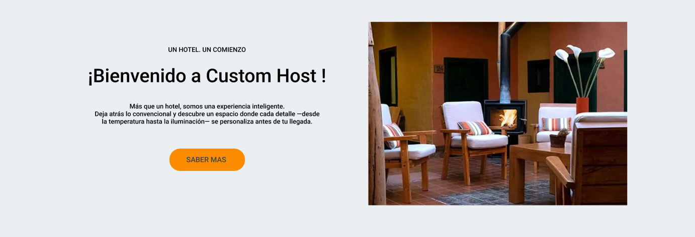
<br>

**Our Services:** En esta sección estará un botón que nos redireccionara a la lista de nuestros servicios en nuestro front-end.

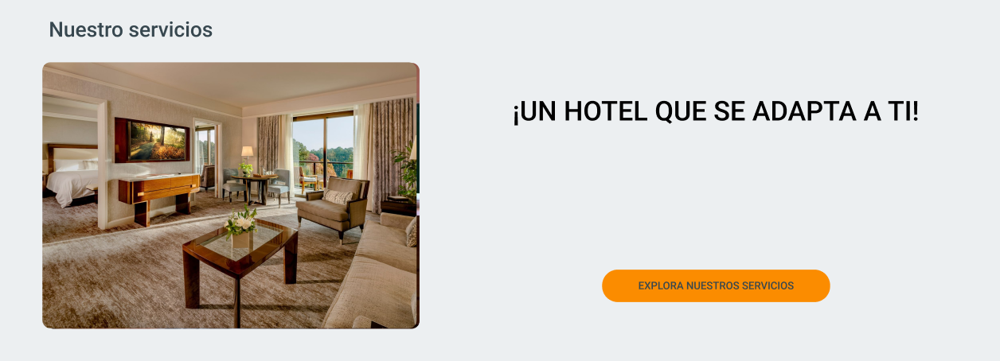
<br>

**Our Rooms** En esta sección estará un botón que nos redireccionara a la lista de nuestras habitaciones en nuestro front-end.

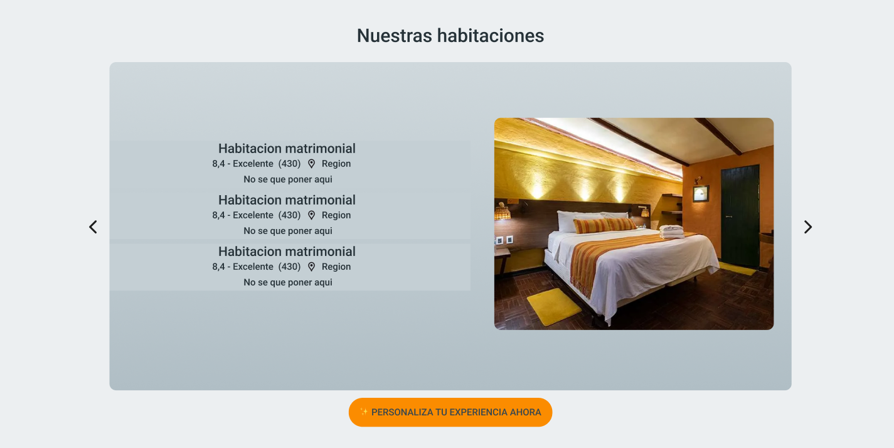
<br>

**Statements** En esta sección se encuentran las opiniones y comentarios de los usuarios que usaron nuestra aplicación web para que futuros huespedes tengan información del servicio brindado.

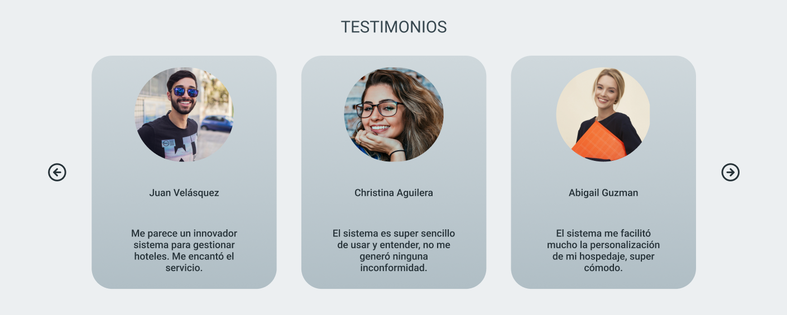
<br>

**Support** Esta seccion está dividida en dos pequeñas secciones, en la primera sección encontrarán las preguntas frecuentes y en segunda sección encontrarán la forma de contactarno como el chat con el soporte del hotel.

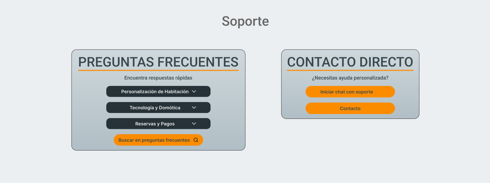
<br>

**Footer**
- El logo junto con correo y numero de contacto.
- Secciones de partes de CustomHost como "Home", "SmartStay" y "About Us".
- Ayuda el usuario como "Contacto", "Preguntas frecuentes", "Términos de servicio" y "Política de privacidad".
- Las redes sociales con las que cuenta Custom Host.


<br>

#### **2. Pantalla Home**
- En la primera sección de esta pantalla se pueden ver 5 cards las cuales muestran información importante para el hotel como la cantidad de habitaciones ocupadas, las reservas del día, las solicitudes urgentes, Check-outs pendientes y los dispositivos IoT inactivos.
- En la siguiente sección tenemos una gráfica que muestra las cantidad de habitaciones reservadas en los últimos treinta días.
- Y por último una tabla con los húespedes actuales, mostrando su habitación, nombre y las fechas de check-in y check-out. <br>
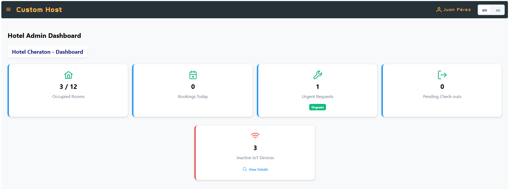
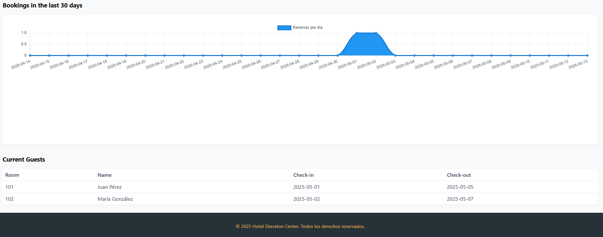

#### **3. Pantalla Rooms Managment**
- En esta página vemos una tabla con las habitaciones que hay en el hotel, mostrando el número de la habitación, el tipo (Suite, Deluxe o Familiar), el status (disponible, ocupado o en limpieza), el precio, el piso en el que se encuentra y las opciones de editar o borra.<br>
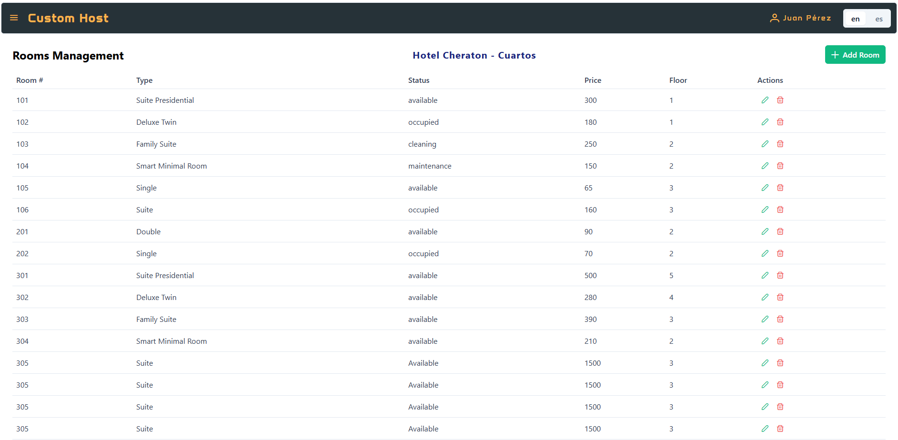
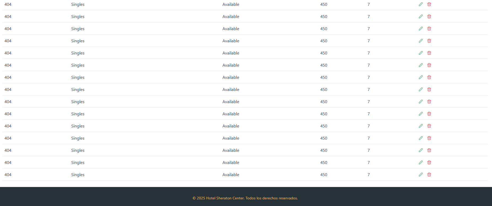

#### **4. Pantalla Iot Device**
- En esta pantalla tenemos cards en las que nos dice con que dispositivos IoT cuenta cada habitación, tambipen nos muestra si los dispositivos están encendidos, apagados o en mantenimiento.<br>
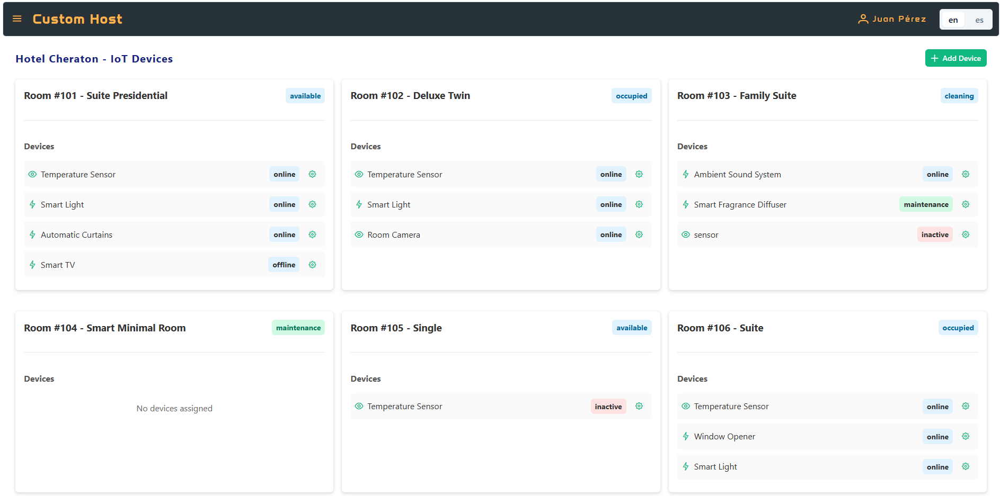
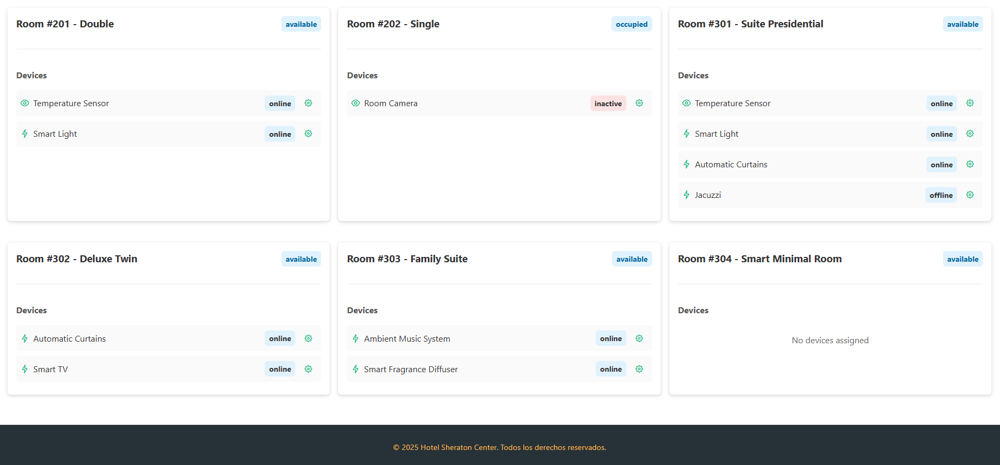

#### **5. Pantalla Customer Request**
- En esta página tenemos dos tablas, la primera muestra que habitaciones están en mantenimiento o están ocupadas y la cantidad de peticiones que han hecho los huespedes de esa habitación.
- En la segunta tabla, nos muestra las peticiones pendientes.<br> 
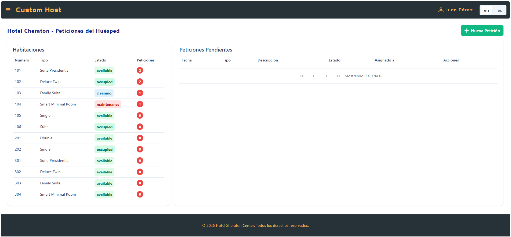

#### **6. Pantalla Booking Tracker**
- En esta pantalla tenemos una tabla con los húespedes actuales, mostrando su habitación, nombre, las fechas de check-in y check-out y las opciones de editar o borrar. <br>
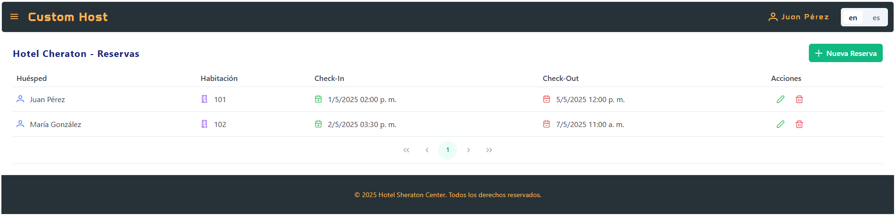

#### **7. Pantalla Request Staff**
- En esta pantalla hay una tabla el nombre de un trabajador del hotel asignadole una solicitu realizado por un huésped. <br>
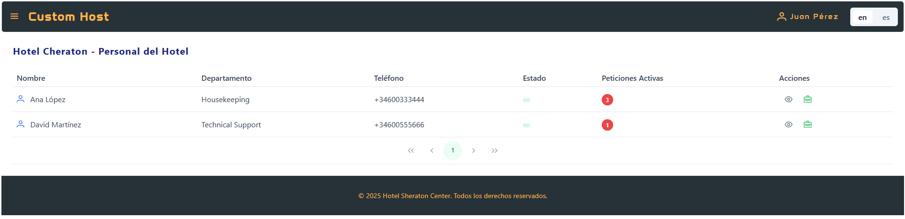

#### **8. Pantalla Profile**
- En esta página tenemos dos cards mostrando los datos personales del administrador y el hotel que trabaja con nosotros. <br>
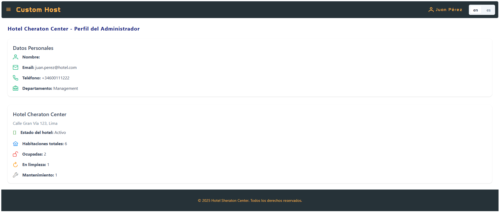

## 4.2. Information Architecture.
La arquitectura de información que se emplea en CustomHost está diseñada para ofrecer una navegación fluida y lógica tanto para huéspedes como para personal administrativo de hoteles. Esta estructura permitirá a los usuarios personalizar su experiencia de hospedaje, controlar su entorno y al personal del hotel gestionar de manera eficiente las preferencias y el estado de cada habitación, todo desde una plataforma centralizada.

La arquitectura de información que se emplea en CustomHost está diseñada para ofrecer una navegación fluida y lógica tanto para huéspedes como para personal administrativo de hoteles. Esta estructura permitirá a los usuarios personalizar su experiencia de hospedaje, controlar su entorno y al personal del hotel gestionar de manera eficiente las preferencias y el estado de cada habitación, todo desde una plataforma centralizada.

### 4.2.1. Organization Systems.
*Organización visual del contenido*
Se empleará una estructura jerárquica visual clara en la Landing Page y en cada sección de la plataformaweb. Se priorizará la presentación de información clave como el panel de preferencias del huésped, el estado de las habitaciones, y accesos rápidos a funciones como check-in, control domótico o comunicación con el personal.

### 4.2.2. Labeling Systems.
Estos son los principios de etiquetado aplicados en la plataforma:

**Claridad y simplicidad:** Se emplea un lenguaje accesible para los usuarios, evitando tecnicismos innecesarios en la interfaz del huésped. En el caso del personal técnico y administrativo, se mantienen ciertos términos específicos, especialmente en la gestión de dispositivos inteligentes y mantenimiento.

**Brevedad:** Las etiquetas de botones, menús y opciones se mantienen breves y directas, facilitando la navegación ágil desde cualquier dispositivo.

### 4.2.3. SEO Tags and Meta Tags
- Título: ```<title> CustomHost | Personaliza tu estadía con tecnología inteligente </title>```
- Descripción: ```<meta name = "description" content = "Plataforma que permite a huéspedes y hoteles personalizar habitaciones con domótica, IoT y acceso biométrico. Vive una experiencia única e inteligente."/>```
- Palabras Clave: ```<meta name = "keyword" content = "Hoteles inteligentes, domótica hotelera, IoT en hoteles, personalización de estadía, check-in digital, habitaciones automatizadas"/>```

### 4.2.4. Searching Systems.
Al ingresar, el usuario será recibido con una pantalla de bienvenida donde se encontrará con dos botones en la parte superior derecha, uno para registrarse y otro para inicar sesión. Una vez iniciada la sesión, la navegación dentro de la aplicación estará organizada para facilitar una experiencia fluida e intuitiva.

Los usuarios contarán con una barra de navegación superior que les permitirá acceder fácilmente a las principales funciones. Desde allí podrán personalizar su estadía, controlar su entorno, solicitar ayuda o gestionar su salida del hotel.

La navegación estará reforzada con íconos, etiquetas breves y estados activos visuales, para garantizar que los usuarios siempre sepan dónde están y cómo volver o avanzar en sus acciones.
Al ingresar, el usuario será recibido con una pantalla de bienvenida donde se encontrará con dos botones en la parte superior derecha, uno para registrarse y otro para inicar sesión. Una vez iniciada la sesión, la navegación dentro de la aplicación estará organizada para facilitar una experiencia fluida e intuitiva.

Los usuarios contarán con una barra de navegación superior que les permitirá acceder fácilmente a las principales funciones. Desde allí podrán personalizar su estadía, controlar su entorno, solicitar ayuda o gestionar su salida del hotel.

La navegación estará reforzada con íconos, etiquetas breves y estados activos visuales, para garantizar que los usuarios siempre sepan dónde están y cómo volver o avanzar en sus acciones.

### 4.2.5. Navigation Systems.
Al ingresar al sitio web de CustomHost, el usuario visualizará una barra de navegación fija en la parte superior de la pantalla, la cual facilitará el acceso directo a las secciones más importantes del sitio.


Esta barra permanecerá visible durante toda la navegación, sin importar la sección visitada, asegurando así un acceso ágil y constante a todos los servicios y recursos que ofrece CustomHost.

## 4.3. Landing Page UI Design.
En esta sección se presentan los diseños correspondientes a nuestra Landing Page, los cuales se encuentran divididos en dos partes: por un lado, los wireframes que muestran una estructura simplificada de la interfaz, y por otro, el mock-up visual que servirá como referencia estética y funcional para el desarrollo final de la página.

### 4.3.1. Landing Page Wireframe.
[Link en Figma]https://www.figma.com/design/3laD7dXkyOejl98KTsmxjj/Aplicaciones-Web?node-id=0-1&t=H1oZeP90awe925yF-1

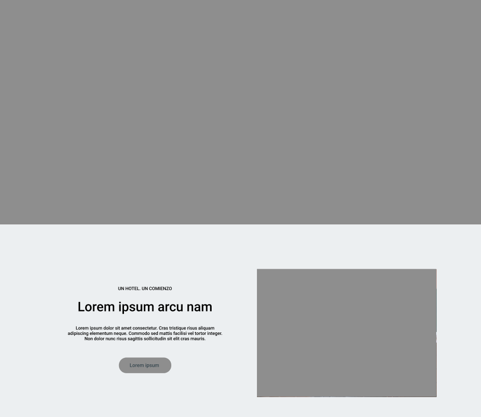
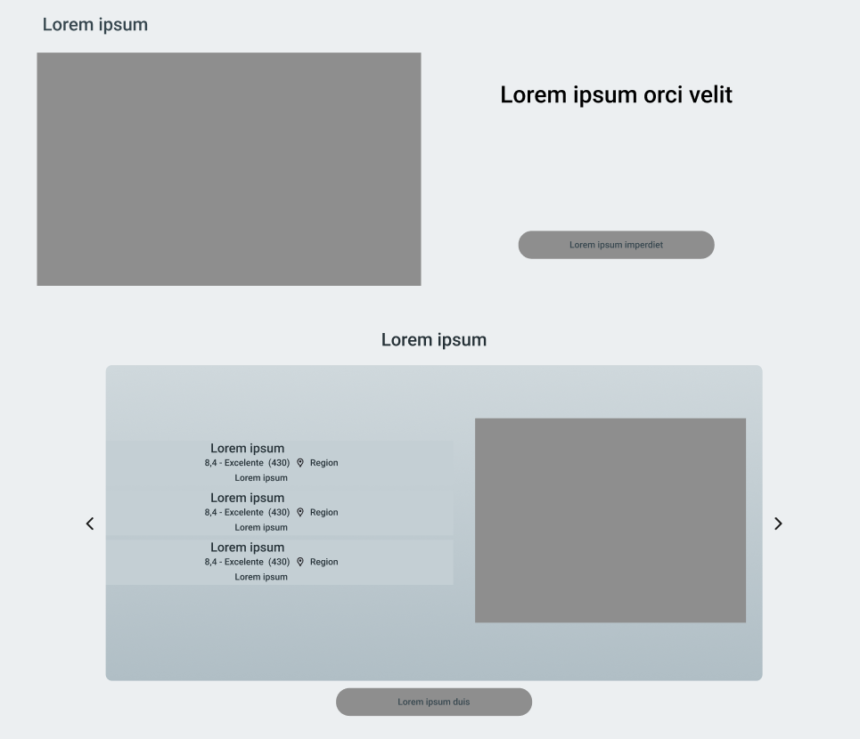
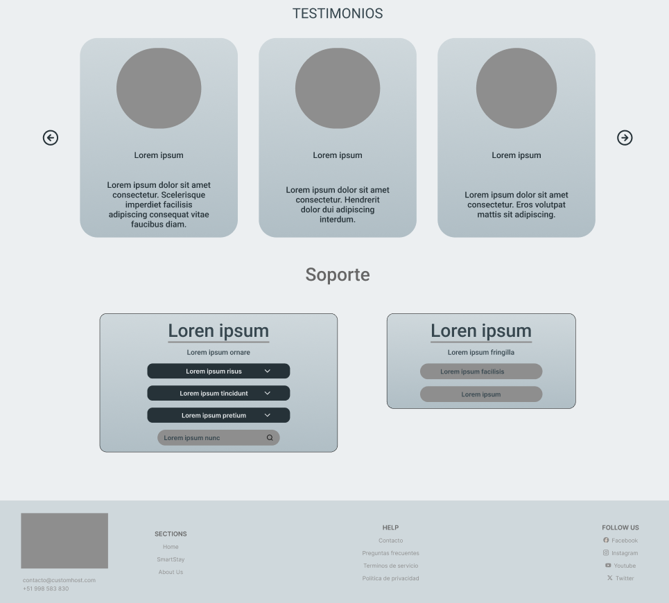

### 4.3.2. Landing Page Mock-up.
[Link en Figma]https://www.figma.com/design/3laD7dXkyOejl98KTsmxjj/Aplicaciones-Web?node-id=0-1&t=H1oZeP90awe925yF-1

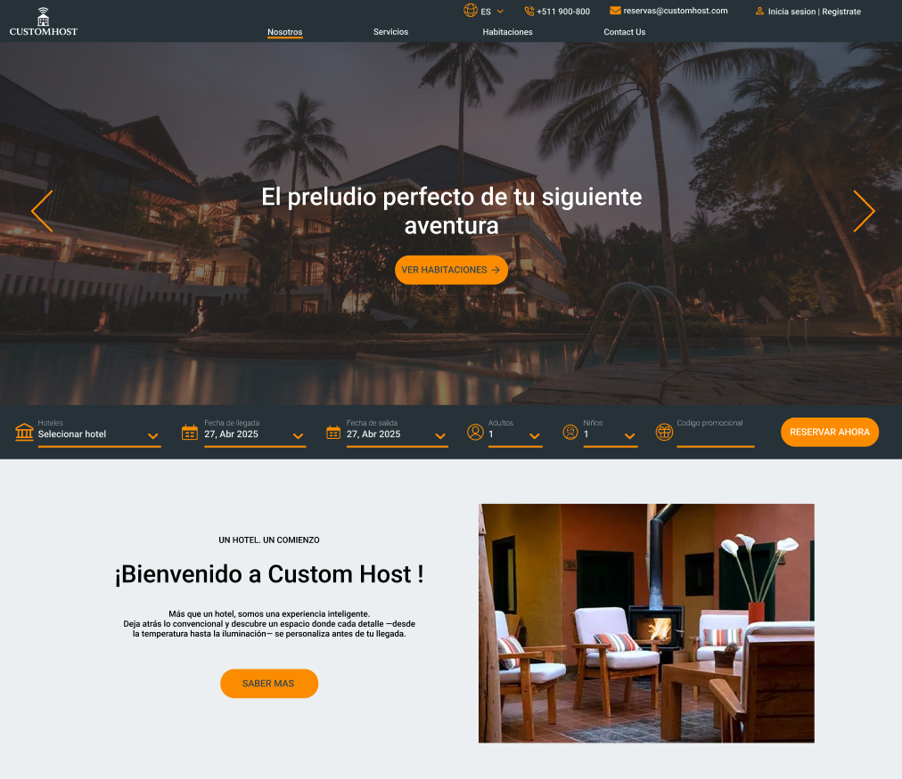
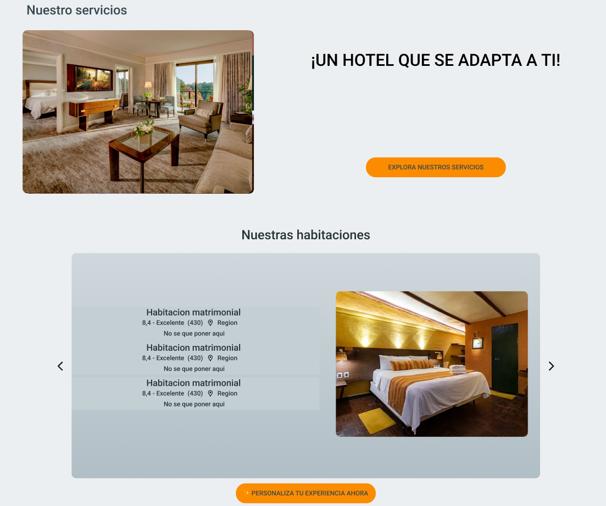
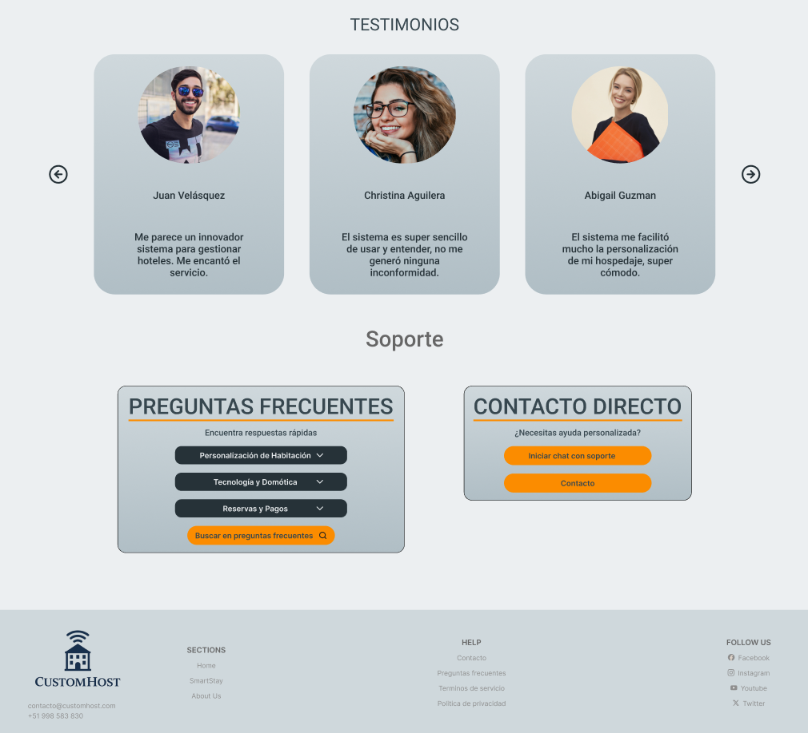


## 4.4. Web Applications UX/UI Design.
### 4.4.1. Web Applications Wireframes.


### 4.4.2. Web Applications Wireflow Diagrams.


### 4.4.2. Web Applications Mock-ups.


### 4.4.3. Web Applications User Flow Diagrams.


## 4.5. Web Applications Prototyping.
URL del Prototipo https://www.figma.com/design/Rti8LYhQHMeIjsfMIQYIdr/Open-Source?node-id=0-1&p=f&t=XYETOEAUmnls4kjW-0

## 4.6. Domain-Driven Software Architecture.
### 4.6.1. Software Architecture Context Diagram.


   
### 4.6.2. Software Architecture Container Diagrams.
web.png)


### 4.6.3. Software Architecture Components Diagrams.


## 4.7. Software Object-Oriented Design.
### 4.7.1. Class Diagrams.

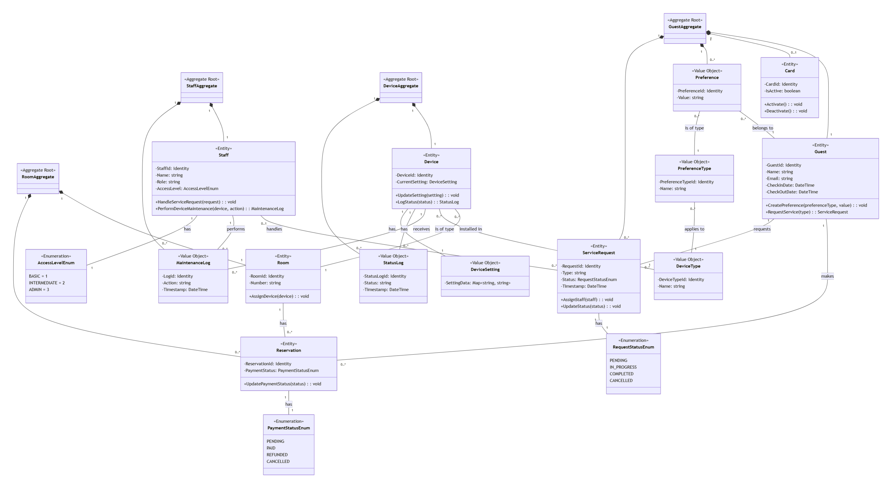

[> Click aquí para acceder al diagrama <](https://lucid.app/lucidchart/0b48881b-37af-4d3f-81f0-5c48f44eff2d/edit?invitationId=inv_e14a7c8d-7849-467d-99ab-528f2398e183&page=0_0#)

### 4.7.2. Class Dictionary.

# Class Dictionary

## 1. GuestAggregate
- **Type**: Aggregate Root
- **Description**: Raíz del agregado relacionado con los huéspedes.
- **Relationships**:
  - Contiene `Guest` (1:1).
  - Contiene `Card` (0..1).
  - Contiene `Preference` (0..*).
  - Contiene `ServiceRequest` (0..*).

---

## 2. Guest
- **Type**: Entity
- **Attributes**:
  - `GuestId`: Identity (Identificador único del huésped).
  - `Name`: string (Nombre del huésped).
  - `Email`: string (Correo electrónico del huésped).
  - `CheckInDate`: DateTime (Fecha de entrada).
  - `CheckOutDate`: DateTime (Fecha de salida).
- **Methods**:
  - `CreatePreference(preferenceType, value)`: Crea una nueva preferencia para el huésped.
  - `RequestService(type)`: Solicita un servicio para el huésped.
- **Relationships**:
  - Pertenece a `GuestAggregate`.
  - Tiene `Reservation` (0..*).
  - Tiene `ServiceRequest` (0..*).
  - Tiene `Preference` (0..*).

---

## 3. Card
- **Type**: Entity
- **Attributes**:
  - `CardId`: Identity (Identificador único de la tarjeta).
  - `IsActive`: boolean (Indica si la tarjeta está activa).
- **Methods**:
  - `Activate()`: Activa la tarjeta.
  - `Deactivate()`: Desactiva la tarjeta.
- **Relationships**:
  - Pertenece a `GuestAggregate`.

---

## 4. RoomAggregate
- **Type**: Aggregate Root
- **Description**: Raíz del agregado relacionado con las habitaciones.
- **Relationships**:
  - Contiene `Room` (1:1).
  - Contiene `Reservation` (0..*).

---

## 5. Room
- **Type**: Entity
- **Attributes**:
  - `RoomId`: Identity (Identificador único de la habitación).
  - `Number`: string (Número de la habitación).
- **Methods**:
  - `AssignDevice(device)`: Asigna un dispositivo a la habitación.
- **Relationships**:
  - Pertenece a `RoomAggregate`.
  - Tiene `Reservation` (0..*).
  - Tiene `Device` (0..*).

---

## 6. Reservation
- **Type**: Entity
- **Attributes**:
  - `ReservationId`: Identity (Identificador único de la reserva).
  - `PaymentStatus`: PaymentStatusEnum (Estado de pago de la reserva).
- **Methods**:
  - `UpdatePaymentStatus(status)`: Actualiza el estado de pago de la reserva.
- **Relationships**:
  - Pertenece a `RoomAggregate`.
  - Está relacionada con `Guest` (1:0..*).
  - Está relacionada con `Room` (1:0..*).

---

## 7. StaffAggregate
- **Type**: Aggregate Root
- **Description**: Raíz del agregado relacionado con el personal.
- **Relationships**:
  - Contiene `Staff` (1:1).
  - Contiene `MaintenanceLog` (0..*).

---

## 8. Staff
- **Type**: Entity
- **Attributes**:
  - `StaffId`: Identity (Identificador único del miembro del personal).
  - `Name`: string (Nombre del miembro del personal).
  - `Role`: string (Rol del miembro del personal).
  - `AccessLevel`: AccessLevelEnum (Nivel de acceso del miembro del personal).
- **Methods**:
  - `HandleServiceRequest(request)`: Maneja una solicitud de servicio.
  - `PerformDeviceMaintenance(device, action)`: Realiza mantenimiento en un dispositivo.
- **Relationships**:
  - Pertenece a `StaffAggregate`.
  - Tiene `MaintenanceLog` (0..*).
  - Maneja `ServiceRequest` (0..*).

---

## 9. DeviceAggregate
- **Type**: Aggregate Root
- **Description**: Raíz del agregado relacionado con los dispositivos.
- **Relationships**:
  - Contiene `Device` (1:1).
  - Contiene `StatusLog` (0..*).

---

## 10. Device
- **Type**: Entity
- **Attributes**:
  - `DeviceId`: Identity (Identificador único del dispositivo).
  - `CurrentSetting`: DeviceSetting (Configuración actual del dispositivo).
- **Methods**:
  - `UpdateSetting(setting)`: Actualiza la configuración del dispositivo.
  - `LogStatus(status)`: Registra el estado del dispositivo.
- **Relationships**:
  - Pertenece a `DeviceAggregate`.
  - Está instalado en `Room` (1:0..*).
  - Tiene `DeviceType` (1:1).
  - Tiene `MaintenanceLog` (0..*).
  - Tiene `StatusLog` (0..*).

---

## 11. ServiceRequest
- **Type**: Entity
- **Attributes**:
  - `RequestId`: Identity (Identificador único de la solicitud de servicio).
  - `Type`: string (Tipo de solicitud de servicio).
  - `Status`: RequestStatusEnum (Estado de la solicitud de servicio).
  - `Timestamp`: DateTime (Marca de tiempo de la solicitud).
- **Methods**:
  - `AssignStaff(staff)`: Asigna un miembro del personal a la solicitud.
  - `UpdateStatus(status)`: Actualiza el estado de la solicitud.
- **Relationships**:
  - Pertenece a `GuestAggregate`.
  - Es manejada por `Staff` (0..1).

---

## 12. DeviceType
- **Type**: Value Object
- **Attributes**:
  - `DeviceTypeId`: Identity (Identificador único del tipo de dispositivo).
  - `Name`: string (Nombre del tipo de dispositivo).
- **Relationships**:
  - Está relacionado con `Device` (1:0..*).
  - Aplica a `PreferenceType` (0..*).

---

## 13. PreferenceType
- **Type**: Value Object
- **Attributes**:
  - `PreferenceTypeId`: Identity (Identificador único del tipo de preferencia).
  - `Name`: string (Nombre del tipo de preferencia).
- **Relationships**:
  - Está relacionado con `Preference` (1:0..*).
  - Se aplica a `DeviceType` (0..*).

---

## 14. Preference
- **Type**: Value Object
- **Attributes**:
  - `PreferenceId`: Identity (Identificador único de la preferencia).
  - `Value`: string (Valor de la preferencia).
- **Relationships**:
  - Pertenece a `Guest` (1:0..*).
  - Está relacionado con `PreferenceType` (1:1).

---

## 15. DeviceSetting
- **Type**: Value Object
- **Attributes**:
  - `SettingData`: Map<string, string> (Datos de configuración del dispositivo).
- **Relationships**:
  - Es utilizado por `Device` (1:1).

---

## 16. MaintenanceLog
- **Type**: Value Object
- **Attributes**:
  - `LogId`: Identity (Identificador único del registro de mantenimiento).
  - `Action`: string (Acción realizada durante el mantenimiento).
  - `Timestamp`: DateTime (Marca de tiempo del registro).
- **Relationships**:
  - Es realizado por `Staff` (1:0..*).
  - Es recibido por `Device` (1:0..*).

---

## 17. StatusLog
- **Type**: Value Object
- **Attributes**:
  - `StatusLogId`: Identity (Identificador único del registro de estado).
  - `Status`: string (Estado registrado).
  - `Timestamp`: DateTime (Marca de tiempo del registro).
- **Relationships**:
  - Es registrado por `Device` (1:0..*).

---

## 18. AccessLevelEnum
- **Type**: Enumeration
- **Values**:
  - `BASIC = 1`
  - `INTERMEDIATE = 2`
  - `ADMIN = 3`

---

## 19. RequestStatusEnum
- **Type**: Enumeration
- **Values**:
  - `PENDING`
  - `IN_PROGRESS`
  - `COMPLETED`
  - `CANCELLED`

---

## 20. PaymentStatusEnum
- **Type**: Enumeration
- **Values**:
  - `PENDING`
  - `PAID`
  - `REFUNDED`
  - `CANCELLED`

## 4.8. Database Design.
### 4.8.1. Database Diagram.

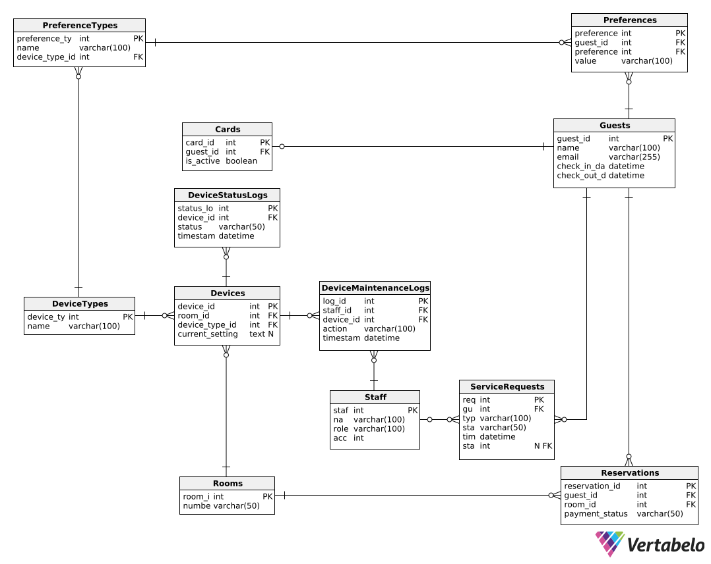

[> Click aquí para acceder al diagrama <](https://my.vertabelo.com/public-model-view/n0NImX9sR1voJyd33Hr1iawsHgx7swpzz7jOBxA2VjOTE3i8WLuZf64ZQlNCyCLB?x=2736&y=2923&zoom=0.4375)
# Capítulo V: Product Implementation, Validation & Deployment
En este último capítulo, nos centraremos en la implementación, validación y despliegue de nuestro proyecto. Al igual que explicar los puntos y pasos necesarios que hemos tomado para lograr su realización.
## 5.1. Software Configuration Management.
Durante el desarrollo del proyecto utilizaremos las siguientes convenciones o reglas para mantener consistencia en todo momento:
|Contexto|Convención|
|-|-|
|Nombre de archivos|Todos los archivos tendrán nombres en minúscula, sin espacios, usando kebab-case.|
|Convenciones de nomenclatura| Variables y funciones: lowerCamelCase; clases y componentes: PascalCase; constantes: UPPER_SNAKE_CASE; archivos: kebab-case.|
|Estructura del código|Usar estructura modular siguiendo el patrón feature/module, con carpetas como components/, assets/, pages/, services/, etc. Separar por responsabilidades.|
|Estilo de codificación|Seguir las reglas de ESLint y Prettier: Sangría de 2 espacios; comillas simples; punto y coma obligatorio; y orden alfabético en CSS.|
|Documentación|Comentar solo en funciones complejas o integraciones externas. Usar formato descripción y mantener el README.md claro y actualizado.|
|Control de versiones|GitHub Flow: ramas por feature, uso de Pull Requests, revisiones antes de merge. Formato de commits: feat, fix, chore, etc.|
|Gestión de dependencias|	Usar npm. Mantener package.json ordenado y actualizado. Preferir dependencias estables y con comunidad activa. Ejecutar npm audit regularmente.|
|Convenciones de prueba|Tests en archivos .spec.js si aplica. Enfoque en pruebas visuales/manuales en componentes clave como BookingForm, RoomCard, ServiceRequest.|
|Convenciones de seguridad|Validación de entradas en frontend. Autenticación vía tokens (JWT). No incluir secretos en el código. Usar sanitización para evitar XSS.|
|Convenciones de colaboración| Comunicación por Discord o Teams. Gestión en Trello o GitHub Projects. Documentar avances, pedir feedback constante y promover buenas prácticas. |
### 5.1.1. Software Development Environment Configuration.
|Producto|Descripción|Próposito de Uso
|-|-|-|
|Rider (JetBrains)|Entorno de desarrollo especializado en .NET, ideal para construir aplicaciones robustas de escritorio, móviles y servicios web.|Se emplea para el desarrollo de WebServices en C# y tecnología .NET, aprovechando su rendimiento, seguridad y compatibilidad multiplataforma.|
|MySQL|Sistema de gestión de bases de datos relacional, de código abierto y ampliamente soportado.|Brinda una base de datos confiable para manejar reservas, huéspedes, dispositivos y servicios del hotel, con capacidad de gestión local o en la nube.|
|Postman	|Plataforma de colaboración para pruebas de APIs REST. Permite simular, probar y documentar endpoints rápidamente.|Ideal para probar servicios de la web como reservas, preferencias de usuario, solicitudes de habitación y más.|
|Git|Sistema de control de versiones distribuido, esencial para llevar un historial organizado del desarrollo del software.|Administra cambios en el código, facilita el trabajo colaborativo y permite restaurar versiones anteriores si se requiere.|
### 5.1.2. Source Code Management.
El gitjab donde tengamos el proyecto
### 5.1.3. Source Code Style Guide & Conventions.
Que usamos con css (en caso usemos software para SASS)
supongo q tmbn cositas de como hacemo el code capas algun tipo de codigo para comunicarse entre comments
### 5.1.4. Software Deployment Configuration.
Configuraciones de donde y como deployeamos el proyecto
## 5.2. Landing Page, Services & Applications Implementation.
### 5.2.1. Sprint 1
#### 5.2.1.1. Sprint Planning 1.
A continuación, se presentará el sprint planning 1 donde se mostrarán las evidencias de planificación e implementación
del landing page.

**Sprint Backlog 1**
<table>
    <thead>
        <tr>
            <th> Sprint #</th>
            <th> Sprint 1</th>
        </tr>
    </thead>
    <tbody>
        <tr>
            <td style="font-weight: bold; text-align: center" colspan="2"> Sprint Planing Background</td>
        </tr>
        <tr>
            <td style="font-weight: bold;"> Date</td>
            <td> 15/04/2024 </td>
        </tr>
        <tr>
            <td style="font-weight: bold;"> Time</td>
            <td> 17:00 horas (GMT-5)</td>
        </tr>
        <tr>
            <td style="font-weight: bold;"> Location</td>
            <td> Modalidad remota por Discord.
            <td>
        </tr>
        <tr>
            <td style="font-weight: bold;"> Prepared By</td>
            <td> Softcore team
            <td>
        </tr>
        <tr>
            <td style="font-weight: bold;"> Attendees (to planning meeting)</td>
            <td> Todos los miembros del equipo Softcore.
            <td>
        </tr>
        <tr>
            <td style="font-weight: bold;"> Sprint n – 0 Review Summary</td>
            <td> Debido a que es el primer sprint que se ha hecho, no existen sprints pasados a este.
            <td>
        </tr>
        <tr>
            <td style="font-weight: bold;"> Sprint n – 1 Retrospective Summary</td>
            <td>
        Durante este sprint, se creó el landing page empleando HTML, CSS y JavaScript. También se abordaron las conversaciones sobre el contenido textual que se integró en el landing page, así como el diseño previamente establecido en Figma. Al finalizar este sprint, el landing page se subió a GitHub Pages , permitiendo que cualquier usuario pueda acceder y visualizar la página a través del enlace proporcionado. Además, se realizaron pruebas exhaustivas para asegurar que el sitio esté completamente funcional y se vea correctamente en cualquier dispositivo, garantizando una experiencia óptima tanto en computadoras de escritorio como en tablets y teléfonos móviles.
            <td>
        </tr>
        <tr>
            <td style="font-weight: bold; text-align: center" colspan="2"> Sprint Goal & User Stories</td>
        </tr>
        <tr>
            <td style="font-weight: bold;"> Sprint 1 Velocity</td>
            <td> 14
            <td>
        </tr>
        <tr>
            <td style="font-weight: bold;"> Sum of Story Points</td>
            <td> 14
            <td>
        </tr>
    </tbody>
</table>

#### 5.2.1.2. Aspect Leaders and Collaborators.

|Team Member|GitHub Username|UX-UI<br>Leader(L)/Collaborator(C)| 
|-|-|-|
|Arrieta Quispe, Alison Jimena|alisoft08|C|L|C|
|Ccarita Cruz, Roberto Brayan|hallzyx|C|C|L|
|Ordoñez Ricaldi, Axel Randall|nOOmzzzz|C|C|C|
|Panta Castro, Fabrizio Martin|F4brizio24|C|C|C|
|Santiago Peña, Andreow Jomark|andrew65411|L|C|C|

#### 5.2.1.3. Sprint Backlog 1.


#### 5.2.1.4. Development Evidence for Sprint Review.

#### 5.2.1.5. Execution Evidence for Sprint Review.
Sprint 1: En este entregable, hemos logrado desarrollar la Landing Page para nuestra StartUp Sweet Manager. El link de la Landing Page es el siguiente: https://softcore-app-web-1asi0730-2510-4395.github.io/CustomHost/.

#### 5.2.1.6. Services Documentation Evidence for Sprint Review.
En este sprint se cumplió el objetivo de desarrollar la Landing Page; sin embargo, al ser Landing Page no requiere de documentación relacionada a Web Services
#### 5.2.1.7. Software Deployment Evidence for Sprint Review.
En este sprint, se completó el desarrollo del landing page y se utilizó un conjunto de herramientas para su despliegue:

- Git: Utilizado como sistema de control de versiones para facilitar el trabajo en equipo durante el desarrollo del landing page.
- GitFlow: Implementado como flujo de trabajo para gestionar el progreso individual de cada miembro del equipo en el desarrollo del landing page.
- GitHub: Empleado como plataforma colaborativa para almacenar las versiones del proyecto y facilitar el desarrollo conjunto del equipo.
- Github pages: Utilizado como plataforma para automatizar la hospedaje y despliegue del landing page, especialmente diseñada para sitios web estáticos.

#### 5.2.1.8. Team Collaboration Insights during Sprint.
El equipo desarrolló el sistema de gestión hotelera utilizando una estrategia basada en ramas para cada componente o funcionalidad. Esta metodología permitió que cada miembro del equipo trabajara de forma independiente en elementos como la página de inicio, el selector de idioma, la gestión de peticiones y el panel de administración, sin interferir con el trabajo de los demás. Una vez finalizada cada funcionalidad, se verificó que no existieran conflictos con la rama principal (main) y se generó una pull request para integrar los cambios de forma controlada. A continuación, se adjunta una imagen que evidencia la colaboración del equipo en GitHub.
 


### 5.2.2. Sprint 2

En este sprint como equipo nos hemos enfocado en el desarrollo frontend de la aplicación.


#### 5.2.2.1.Sprint Planning 2.

A continuación se presenta los detalles de la planificación del segundo sprint.
<table>
    <thead>
        <tr>
            <th> Sprint #</th>
            <th> Sprint 2</th>
        </tr>
    </thead>
    <tbody>
        <tr>
            <td style="font-weight: bold; text-align: center" colspan="2"> Sprint Planing Background</td>
        </tr>
        <tr>
            <td style="font-weight: bold;"> Date</td>
            <td> 07/05/2025 </td>
        </tr>
        <tr>
            <td style="font-weight: bold;"> Time</td>
            <td> 14:00 horas (GMT-5)</td>
        </tr>
        <tr>
            <td style="font-weight: bold;"> Location</td>
            <td> Lima, Reunion virtual por Discord
            <td>
        </tr>
        <tr>
            <td style="font-weight: bold;"> Prepared By</td>
            <td> Softcore team
            <td>
        </tr>
        <tr>
            <td style="font-weight: bold;"> Attendees (to planning meeting)</td>
            <td> Roberto Brayan Ccarita Cruz <br> Andreow Jomark Santiago Peña <br> Alison Jimena Arrieta Quispe <br> Fabrizio Martin Panta Castro <br> Axel Randall Ordoñez Ricaldi
            <td>
        </tr>
        <tr>
            <td style="font-weight: bold;"> Sprint n – 1 Review Summary</td>
            <td> Sprint 1: En el anterior sprint hemos diseñado un langing page con seccion hero, beneficios, introduccion, valores y contacto. Hemos cumplido con todas las historias de usuario formuladas.
            <td>
        </tr>
        <tr>
            <td style="font-weight: bold;"> Sprint n – 1 Retrospective Summary</td>
            <td>
                Sprint 1: En el anterior sprint hemos diseñado una landing page, tuvimos algunos problemas al incio pero luego supimos manejar y ordenar todo por branches y lograr llegar a un buen resultado con uso de html, css y js.  
            <td>
        </tr>
        <tr>
            <td style="font-weight: bold;"> Sprint Goal & User Stories</td>
<td> Desarrollar y completar el frontend de la aplicación, asegurando una interfaz de usuario intuitiva y funcional que cumpla con los requisitos y especificaciones establecidas.
            <td>
        </tr>
        <tr>
            <td style="font-weight: bold;"> Sprint 2 Velocity</td>
            <td> 15
            <td>
        </tr>
        <tr>
            <td style="font-weight: bold;"> Sum of Story Points</td>
            <td> 23
            <td>
        </tr>
    </tbody>
</table>

#### 5.2.2.2. Aspect Leaders and Collaborators.

|Team Member|GitHub Username|Performance<br>Leader(L)/Collaborator(C)|UX-UI<br>Leader(L)/Collaborator(C)|Funcionalidad<br>Leader(L)/Collaborator(C)| 
|-|-|-|-|-|
|Arrieta Quispe, Alison Jimena|alisoft08|C|L|C|
|Ccarita Cruz, Roberto Brayan|hallzyx|C|C|L|
|Ordoñez Ricaldi, Axel Randall|nOOmzzzz|C|C|C|
|Panta Castro, Fabrizio Martin|F4brizio24|C|C|C|
|Santiago Peña, Andreow Jomark|andrew65411|L|C|C|

#### 5.2.2.3. Sprint Backlog 2.

Aquí se presenta el backlog desarrollado a partir del Sprint 2.


#### 5.2.2.4. Development Evidence for Sprint Review.
Esta sección registra las evidencias del desarrollo del Sprint.


| Repository     | Branch                    | Commit Message                          | Committed on (Date) |
|----------------|----------------------------|------------------------------------------|---------------------|
| customhost     | develop                    | Merge pull request #5 from feature/home-page | 13/05/2024          |
| customhost     | feature/basic-routing      | feat: added Angular basic routing module | 10/05/2024          |
| customhost     | feature/i18n               | feat: integrated ngx-translate and language switcher | 11/05/2024          |
| customhost     | feature/json               | feat: added assets json for dynamic data | 11/05/2024          |
| customhost     | feature/guest-experience   | feat: created guest experience component | 12/05/2024          |
| customhost     | feature/home-page          | feat: designed and structured homepage layout | 13/05/2024          |

#### 5.2.2.5. Execution Evidence for Sprint Review.
Sprint 2: En este entregable, hemos logrado desarrollar el Frontend de la aplicación para nuestra StartUp Sweet Manager. El link de la aplicación es el siguiente: https://aaaavue-hallzyxs-projects.vercel.app/rooms


#### 5.2.2.6. Services Documentation Evidence for Sprint Review.
Durante este sprint se avanzó en el desarrollo de la interfaz de usuario de la aplicación utilizando Vue como lenguaje de front end, enfocándose principalmente en la construcción de componentes visuales y estructurales.
En esta fase no se integraron servicios reales (API REST), ya que los datos utilizados en los componentes fueron simulados localmente para efectos de diseño y validación visual.

La integración con servicios back-end está prevista para un sprint posterior, una vez finalizada la implementación de la estructura base de la aplicación. Por ello, no se incluye evidencia de documentación de servicios en esta etapa.
#### 5.2.2.7. Software Deployment Evidence for Sprint Review.
En este sprint, se completó el desarrollo del landing page y se utilizó un conjunto de herramientas para su despliegue:

- Git: Utilizado como sistema de control de versiones para facilitar el trabajo en equipo durante el desarrollo del front-end application.
- GitFlow: Implementado como flujo de trabajo para gestionar el progreso individual de cada miembro del equipo en el desarrollo del front-end application.
- GitHub: Empleado como plataforma colaborativa para almacenar las versiones del proyecto y facilitar el desarrollo conjunto del front-end application.
- Vercel: Utilizado como plataforma para automatizar el despliegue del front-end application.


#### 5.2.2.8. Team Collaboration Insights during Sprint.


# Bibliografía

``` 
MINCETUR. (2024). Arribos, pernoctaciones y oferta hotelera en establecimientos de hospedaje. https://datosturismo.mincetur.gob.pe/appdatosturismo/content3.html

Cántaro Márquez, A. L., Miranda Vásquez, G. F., & Ángeles Barrantes, D. (2023). Análisis de las eco-innovaciones en establecimientos de hospedaje peruanos. Sustainability, 15(8), 6700. https://doi.org/10.3390/su15086700

```

# Anexos

video 1: [https://upcedupe-my.sharepoint.com/:v:/g/personal/u202317362_upc_edu_pe/ETQAkMt6M7VHppn0V_2yowMB4lImpb1OLwaovBnNoPKKhg?e=qYLctj&nav=eyJyZWZlcnJhbEluZm8iOnsicmVmZXJyYWxBcHAiOiJTdHJlYW1XZWJBcHAiLCJyZWZlcnJhbFZpZXciOiJTaGFyZURpYWxvZy1MaW5rIiwicmVmZXJyYWxBcHBQbGF0Zm9ybSI6IldlYiIsInJlZmVycmFsTW9kZSI6InZpZXcifX0%3D](https://upcedupe-my.sharepoint.com/:v:/g/personal/u202317362_upc_edu_pe/ETQAkMt6M7VHppn0V_2yowMB4lImpb1OLwaovBnNoPKKhg?e=qYLctj&nav=eyJyZWZlcnJhbEluZm8iOnsicmVmZXJyYWxBcHAiOiJTdHJlYW1XZWJBcHAiLCJyZWZlcnJhbFZpZXciOiJTaGFyZURpYWxvZy1MaW5rIiwicmVmZXJyYWxBcHBQbGF0Zm9ybSI6IldlYiIsInJlZmVycmFsTW9kZSI6InZpZXcifX0%3D)

video 2: [https://upcedupe-my.sharepoint.com/:v:/g/personal/u202317362_upc_edu_pe/EW8bbyowHHNGvrGNiIjfFlwB-Q3bTBRaSvZlTXGKRC2L7w?e=R9zBK3&nav=eyJyZWZlcnJhbEluZm8iOnsicmVmZXJyYWxBcHAiOiJTdHJlYW1XZWJBcHAiLCJyZWZlcnJhbFZpZXciOiJTaGFyZURpYWxvZy1MaW5rIiwicmVmZXJyYWxBcHBQbGF0Zm9ybSI6IldlYiIsInJlZmVycmFsTW9kZSI6InZpZXcifX0%3D](https://upcedupe-my.sharepoint.com/:v:/g/personal/u202317362_upc_edu_pe/EW8bbyowHHNGvrGNiIjfFlwB-Q3bTBRaSvZlTXGKRC2L7w?e=R9zBK3&nav=eyJyZWZlcnJhbEluZm8iOnsicmVmZXJyYWxBcHAiOiJTdHJlYW1XZWJBcHAiLCJyZWZlcnJhbFZpZXciOiJTaGFyZURpYWxvZy1MaW5rIiwicmVmZXJyYWxBcHBQbGF0Zm9ybSI6IldlYiIsInJlZmVycmFsTW9kZSI6InZpZXcifX0%3D)

video 3: [https://upcedupe-my.sharepoint.com/:v:/g/personal/u202317362_upc_edu_pe/EdDQjdiPjQ9JlAtkH5yDuhgBZcXkH52f6WubG0DGugxiYw?e=RGPOHp&nav=eyJyZWZlcnJhbEluZm8iOnsicmVmZXJyYWxBcHAiOiJTdHJlYW1XZWJBcHAiLCJyZWZlcnJhbFZpZXciOiJTaGFyZURpYWxvZy1MaW5rIiwicmVmZXJyYWxBcHBQbGF0Zm9ybSI6IldlYiIsInJlZmVycmFsTW9kZSI6InZpZXcifX0%3D](https://upcedupe-my.sharepoint.com/:v:/g/personal/u202317362_upc_edu_pe/EdDQjdiPjQ9JlAtkH5yDuhgBZcXkH52f6WubG0DGugxiYw?e=RGPOHp&nav=eyJyZWZlcnJhbEluZm8iOnsicmVmZXJyYWxBcHAiOiJTdHJlYW1XZWJBcHAiLCJyZWZlcnJhbFZpZXciOiJTaGFyZURpYWxvZy1MaW5rIiwicmVmZXJyYWxBcHBQbGF0Zm9ybSI6IldlYiIsInJlZmVycmFsTW9kZSI6InZpZXcifX0%3D)

video 4: [https://upcedupe-my.sharepoint.com/:v:/g/personal/u202317362_upc_edu_pe/ETgSUSNEantAraWk1atoAa4BjISZsufjnztzz_iJVxGXAg?e=oxnXyR&nav=eyJyZWZlcnJhbEluZm8iOnsicmVmZXJyYWxBcHAiOiJTdHJlYW1XZWJBcHAiLCJyZWZlcnJhbFZpZXciOiJTaGFyZURpYWxvZy1MaW5rIiwicmVmZXJyYWxBcHBQbGF0Zm9ybSI6IldlYiIsInJlZmVycmFsTW9kZSI6InZpZXcifX0%3D](https://upcedupe-my.sharepoint.com/:v:/g/personal/u202317362_upc_edu_pe/ETgSUSNEantAraWk1atoAa4BjISZsufjnztzz_iJVxGXAg?e=oxnXyR&nav=eyJyZWZlcnJhbEluZm8iOnsicmVmZXJyYWxBcHAiOiJTdHJlYW1XZWJBcHAiLCJyZWZlcnJhbFZpZXciOiJTaGFyZURpYWxvZy1MaW5rIiwicmVmZXJyYWxBcHBQbGF0Zm9ybSI6IldlYiIsInJlZmVycmFsTW9kZSI6InZpZXcifX0%3D)

video 5: [https://upcedupe-my.sharepoint.com/personal/u202317362_upc_edu_pe/_layouts/15/stream.aspx?id=%2Fpersonal%2Fu202317362%5Fupc%5Fedu%5Fpe%2FDocuments%2FSegmento%201%20%2D%20Luis%20Cordova%2Emp4&nav=eyJyZWZlcnJhbEluZm8iOnsicmVmZXJyYWxBcHAiOiJTdHJlYW1XZWJBcHAiLCJyZWZlcnJhbFZpZXciOiJTaGFyZURpYWxvZy1MaW5rIiwicmVmZXJyYWxBcHBQbGF0Zm9ybSI6IldlYiIsInJlZmVycmFsTW9kZSI6InZpZXcifX0&ga=1&referrer=StreamWebApp%2EWeb&referrerScenario=AddressBarCopied%2Eview%2Ee82cd9e2%2D078e%2D4cb0%2D80cf%2D3200ebfdab04](https://upcedupe-my.sharepoint.com/personal/u202317362_upc_edu_pe/_layouts/15/stream.aspx?id=%2Fpersonal%2Fu202317362%5Fupc%5Fedu%5Fpe%2FDocuments%2FSegmento%201%20%2D%20Luis%20Cordova%2Emp4&nav=eyJyZWZlcnJhbEluZm8iOnsicmVmZXJyYWxBcHAiOiJTdHJlYW1XZWJBcHAiLCJyZWZlcnJhbFZpZXciOiJTaGFyZURpYWxvZy1MaW5rIiwicmVmZXJyYWxBcHBQbGF0Zm9ybSI6IldlYiIsInJlZmVycmFsTW9kZSI6InZpZXcifX0&ga=1&referrer=StreamWebApp%2EWeb&referrerScenario=AddressBarCopied%2Eview%2Ee82cd9e2%2D078e%2D4cb0%2D80cf%2D3200ebfdab04)

video 6: [https://upcedupe-my.sharepoint.com/:v:/g/personal/u202317362_upc_edu_pe/EU9qNutqfIdAlN0FVSU5avIBOmL9Y3mwIx2kCBAuGyURhw?e=Vb6lwq&nav=eyJyZWZlcnJhbEluZm8iOnsicmVmZXJyYWxBcHAiOiJTdHJlYW1XZWJBcHAiLCJyZWZlcnJhbFZpZXciOiJTaGFyZURpYWxvZy1MaW5rIiwicmVmZXJyYWxBcHBQbGF0Zm9ybSI6IldlYiIsInJlZmVycmFsTW9kZSI6InZpZXcifX0%3D](https://upcedupe-my.sharepoint.com/:v:/g/personal/u202317362_upc_edu_pe/EU9qNutqfIdAlN0FVSU5avIBOmL9Y3mwIx2kCBAuGyURhw?e=Vb6lwq&nav=eyJyZWZlcnJhbEluZm8iOnsicmVmZXJyYWxBcHAiOiJTdHJlYW1XZWJBcHAiLCJyZWZlcnJhbFZpZXciOiJTaGFyZURpYWxvZy1MaW5rIiwicmVmZXJyYWxBcHBQbGF0Zm9ybSI6IldlYiIsInJlZmVycmFsTW9kZSI6InZpZXcifX0%3D)

video 7: [https://upcedupe-my.sharepoint.com/:v:/g/personal/u202317362_upc_edu_pe/EY3QHbePejVFhy4Lxa49_84BAwjrm9Pk8aQZWCyGwuz63Q?e=BSpEnp&nav=eyJyZWZlcnJhbEluZm8iOnsicmVmZXJyYWxBcHAiOiJTdHJlYW1XZWJBcHAiLCJyZWZlcnJhbFZpZXciOiJTaGFyZURpYWxvZy1MaW5rIiwicmVmZXJyYWxBcHBQbGF0Zm9ybSI6IldlYiIsInJlZmVycmFsTW9kZSI6InZpZXcifX0%3D](https://upcedupe-my.sharepoint.com/:v:/g/personal/u202317362_upc_edu_pe/EY3QHbePejVFhy4Lxa49_84BAwjrm9Pk8aQZWCyGwuz63Q?e=BSpEnp&nav=eyJyZWZlcnJhbEluZm8iOnsicmVmZXJyYWxBcHAiOiJTdHJlYW1XZWJBcHAiLCJyZWZlcnJhbFZpZXciOiJTaGFyZURpYWxvZy1MaW5rIiwicmVmZXJyYWxBcHBQbGF0Zm9ybSI6IldlYiIsInJlZmVycmFsTW9kZSI6InZpZXcifX0%3D)


