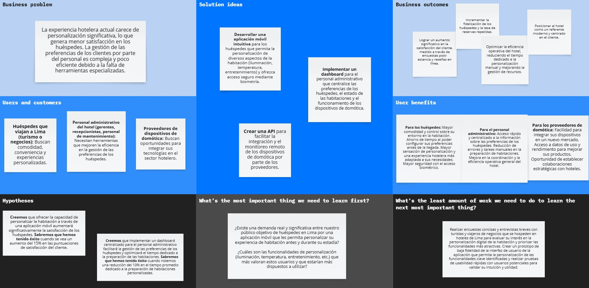

# <center>COURSE PROJECT</center>

<p align="center">
    <strong>Universidad Peruana de Ciencias Aplicadas</strong><br>
    </img><br>
    <strong>Ingeniería de Software</strong><br>
    <strong>Aplicaciones Web - 4395</strong><br>
    <strong>Profesor: Angel Augusto Velasquez Nuñez </strong><br>
    <br>INFORME TRABAJO FINAL
</p>

<center>

#### Startup: **SoftCore**
#### Product: **CustomHost**

</center>

### <center>Team  Members:</center>
<center>

| Member                           | Code       |
|----------------------------------|------------|
| Ordoñez Ricaldi, Axel Randall  | U202216827 |
|        |  |
|       |  |
|  |  |
|              |  |
|          |  |

<br> ABRIL 2025
</center>  

# Registro de Versiones del Informe
<center>

| Version | Fecha | Autor | Descripcion de Modificacion |
| ----------- | ----------- | ----------- | ----------- |
| 0.0 | 09/04/2025 |SoftCore |Se crea el documento |  

</center>

# Project Report Collaboration Insights
[URL del repositorio](https://github.com/SoftCore-App-Web-1ASI0730-2510-4395/CustomHost)

(Imagenes de los commits cada entrega)


# Contenido


[Registro de Versiones del Informe](#registro-de-versiones-del-informe)

[Project Report Collaboration Insights](#project-report-collaboration-insights)

[Student Outcome](#student-outcome)

[Capítulo I: Introducción](#capítulo-i-introducción)

[1.1 Startup Profile](#11-startup-profile)  
[1.1.1. Descripción de la Startup](#111-descripción-de-la-startup)  
[1.1.2. Perfiles de integrantes del equipo](#112-perfiles-de-integrantes-del-equipo)  

[1.2. Solution Profile](#12-solution-profile)  
[1.2.1 Antecedentes y problemática](#121-antecedentes-y-problemática)  
[1.2.2 Lean UX Process.](#122-lean-ux-process)  
[1.2.2.1. Lean UX Problem Statements.](#1221-lean-ux-problem-statements)  
[1.2.2.2. Lean UX Assumptions.](#1222-lean-ux-assumptions)  
[1.2.2.3. Lean UX Hypothesis Statements.](#1223-lean-ux-hypothesis-statements)  
[1.2.2.4. Lean UX Canvas.](#1224-lean-ux-canvas)  

[1.3. Segmentos objetivo.](#13-segmentos-objetivo)  

[Capítulo II: Requirements Elicitation & Analysi](#capítulo-ii-requirements-elicitation--analysis)  

[2.1. Competidores](#21-competidores)  
[2.1.1. Análisis competitivo](#211-análisis-competitivo)  
[2.1.2. Estrategias y tácticas frente a competidores](#211-análisis-competitivo)  

[2.2. Entrevistas](#22-entrevistas)  
[2.2.1. Diseño de entrevistas](#221-diseño-de-entrevistas)  
[2.2.2. Registro de entrevistas](#222-registro-de-entrevistas)  
[2.2.3. Análisis de entrevistas](#223-análisis-de-entrevistas)  

[2.3. Needfinding](#23-needfinding)  
[2.3.1. User Personas](#231-user-personas)  
[2.3.2. User Task Matrix](#232-user-task-matrix)  
[2.3.3. User Journey Mapping](#233-user-journey-mapping)  
[2.3.4. Empathy Mapping](#234-empathy-mapping)  
[2.3.5. As-is Scenario Mapping](#235-as-is-scenario-mapping) 

[2.4. Ubiquitous Language](#24-ubiquitous-language)  

[Capítulo III: Requirements Specificatio](#capítulo-iii-requirements-specification)  

[3.1. To-Be Scenario Mapping](#31-to-be-scenario-mapping)    
[3.2. User Stories](#32-user-stories)  
[3.3. Impact Mapping](#33-impact-mapping)  
[3.4. Product Backlog](#34-product-backlog)  

[Capítulo IV: Product Desig](#capítulo-iv-product-design)  

[4.1. Style Guidelines](#41-style-guidelines)  
[4.1.1. General Style Guidelines](#411-general-style-guidelines)  
[4.1.2. Web Style Guidelines](#412-web-style-guidelines)  

[4.2. Information Architecture](#42-information-architecture)  
[4.2.1. Organization Systems](#421-organization-systems)  
[4.2.2. Labeling Systems](#422-labeling-systems)  
[4.2.3. SEO Tags and Meta Tag](#423-seo-tags-and-meta-tags)  
[4.2.4. Searching Systems](#424-searching-systems)   
[4.2.5. Navigation Systems](#425-navigation-systems)  

[4.3. Landing Page UI Design](#43-landing-page-ui-design)   
[4.3.1. Landing Page Wireframe](#431-landing-page-wireframe)  
[4.3.2. Landing Page Mock-up](#432-landing-page-mock-up) 

[4.4. Web Applications UX/UI Design](#44-web-applications-uxui-design)  
[4.4.1. Web Applications Wireframes](#441-web-applications-wireframes)  
[4.4.2. Web Applications Wireflow Diagrams](#442-web-applications-wireflow-diagrams)  
[4.4.2. Web Applications Mock-ups](#442-web-applications-mock-ups)   
[4.4.3. Web Applications User Flow Diagrams](#443-web-applications-user-flow-diagrams)  

[4.5. Web Applications Prototyping](#45-web-applications-prototyping)  

[4.6. Domain-Driven Software Architecture](#46-domain-driven-software-architecture)  
[4.6.1. Software Architecture Context Diagram](#461-software-architecture-context-diagram)  
[4.6.2. Software Architecture Container Diagrams](#462-software-architecture-container-diagrams)  
[4.6.3. Software Architecture Components Diagrams](#463-software-architecture-components-diagrams)  

[4.7. Software Object-Oriented Design](#47-software-object-oriented-design)  
[4.7.1. Class Diagrams](#471-class-diagrams)  
[4.7.2. Class Dictionary](#472-class-dictionary)  

[4.8. Database Design](#48-database-design)  
[4.8.1. Database Diagram](#481-database-diagram)  

[Capítulo V: Product Implementation, Validation & Deploymen](#capítulo-v-product-implementation-validation--deployment)  

[5.1. Software Configuration Management](#51-software-configuration-management)  
[5.1.1. Software Development Environment Configuration](#511-software-development-environment-configuration)  
[5.1.2. Source Code Management](#512-source-code-management)  
[5.1.3. Source Code Style Guide & Conventions](#513-source-code-style-guide--conventions)  
[5.1.4. Software Deployment Configuration](#514-software-deployment-configuration)  

[5.2. Landing Page, Services & Applications Implementation](#52-landing-page-services--applications-implementation)  
[5.2.X. Sprint ](#52x-sprint-n)  
[5.2.X.1. Sprint Planning n](#52x1-sprint-planning-n)  
[5.2.X.2. Sprint Backlog n](#52x2-sprint-backlog-n)  
[5.2.X.3. Development Evidence for Sprint Review](#52x3-development-evidence-for-sprint-review)  
[5.2.X.4. Testing Suite Evidence for Sprint Review](#52x4-testing-suite-evidence-for-sprint-review)  
[5.2.X.5. Execution Evidence for Sprint Review](#52x5-execution-evidence-for-sprint-review)  
[5.2.X.6. Services Documentation Evidence for Sprint Review](#52x6-services-documentation-evidence-for-sprint-review)  
[5.2.X.7. Software Deployment Evidence for Sprint Review](#52x7-software-deployment-evidence-for-sprint-review)  
[5.2.X.8. Team Collaboration Insights during Sprint](#52x8-team-collaboration-insights-during-sprint)  

[5.3. Validation Interviews](#53-validation-interviews)  
[5.3.1. Diseño de Entrevistas](#531-diseño-de-entrevistas)  
[5.3.2. Registro de Entrevistas](#532-registro-de-entrevistas)  
[5.3.3. Evaluaciones según heurísticas](#533-evaluaciones-según-heurísticas)  

[5.4. Video About-the-Product](#54-video-about-the-product)  

[Conclusiones](#conclusiones)  
[Conclusiones y recomendaciones](#conclusiones-y-recomendaciones)  
[Video About-the-Team](#video-about-the-team)  
[Bibliografía](#bibliografía)  
[Anexos](#anexos)  

# Student Outcome
|Criterio Especifico|Acciones Realizadas|Conclusiones|
|-|-|-|
|Trabaja en equipo para proporcionar liderazgo en forma conjunta.|Compañero Axel Ordoñez:<br> *TB1:*  Colaboró activamente en la planificación del proyecto, especialmente en las secciones relacionadas con Lean UX Process, análisis de competidores, To-Be Scenario Mapping y diagramas técnicos (contenedores, contexto y base de datos). Ayudó a revisar y mejorar partes del informe antes de la entrega final.*TP1:* Participó en el desarrollo frontend del sistema, colaboró en la versión corregida y mejorada de artefactos previos, y apoyó en la documentación técnica del producto. Además, contribuyó en la evidencia de desarrollo, ejecución y despliegue del sistema. Compañero Fabrizio Panta:<br> *TB1:*  Realizó entrevistas, empathy map, user task matrix, product backlog e impact map. También participó en la definición de style guidelines, diseño de wireframes y mockups del frontend web application.  *TP1:* Desarrolló componentes clave del frontend, implementó correcciones basadas en retroalimentación recibida, y trabajó en la documentación visual del diseño UX/UI, incluyendo wireframes actualizados y user flow mejorados. Compañero Roberto Ccarita:<br> *TB1:* Contribuyó en la elaboración de User Personas, Empathy Map y análisis competitivo. Apoyó en el diseño del landing page y su posterior despliegue.  *TP1:* Desarrolló componentes asignados del frontend, aplicó correcciones al report project y ayudó a mantener una dinámica colaborativa dentro del equipo durante el desarrollo del TP1.Compañero Alison Arrieta:<br> *TB1:* Participó en la investigación de competidores, redacción de entrevistas, diseño del landing page y su despliegue inicial.  *TP1:* Lideró la mejora del landing page, integró feedback del TB1 y colaboró en la conexión entre diseño UX/UI y funcionalidades desarrolladas en el frontend. Compañero Andreow Santiago:<br> *TB1:*Contribuyó en la definición de Needfinding, Ubiquitous Language y diseño UX/UI del sistema. Participó en la planificación de sprints iniciales y en la organización de tareas.*TP1:*Implementó user stories en el frontend, trabajó en la conexión entre diseño y lógica funcional, y aplicó correcciones técnicas para mejorar la calidad del producto entregado.|Durante los entregables TB1 y TP1, todos los integrantes demostraron habilidades efectivas de trabajo en equipo, combinando esfuerzos individuales para lograr un liderazgo compartido. Si bien uno de los miembros asumió formalmente el rol de coordinador, todos aportaron desde sus áreas de especialización, promoviendo una dinámica colaborativa que permitió avanzar ordenadamente en el desarrollo del proyecto. La capacidad de escuchar, delegar y apoyarse mutuamente fue clave para superar desafíos técnicos y organizativos.|
|Crea un entorno colaborativo e inclusivo, establece metas, planifica tareas y cumple objetivos.|Compañero Axel Ordoñez:<br> *TB1:* Estableció metas claras en el área técnica del proyecto, especialmente en la parte de arquitectura del software. Ayudó a distribuir tareas entre los compañeros y aseguró que todos tuvieran acceso a información relevante.   *TP1:*Revisó y actualizó la planificación del equipo tras recibir retroalimentación, asegurándose de que se cumplieran los plazos y se alcanzaran los objetivos técnicos del Sprint 2. Compañero Fabrizio Panta:<br> *TB1:*Colaboró en la definición de objetivos del proyecto, especialmente en el diseño UX/UI y creación de artefactos visuales. Su participación fue clave para estructurar las primeras versiones del frontend. *TP1:*Ajustó la planificación del equipo para adaptarse a nuevas necesidades, supervisó el cumplimiento de tareas asignadas y reforzó el ambiente colaborativo mediante reuniones constantes y revisiones grupales. Compañero Brayan Ccarita:<br> *TB1:*Ayudó en la planificación de aspectos visuales del producto y colaboró en la mejora del landing page. Participó en reuniones de seguimiento para asegurar el avance del equipo *TP1:*Cumplió con sus tareas técnicas asignadas, ayudó a mantener reuniones efectivas y propuso soluciones prácticas durante el desarrollo frontend, lo cual contribuyó al cumplimiento de objetivos comunes. Compañero Alison Arrieta:<br> *TB1:*Fue clave en la definición de metas relacionadas con la experiencia de usuario. Trabajó en la planificación del diseño del sistema y aseguró que cada miembro comprendiera su rol en el avance del proyecto.  *TP1:*Refinó el diseño del landing page, ayudó a priorizar tareas del frontend y fomentó un entorno colaborativo y respetuoso dentro del equipo.Compañero Andreow Santiago:<br> *TB1:*Ayudó a establecer objetivos generales del proyecto, especialmente en la conexión entre diseño UX/UI y desarrollo técnico. Participó en la planificación de sprints iniciales. *TP1:*Se encargó de priorizar tareas técnicas, aplicó correcciones del TB1 y mantuvo una actitud proactiva en la búsqueda de soluciones técnicas que permitieran cumplir los objetivos del sprint.|El equipo logró crear un entorno colaborativo e inclusivo donde cada miembro pudo participar activamente en la planificación y ejecución de tareas. Las metas fueron claramente definidas desde el inicio y se trabajó con compromiso para alcanzarlas. La distribución equitativa de roles, el seguimiento constante y la adaptación a nuevas necesidades permitieron cumplir los objetivos establecidos tanto en TB1 como en TP1. Este enfoque colaborativo sentó las bases para futuros entregables, consolidando una dinámica sólida y profesional dentro del equipo|
# Capítulo I: Introducción
## 1.1. Startup Profile
### 1.1.1. Descripción de la Startup

SoftCore es una prometedora startup conformada por estudiantes de la Universidad Peruana de Ciencia Aplicadas (UPC) en Lima, Perú, unidos por la visión de transformar la experiencia hotelera a través de la tecnología. Este equipo combina su conocimiento en desarrollo de software, diseño de interfaces y gran interes en la industria hotelera para crear una innovadora aplicación de gestión. Su objetivo principal es empoderar a los huéspedes, permitiéndoles personalizar su estadía y convertir cada habitación en un espacio inteligente y adaptado a sus preferencias individuales.

La propuesta de SoftCore se centra en la integración de tecnologías emergentes como el Internet de las Cosas (IoT), la biometría y la domótica. A través de su aplicación, los usuarios podrán definir sus preferencias antes o durante su llegada al hotel, lo que se traducirá en un entorno de habitación que responda automáticamente a sus necesidades. Esta solución no solo busca mejorar la comodidad y satisfacción del huésped, sino también proporcionar al personal administrativo herramientas eficientes para gestionar estas preferencias y optimizar las operaciones del hotel.

Con un enfoque inicial en el mercado hotelero de Lima, SoftCore aspira a convertirse en un referente de la innovación en el sector. La mentalidad disruptiva forma parte de nuestra filosofía y gracias a esto es posible abordar los desafíos de la industria con soluciones creativas y centradas en el usuario. La startup busca demostrar cómo la tecnología puede elevar la experiencia del cliente y generar valor tanto para los huéspedes como para los establecimientos hoteleros, marcando el camino hacia una nueva era de "hoteles inteligentes" en la capital peruana.

#### 1.1.2. Perfiles de integrantes del equipo
|Miembros del equipo | Codigo Estudiante | Carrera | Conocimientos / Habilidades |
|-|-|-|-|
|Ordoñez Ricaldi, Axel Randall 	|U202216827|Ingenieria de software|C++, SQL, MongoDB, Python. Paciencia y buen trabajo en equipo|
|Panta Castro, Fabrizio Martin 	|U20231A810|Ingenieria de software|SQL, Pyhton, C++. Compañerismo y responsable con las entregas.|
|Ccarita Cruz, Brayan Roberto 	|U20221C218|Ingenieria de software|Astro.js, Svelte, Golang, Design Sprint. Perseverante y puntual|
| Arrieta Quispe, Alison Jimena  | U202312031 |  Ingeniería de Software |  MySql, C++, C#, Docker, Java, JavaScript. Responsable y Trabajadora. |
| Santiago Peña, Andrew Joamrk | U202317362 |Ingenieria de software | MySql, C++, C#, Docker, Perseverante y buen trabajo en equipo. |

## 1.2. Solution Profile
### 1.2.1 Antecedentes y problemática

La industria hotelera ha experimentado una notable evolución tecnológica, donde la implementación de soluciones digitales se ha vuelto crucial para mejorar tanto la eficiencia operativa como la experiencia del cliente. Inicialmente, los sistemas eran manuales, progresando hacia los Sistemas de Gestión de Propiedades (PMS) y, más tarde, a soluciones en la nube. Hoy en día, la inteligencia artificial (IA) está transformando el sector, optimizando procesos y personalizando la interacción con los huéspedes. Sin embargo, la adopción de estas tecnologías, especialmente en lugares como Lima, enfrenta desafíos relacionados con la inversión y la infraestructura (Analysis of Eco-Innovations in Peruvian Accommodation Establishments, 2023).

La personalización se ha convertido en una expectativa fundamental para los viajeros, quienes buscan experiencias adaptadas a sus preferencias. El Internet de las Cosas (IoT) juega un papel esencial al permitir la adaptación de las habitaciones a las necesidades individuales y al agilizar procesos como el check-in y el servicio en la habitación. A pesar de los beneficios, la implementación de IoT presenta retos como los costos iniciales y las preocupaciones de seguridad (Analysis of Eco-Innovations in Peruvian Accommodation Establishments, 2023).

La pandemia de COVID-19 generó una drástica caída en el turismo peruano, evidenciada en el desplome de las llegadas de huéspedes tanto nacionales como extranjeros en el año 2020. Los datos del MINCETUR muestran que los arribos de turistas nacionales se redujeron significativamente de 54.9 millones en 2019 a tan solo 34.6 millones en 2020, mientras que el turismo extranjero experimentó un descenso aún más alarmante, pasando de 8.3 millones a un mínimo histórico de 1.8 millones en el mismo periodo (MINCETUR, 2024). Si bien en los años posteriores se observa una tendencia de recuperación gradual en ambos segmentos, con un aumento constante en las cifras de arribos, aún no se alcanzan los niveles prepandemia, especialmente en el caso del turismo internacional. Esta situación resalta la necesidad de revitalizar el sector a través de la innovación, donde la Inteligencia Artificial (IA) y la domótica emergen como herramientas clave. La IA puede personalizar la experiencia del viajero, optimizar la gestión de recursos y predecir tendencias, mientras que la domótica puede mejorar la eficiencia y el confort en los alojamientos, ofreciendo experiencias más seguras, personalizadas y atractivas para los visitantes en la nueva normalidad.

Por lo tanto, existe una necesidad continua de que los hoteles en Lima adopten e integren tecnologías avanzadas para personalizar la experiencia del huésped y mejorar la eficiencia. A pesar de los desafíos económicos y de infraestructura, la transformación digital y la adopción de IoT son fundamentales para satisfacer las expectativas de los turistas y mantener la competitividad en el mercado hotelero.

### 1.2.2 Lean UX Process.
#### 1.2.2.1. Lean UX Problem Statements.
Nuestro contexto demanda soluciones tecnológicas innovadoras para optimizar la experiencia hotelera de los huéspedes, permitiéndoles personalizar su entorno y disfrutar de una estadía adaptada a sus necesidades individuales. A través de nuestra aplicación de gestión hotelera, buscamos brindar una plataforma integral que permita a los usuarios ingresar sus preferencias y que estas se traduzcan en una habitación inteligente y personalizada desde el momento en que reciben la llave.

Hemos observado un factor importante que afecta la satisfacción de los huéspedes, el cual se manifiesta en la falta de personalización y adaptación de las habitaciones a sus gustos y requerimientos específicos, limitando la sensación de confort y exclusividad durante su estadía.

¿Cómo podemos desarrollar una aplicación de gestión hotelera que se adapte a las necesidades individuales de cada huésped, integrando tecnologías como IoT, biometría y domótica para ofrecer una experiencia personalizada y optimizada en hoteles inteligentes de Lima?
#### 1.2.2.2. Lean UX Assumptions.
##### Business Assumptions

|Assumption|Description|
|-|-|
| Aumento de satisfacción      | La aplicación incrementará la satisfacción del cliente, promoviendo su fidelización y recomendaciones.        |
| Rentabilidad de IoT          | La inversión en domótica e IoT será rentable a mediano plazo por la diferenciación y optimización de recursos.|
| Adaptación del personal      | El personal administrativo podrá adaptarse fácilmente al dashboard y usarlo en su rutina diaria.              | 
| Colaboración con proveedores | Habrá una cooperación fluida con proveedores de domótica para integración y mantenimiento.                    |
| Diferenciación competitiva   | La idea de un "hotel inteligente" destacará frente a otros hoteles en Lima.                                   |
| Versión móvil eficiente      | La versión móvil facilitará la interacción del huésped en todas las etapas de su experiencia.                 |


##### User Assumptions
|Assumption|Description|
|-|-|
| Interés en personalización | Los turistas estarán interesados en la propuesta de personalización vía app.           |
| Valoración del control     | Los huéspedes valorarán poder manejar aspectos como luz o temperatura desde su celular.|
| Facilidad de uso           | Los usuarios verán la app como intuitiva y fácil de usar.                              |
| Confianza en biometría     | Habrá confianza en el uso de tecnología biométrica para acceso y personalización.      |
| Tiempo para configurar     | Los turistas estarán dispuestos a configurar preferencias antes o al llegar.           |
| Percepción de valor        | Los huéspedes verán el hotel inteligente como un valor agregado significativo.         |
#### 1.2.2.3. Lean UX Hypothesis Statements.
1. Creemos que ofrecer a los huéspedes la capacidad de personalizar su habitación a través de una aplicación móvil antes de su llegada aumentará su satisfacción general con la estadía.
Sabremos que hemos tenido éxito cuando observemos un aumento del 15% en las puntuaciones de satisfacción del cliente relacionadas con la comodidad y personalización de la habitación en las encuestas post-estancia.

2. Creemos que la implementación de un dashboard intuitivo para el personal administrativo que centralice las preferencias de los huéspedes optimizará la gestión del hotel y reducirá el tiempo dedicado a tareas relacionadas con la personalización de habitaciones.
Sabremos que hemos tenido éxito cuando el personal administrativo reporte una reducción del 10% en el tiempo promedio dedicado a la preparación y ajuste de las habitaciones según las preferencias de los huéspedes.

3. Creemos que la integración de tecnología biométrica para el acceso a la habitación y la personalización del entorno aumentará la percepción de seguridad y exclusividad entre los huéspedes.
Sabremos que hemos tenido éxito cuando al menos el 80% de los huéspedes que utilicen la función biométrica la califiquen positivamente en términos de seguridad y conveniencia en las encuestas post-estancia.

4. Creemos que ofrecer control domótico de la habitación a través de la aplicación (iluminación, temperatura, etc.) mejorará la comodidad y la experiencia general de los huéspedes durante su estadía.
Sabremos que hemos tenido éxito cuando observemos un aumento del 20% en el uso de las funciones de control domótico dentro de la aplicación por parte de los huéspedes activos.

5. Creemos que al proporcionar una plataforma que permite a los proveedores de domótica monitorear el funcionamiento de sus dispositivos en tiempo real, se facilitará el mantenimiento preventivo y se minimizarán los problemas técnicos en las habitaciones.
Sabremos que hemos tenido éxito cuando se registre una disminución del 5% en el número de reportes de fallas de los dispositivos de domótica en las habitaciones inteligentes.

6. Creemos que la disponibilidad de una versión móvil de la aplicación aumentará la interacción de los huéspedes con la plataforma antes, durante y después de su estadía, fomentando la exploración de los servicios del hotel y posibles reservas futuras.
Sabremos que hemos tenido éxito cuando observemos un aumento del 10% en el número de usuarios activos en la versión móvil de la aplicación y un incremento del 5% en las consultas o reservas realizadas a través de la misma.
#### 1.2.2.4. Lean UX Canvas.



## 1.3. Segmentos objetivo.
##### Segmento 1: Huéspedes que desean hospedarse en un hotel

Este segmento incluye a individuos de diversos perfiles demográficos y socioeconómicos que tienen la necesidad o el deseo de alojarse en un hotel en Lima, ya sea por motivos de turismo, negocios u otros.

**Características demográficas:**

- **Rango de edad:** Amplio, desde jóvenes adultos hasta personas mayores.
- **Geografía:** Principalmente turistas nacionales e internacionales que visitan Lima, así como residentes locales que buscan una experiencia diferente.
- **Intereses:** Búsqueda de comodidad, conveniencia, experiencias personalizadas y, específicamente para nuestro caso, interés en la innovación tecnológica y la domótica en hoteles.

**Problema:** Estos huéspedes buscan una experiencia hotelera que vaya más allá de la simple pernoctación, deseando un entorno que se adapte a sus preferencias individuales para una estadía más confortable y memorable.

##### Segmento 2: Personal administrativo del hotel

Este segmento comprende a los empleados del hotel encargados de la gestión operativa, la atención al cliente y el mantenimiento de las instalaciones.

**Características demográficas:**

- **Roles:** Gerentes, recepcionistas, personal de mantenimiento, personal de limpieza, etc.
- **Necesidades:** Herramientas eficientes para la gestión de reservas, la atención a los huéspedes, la organización de las habitaciones y el seguimiento del estado de los dispositivos.
- **Objetivos:** Optimizar la eficiencia operativa, mejorar la satisfacción del cliente y reducir la carga de trabajo manual.

**Problema:** El personal del hotel tiene problemas para saber qué le gusta a cada huésped y asegurarse de que su estadía sea tal como la prefieren. Esto es difícil porque no tienen un sistema fácil y único para guardar y usar esa información.

##### Segmento 3: Proveedores de dispositivos de domótica

Este segmento incluye a las empresas que desarrollan, fabrican y distribuyen dispositivos y sistemas de domótica (iluminación inteligente, control de temperatura, cerraduras electrónicas, etc.).

**Características demográficas:**

- **Tipo de empresas:** Desde startups tecnológicas hasta grandes corporaciones especializadas en IoT y automatización del hogar/edificios.
- **Intereses:** Expandir su mercado, integrar sus productos en nuevos entornos (como hoteles), obtener datos sobre el rendimiento de sus dispositivos en un contexto de uso real y establecer alianzas estratégicas.

**Problema:** Estos proveedores buscan canales efectivos para introducir sus tecnologías en el sector hotelero y necesitan plataformas que faciliten la integración y el monitoreo de sus dispositivos en las instalaciones de sus clientes.

---

# Capítulo II: Requirements Elicitation & Analysis
## 2.1. Competidores.
### 2.1.1. Análisis competitivo.

| Competitive Analysis Landscape                          |  |
| ------------------------------------------------------- | -|
| ¿Por qué llevar a cabo este análisis?                   | -- |


| |  | (Nosotros) | Competidor  | Comptdor |
|-|-|-|-|-|
| PERFIL| Overview | lorem | ipsum | lorem |
|| Ventaja competitiva ¿Qué valor ofrece a los clientes? |  ipsu | impuz |
|| Mercado Objetivo                                        | Jeda | asa | asa2 |
| Perfil de marketing                                     | Estrategia de Marketing | Redes Sociales | Redes Sociales | Televisión, Redes Sociales |
| Perfil del producto                                     | Productos y servicios | Elementos Gráficos Interactivos Enseñanza de Matemáticas Lúdica y Autodidacta Educación matemática interactiva Ámbito Freemium | Educación matemática interactiva Mas de 100 cursos en 28 idiomas diferentes | Educación general interactiva Contratos con Movistar |
|| Precios y costos                                        | Freemium (Cuenta Premium permite personalizar los juegos) Gratis | Gratuito | Gratuito |
|| Canales de distribución (Web y/o Móvil)                 | Web y Móvil Web | Móvil Web | Web y móvil Web |
### 2.1.2. Estrategias y tácticas frente a competidores.


|Competidores ->|  | Nosotros | Competidor2| Competidor3|
|-|-|-|-|-|
| Análisis SWOT | Fortalezas | lorem | Lorem | lorem |
|| Debilidades   | lorem | lorem | lorem | lorem | 
|| Oportunidades | lorem | lorem | lorem | lorem | 
|| Amenazas      | lorem | lorem | lorem | lorem |

## 2.2. Entrevistas.
### 2.2.1. Diseño de entrevistas.
**Preguntas generales:**

1. ¿Cuál es su nombre? 
2. ¿Qué edad tiene? 
3. ¿A qué se dedica? 
4. ¿[Opinion de idea de propuesta]? 

**Entrevistas usuario segmento 2**
1. ¿Lorem?
2. ¿Lorem?
3. ¿Lorem?
4. ¿Lorem?  
   
**Entrevistas usuario segmento 2**
1. ¿Lorem? 
2. ¿Lorem?
3. ¿Lorem?
4. ¿Lorem? 
### 2.2.2. Registro de entrevistas.
**Segmento 1**  
Nombre: _____
Edad: _ años 
Ocupación: _____  
  
{texto mucho}

**Segmento 2**  
Nombre: _____
Edad: _ años 
Ocupación: _____  

{texto}

### 2.2.3. Análisis de entrevistas.
**Segmento 1:**
{texto}
**Segmento 2:**
{texto}
## 2.3. Needfinding.
### 2.3.1. User Personas.
**Segmento 1:**  


**Segmento 2:**


### 2.3.2. User Task Matrix.
| --- | ------ | Segmento 1  | ------/----- | Segmento 2  | ---------- |
| --- | ------ | ----------- | ------------ | ----------- | ---------- |
| ID  | Titulo | Importancia | Frecuencia   | Importancia | Frecuencia |
| U01X| {Texto}| Alta        | Alta         | Media       | Baja       |
### 2.3.3. User Journey Mapping.
**Registration:**
Why would they trust us?
- s
- s
- s
  
**Onboarding and first use:**
How can they feel successful?
- s
- s
- s  
  
**Sharing:**
Why would they invite others?
- s
- s
- s

### 2.3.4. Empathy Mapping.
**Segmento 1:**


**Segmento 2:**

### 2.3.5. As-is Scenario Mapping.

**Segmento 1**  
Escenario: {escenario}

As Is:
| Fases| Fase 1 | Fase 2| Fase 3| Fase 4|
| -------- | --------- | --------- | ------- | --------- |
| Doing | texto| texto | texto| texto|
| Thinking | texto| texto | texto| texto|
| Feeling  | texto| texto | texto| texto|

**Segmento 2**  
Escenario: Dificultad para entender Matemáticas

As Is:
| Fases| Fase 1 | Fase 2| Fase 3| Fase 4|
| -------- | --------- | --------- | ------- | --------- |
| Doing | texto| texto | texto| texto|
| Thinking | texto| texto | texto| texto|
| Feeling  | texto| texto | texto| texto|
## 2.4. Ubiquitous Language.
```
Texto ubiquo: Definicion de este
```

---

# Capítulo III: Requirements Specification
## 3.1. To-Be Scenario Mapping.

Segmento 1:

| Fases    |  fase 1 as is | fase 2| fase 3|
| -------- | ------- | ---- | ---------------- |
| Doing    | | texto| texto | texto| texto|
| Thinking | | texto| texto | texto| texto|
| Feeling  | | texto| texto | texto| texto|

Segmento 2:
| Fases    |  fase 1 as is | fase 2| fase 3|
| -------- | ------- | ---- | ---------------- |
| Doing    | | texto| texto | texto| texto|
| Thinking | | texto| texto | texto| texto|
| Feeling  | | texto| texto | texto| texto|

## 3.2. User Stories.

| HU0X | Historia Usuario | "Descripcion"  |
|-|-|-|

## 3.3. Impact Mapping.


## 3.4. Product Backlog.

| #Orden | User Story ID | Titulo| Descripción| Story Points (1/2/3/5/8) |
| ------ | ------------- | ----- | ---------- | ------------------------ |
| 1      | HU01          | titulo his | desc  | 5                        |

# Capítulo IV: Product Design
## 4.1. Style Guidelines.
### 4.1.1. General Style Guidelines.
Descripcion del porque estos elementos seran importantes

**Color:** (Descripcion de los colores escogidos y porque)  


**Tipografia:** (Descripcion de la tipografia escogida para el proyecto y porque)

**Branding** (Describir logotipo y porque)

### 4.1.2. Web Style Guidelines.
Descripcion de los elementos que se utilizaran en el web app

**Background:** (primary, secondary, terniary)  

**Text Styles:** (H1, H2, p, a,)  

**Button Styles:** (Button, dropdowns, Switches)

**Icons:** (Fondo blanco con los iconos que vamos a usar)

**Misc** (Cosas como nav var o slideshows que pensemos usar)

## 4.2. Information Architecture.
### 4.2.1. Organization Systems.
Descripcion corta respecto a los sistemas de organizacion que usaremos  (Escoger)
"Hierarchical. This structures advices to present the content in a way to distinguish the level of importance by making use of physical differences, such as size, colour, contrast, alignment etc.

Sequential. Guide users to follow a specific path towards their goal and provide content step-by-step based on the current step. 

Matrix. You can always give the users the option to choose the type of navigation they prefer, i.e. Alphabetical, Chronological, by topic."
### 4.2.2. Labeling Systems.
The labeling system aims at uniting the data effectively and represent them in simple way and avoid confusing great amount of information. A widely adopted way to achieve this is by creating the labels which represent loads of data in few words. 

Como decir "home, about us, etc" basicamente lo que iria en un nav var y asi
### 4.2.3. SEO Tags and Meta Tags

**Meta & SEO (Search Engine Optimization) Tags:**  sirven para que la pagina web sea encontrada facilmente es lo que sale al encontrar la pagina en el buscador (se ponen en el <"head">)
* Titulo: ```<title> ___ </title> ```
* Descripcion: ```<meta name = "description" content = "texto descipcion"/> ```
* Palabras Clave: ```<meta name = "keyword" content = "keyword1, 2 3"/> ```

### 4.2.4. Searching Systems.
**Que se busca?:** Que buscara el usuario  
**Que resultados se mostraran?:** Que se mostrara  
**Interface de busqueda:** Descripcion de como ayuda a encontrar lo deseado 


### 4.2.5. Navigation Systems.
Basicamente aqui definimos como funciona la navegacion del web app
**Hierarchical Navigation System:** Main page a destination pages.
**Global Navigation Systems** (Complemento del Hierachical) Movimiento vertical (te mueves por la pagina)con nav(debe poder regresar a la principal)
**Local Navigation Systems** (vas a otras paginas) (complemento del global nav sistem sub-site) Usas otras paginas
## 4.3. Landing Page UI Design.
### 4.3.1. Landing Page Wireframe.
la pagina donde te registras y ves info del web app (te manda al web app)

Wireframe es todo lo funcional de la pagina

### 4.3.2. Landing Page Mock-up.
Mockup es todo lo relacionado al diseño de la pagina

## 4.4. Web Applications UX/UI Design.
### 4.4.1. Web Applications Wireframes.
lo funcional de cada aspecto del wireframe 

### 4.4.2. Web Applications Wireflow Diagrams.
Wireflow es como se va a navegar por la pagina (boton me lleva a esta pagina y este me regresa)

### 4.4.2. Web Applications Mock-ups.
Diseño en todo aspecto

### 4.4.3. Web Applications User Flow Diagrams.
un flow diagram de como el usuario utilizara la pagina **[PARA CADA USER GOAL]** 

## 4.5. Web Applications Prototyping.
[URL del Prototipo (Hecho en figma)](https://www.example.com)
## 4.6. Domain-Driven Software Architecture.
### 4.6.1. Software Architecture Context Diagram.
1. System Context Diagram: Diagrama que muestra la relacion del aplicativo con los usuarios
se incluyen servicios externos (si hay pocos bounded context se incluyen ahi)

2. Bounded Context Map: Muestra la relacion entre bounded contexts (los bounded context son como una burbuja que encapsula palabras clave en los procesos para poder diferenciarlos [Ej. Bounded context enfocado en las ventas(ventas), otro en revisar el stock(gestion) y otro enfocado en los proveedores (suministros)]) Se hace como un brainstorm y se ve en que pueden conectarse o comunicarse [se usa un circulo entre conexiones lineales (upstream o downstream) para definir comunicacion, algunos context se pueden integrar para representar por ejemplo un share model por database, tambien se mencionan los (third party context para definir los restful apis)]
   
### 4.6.2. Software Architecture Container Diagrams.
1. Bounded Context Deployable / Container Diagrams. Sirve para entender como funciona y el proceso, Se especifican DB's, indexers, Search engine, las Apis que usen los bounded context y se conectan por flechas, las cuales tienen como objetivo explicar la direcion y relacion junto a que se esta enviando/comunicando (TCP) 

### 4.6.3. Software Architecture Components Diagrams.
1. Component diagrams: Estos van a mostrar las ordenes, procesos, mensajes y componentes utilizados en el uso del aplicativo, claro se deben hacer diferentes de estos para cada bounded o USER GOALS
## 4.7. Software Object-Oriented Design.
### 4.7.1. Class Diagrams.
Esta yaselasaben (diagrama de clases)
Clases(name), objetos(nombre-objeto [como objeto]), metodos("Accion") y atributos(Correo, edad,nombre como valor, ID)
### 4.7.2. Class Dictionary.
Inherit (ave(superclase) -> (subclase)canario )
Polymorphism (Ej. funcion de persona hablar() -> Peruano hablar() , Gringo hablar() todos tienen una funcion que contiene persona y van cambiando sus formas)
Abstraction (Ej. Solo muestra el usuario, pero esta su edad, correo y veces usada que uso app en la base de datos (fuera de vista))
Encapsulation (cuando tienes tus variables y metodos en la misma clase las estas encapsulando, aun mas se encapsulan en Private y Public )
## 4.8. Database Design.
### 4.8.1. Database Diagram.
Diagrama de base de datos (la relacion entre clases PK FK el Normalizar tmbn, isiyisi 🕸)
# Capítulo V: Product Implementation, Validation & Deployment
## 5.1. Software Configuration Management.
### 5.1.1. Software Development Environment Configuration.
Especificaciones de donde vamos a hacer el proyecto (vscode supongo)
extensiones tmbn? nose bn q quieren aca
### 5.1.2. Source Code Management.
El gitjab donde tengamos el proyecto
### 5.1.3. Source Code Style Guide & Conventions.
Que usamos con css (en caso usemos software para SASS)
supongo q tmbn cositas de como hacemo el code capas algun tipo de codigo para comunicarse entre comments
### 5.1.4. Software Deployment Configuration.
Configuraciones de donde y como deployeamos el proyecto
## 5.2. Landing Page, Services & Applications Implementation.
### 5.2.X. Sprint n
#### 5.2.X.1. Sprint Planning n.
Explicar como vamos a plannear el sprint?
#### 5.2.X.2. Sprint Backlog n.
 Nica hago la tabla 
#### 5.2.X.3. Development Evidence for Sprint Review.

#### 5.2.X.4. Testing Suite Evidence for Sprint Review.

#### 5.2.X.5. Execution Evidence for Sprint Review.

#### 5.2.X.6. Services Documentation Evidence for Sprint Review.

#### 5.2.X.7. Software Deployment Evidence for Sprint Review.

#### 5.2.X.8. Team Collaboration Insights during Sprint.
 imagenes de colaboraciones github

## 5.3. Validation Interviews.
### 5.3.1. Diseño de Entrevistas.
**Preguntas generales:**

1. ¿Cuál es su nombre? 
2. ¿Qué edad tiene? 
3. ¿A qué se dedica? 
4. ¿[Opinion de idea de propuesta]? 

**Entrevistas usuario segmento 2**
1. ¿Lorem?
2. ¿Lorem?
3. ¿Lorem?
4. ¿Lorem?  
   
**Entrevistas usuario segmento 2**
1. ¿Lorem? 
2. ¿Lorem?
3. ¿Lorem?
4. ¿Lorem? 
### 5.3.2. Registro de Entrevistas.
**Segmento 1**  
Nombre: _____
Edad: _ años 
Ocupación: _____  
  
{texto mucho}

**Segmento 2**  
Nombre: _____
Edad: _ años 
Ocupación: _____  

{texto}
### 5.3.3. Evaluaciones según heurísticas.
| HEURÍSTICA   | EVALUACIÓN ✅❌ | NOTA      |
| --------------------------------------------- | ---------- | --------- |
| Visibilidad del estado del sistema            |            | {texto}   |
| Coincidencia entre el sistema y el mundo real |            | {texto}   |
| Control y libertad del usuario                |            | {texto}   |
| Consistencia y estándares                     |            | {texto}   |
| Prevención de errores                         |            | {texto}   |
| Mostrar antes que recordar                    |            | {texto}   |
| Flexibilidad y eficiencia de uso              |            | {texto}   |
| Diseño estético y minimalista                 |            | {texto}   |
| Comunicar errores con facilidad               |            | {texto}   |
| Ayuda y documentación                         |            | {texto}   |
## 5.4. Video About-the-Product.
[URL del video about the product](https://www.example.com)
# Conclusiones
{texto}
# Conclusiones y recomendaciones.
{texto}
# Video About-the-Team.
[URL del video about the team](https://www.example.com)

# Bibliografía
qoomon. (2021, 11 enero). Conventional Commit Messages. Gist.
Recuperado 20 de junio de 2022, de [LINK](https://gist.github.com/qoomon/5dfcdf8eec66a051ecd85625518cfd13)

LeaseIN. (2018). Importancia de contar con un equipo de soporte
técnico. [Entrada en blog]. Recuperado de:
[LINK](https://leasein.pe/blog/branding-empresarial-importanciasoporte-tecnico/)
``` 
formato

"Apellido", Ini.Ciales. & "otroAutor", O.A. (año). titulo del articulo.
        "nombre del articulo o lo q sea, Volumen(si es que tiene), numero  de pagina"#-#. https//link.org/eeeseneko

```
# Anexos

datos, gráficos, imágenes, esquemas, mapas o referencias de otros autores


