# <center>COURSE PROJECT</center>

<p align="center">
    <strong>Universidad Peruana de Ciencias Aplicadas</strong><br>
    </img><br>
    <strong>Ingeniería de Software</strong><br>
    <strong>Aplicaciones Web - 4395</strong><br>
    <strong>Profesor: Angel Augusto Velasquez Nuñez </strong><br>
    <br>INFORME TRABAJO FINAL
</p>

<center>

#### Startup: **SoftCore**
#### Product: **CustomHost**

</center>


### <center>Team  Members:</center>
 
| Member                           | Code       |
|----------------------------------|------------|
| Ordoñez Ricaldi, Axel Randall    | U202216827 |
| Panta Castro, Fabrizio Martin    | U20231A810 |
| Ccarita Cruz, Brayan Roberto     | U20221C218 |
| Arrieta Quispe, Alison Jimena    | U202312031 |
| Santiago Peña, Andreow Jomark    | U202317362 |

  
<center>
<br> ABRIL 2025
</center>  


# Registro de Versiones del Informe


| Version | Fecha      | Autor            | Descripción de Modificación                                                                                                                    |
|---------|------------|------------------|------------------------------------------------------------------------------------------------------------------------------------------------|
| 0.1     | 07/04/2025 | Andreow Santiago | Creacion del documento                                                                                                                         |
| 0.2     | 13/04/2025 | Alison Arrieta   | Se completa el capitulo I siguiendo las mejoras del profesor                                                                                   |
| 0.3     | 17/04/2025 | Axel Ordoñez     | Se aplican mejoras a las seccion del capitulo I y II siendo especificamente Journey Mapping, Entrevistas y competidores                        |
| 0.4     | 21/04/2025 | Andreow Santiago | Se realiza un review a los mockupc y wireframes                                                                                                |
| 0.5     | 23/04/2025 | Brayan Ccarita   | Realiza cambios en diagramas de clases y user flow                                                                                             |
| 0.6     | 26/04/2025 | Fabrizio Panta   | Se realizan cambios en el capitulo IV siendo especificamente en el style guidelines, se mejora la redaccion y se agregan imagenes de los mockups |
| 0.7     | 27/04/2025 | Andreow Santiago | Se realizan cambios a la investigacion y el lean UX                                                                                            |
| 0.8     | 28/04/2025 | Alison Arrieta   | Se realizan cambios a toda la seccion 5.1                                                                                                      |
| 0.9     | 28/05/2025 | Andreow Santiago | Se realizan mejoras a la redaccion y se agregan imagenes de los mockups                                                                        |
| 1.1     | 01/05/2025 | Alex Ordoñez     | Realiza correciones observadas en clase                                                                                                        |
| 1.2     | 18/05/2025 | Fabrizio Panta   | Finaliza el proceso Lean UX corregido                                                                                                          |
| 1.3     | 18/05/2025 | Andreow Santiago | Se realizan correcciones de redaccion y se agrega el capitulo V                                                                                |
| 1.4     | 19/05/2025 | Andreow Santiago | Se realizan cambios en la seccion de entrevistas 2.2.2                                                                                         |
| 1.5     | 19/05/2025 | Alison Arrieta   | Realiza correciones observadas en user personas                                                                                                |
| 1.6     | 20/05/2025 | Brayan Ccarita   | Realiza cambios en la bibliografia, cambio de forrmato APA                                                                                     |
| 1.7     | 21/05/2025 | Axel ordoñez     | Realiza cambios en los user stories                                                                                                            |
| 1.8     | 25/05/2025 | Fabrizio Panta   | Se realizan cambios en la seccion de user flow                                                                                                 |
| 1.9     | 31/05/2025 | Brayan Ccarita   | Actualizacion de los diagramas C4 model                                                                                                        |
| 1.10    | 01/06/2025 | Axel Ordoñez     | Se realizan cambios en la seccion de product backlog                                                                                           |
| 2.1     | 06/06/2025 | Andreow Santiago | Actualiza los impact map de los segmentos                                                                                                      |
| 2.2     | 07/06/2025 | Alison Arrieta   | Realiza mejoras en los impact map                                                                                                              |
| 2.3     | 08/06/2025 | Andreow Santiago | Inicio del Sprint 3 – Planificación y actualización de tareas en Jira                                                                          |
| 2.4     | 10/06/2025 | Alison Arrieta   | Revisión y mejora de la Sección 4 del informe siguiendo las indicciones de la clase                                                            |
| 2.5     | 11/06/2025 | Axel Ordoñez     | Diseño de guiones para entrevistas de validación                                                                                               |
| 2.6     | 12/06/2025 | Brayan Ccarita   | Realización de entrevistas de validación con huéspedes y staff                                                                                 |
| 2.7     | 13/06/2025 | Fabrizio Panta   | Análisis y síntesis de resultados de las entrevistas                                                                                           |
| 2.8     | 14/06/2025 | Andreow Santiago | Inicio de desarrollo del backend del sistema                                                                                                   |
| 2.9     | 16/06/2025 | Alison Arrieta   | Configuración del backend siguiendo buenas prácticas (seguridad, logs, etc.)                                                                   |
| 2.10    | 16/06/2025 | Axel Ordoñez     | Mejoras en la lógica del backend basadas en feedback técnico                                                                                   |
| 2.11    | 17/06/2025 | Brayan Ccarita   | Deploy del backend a servidor de producción                                                                                                |
| 2.12    | 17/06/2025 | Fabrizio Panta   | Integración del backend con el frontend existente                                                                                              |
| 2.13    | 18/06/2025 | Andreow Santiago | Preparación de guiones y grabación del video "About the Product"                                                                               |
| 2.14    | 18/06/2025 | Alison Arrieta  | Grabación del video "About the Team"                                                                                                           |
| 2.15    | 18/06/2025 | Brayan Ccarita  | Incorporación de comentarios del docente al informe final                                                                                      |
| 2.16    | 19/06/2025 | Andreow Santiago  | Revisión general y entrega final del informe                                                                                                   |


# Project Report Collaboration Insights
En esta sección, el equipo presenta un análisis detallado de la colaboración realizada durante el desarrollo del informe del proyecto. A continuación,
se describe el progreso alcanzado a lo largo de las distintas entregas (TB1, TP1 y TB2), 
destacando tanto el trabajo individual como el esfuerzo colectivo, los commits realizados 
y las evidencias gráficas del flujo colaborativo en GitHub.

A continuación, se detalla el trabajo realizado durante cada entrega, acompañado de 
evidencias visuales de participación en GitHub y un resumen de los principales commits 
realizados por los miembros del equipo.

## TB1

La entrega del TB1 finalizó con éxito y está documentada en el repositorio de Github perteneciente a la organización del equipo:
[Reporte del proyecto de CustomHost](https://github.com/SoftCore-App-Web-1ASI0730-2510-4395/CustomHost)

Durante el desarrollo del informe, se siguieron los siguientes lineamientos:

- Los contenidos asignados a cada miembro fueron redactados y estructurados utilizando el formato Markdown , asegurando una presentación clara y estandarizada.
- Cada cambio realizado fue respaldado mediante commits en el repositorio, garantizando trazabilidad y control de versiones del avance del proyecto.
- Se crearon los artefactos necesarios utilizando las herramientas recomendadas. Las imágenes utilizadas fueron obtenidas a través de la carpeta assets o publicadas desde Imgur , para su correcta integración en el informe.
- Se realizaron reuniones periódicas para coordinar el avance de los elementos del informe y reportar los progresos del Sprint 1, centrado en la definición inicial del alcance del proyecto y el diseño preliminar del sistema.

### Coherencia con el Registro de Versiones del Informe
Los cambios realizados durante esta etapa están alineados con la evolución del documento, reflejando el trabajo colaborativo y constante refinamiento del contenido por parte del equipo.

Este historial de actualizaciones coincide con el trabajo desarrollado durante el TB1, mostrando cómo el equipo fue avanzando en la elaboración del informe de forma continua y colaborativa.


### Actividad en GitHub - TB1 (Abril - Mayo 2025)

Se muestra el gráfico de actividad en GitHub durante la preparación del TB1:


### Commits para TB1
Estos commits reflejan el progreso constante y la colaboración entre los miembros del equipo.


### Network graph para TB1

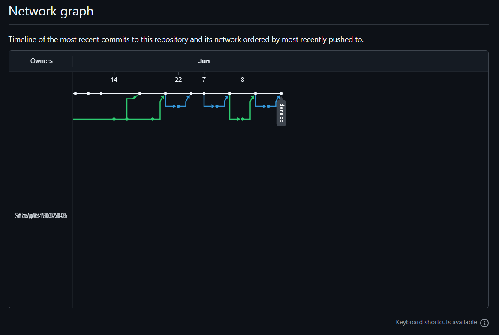


## TP1
Durante la entrega del TP1, el equipo continuó trabajando de forma colaborativa, centrando sus esfuerzos en el desarrollo frontend del sistema y en la implementación técnica del producto. A continuación, se detallan los aspectos clave del avance realizado:

- Se realizaron correcciones basadas en retroalimentación recibida, mejorando tanto el diseño como la funcionalidad del sistema.
- Se mejoraron artefactos previos, asegurando calidad y coherencia en la documentación.
- Se avanzó significativamente en la documentación funcional y técnica del proyecto, integrando ajustes realizados durante las revisiones.


Aquí está el link del repositorio del frontend del proyecto:
[Repositorio del Front-end de CustomHost](https://https://github.com/SoftCore-App-Web-1ASI0730-2510-4395/customhost-frontend)
 y el del reporte del proyecto:
[Reporte del proyecto de CustomHost](https://github.com/SoftCore-App-Web-1ASI0730-2510-4395/CustomHost)

Tal como se hizo durante el TB1, se siguió un flujo de trabajo estructurado utilizando 
ramas específicas para cada tarea. Los cambios fueron revisados mediante Pull Requests 
antes de ser fusionados en la rama principal (develop). Este proceso permitió 
garantizar calidad en el código, así como mantener un control claro y 
trazable del aporte de cada integrante al desarrollo del proyecto.


### Actividad en GitHub - TP1 (Abril - Mayo 2025)
Se muestra el gráfico de actividad en GitHub durante la preparación del TP1:

Reporte del proyecto:


Aplicacion frontend del proyecto:

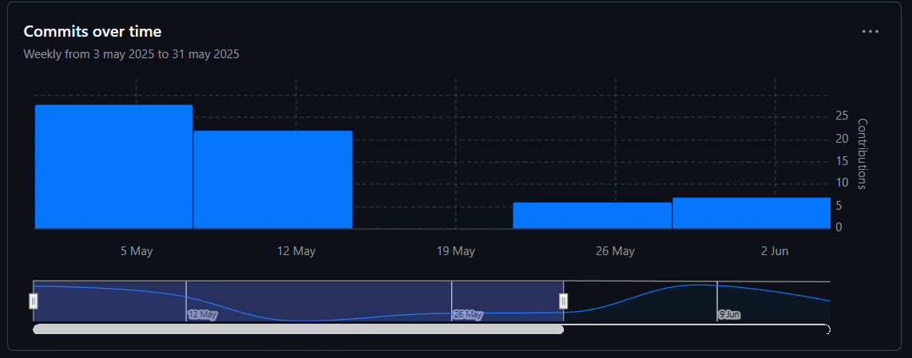

### Commits para TP1
Reporte del proyecto:


Aplicacion frontend del proyecto:

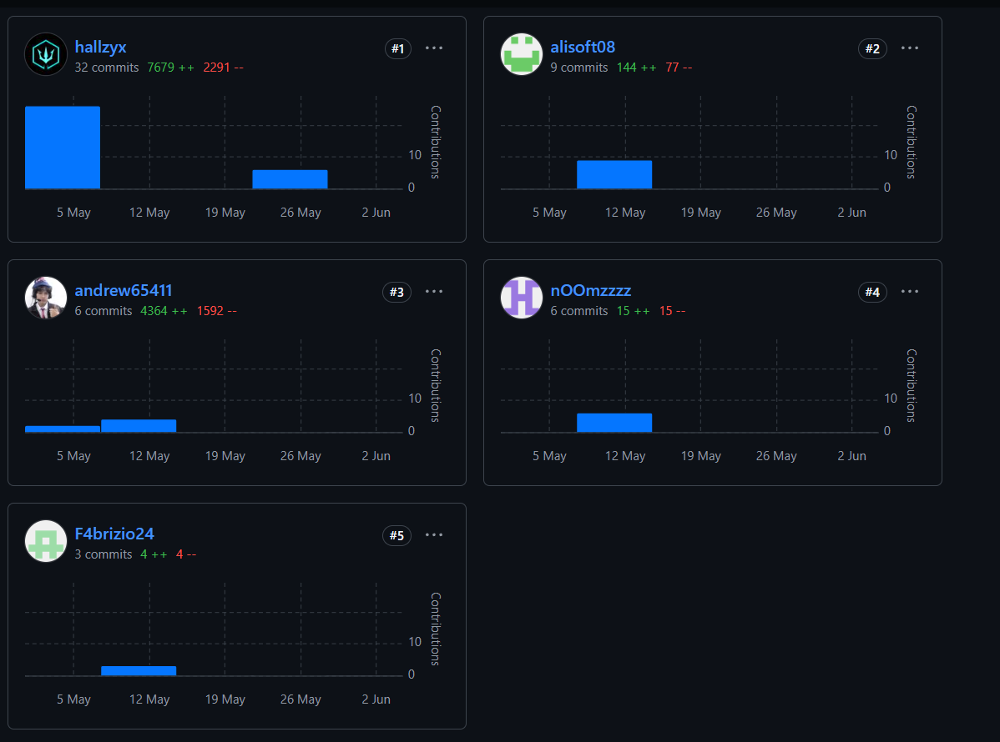

Estos commits reflejan un trabajo constante y distribuido entre todos los miembros del equipo, con un enfoque en el desarrollo técnico, diseño UX/UI y mejora continua del informe.

### Network graph para TP1
Reporte del proyecto:

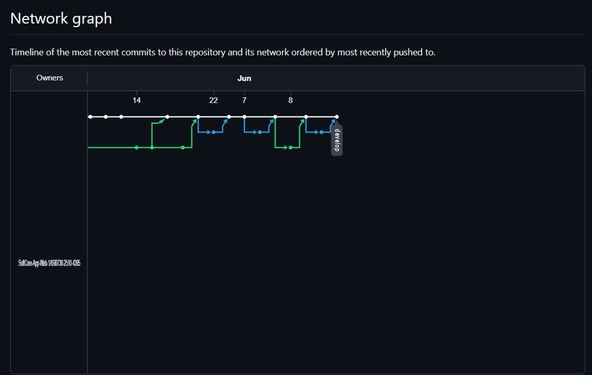

Aplicacion frontend del proyecto:

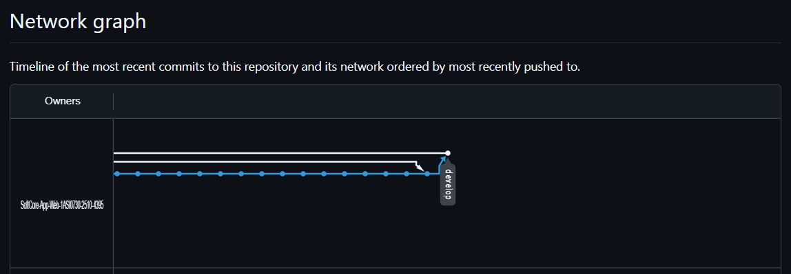


# TB2

Durante la entrega del TB2, el equipo continuó trabajando con enfoque técnico y colaborativo, centrando sus esfuerzos en el desarrollo backend del sistema y su integración con el frontend ya desarrollado.

- Análisis de resultados y ajustes realizados a funcionalidades del sistema.
- Inicio del desarrollo del backend siguiendo decisiones arquitectónicas definidas.
- Configuración del backend aplicando buenas prácticas: seguridad, logs y modularidad.
- Optimización de la lógica del backend tras recibir feedback técnico del equipo.
- Despliegue del backend a entorno de producción y verificación de conexión desde el frontend.
- Integración exitosa del backend con el frontend existente, completando la funcionalidad del sistema.

Aquí está el link del repositorio del frontend del proyecto:

🔗 [Repositorio del Frontend - CustomHost](https://github.com/SoftCore-App-Web-1ASI0730-2510-4395/customhost-frontend)   

Aquí está el link del repositorio del backend del proyecto:

🔗 [Repositorio del Backend - CustomHost](https://github.com/SoftCore-App-Web-1ASI0730-2510-4395/CustomHost)

Tal como se hizo durante entregas anteriores, se utilizó un flujo de trabajo estructurado con ramas específicas para cada tarea. Los cambios fueron revisados mediante Pull Requests antes de ser fusionados a la rama principal (`develop`). Este proceso permitió garantizar la calidad del código y mantener un control claro del aporte de cada integrante.

### Actividad en GitHub TB2 (Mayo - Junio 2025):

Aplicacion frontend del proyecto:

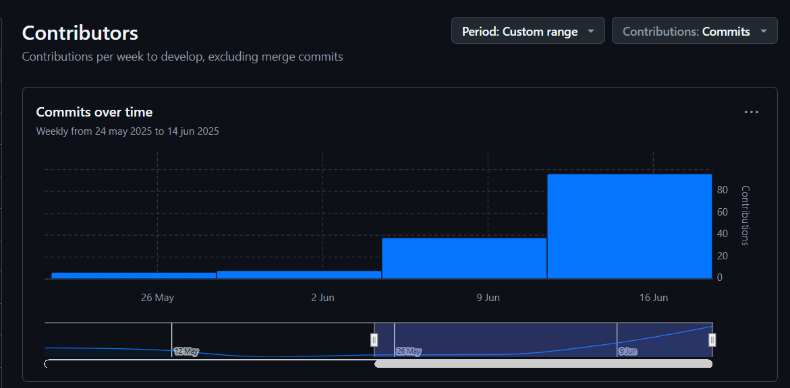

Aplicacion backend del proyecto:

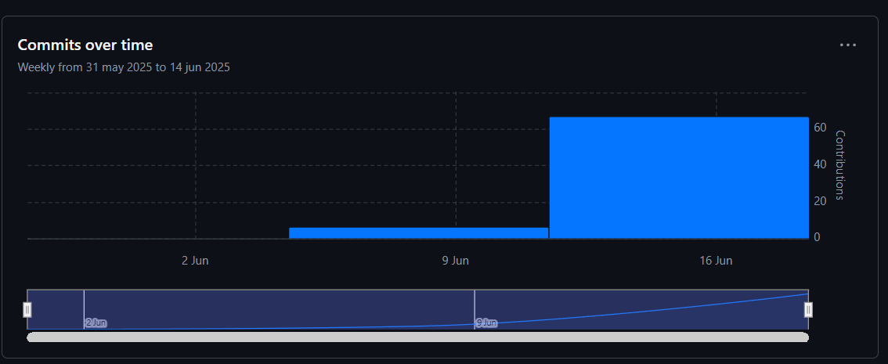

### Commits para TB2:

Aplicacion frontend del proyecto:

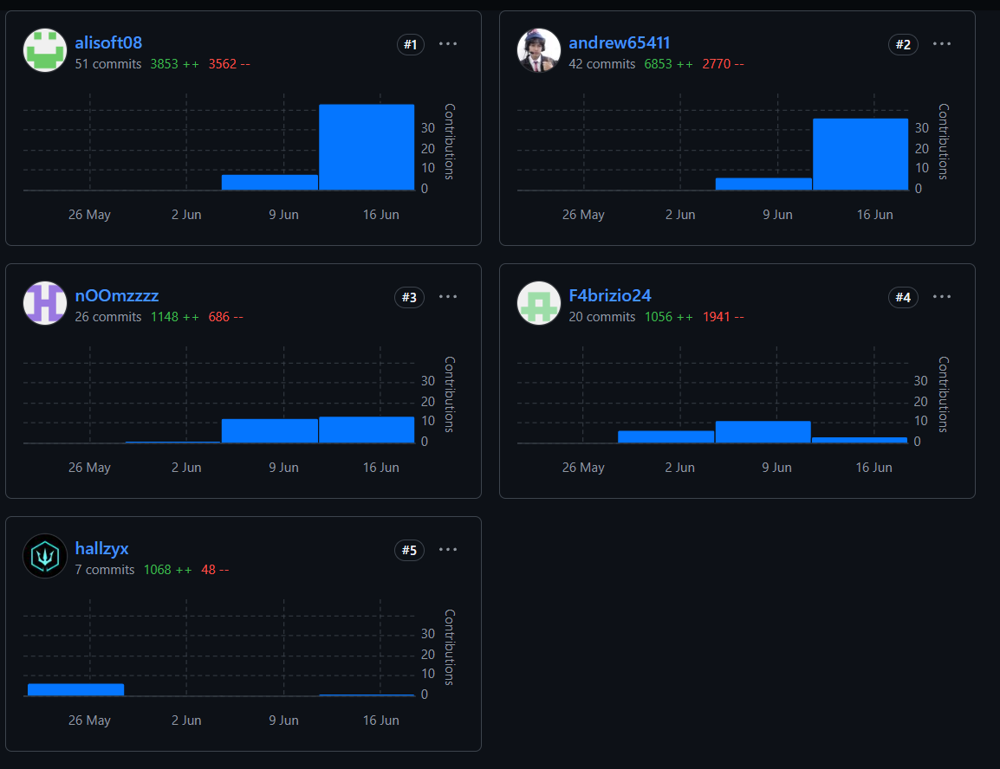

Aplicacion backend del proyecto:

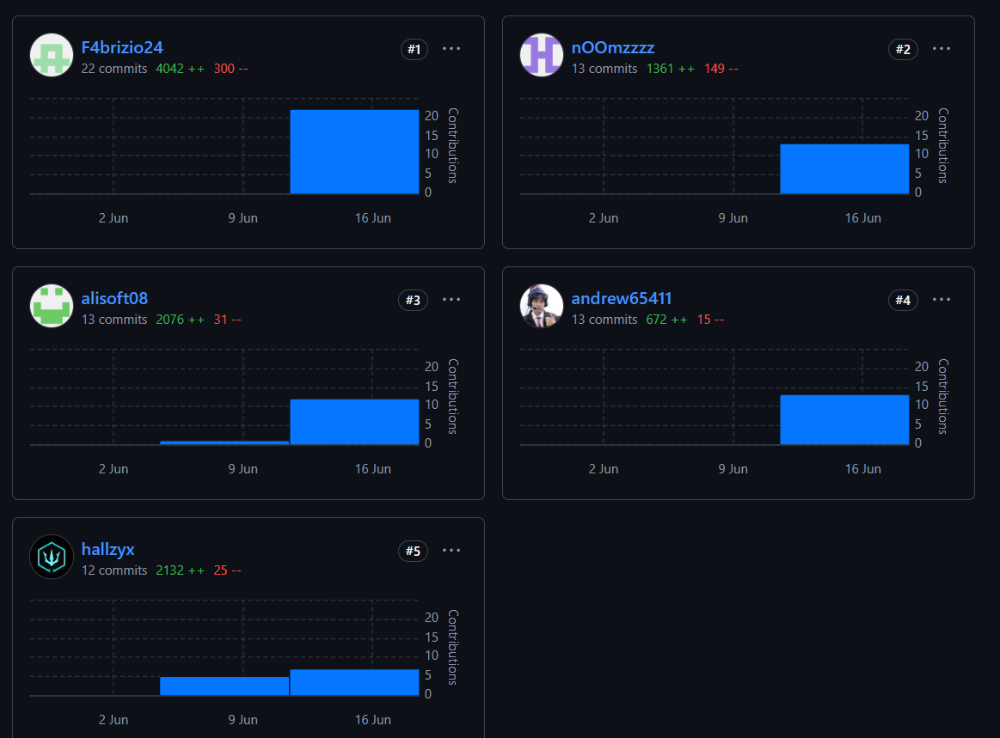

Estos commits reflejan un trabajo constante y distribuido entre todos los miembros del equipo, con un enfoque en el desarrollo técnico, diseño UX/UI y mejora continua del informe.

### Network graph para TB2:
Aplicacion frontend del proyecto:

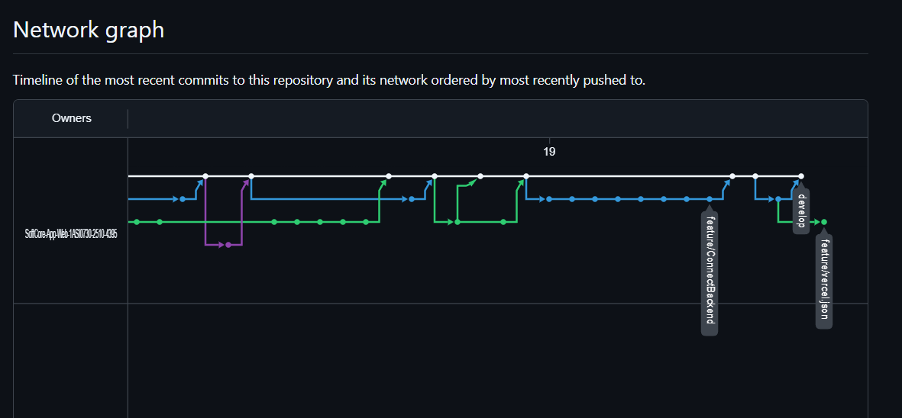

Aplicacion backend del proyecto:

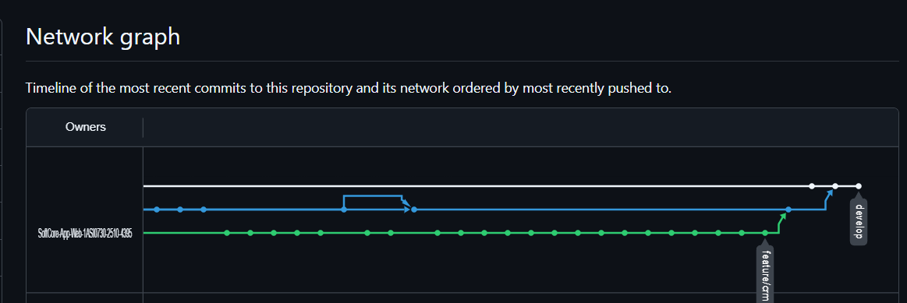


# Contenido

[Registro de Versiones del Informe](#registro-de-versiones-del-informe)

[Project Report Collaboration Insights](#project-report-collaboration-insights)

[Student Outcome](#student-outcome)

[Capítulo I: Introducción](#capítulo-i-introducción)

[1.1 Startup Profile](#11-startup-profile)  
[1.1.1. Descripción de la Startup](#111-descripción-de-la-startup)  
[1.1.2. Perfiles de integrantes del equipo](#112-perfiles-de-integrantes-del-equipo)  

[1.2. Solution Profile](#12-solution-profile)  
[1.2.1 Antecedentes y problemática](#121-antecedentes-y-problemática)  
[1.2.2 Lean UX Process.](#122-lean-ux-process)  
[1.2.2.1. Lean UX Problem Statements.](#1221-lean-ux-problem-statements)  
[1.2.2.2. Lean UX Assumptions.](#1222-lean-ux-assumptions)  
[1.2.2.3. Lean UX Hypothesis Statements.](#1223-lean-ux-hypothesis-statements)  
[1.2.2.4. Lean UX Canvas.](#1224-lean-ux-canvas)  

[1.3. Segmentos objetivo.](#13-segmentos-objetivo)  

[Capítulo II: Requirements Elicitation & Analysi](#capítulo-ii-requirements-elicitation--analysis)  

[2.1. Competidores](#21-competidores)  
[2.1.1. Análisis competitivo](#211-análisis-competitivo)  
[2.1.2. Estrategias y tácticas frente a competidores](#211-análisis-competitivo)  

[2.2. Entrevistas](#22-entrevistas)  
[2.2.1. Diseño de entrevistas](#221-diseño-de-entrevistas)  
[2.2.2. Registro de entrevistas](#222-registro-de-entrevistas)  
[2.2.3. Análisis de entrevistas](#223-análisis-de-entrevistas)  

[2.3. Needfinding](#23-needfinding)  
[2.3.1. User Personas](#231-user-personas)  
[2.3.2. User Task Matrix](#232-user-task-matrix)  
[2.3.3. User Journey Mapping](#233-user-journey-mapping)  
[2.3.4. Empathy Mapping](#234-empathy-mapping)  
[2.3.5. As-is Scenario Mapping](#235-as-is-scenario-mapping) 

[2.4. Ubiquitous Language](#24-ubiquitous-language)  

[Capítulo III: Requirements Specificatio](#capítulo-iii-requirements-specification)  

[3.1. To-Be Scenario Mapping](#31-to-be-scenario-mapping)    
[3.2. User Stories](#32-user-stories)  
[3.3. Impact Mapping](#33-impact-mapping)  
[3.4. Product Backlog](#34-product-backlog)  

[Capítulo IV: Product Desig](#capítulo-iv-product-design)  

[4.1. Style Guidelines](#41-style-guidelines)  
[4.1.1. General Style Guidelines](#411-general-style-guidelines)  
[4.1.2. Web Style Guidelines](#412-web-style-guidelines)  

[4.2. Information Architecture](#42-information-architecture)  
[4.2.1. Organization Systems](#421-organization-systems)  
[4.2.2. Labeling Systems](#422-labeling-systems)  
[4.2.3. SEO Tags and Meta Tag](#423-seo-tags-and-meta-tags)  
[4.2.4. Searching Systems](#424-searching-systems)   
[4.2.5. Navigation Systems](#425-navigation-systems)  

[4.3. Landing Page UI Design](#43-landing-page-ui-design)   
[4.3.1. Landing Page Wireframe](#431-landing-page-wireframe)  
[4.3.2. Landing Page Mock-up](#432-landing-page-mock-up) 

[4.4. Web Applications UX/UI Design](#44-web-applications-uxui-design)  
[4.4.1. Web Applications Wireframes](#441-web-applications-wireframes)  
[4.4.2. Web Applications Wireflow Diagrams](#442-web-applications-wireflow-diagrams)  
[4.4.2. Web Applications Mock-ups](#442-web-applications-mock-ups)   
[4.4.3. Web Applications User Flow Diagrams](#443-web-applications-user-flow-diagrams)  

[4.5. Web Applications Prototyping](#45-web-applications-prototyping)  

[4.6. Domain-Driven Software Architecture](#46-domain-driven-software-architecture)  
[4.6.1. Software Architecture Context Diagram](#461-software-architecture-context-diagram)  
[4.6.2. Software Architecture Container Diagrams](#462-software-architecture-container-diagrams)  
[4.6.3. Software Architecture Components Diagrams](#463-software-architecture-components-diagrams)  

[4.7. Software Object-Oriented Design](#47-software-object-oriented-design)  
[4.7.1. Class Diagrams](#471-class-diagrams)  
[4.7.2. Class Dictionary](#472-class-dictionary)  

[4.8. Database Design](#48-database-design)  
[4.8.1. Database Diagram](#481-database-diagram)  

[Capítulo V: Product Implementation, Validation & Deploymen](#capítulo-v-product-implementation-validation--deployment)  

[5.1. Software Configuration Management](#51-software-configuration-management)  
[5.1.1. Software Development Environment Configuration](#511-software-development-environment-configuration)  
[5.1.2. Source Code Management](#512-source-code-management)  
[5.1.3. Source Code Style Guide & Conventions](#513-source-code-style-guide--conventions)  
[5.1.4. Software Deployment Configuration](#514-software-deployment-configuration)  

[5.2. Landing Page, Services & Applications Implementation](#52-landing-page-services--applications-implementation)  
[5.2.1. Sprint 1](#521-sprint-n)  
[5.2.1.1. Sprint Planning 1](#5211-sprint-planning-1)
[5.2.1.2. Aspect Leaders and Collaborators](#5212-aspect-leaders-and-collaborators)
[5.2.1.3. Sprint Backlog 1](#5213-sprint-backlog-1)  
[5.2.1.4. Development Evidence for Sprint Review](#5214-development-evidence-for-sprint-review)  
[5.2.1.5. Execution Evidence for Sprint Review](#5215-execution-evidence-for-sprint-review)  
[5.2.1.6. Services Documentation Evidence for Sprint Review](#5216-services-documentation-evidence-for-sprint-review)  
[5.2.1.7. Software Deployment Evidence for Sprint Review](#5217-software-deployment-evidence-for-sprint-review)  
[5.2.1.8. Team Collaboration Insights during Sprint](#5218-team-collaboration-insights-during-sprint)  

  
[5.2.2. Sprint 2 ](#522-sprint-2)  
[5.2.2.1. Sprint Planning 2](#5221-sprint-planning-2)  
[5.2.2.2. Aspect Leaders and Collaborators](#5222-aspect-leaders-and-collaborators)
[5.2.2.3. Sprint Backlog n](#5223-sprint-backlog-2)  
[5.2.2.4. Development Evidence for Sprint Review](#5224-development-evidence-for-sprint-review)  
[5.2.2.5. Execution Evidence for Sprint Review](#5225-execution-evidence-for-sprint-review)  
[5.2.2.6. Services Documentation Evidence for Sprint Review](#5226-services-documentation-evidence-for-sprint-review)  
[5.2.2.7. Software Deployment Evidence for Sprint Review](#5227-software-deployment-evidence-for-sprint-review)  
[5.2.2.8. Team Collaboration Insights during Sprint](#5228-team-collaboration-insights-during-sprint)   
  
[Bibliografía](#bibliografía)  
[Anexos](#anexos)  

# Student Outcome

| Criterio Específico                                                                                             | Acciones Realizadas                                                                                                                                                                                                                                                                                                                                                                                                                                                                                                                                                                                                                                                                                                                                                                                                                                                                                                                                                                                                                                                                                                                                                                                                                                                                                                                                                                                                                                                                                                                                                                                                                                                                                                                                                                                                                                                                                                                                                                                                                                                                                                                                                                                                                                                                                                                                                                                                                                                                                                                                                                                                                                                                                                                                                                                                                                                                                                                                                                                                                                                                                                                                                                                                                                                                                                                                                                                                                                                                                                                                                                                                                                                                                                                                                                                                                                                                                                                                                                                                    | Conclusiones |
|-----------------------------------------------------------------------------------------------------------------|------------------------------------------------------------------------------------------------------------------------------------------------------------------------------------------------------------------------------------------------------------------------------------------------------------------------------------------------------------------------------------------------------------------------------------------------------------------------------------------------------------------------------------------------------------------------------------------------------------------------------------------------------------------------------------------------------------------------------------------------------------------------------------------------------------------------------------------------------------------------------------------------------------------------------------------------------------------------------------------------------------------------------------------------------------------------------------------------------------------------------------------------------------------------------------------------------------------------------------------------------------------------------------------------------------------------------------------------------------------------------------------------------------------------------------------------------------------------------------------------------------------------------------------------------------------------------------------------------------------------------------------------------------------------------------------------------------------------------------------------------------------------------------------------------------------------------------------------------------------------------------------------------------------------------------------------------------------------------------------------------------------------------------------------------------------------------------------------------------------------------------------------------------------------------------------------------------------------------------------------------------------------------------------------------------------------------------------------------------------------------------------------------------------------------------------------------------------------------------------------------------------------------------------------------------------------------------------------------------------------------------------------------------------------------------------------------------------------------------------------------------------------------------------------------------------------------------------------------------------------------------------------------------------------------------------------------------------------------------------------------------------------------------------------------------------------------------------------------------------------------------------------------------------------------------------------------------------------------------------------------------------------------------------------------------------------------------------------------------------------------------------------------------------------------------------------------------------------------------------------------------------------------------------------------------------------------------------------------------------------------------------------------------------------------------------------------------------------------------------------------------------------------------------------------------------------------------------------------------------------------------------------------------------------------------------------------------------------------------------------------------------------|--------------|
| <p style="text-align:left; margin-top: 0;">Trabaja en equipo para proporcionar liderazgo en forma conjunta.</p> | **Axel Ordoñez:**<br><strong>TB1:</strong> Establecimos metas claras en el área técnica del proyecto, especialmente en la parte de arquitectura del software. Ayudamos a distribuir tareas entre los compañeros y aseguramos que todos tuvieran acceso a información relevante.<br><strong>TP1:</strong> Revisamos y actualizamos la planificación del equipo tras recibir retroalimentación, asegurándonos de que se cumplieran los plazos y se alcanzaran los objetivos técnicos del Sprint 2.<br><strong>TB2:</strong> Diseñé guiones para las entrevistas de validación con usuarios reales, participé activamente en su realización y contribuí al análisis de resultados, lo cual fue clave para validar funcionalidades del sistema. Además, trabajé en mejoras técnicas del backend basadas en feedback del equipo.<br><br><strong>Fabrizio Panta:</strong><br><strong>TB1:</strong> Colaboramos en la definición de objetivos del proyecto, especialmente en el diseño UX/UI y creación de artefactos visuales. Nuestra participación fue clave para estructurar las primeras versiones del frontend.<br><strong>TP1:</strong> Ajustamos la planificación del equipo para adaptarnos a nuevas necesidades, supervisamos el cumplimiento de tareas asignadas y reforzamos el ambiente colaborativo mediante reuniones constantes y revisiones grupales.<br><strong>TB2:</strong> Realicé el análisis y síntesis de los resultados obtenidos en las entrevistas de validación, lo cual ayudó a identificar áreas de mejora en la experiencia de usuario. También integré el backend con el frontend existente, asegurando una comunicación efectiva entre ambos componentes.<br><br><strong>Brayan Ccarita:</strong><br><strong>TB1:</strong> Ayudamos en la planificación de aspectos visuales del producto y colaboramos en la mejora del landing page. Participamos en reuniones de seguimiento para asegurar el avance del equipo.<br><strong>TP1:</strong> Cumplimos con nuestras tareas técnicas asignadas, ayudamos a mantener reuniones efectivas y propusimos soluciones prácticas durante el desarrollo frontend, lo cual contribuyó al cumplimiento de objetivos comunes.<br><strong>TB2:</strong> Realicé entrevistas de validación con huéspedes y staff, lo que permitió obtener valiosa retroalimentación sobre la utilidad y usabilidad del sistema. También me encargué del despliegue del backend a un entorno de producción, garantizando su disponibilidad para pruebas y uso real.<br><br><strong>Alison Arrieta:</strong><br><strong>TB1:</strong> Fuimos clave en la definición de metas relacionadas con la experiencia de usuario. Trabajamos en la planificación del diseño del sistema y aseguramos que cada miembro comprendiera su rol en el avance del proyecto.<br><strong>TP1:</strong> Refinamos el diseño del landing page, ayudamos a priorizar tareas del frontend y fomentamos un entorno colaborativo y respetuoso dentro del equipo.<br><strong>TB2:</strong> Revisé y mejoré la Sección 4 del informe siguiendo las indicaciones de clase. También configuré el backend aplicando buenas prácticas de seguridad y logs, lo que garantizó mayor robustez y mantenibilidad del código.<br><br><strong>Andreow Santiago:</strong><br><strong>TB1:</strong> Ayudamos a establecer objetivos generales del proyecto, especialmente en la conexión entre diseño UX/UI y desarrollo técnico. Participamos en la planificación de sprints iniciales.<br><strong>TP1:</strong> Nos encargamos de priorizar tareas técnicas, aplicamos correcciones del TB1 y mantuvimos una actitud proactiva en la búsqueda de soluciones técnicas que permitieran cumplir los objetivos del sprint.<br><strong>TB2:</strong> Inicié el desarrollo del backend del sistema, coordiné la planificación y actualización de tareas en Jira durante el Sprint 3, preparé guiones y grabé el video “About the Product”, y realicé la revisión general final del informe antes de la entrega oficial. | <p style="text-align:left; margin-top: 0;"><strong>TB1:</strong> Desde el inicio del proyecto, trabajamos en equipo distribuyendo roles y responsabilidades de manera equitativa. Aportamos desde nuestras áreas de especialización para construir una base sólida del sistema, promoviendo una dinámica colaborativa e inclusiva.<br><strong>TP1:</strong> Consolidamos el liderazgo compartido dentro del equipo. Coordinamos esfuerzos, revisamos nuestro progreso y ajustamos estrategias según las necesidades del proyecto, logrando avanzar de forma organizada y profesional hacia los objetivos técnicos y de diseño.<br><strong>TB2:</strong> Durante esta etapa, consolidamos aún más el trabajo en equipo. Llevamos a cabo entrevistas de validación, desarrollamos y configuramos el backend, lo desplegamos a producción y lo integramos con el frontend. Preparamos materiales audiovisuales finales y realizamos una revisión general del informe, incorporando comentarios del docente. Todo este proceso reflejó el compromiso, organización y profesionalismo del equipo.</p> |
| <p style="text-align:left; margin-top: 0;">Crea un entorno colaborativo e inclusivo, establece metas, planifica tareas y cumple objetivos.</p> | **Axel Ordoñez:** <br><strong>TB1:</strong> Establecimos metas claras en el área técnica del proyecto, especialmente en la parte de arquitectura del software. Ayudamos a distribuir tareas entre los compañeros y aseguramos que todos tuvieran acceso a información relevante. <br><strong>TP1:</strong> Revisamos y actualizamos la planificación del equipo tras recibir retroalimentación, asegurándonos de que se cumplieran los plazos y se alcanzaran los objetivos técnicos del Sprint 2. <br><strong>TB2:</strong> Avanzamos en el desarrollo del backend siguiendo las decisiones arquitectónicas definidas, aplicando buenas prácticas como seguridad, logs y modularidad. También lideré la integración exitosa del backend con el frontend existente.<br><br><strong>Fabrizio Panta:</strong> <br><strong>TB1:</strong> Colaboramos en la definición de objetivos del proyecto, especialmente en el diseño UX/UI y creación de artefactos visuales. Nuestra participación fue clave para estructurar las primeras versiones del frontend. <br><strong>TP1:</strong> Ajustamos la planificación del equipo para adaptarnos a nuevas necesidades, supervisamos el cumplimiento de tareas asignadas y reforzamos el ambiente colaborativo mediante reuniones constantes y revisiones grupales. <br><strong>TB2:</strong> Contribuí al análisis de resultados y ajustes realizados a funcionalidades del sistema. Además, trabajé en la optimización de la interfaz tras la conexión con el backend, asegurando una experiencia más fluida.<br><br><strong>Brayan Ccarita:</strong> <br><strong>TB1:</strong> Ayudamos en la planificación de aspectos visuales del producto y colaboramos en la mejora del landing page. Participamos en reuniones de seguimiento para asegurar el avance del equipo. <br><strong>TP1:</strong> Cumplimos con nuestras tareas técnicas asignadas, ayudamos a mantener reuniones efectivas y propusimos soluciones prácticas durante el desarrollo frontend, lo cual contribuyó al cumplimiento de objetivos comunes. <br><strong>TB2:</strong> Trabajé en la optimización de la lógica del backend basada en feedback técnico del equipo. También participé en el despliegue del backend a producción y verificación de su conexión desde el frontend.<br><br><strong>Alison Arrieta:</strong> <br><strong>TB1:</strong> Fuimos clave en la definición de metas relacionadas con la experiencia de usuario. Trabajamos en la planificación del diseño del sistema y aseguramos que cada miembro comprendiera su rol en el avance del proyecto. <br><strong>TP1:</strong> Refinamos el diseño del landing page, ayudamos a priorizar tareas del frontend y fomentamos un entorno colaborativo y respetuoso dentro del equipo. <br><strong>TB2:</strong> Apoyé el análisis de resultados y la integración del frontend con el backend, asegurando coherencia visual y funcional. También participé en revisiones de usabilidad post-integración.<br><br><strong>Andreow Santiago:</strong> <br><strong>TB1:</strong> Ayudamos a establecer objetivos generales del proyecto, especialmente en la conexión entre diseño UX/UI y desarrollo técnico. Participamos en la planificación de sprints iniciales. <br><strong>TP1:</strong> Nos encargamos de priorizar tareas técnicas, aplicamos correcciones del TB1 y mantuvimos una actitud proactiva en la búsqueda de soluciones técnicas que permitieran cumplir los objetivos del sprint. <br><strong>TB2:</strong> Participé activamente en la configuración del backend, la optimización de la lógica tras recibir feedback del equipo y el despliegue a producción. Además, apoyé la integración con el frontend y la verificación funcional del sistema completo.                                                                                                                                                                                                                                                                          | <p style="text-align:left; margin-top: 0;"><strong>TB1:</strong> Creamos desde el inicio un entorno colaborativo e inclusivo, con metas bien definidas y una distribución clara de roles. Cada integrante participó activamente en la planificación y ejecución de tareas, sentando las bases para un trabajo organizado y funcional. <br><strong>TP1:</strong> Consolidamos esa dinámica de trabajo, mejoramos procesos según la retroalimentación recibida y logramos avanzar de forma coordinada en el desarrollo frontend y la documentación técnica. La comunicación constante, la adaptabilidad y el compromiso nos permitieron cumplir con los objetivos técnicos y de diseño establecidos. <br><strong>TB2:</strong> En esta fase, iniciamos el desarrollo del backend siguiendo decisiones arquitectónicas definidas, configuramos el sistema aplicando buenas prácticas de seguridad, logs y modularidad, y optimizamos la lógica tras recibir feedback técnico del equipo. Logramos el despliegue del backend a producción y verificamos su conexión desde el frontend. Finalmente, completamos la integración exitosa del backend con el frontend, consolidando una funcionalidad completa del sistema y preparándonos para futuras iteraciones más complejas.</p> |

# Capítulo I: Introducción
## 1.1. Startup Profile
### 1.1.1. Descripción de la Startup

SoftCore es una prometedora startup conformada por estudiantes de la Universidad Peruana de Ciencia Aplicadas (UPC) en Lima, Perú, unidos por la visión de transformar la experiencia hotelera a través de la tecnología. Este equipo combina su conocimiento en desarrollo de software, diseño de interfaces y gran interes en la industria hotelera para crear una innovadora aplicación de gestión. Su objetivo principal es empoderar a los huéspedes, permitiéndoles personalizar su estadía y convertir cada habitación en un espacio inteligente y adaptado a sus preferencias individuales.

La propuesta de SoftCore se centra en la integración de tecnologías emergentes como el Internet de las Cosas (IoT), la biometría y la domótica. A través de su aplicación, los usuarios podrán definir sus preferencias antes o durante su llegada al hotel, lo que se traducirá en un entorno de habitación que responda automáticamente a sus necesidades. Esta solución no solo busca mejorar la comodidad y satisfacción del huésped, sino también proporcionar al personal administrativo herramientas eficientes para gestionar estas preferencias y optimizar las operaciones del hotel.

Con un enfoque inicial en el mercado hotelero de Lima, SoftCore aspira a convertirse en un referente de la innovación en el sector. La mentalidad disruptiva forma parte de nuestra filosofía y gracias a esto es posible abordar los desafíos de la industria con soluciones creativas y centradas en el usuario. La startup busca demostrar cómo la tecnología puede elevar la experiencia del cliente y generar valor tanto para los huéspedes como para los establecimientos hoteleros, marcando el camino hacia una nueva era de "hoteles inteligentes" en la capital peruana.

#### 1.1.2. Perfiles de integrantes del equipo

| Miembros del equipo | Código Estudiante | Carrera | Conocimientos / Habilidades |
|---|---|---|---|
| Arrieta Quispe, Alison Jimena   | U202312031 | Ingeniería de Software | MySQL, C++, C#, Docker, Java, JavaScript. Responsable y trabajadora. |
| Ccarita Cruz, Brayan Roberto   | U20221C218 | Ingeniería de Software | Astro.js, Svelte, Golang, Design Sprint. Perseverante y puntual |
| Ordoñez Ricaldi, Axel Randall   | U202216827 | Ingeniería de Software | C++, SQL, MongoDB, Python. Paciencia y buen trabajo en equipo |
| Panta Castro, Fabrizio Martin   | U20231A810 | Ingeniería de Software | SQL, Python, C++. Compañerismo y responsable con las entregas. |
| Santiago Peña, Andreow Jomark   | U202317362 | Ingeniería de Software | MySQL, C++, C#, Docker. Perseverante y buen trabajo en equipo. |


# 1.2. Solución Profile

## 1.2.1. Antecedentes y Problemática

Como parte del proceso de identificación de la problemática en el sector hotelero limeño, se aplicó la técnica **The 5 W’s and 2 H’s (Who, What, Where, When, Why, How, How Much)**, permitiendo estructurar de manera clara y estratégica los antecedentes, la situación actual y las oportunidades de innovación tecnológica en el ámbito hotelero.

### 1. Who (Quién)

Los principales stakeholders identificados son:
- **Huéspedes**: Viajeros nacionales e internacionales que buscan comodidad, personalización y experiencias memorables durante su estadía.
- **Personal administrativo del hotel**: Recepcionistas, coordinadores de piso, técnicos de mantenimiento y gerentes responsables de garantizar la operación eficiente y la satisfacción del cliente.
- **Proveedores de tecnología**: Empresas especializadas en domótica, IoT y soluciones tecnológicas para hoteles inteligentes.

### 2. What (Qué)

Actualmente, existe una brecha significativa entre las expectativas de los huéspedes modernos y la capacidad de los hoteles en Lima para ofrecer una experiencia personalizada y digital. Los sistemas tradicionales no permiten gestionar preferencias individuales, ni integrar tecnologías como la biometría, la domótica o el monitoreo remoto de dispositivos, lo cual limita tanto la comodidad del huésped como la eficiencia operativa del hotel.

### 3. Where (Dónde)

La problemática se centra en el mercado hotelero de Lima, específicamente en establecimientos que buscan mejorar su competitividad mediante la adopción de tecnologías digitales. Este problema es especialmente relevante en hoteles de tres a cinco estrellas que compiten por turistas nacionales e internacionales y viajeros de negocios.

### 4. When (Cuándo)

La necesidad ha ido creciendo desde la pandemia, cuando los viajeros comenzaron a priorizar la seguridad, la comodidad sin contacto y la personalización. En los últimos años, ha aumentado la demanda de hoteles inteligentes, y los avances en IA, IoT y domótica han hecho posible su implementación, aunque aún existen barreras de adopción.

### 5. Why (Por qué)

La falta de integración tecnológica en el sector hotelero genera:
- Baja satisfacción del huésped debido a la imposibilidad de personalizar su experiencia.
- Ineficiencia operativa al depender de procesos manuales y desconectados.
- Costos innecesarios por fallas técnicas no anticipadas.
- Menor diferenciación frente a competidores que ya están adoptando estas tecnologías.

Esta problemática afecta negativamente la reputación del hotel, la fidelización del cliente y la rentabilidad del negocio.

### 6. How (Cómo)

Actualmente, los hoteles dependen de múltiples herramientas: PMS tradicional, sistemas de control de acceso físico, y en algunos casos, aplicaciones móviles básicas sin conexión entre sí. Esta fragmentación impide centralizar la información del huésped, automatizar tareas y ofrecer una experiencia coherente.

### 7. How Much (Cuánto)

El impacto económico incluye:
- Costos adicionales por ajustes manuales y errores en la configuración de habitaciones.
- Pérdida de ingresos por insatisfacción del cliente y bajas calificaciones en plataformas de opinión.
- Dificultad para justificar inversiones en tecnología por falta de claridad sobre retorno de inversión.
- Reducción en la productividad del personal por gestión ineficiente de datos.

Con base en este análisis preliminar, se identifica como **problemática principal** la ausencia de una plataforma integral que permita personalizar la experiencia del huésped, optimizar la gestión operativa del hotel y facilitar el monitoreo y mantenimiento de dispositivos inteligentes.

**Custom Host** se propone como respuesta a esta brecha, diseñando una solución tecnológica que integre en un solo flujo las necesidades de personalización del huésped, gestión eficiente del personal y conectividad con proveedores de tecnología, enfocándose inicialmente en el mercado hotelero de Lima.

### Delimitación del alcance del proyecto:

Este proyecto contempla el diseño y desarrollo de una plataforma web y móvil que permita:
- Personalización previa a la llegada del huésped (temperatura, iluminación, tipo de almohada, etc.).
- Dashboard intuitivo para el personal del hotel con visualización de preferencias y alertas en tiempo real.
- Acceso biométrico a la habitación.
- Control domótico de la habitación vía app móvil.
- Plataforma de monitoreo para proveedores de dispositivos inteligentes.

Queda fuera del alcance:
- Integración con otros sectores hoteleros distintos a los mencionados.
- Ampliación a otros países en esta fase inicial.
- Implementación de funcionalidades avanzadas como IA predictiva o asistentes virtuales sin validación previa.

---

## 1.2.2. Lean UX Process

### 1.2.2.1. Lean UX Problem Statement

**Custom Host** es una plataforma tecnológica que permite a los hoteles de Lima ofrecer una experiencia de hospedaje inteligente, personalizada y centrada en el usuario, integrando soluciones de domótica, biometría y gestión operativa.

**Contexto:** Nuestra solución busca transformar la experiencia hotelera tradicional en una experiencia conectada, donde el huésped pueda personalizar su entorno antes de llegar y disfrutar de un servicio altamente adaptado a sus preferencias.

**Observación del problema:** Sin embargo, hemos identificado que muchos hoteles no pueden ofrecer una experiencia verdaderamente personalizada debido a la falta de herramientas que centralicen las preferencias del huésped y las traduzcan automáticamente en la configuración de la habitación.

**Impacto:** Esta situación genera baja satisfacción del cliente, mayor carga laboral para el personal y menores índices de recomendación y fidelización.

**Necesidad insatisfecha:** Actualmente, los hoteles carecen de una solución que permita gestionar todas las variables de personalización de forma intuitiva, accesible y escalable, integrando además al personal y a los proveedores de tecnología.

**Pregunta de mejora:** ¿Cómo podríamos desarrollar una plataforma que permita a los hoteles ofrecer una experiencia inteligente y personalizada, mejorando la satisfacción del huésped, la eficiencia operativa y la colaboración con proveedores de tecnología?

---

### 1.2.2.2. Lean UX Assumptions

En el desarrollo de Custom Host, se han definido supuestos clave según la metodología Lean UX, orientados a guiar el diseño de producto, minimizar riesgos y validar tempranamente decisiones estratégicas. Estos supuestos se dividen en cinco categorías:

#### User Assumptions

| Supuesto | Descripción |
|---------|-------------|
| Interés en personalización | Los huéspedes valoran poder configurar su habitación antes de llegar. |
| Uso de tecnología móvil | La mayoría de los huéspedes usará la aplicación móvil durante su estadía. |
| Confianza en biometría | Los usuarios confían en el acceso biométrico como método seguro y conveniente. |
| Facilidad de uso | La interfaz será percibida como intuitiva por usuarios de diferentes edades. |
| Disposición a probar nuevas tecnologías | Los huéspedes están dispuestos a usar funciones innovadoras si mejoran su experiencia. |

#### User Outcome Assumptions

| Supuesto | Descripción |
|---------|-------------|
| Aumento de satisfacción | Si los huéspedes pueden personalizar su habitación, entonces al menos el 80% reportará alta satisfacción. |
| Mejora en percepción de exclusividad | Si el acceso es biométrico, entonces al menos el 75% lo considerará una experiencia premium. |
| Fidelización del cliente | Si la experiencia es personalizada, entonces al menos el 50% regresará o recomendará el hotel. |

#### Business Assumptions

| Supuesto | Descripción |
|---------|-------------|
| Rentabilidad de la inversión | La tecnología aumentará la ocupación y reducirá costos operativos. |
| Adaptación del personal | El equipo hotelero podrá usar el dashboard sin capacitación intensiva. |
| Colaboración con proveedores | Las empresas de domótica apoyarán la integración técnica. |
| Diferenciación competitiva | Los hoteles con Custom Host destacarán frente a la competencia. |

#### Business Outcome Assumptions

| Supuesto | Descripción |
|---------|-------------|
| Aumento en ocupación hotelera | Al mejorar la experiencia, se espera un aumento del 10% en la ocupación promedio. |
| Reducción en tiempos operativos | El personal administrativo ahorrará al menos el 10% del tiempo dedicado a preparar habitaciones. |
| Disminución de fallos técnicos | Gracias al monitoreo en tiempo real, se espera una reducción del 5% en reportes de problemas. |

#### Feature Assumptions

| Supuesto | Descripción |
|---------|-------------|
| App móvil intuitiva | Al menos el 90% de los huéspedes usará la app durante su estadía. |
| Dashboard efectivo | Al menos el 85% del personal hotelero reportará que mejora su trabajo. |
| Funciones biométricas | Al menos el 80% de los usuarios calificará positivamente el acceso biométrico. |
| Monitoreo de dispositivos | Al menos el 70% de los proveedores indicarán que la plataforma facilita el mantenimiento. |
| Control domótico | Al menos el 75% de los huéspedes usará al menos dos funciones de control remoto. |

---

### 1.2.2.3. Lean UX Hypothesis Statements

1. **Creemos que ofrecer a los huéspedes la capacidad de personalizar su habitación a través de una aplicación móvil antes de su llegada aumentará su satisfacción general con la estadía.**  
   *Sabremos que hemos tenido éxito cuando observemos un aumento del 15% en las puntuaciones de satisfacción del cliente relacionadas con la comodidad y personalización de la habitación en las encuestas post-estancia.*

2. **Creemos que la implementación de un dashboard intuitivo para el personal administrativo que centralice las preferencias de los huéspedes optimizará la gestión del hotel y reducirá el tiempo dedicado a tareas relacionadas con la personalización de habitaciones.**  
   *Sabremos que hemos tenido éxito cuando el personal administrativo reporte una reducción del 10% en el tiempo promedio dedicado a la preparación y ajuste de las habitaciones según las preferencias de los huéspedes.*

3. **Creemos que la integración de tecnología biométrica para el acceso a la habitación y la personalización del entorno aumentará la percepción de seguridad y exclusividad entre los huéspedes.**  
   *Sabremos que hemos tenido éxito cuando al menos el 80% de los huéspedes que utilicen la función biométrica la califiquen positivamente en términos de seguridad y conveniencia en las encuestas post-estancia.*

4. **Creemos que ofrecer control domótico de la habitación a través de la aplicación (iluminación, temperatura, etc.) mejorará la comodidad y la experiencia general de los huéspedes durante su estadía.**  
   *Sabremos que hemos tenido éxito cuando observemos un aumento del 20% en el uso de las funciones de control domótico dentro de la aplicación por parte de los huéspedes activos.*

5. **Creemos que al proporcionar una plataforma que permite a los proveedores de domótica monitorear el funcionamiento de sus dispositivos en tiempo real, se facilitará el mantenimiento preventivo y se minimizarán los problemas técnicos en las habitaciones.**  
   *Sabremos que hemos tenido éxito cuando se registre una disminución del 5% en el número de reportes de fallas de los dispositivos de domótica en las habitaciones inteligentes.*

6. **Creemos que la disponibilidad de una versión móvil de la aplicación aumentará la interacción de los huéspedes con la plataforma antes, durante y después de su estadía, fomentando la exploración de los servicios del hotel y posibles reservas futuras.**  
   *Sabremos que hemos tenido éxito cuando observemos un aumento del 10% en el número de usuarios activos en la versión móvil de la aplicación y un incremento del 5% en las consultas o reservas realizadas a través de la misma.*
#### 1.2.2.4. Lean UX Canvas.

En el apartado de Lean UX Canvas se desarrolló una estructuración completa y académica de las principales hipótesis estratégicas que sustentan la propuesta de valor y la arquitectura de la plataforma Custom Host .

Cada hipótesis fue traducida en un Lean UX Canvas formal, siguiendo un enfoque científico-experimental que articula: el problema de negocio detectado (Business Problem ), las soluciones propuestas a nivel funcional y técnico (Solutions ), los resultados esperados a nivel organizacional (Business Outcomes ), la caracterización de los usuarios objetivos (Users ), los beneficios esperados para estos usuarios (User Outcomes & Benefits ), la formulación de hipótesis de aprendizaje (Hypotheses ), y el diseño de experimentos estratégicos para validar o refutar dichas hipótesis (What's the most important thing we need to learn first? y What's the least amount of work we need to do to learn the next most important thing? ).

Este trabajo metodológico permitió no solo establecer un marco claro de experimentación y validación temprana de las decisiones de diseño y tecnología, sino también alinear todos los esfuerzos de desarrollo a métricas de éxito específicas y medibles. Así, el apartado de Lean UX Canvas representa una pieza fundamental dentro del enfoque de construcción iterativa, ágil y centrada en el usuario de Custom Host , asegurando que cada funcionalidad propuesta responde a necesidades reales, riesgos priorizados y oportunidades de negocio tangibles.

"Anexo: Diagrama de Lean UX Canvas":
[Lean UX Canvas - CustomHost](https://drive.google.com/drive/folders/1lisWJ5DpLPSO-jhpY3pJzf0qpPOdMhyf?usp=sharing)

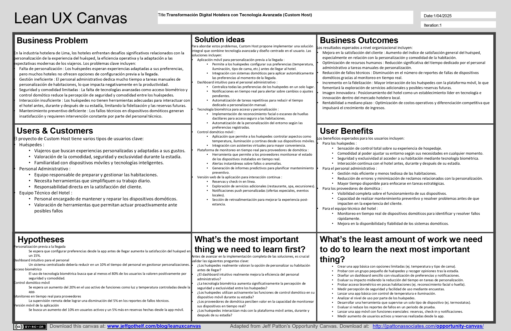

## 1.3. Segmentos objetivo

### Segmento Objetivo #1: Huéspedes que desean hospedarse en un hotel

Este segmento incluye a individuos de diversos perfiles demográficos y socioeconómicos que tienen la necesidad o el deseo de alojarse en un hotel en Lima, ya sea por motivos de turismo, negocios u otros.

#### Aspectos demográficos

- **Sexo:** Sin distinción de género.
- **Edad:** De 18 a 60 años, con mayor concentración entre jóvenes adultos y adultos profesionales.
- **Nivel socioeconómico:** Medio a medio-alto, orientados a experiencias cómodas y tecnológicamente avanzadas.
- **Geografía:** Principalmente turistas nacionales e internacionales que visitan Lima, así como residentes locales interesados en una experiencia diferente.

#### Aspectos psicográficos

- Personas que valoran la comodidad, conveniencia y personalización durante su estadía.
- Interés en la innovación tecnológica aplicada al sector hotelero, como domótica y acceso biométrico.
- Disposición a usar herramientas digitales para mejorar su experiencia de hospedaje.
- En búsqueda de hoteles que ofrezcan una propuesta moderna, segura y memorable.

#### Aspectos conductuales

- Prefieren aplicaciones móviles intuitivas que les permitan configurar preferencias antes de la llegada.
- Están dispuestos a probar nuevas tecnologías si estas mejoran su experiencia de usuario.
- Tienen altas expectativas en cuanto a confort, seguridad y atención personalizada.
- Comparten su experiencia en redes sociales si perciben valor agregado o diferenciación respecto a otros establecimientos.

---

### Segmento Objetivo #2: Personal administrativo del hotel

Este segmento comprende a los empleados del hotel encargados de la gestión operativa, la atención al cliente y el mantenimiento de las instalaciones.

#### Aspectos demográficos

- **Sexo:** Sin distinción de género.
- **Edad:** De 20 a 55 años, con experiencia laboral en el sector hotelero.
- **Nivel socioeconómico:** Bajo a medio, dependiendo del rol y antigüedad.
- **Roles principales:** Recepcionistas, coordinadores de piso, personal de limpieza, técnicos de mantenimiento, supervisores y gerentes.

#### Aspectos psicográficos

- Profesionales orientados a resultados, que buscan herramientas que mejoren su eficiencia diaria.
- Valoran interfaces intuitivas que simplifiquen procesos repetitivos y reduzcan errores humanos.
- Motivados por soluciones que faciliten la atención personalizada al huésped sin aumentar su carga laboral.
- Sensibles a la adopción de tecnología si esta contribuye a agilizar tareas y optimizar recursos.

#### Aspectos conductuales

- Requieren dashboards claros y accesibles que centralicen información relevante (preferencias del huésped, estado de habitaciones, alertas).
- Dependen de notificaciones y alertas en tiempo real para gestionar cambios y prioridades.
- Prefieren sistemas fáciles de aprender y rápidos de implementar en su rutina diaria.
- Se benefician de herramientas que permitan monitorear dispositivos inteligentes y anticipar posibles fallas.
# Capítulo II: Requirements Elicitation & Analysis
## 2.1. Competidores

Con el propósito de fortalecer la propuesta de valor de **Custom Host** y posicionarla estratégicamente en el mercado de hoteles inteligentes en Lima, se desarrollará un análisis competitivo frente a sus principales referentes: **INTELITY, ALICE Platform y Cloudbeds**.

Este análisis permitirá identificar de manera sistemática las **fortalezas, debilidades, oportunidades y amenazas (SWOT)** de cada competidor, así como evaluar sus estrategias comerciales, modelos de negocio, propuestas de valor y posicionamiento en el mercado. Se prestará especial atención a cómo estas plataformas abordan la experiencia del huésped, la gestión operativa y la integración con tecnologías emergentes como el IoT, dado que Custom Host se diferencia precisamente por su enfoque único en personalización automatizada mediante domótica y biométrica.

A partir de esta evaluación, se definirán estrategias de diferenciación y tácticas de posicionamiento que permitan a Custom Host maximizar su competitividad, aprovechar nichos de mercado poco explorados —como los hoteles boutique tecnológicos— y ofrecer una solución más completa e innovadora tanto para huéspedes como para el personal del hotel.
### 2.1.1. Análisis competitivo.

| Competitive Analysis Landscape                          |  |
| ------------------------------------------------------- | -|
| ¿Por qué llevar a cabo este análisis?                   | Para identificar cómo Custom Host puede diferenciarse en el mercado de hotelería inteligente en Lima, aprovechando su enfoque único en personalización con IoT/biométrica - algo que competidores como INTELITY (solo software) y Cloudbeds (gestión genérica) no ofrecen. El análisis revela oportunidades clave: dominar el nicho de hoteles boutique tecnológicos y crear alianzas estratégicas con proveedores de domótica, mientras se evitan los altos costos de competir directamente con soluciones masivas ya establecidas. |


| |  | Custom Host (Nosotros) | INTELITY | ALICE Platform |Cloudbeds |
|-|-|-|-|-|-|
| PERFIL| Overview | Custom Host es una plataforma innovadora que utiliza IoT y biométrica para personalizar la experiencia hotelera, ajustando automáticamente las habitaciones según las preferencias del huésped. | INTELITY es una plataforma de gestión hotelera enfocada en mejorar el engagement con los huéspedes a través de una app móvil y automatización de servicios.	 | ALICE es un software diseñado para optimizar las operaciones hoteleras, desde reservas hasta mantenimiento, mejorando la eficiencia del personal.	 | Cloudbeds es una solución de gestión hotelera en la nube que combina administración de propiedades, reservas y distribución en una sola plataforma.|
|| Ventaja competitiva ¿Qué valor ofrece a los clientes? | Ofrece adaptación en tiempo real mediante domótica, creando un entorno único que mejora la satisfacción del cliente y simplifica la gestión para los hoteles.| Su integración con sistemas PMS líderes la hace ideal para cadenas hoteleras que buscan una solución tecnológica robusta y escalable.|Su fortaleza radica en la gestión interna, ayudando a hoteles a organizar tareas y comunicarse mejor con empleados y huéspedes.|Destaca por su interfaz intuitiva y su capacidad para integrarse con más de 500 canales de distribución, como Booking y Expedia.|
|| Mercado Objetivo                                        |Se dirige a hoteles boutique y de lujo en Lima, especialmente aquellos que atraen a huéspedes interesados en tecnología y experiencias personalizadas.| Cadenas hoteleras internacionales que necesitan herramientas para gestionar múltiples propiedades de manera eficiente.| Hoteles medianos y grandes, principalmente en EE.UU. y Europa, que buscan simplificar sus procesos operativos. | Hoteles boutique y propiedades independientes que necesitan una herramienta completa y fácil de usar.|
| Perfil de marketing                                     | Estrategia de Marketing | Se centra en alianzas con proveedores de IoT y en destacar su propuesta de "experiencia única" a través de redes sociales y demostraciones interactivas. | Enfoque B2B, con ventas directas a grandes hoteles y participación en ferias del sector. |Webinars y casos de éxito para demostrar su impacto en la productividad hotelera. | Marketing digital y presencia en eventos de la industria para promover sus soluciones. |
| Perfil del producto| Productos y servicios | Incluye una app móvil para huéspedes, un dashboard administrativo y dispositivos IoT para habitaciones inteligentes. | App para huéspedes, API para integraciones personalizadas y herramientas de gestión operativa. | Software para staff, app de huésped y herramientas de coordinación de equipos. |Gestión de reservas, distribución multicanal, informes de desempeño y herramientas de revenue management.|
|| Precios y costos                                        |  Modelo freemium con opciones de suscripción basadas en el número de habitaciones adaptadas. | Licencia anual por hotel, con costos que varían según el tamaño y necesidades de la propiedad. | Basado en el número de habitaciones, con planes adaptables a diferentes tamaños de propiedades. | Tarifa dinámica con planes "Pro" y "360", ajustables según las necesidades del hotel. |
|| Canales de distribución (Web y/o Móvil)                 | Disponible en web y móvil (iOS/Android), facilitando el acceso tanto para huéspedes como para el personal del hotel. | App propia y compatibilidad con sistemas PMS existentes. | Plataforma web y app móvil para acceso remoto. | Plataforma web y móvil, accesible desde cualquier dispositivo.|
### 2.1.2. Estrategias y tácticas frente a competidores.


|Competidores ->|  | Custom Host (Nosotros) | INTELITY| ALICE Platform| Cloudbeds |
|-|-|-|-|-|-|
| Análisis SWOT | Fortalezas | Custom Host destaca por su uso de IoT y biométrica para personalizar automáticamente las habitaciones, junto con un dashboard que simplifica la gestión hotelera, ofreciendo una ventaja competitiva en el mercado de hotelería personalizada | INTELITY es líder en soluciones de guest engagement, con una app móvil robusta y alta integración con sistemas de gestión hotelera (PMS). Su presencia global lo hace atractivo para cadenas internacionales. | ALICE se especializa en optimizar operaciones hoteleras, ayudando al personal con gestión de tareas, mantenimiento y comunicación interna. Es una solución eficiente para hoteles medianos y grandes. | Cloudbeds destaca por su interfaz intuitiva y su capacidad de integración con múltiples canales de distribución (Booking, Expedia). Es ideal para hoteles boutique que buscan una solución todo-en-uno. |
|| Debilidades   | El alto costo de implementación de dispositivos IoT puede ser una barrera para hoteles pequeños. Además, al ser un modelo nuevo, requiere convencer a los hoteles de adoptar tecnología avanzada, lo que puede ralentizar su expansión inicial. | No ofrece personalización física de habitaciones (domótica avanzada), y sus precios pueden ser prohibitivos para hoteles pequeños o independientes. | No se enfoca en la experiencia directa del huésped, lo que limita su atractivo frente a competidores como Custom Host. | No incluye personalización física (IoT), y su modelo de tarifas dinámicas puede ser menos accesible para propiedades pequeñas. | 
|| Oportunidades | El creciente interés en hoteles inteligentes en Lima y la demanda de experiencias personalizadas representan una ventana clave para posicionarse. Alianzas con proveedores de domótica y cadenas boutique podrían acelerar su adopción. | Podría expandirse en mercados emergentes como Latinoamérica, donde la hotelería de lujo busca innovación tecnológica. | La automatización con IA y la expansión en hoteles corporativos podrían fortalecer su propuesta. | El mercado de hoteles independientes sigue creciendo, y su flexibilidad le permite adaptarse a nuevas demandas, como herramientas de revenue management. | 
|| Amenazas      | Competidores establecidos como INTELITY y Cloudbeds ya tienen presencia en el mercado, y la resistencia al cambio en hoteles tradicionales podría limitar su crecimiento. | La creciente competencia en software hotelero y el avance de soluciones basadas en voz (como Volara) podrían reducir su ventaja. | La saturación de PMS genéricos y el surgimiento de plataformas más especializadas representan riesgos para su crecimiento. | Las grandes OTAs (como Booking.com) están desarrollando sus propios sistemas de gestión, lo que podría reducir su participación en el mercado. |


## 2.2. Entrevistas

Con el objetivo de obtener información rica y contextualizada sobre las necesidades, expectativas y frustraciones tanto de los huéspedes como del personal del hotel, se realizaron entrevistas semi-estructuradas dirigidas a tres segmentos clave: **huéspedes potenciales**, **personal administrativo y operativo del hotel**, y **proveedores de dispositivos de domótica**.

El diseño de las entrevistas se elaboró considerando formularios específicos para cada segmento, formulando preguntas abiertas que permitieran a los participantes expresar libremente sus experiencias, preferencias, puntos de dolor y percepciones tecnológicas. Entre los aspectos abordados se incluyeron datos demográficos básicos, nivel de familiaridad con la tecnología, interés en la personalización de la experiencia hotelera, percepción de valor de funcionalidades como el IoT y la biometría, y facilidad de uso de herramientas digitales relacionadas.

Cada entrevista fue realizada de forma virtual o presencial, registrada con consentimiento previo del participante, y complementada con un resumen descriptivo que recogía las ideas clave, emociones percibidas y hallazgos relevantes. Este proceso siguió buenas prácticas de investigación UX, asegurando una captura consistente de requisitos y oportunidades de mejora.

Posteriormente, los resultados fueron analizados desde una perspectiva cualitativa, identificando patrones comunes, fricciones recurrentes y momentos clave en la experiencia del huésped y en la gestión del personal del hotel. Estos insights sirvieron como base para la construcción de artefactos esenciales como **User Personas**, **Empathy Maps**, **User Goals** y **User Flows**, todos orientados a validar y refinar la propuesta de valor de Custom Host.

La metodología aplicada garantizó una recolección de información profunda y relevante, indispensable para el desarrollo de una plataforma centrada en el usuario, capaz de responder eficazmente a las demandas reales del mercado hotelero inteligente en Lima.


### 2.2.1. Diseño de entrevistas.


Antes de realizar las entrevistas profundas, se aplicó un **formulario básico** dirigido a los participantes para obtener datos demográficos y contextuales esenciales. Este formulario permite segmentar adecuadamente a los usuarios y ajustar las preguntas durante la entrevista según su perfil.

📄 [Accede aquí al formulario de información básica](https://forms.gle/HHPuJJ19MbDsB28C7)

**Preguntas generales:**
En esta sección realizamos preguntas simples para obtener datos demográficos e información de comportamientos clave, como el navegador y dispositivos que utilizan los entrevistados.

1. ¿Cuál es su nombre? 
2. ¿Qué edad tiene? 
3. ¿A qué se dedica? 
4. ¿Qué navegador y dispositivos utiliza con mayor frecuencia? 

Las siguientes preguntas buscan responder nuestra hipótesis central, mencionada en el capítulo anterior:
"¿Los usuarios estarán interesados en nuestra propuesta innovadora, considerando que existen alternativas similares y que realmente la necesitan?"
(Previo a las entrevistas, se recopiló información básica como el distrito de residencia o procedencia de los usuarios para facilitar el contacto).

**Entrevistas usuario segmento (Huéspedes de hoteles)**
Esta sección de preguntas se enfoca en el punto de vista de los usuarios del segmento huéspedes que desean hospedarse en un hotel.

1. ¿Con qué frecuencia se hospeda en hoteles?
2. ¿Qué aspectos valora más al elegir un hotel?
3. ¿Ha utilizado hoteles con sistemas innovadores?
4. ¿Qué frustraciones ha tenido en sus estadías?
5. ¿Cómo preferiría interactuar con los servicios del hotel?
6. ¿Estaría dispuesto a pagar más por una experiencia adaptada a sus preferencias?  

**Entrevistas usuario segmento (Personal administrativo del hotel)**
Esta sección de preguntas se enfoca en el punto de vista de los usuarios del segmento personal administrativo del hotel.

1. ¿Qué rol desempeña en el hotel?  
2. ¿Cómo registran actualmente las preferencias de los huéspedes?
3. ¿Qué dificultades enfrentan para ofrecer una experiencia personalizada?
4. ¿Cómo gestionan la comunicación entre áreas?
5. ¿Qué tecnologías les gustaría implementar para optimizar procesos?
6. ¿Qué obstáculos ven para adoptar soluciones innovadoras? 
7. ¿Creen que los huéspedes demandan más personalización?

### 2.2.2. Registro de entrevistas.

En este apartado se presenta una documentación detallada de cada entrevista realizada con los distintos segmentos objetivo identificados. Se ha recopilado información relevante que incluye el perfil del entrevistado, las respuestas proporcionadas durante la conversación, así como los hallazgos más destacados obtenidos a partir de sus opiniones y experiencias.
📄 [Accede aquí para ver el video de todas las entrevistas](https://upcedupe-my.sharepoint.com/personal/u202317362_upc_edu_pe/_layouts/15/stream.aspx?id=%2Fpersonal%2Fu202317362_upc_edu_pe%2FDocuments%2Fupc-pre-202510-1asi0729-4350-CustomHost-needfinding-sprint-1%2Emp4&referrer=StreamWebApp%2EWeb&referrerScenario=AddressBarCopied%2Eview%2E5353cd4c-a07d-4b9d-aa0a-773e4bf1478c&isDarkMode=false)

# Entrevistas Realizadas

## 🧑‍💼 Segmento 1: Huéspedes Potenciales

### Entrevistado 1: Alessandra Becerra
- **Edad:** 18 años
- **Ocupación:** Estudiante de ingeniería de software
- **Navegador habitual:** Safari y Windows
- **Dispositivos utilizados:** iPhone y laptop
- **Distrito:** San Miguel


- **Instante en el que inicia:** 0:01

**Resumen:**  
Alessandra busca hoteles limpios, con buen WiFi y que acepten mascotas. Critica especialmente las demoras en check-in y la mala señal de internet.

**Preferencias Tecnológicas:**
- Preferiría usar una app para servicios básicos del hotel.
- Cree importante mantener atención humana cuando sea necesario.
- Le interesaría probar tablets integradas en las habitaciones.
- Estaría dispuesta a pagar más por servicios que ahorren tiempo y ofrezcan mayor comodidad.

---

### Entrevistado 2: Luis Córdova
- **Edad:** 25 años
- **Ocupación:** Data Science
- **Navegador habitual:** Google Chrome
- **Dispositivos utilizados:** Computadora y celular
- **Distrito:** San Borja


- **Instante en el que inicia:** 3:11

**Resumen:**  
Luis viaja frecuentemente por trabajo y busca hoteles cómodos y con precios razonables. Tiene fuertes críticas sobre los sistemas obsoletos que aún usan cuadernos físicos o WhatsApp para gestionar tareas, además de problemas con reservas no cumplidas.

**Preferencias Tecnológicas:**
- Prefiere controlar los servicios mediante asistentes de voz o pantallas táctiles.
- Estaría dispuesto a pagar más por una verdadera personalización que optimice su experiencia.
- Sus comentarios reflejan una alta necesidad de modernizar los procesos hoteleros con tecnología práctica y eficiente.

---

### Entrevistado 3: Fernando San José Zamora Solís
- **Edad:** 24 años
- **Ocupación:** Practicante de ingeniería de software
- **Navegador habitual:** Google Chrome y Opera GX
- **Dispositivos utilizados:** Celular y computadora
- **Distrito:** Jesús María


- **Instante en el que inicia:** 8:02

**Resumen:**  
Fernando valora la comodidad y buena relación calidad-precio en sus estadías. Aunque no ha tenido experiencia con hoteles tecnológicos, critica los sistemas anticuados como el mal funcionamiento del teléfono de su habitación, lo cual obligó al uso de intermediarios para comunicarse.

**Preferencias Tecnológicas:**
- Prefiere interactuar con el hotel mediante una aplicación móvil.
- Le interesa probar pantallas táctiles dentro de la habitación.
- Estaría dispuesto a pagar más por personalización (temperatura, iluminación).
- Sería cliente recurrente si el hotel ofreciera estas funcionalidades.

---

## 👨‍💼 Segmento 2: Personal Administrativo del Hotel

### Entrevistado 4: Alex Ávila
- **Edad:** 20 años
- **Ocupación:** Administrador hotelero
- **Navegador habitual:** Opera GX y Windows
- **Dispositivos utilizados:** Laptop y teléfono Android
- **Distrito:** Jesús María


- **Instante en el que inicia:** 12:14

**Resumen:**  
Alex trabaja en la administración de un hotel donde actualmente no existe un sistema digitalizado para registrar preferencias de huéspedes. Solo se asignan habitaciones básicas (como vista a la calle), sin opciones personalizables.

**Desafíos Actuales:**
- Comunicación entre áreas se maneja de forma tradicional (llamadas y asignación verbal).
- Reconoce que los huéspedes demandan más personalización, pero hay resistencia al cambio por parte del personal.
- Algunos clientes frecuentes reciben trato especial basado en la memoria del staff, pero nuevos huéspedes no acceden a estos beneficios por falta de sistemas digitales.

**Visión Tecnológica:**
- Le gustaría implementar mejor control de empleados y actualizar cámaras de seguridad.
- Admite que la adaptación a nuevas tecnologías es lenta, pero necesaria.

---

### Entrevistado 5: Claudia Sifuentes
- **Edad:** 28 años
- **Ocupación:** Gerente de operaciones hotelera
- **Navegador habitual:** Firefox
- **Dispositivos utilizados:** Laptop
- **Distrito:** Lince


- **Instante en el que inicia:** 15:22

**Resumen:**  
Claudia supervisa operaciones en un hotel que usa un CRM básico, aunque de forma irregular. El personal carece de capacitación adecuada para aprovecharlo plenamente.

**Desafíos Actuales:**
- La comunicación interna sigue siendo arcaica: correos electrónicos y reuniones presenciales dominan el flujo de información.
- No hay herramientas digitales para monitorear ni aplicar las preferencias de los huéspedes.
- Los altos costos iniciales y la resistencia al cambio son barreras claras para adoptar nuevas tecnologías.

**Visión Tecnológica:**
- Identifica dos soluciones clave: un sistema robusto de gestión de habitaciones y herramientas predictivas para anticipar necesidades.
- Destaca cómo los huéspedes esperan experiencias personalizadas, similares a las de plataformas como Airbnb, lo que incrementa la presión por modernizar.

---
### Entrevistado 6: Joan Talizo
- **Edad:** 23 años
- **Ocupación:** Administración hotelera
- **Navegador habitual:** Google Chrome
- **Dispositivos utilizados:** Laptop y tablet
- **Distrito:** Surquillo

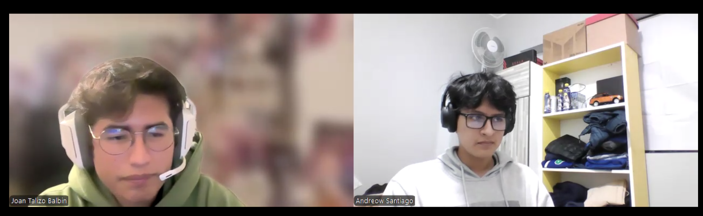

- **Instante en el que inicia:** 17:18

**Resumen:**  
Joan trabaja en el área de *front desk* y atención al cliente. Actualmente, su hotel registra las preferencias de los huéspedes (como vista al mar o tipo de cama) de forma manual: a través de libretas o memorización, lo cual genera errores, especialmente durante temporadas altas.

**Desafíos Actuales:**
- La comunicación entre áreas se realiza principalmente por grupos de WhatsApp, lo que considera poco eficiente.
- No existe una plataforma digital centralizada para registrar ni aplicar las preferencias de los huéspedes.
- El personal joven está abierto a nuevas tecnologías, pero requiere herramientas accesibles y fáciles de adoptar.

**Visión Tecnológica:**
- Reconoce la necesidad de un sistema digitalizado que agilice la gestión de reservas y preferencias del huésped.
- Le gustaría implementar una plataforma centralizada que mejore tanto la experiencia del cliente como la organización interna.
- Aunque el costo es un obstáculo, cree que una solución intuitiva sería bien recibida por su equipo y aumentaría significativamente la eficiencia operativa.
---


## 2.2.3. Análisis de Entrevistas

En este apartado se presenta un análisis detallado de las entrevistas realizadas a los segmentos objetivo identificados durante la fase de investigación: **Huéspedes Potenciales** y **Personal Administrativo del Hotel**. Este análisis tiene como propósito sistematizar las respuestas obtenidas, identificar patrones comunes, validar supuestos iniciales y sustentar la viabilidad y relevancia de Custom Host desde la perspectiva de los usuarios reales.

### 🧑‍💼 Segmento 1: Huéspedes Potenciales

#### Estadísticas y Aspectos Comunes:
- **Navegadores más usados:** Google Chrome (67%), Safari y Firefox.
- **Dispositivos principales:** Teléfono móvil (iPhone o Android) y laptop.
- **Comunicación preferida:** WhatsApp es ampliamente utilizado, aunque todos expresaron cierta frustración por su uso en contextos hoteleros.
- **Edades representadas:** Entre 18 y 25 años.
- **Expectativas tecnológicas:** Alto interés en funcionalidades digitales como personalización de habitación, apps móviles intuitivas y tecnología biométrica.

| Característica | Descripción |
|----------------|-------------|
| **Objetivas**  | Los huéspedes utilizan dispositivos móviles y esperan interacciones digitales simples y útiles. Prefieren apps sobre llamadas o mensajes para interactuar con el hotel. |
| **Subjetivas** | Existe descontento con sistemas obsoletos (ej. mal funcionamiento de teléfonos en habitaciones, check-in lento). La mayoría valora la tecnología como forma de mejorar comodidad y experiencia. |

#### Hallazgos Clave:
- Todos los entrevistados valoran la **personalización del espacio** (temperatura, iluminación, tipo de cama).
- La **facilidad de uso** de la plataforma es crucial para la adopción por parte de los huéspedes.
- Aunque hay interés en nuevas tecnologías, también existe **cierta preocupación por privacidad**, especialmente en funciones como el acceso biométrico.
- Los huéspedes estarían dispuestos a pagar más si perciben un **valor real en la experiencia personalizada**.
- Se validó el supuesto: “Los turistas estarán interesados en la propuesta de personalización vía app”.

---

### 👨‍💼 Segmento 2: Personal Administrativo del Hotel

#### Estadísticas y Aspectos Comunes:
- **Edades representadas:** Entre 20 y 28 años.
- **Sistemas actuales:** Uso de libretas físicas, WhatsApp y CRM básicos.
- **Dispositivos:** Laptop/tablet como principal herramienta; algunos mencionan interés en pantallas táctiles o cámaras actualizadas.
- **Necesidades operativas:** Centralización de información, mejor comunicación interna y reducción de tareas manuales.

| Característica | Descripción |
|----------------|-------------|
| **Objetivas**  | No hay sistema centralizado para registrar ni aplicar preferencias de huéspedes. Hay errores frecuentes al gestionar información manualmente. |
| **Subjetivas** | Reconocen la necesidad de modernización pero ven barreras como costos altos y resistencia al cambio. El personal joven muestra mayor disposición a adoptar tecnología nueva. |

#### Hallazgos Clave:
- Existe un **problema real en la gestión de preferencias de huéspedes**: se registran de forma manual, sin seguimiento digital claro.
- La **comunicación interna** es arcaica (WhatsApp, reuniones presenciales), generando demoras y malentendidos.
- Un **dashboard intuitivo** sería bien recibido si facilita la gestión diaria y reduce trabajo redundante.
- Las experiencias con plataformas como Airbnb están influyendo en las expectativas de los huéspedes, aumentando la presión por modernizar.
- Se validó el supuesto: “El personal administrativo podrá adaptarse fácilmente al dashboard y usarlo en su rutina diaria”, siempre que sea intuitivo.

---

### 🔍 Validación de Supuestos Lean UX

| Supuesto del Lean UX | Validado por Entrevistas? | Justificación |
|----------------------|----------------------------|---------------|
| "Los turistas estarán interesados en la propuesta de personalización vía app." | ✅ Sí | Todos los huéspedes mostraron interés en personalizar su estadía mediante una aplicación. |
| "Los huéspedes valorarán poder manejar aspectos como luz o temperatura desde su celular." | ✅ Sí | Tanto Fernando como Luis y Alessandra expresaron que esta funcionalidad aumentaría su satisfacción. |
| "La implementación de un dashboard intuitivo optimizará la gestión del hotel." | ✅ Sí | Claudia y Joan coincidieron en la necesidad de una herramienta así para mejorar eficiencia operativa. |
| "Los huéspedes verán el hotel inteligente como un valor agregado significativo." | ✅ Sí | Todos los huéspedes valoraron positivamente la idea de hoteles inteligentes, especialmente por comodidad y seguridad. |
| "El personal administrativo podrá adaptarse al dashboard." | ⚠️ Parcialmente | Aunque se reconoce la necesidad, también se mencionó la falta de capacitación y resistencia al cambio como obstáculos. |

---

### 📌 Conclusión del Análisis

Las entrevistas realizadas refuerzan la pertinencia de Custom Host en el mercado hotelero limeño. Ambos segmentos muestran claras señales de **necesidad de innovación tecnológica** y **deseo de personalización**, lo cual respalda la base del proyecto.

Para el **Segmento 1 (Huéspedes)**, se validó fuertemente la aceptación de la tecnología, el interés por la personalización y la disposición a pagar más por comodidad.

Para el **Segmento 2 (Personal del Hotel)**, se identificaron problemas operativos reales (falta de herramientas digitales, comunicación ineficiente) y se confirmó la percepción de que una solución como Custom Host puede mejorar tanto la experiencia del huésped como la eficiencia del personal.

Este análisis servirá como fundamento para la creación de artefactos como **User Personas**, **Empathy Maps** y **User Flows**, todo orientado a mantener un enfoque centrado en el usuario durante el desarrollo de Custom Host.


## 2.3. Needfinding

Para identificar las necesidades reales y prioritarias tanto de los huéspedes como del personal administrativo de hoteles, se realizaron entrevistas a tres segmentos clave: **huéspedes potenciales**, **personal hotelero** y **proveedores de dispositivos de domótica**. A través de estas conversaciones, surgieron patrones comunes y específicos en cada grupo, como el interés por una experiencia personalizada mediante tecnología IoT, la frustración con sistemas anticuados de comunicación interna, y la percepción de valor en funcionalidades como el acceso biométrico o el control remoto de la habitación.

Este proceso de *needfinding* permitió comprender en profundidad las motivaciones, puntos de dolor y expectativas de los usuarios, sentando las bases para el diseño de una plataforma centrada en el usuario, capaz de responder eficazmente a las demandas reales del mercado hotelero inteligente en Lima.

### 2.3.1. User Personas

Como parte del análisis del proceso de *needfinding*, se desarrollaron **User Personas** representativas de los dos segmentos principales: **Huéspedes Potenciales** y **Personal Administrativo del Hotel**. Estas personas sintetizan características clave obtenidas del análisis cualitativo de las entrevistas realizadas, tales como comportamientos recurrentes, motivaciones, frustraciones, objetivos personales, dispositivos utilizados y canales de interacción tecnológica.

Estas herramientas ayudan a traducir datos reales en perfiles comprensibles y accionables, orientando decisiones estratégicas sobre funcionalidades, experiencia de usuario y priorización de desarrollo técnico. Las personas creadas reflejan claramente las necesidades emergentes durante las entrevistas, facilitando un diseño más empático y efectivo de Custom Host.

> 📎 **Anexo:** Diagramas completos del User persona disponibles en las imágenes adjuntas.
>📄 [Accede aquí para ver los user persona](https://drive.google.com/drive/folders/13eOwfAasPjhdcPc3tzzmQxzB97VHwfVK?usp=sharing)

#### Persona 1: Huésped Tecnológico y Viajero Frecuente

- **Nombre:** Javier Morales
- **Edad:** 25 años
- **Ocupación:** Data Scientist
- **Perfil:** Viaja frecuentemente por trabajo y busca comodidad, eficiencia y experiencias modernas.

**Motivaciones:**
- Personalizar su habitación antes de llegar (temperatura, iluminación, tipo de cama).
- Usar asistentes de voz o pantallas táctiles para interactuar con la habitación.
- Evitar procesos manuales o lentos como check-in físico o llamadas telefónicas.

**Frustraciones:**
- Sistemas obsoletos que usan WhatsApp o cuadernos físicos.
- Falta de integración entre servicios del hotel.
- No poder ajustar detalles de la habitación desde su celular.

**Objetivos:**
- Ahorrar tiempo al automatizar procesos de entrada y uso de servicios.
- Vivir una experiencia cómoda y adaptada a sus preferencias.
- Recibir notificaciones claras sobre el estado de sus solicitudes.

**Dispositivos Usados:**
- Computadora y teléfono móvil Android.
- Navegador habitual: Google Chrome.

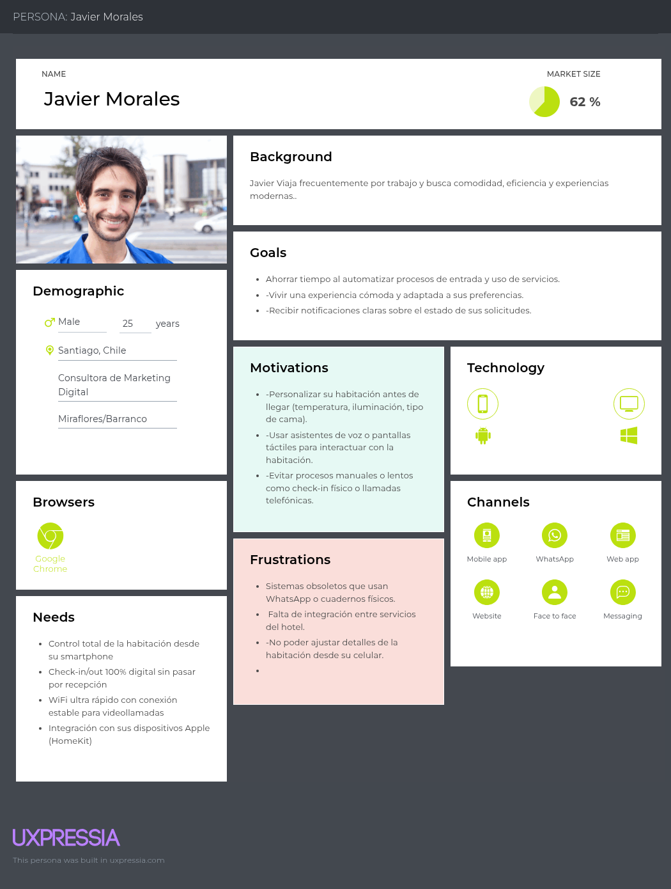

---
#### Persona 2: Empleado Joven del Sector Hotelero

- **Nombre:** Javier Rios
- **Edad:** 23 años
- **Ocupación:** Asistente de recepción / Front Desk
- **Perfil:** Trabaja en un hotel pequeño, interesado en soluciones digitales que mejoren su desempeño y la experiencia del cliente.

**Motivaciones:**
- Mejorar la organización interna del hotel.
- Reducir errores al gestionar preferencias de huéspedes.
- Adoptar tecnologías que aumenten la eficiencia operativa.

**Frustraciones:**
- Uso manual de libretas para registrar preferencias.
- Comunicación ineficiente entre áreas del hotel (grupos de WhatsApp).
- Falta de capacitación formal para usar nuevas herramientas.

**Objetivos:**
- Tener una herramienta centralizada para ver y gestionar preferencias de huéspedes.
- Mejorar la imagen del hotel frente a clientes exigentes.
- Disminuir el tiempo dedicado a tareas repetitivas gracias a la digitalización.

**Dispositivos Usados:**
- Laptop y tablet.
- Navegador habitual: Google Chrome.

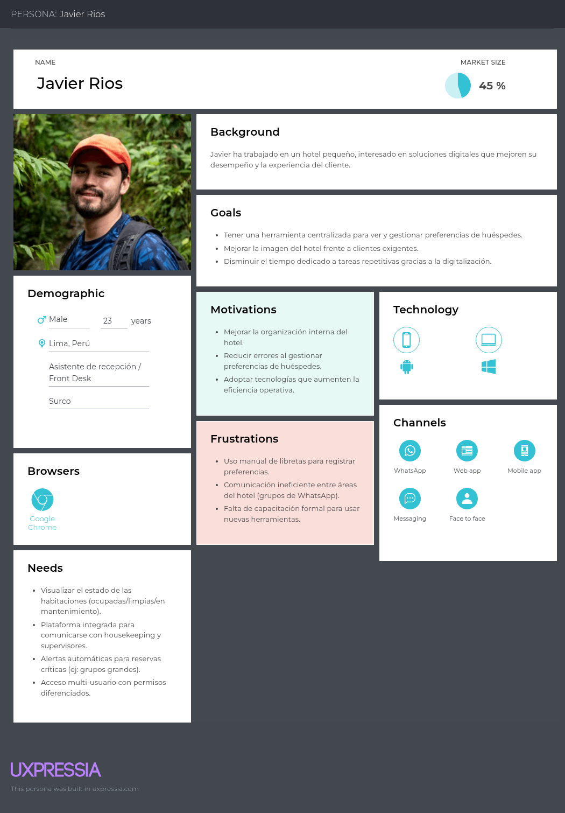

---
**Impacto en el Diseño de Custom Host:**

La creación de estas User Personas ha sido fundamental para:
- Priorizar funcionalidades esenciales (como personalización anticipada de habitación).
- Definir flujos de usuario intuitivos y accesibles desde dispositivos móviles.
- Validar supuestos iniciales sobre la aceptación de tecnología por parte de ambos segmentos.
- Diseñar interfaces amigables tanto para huéspedes como para el personal del hotel.

Con base en estas representaciones, se han podido construir otros artefactos clave como **Empathy Maps**, **User Goals** y **User Flows**, todos ellos enfocados en mantener un enfoque centrado en el usuario durante todo el ciclo de desarrollo de Custom Host.

### 2.3.2. User Task Matrix

A continuación se presenta la **User Task Matrix**, construida a partir de las entrevistas realizadas con los dos segmentos principales definidos: **Huéspedes Potenciales** y **Personal Administrativo del Hotel**.

Este artefacto permite visualizar las tareas clave que realiza cada tipo de usuario, así como evaluar la **frecuencia** con la que las ejecutan y la **importancia** que les asignan. La información obtenida es crucial para priorizar funcionalidades durante el desarrollo de Custom Host, asegurando que estén alineadas con las necesidades reales de ambos grupos de usuarios.

| ID  | Tarea | Importancia (Huésped) | Frecuencia (Huésped) | Importancia (Staff) | Frecuencia (Staff) |
|-----|---------------------------------------------------|------------------------|-----------------------|----------------------|---------------------|
| U01 | Personalizar ambiente de la habitación          | Alta                   | Media                 | Alta                 | Alta                |
| U02 | Realizar check-in/check-out digital             | Alta                   | Baja                  | Alta                 | Alta                |
| U03 | Controlar dispositivos IoT (luz, clima, TV)     | Alta                   | Alta                  | Media                | Alta                |
| U04 | Solicitar servicios adicionales                 | Media                  | Media                 | Alta                 | Alta                |
| U05 | Reportar problemas técnicos                     | Alta                   | Baja                  | Alta                 | Media               |
| U06 | Gestionar reservas y modificaciones            | Alta                   | Baja                  | Alta                 | Alta                |
| U07 | Coordinar limpieza de habitaciones            | -                      | -                     | Alta                 | Alta                |
| U08 | Actualizar inventario de amenidades            | -                      | -                     | Alta                 | Alta                |
| U09 | Gestionar comunicación entre áreas             | -                      | -                     | Alta                 | Alta                |
| U10 | Registrar preferencias recurrentes              | Media                  | Baja                  | Alta                 | Media               |


### 2.3.3. User Journey Mapping

Con el objetivo de comprender en profundidad las necesidades, comportamientos, emociones y puntos de fricción de nuestros principales segmentos de usuario, se desarrolló un **User Journey Mapping** utilizando la herramienta especializada **UXPressia**. Este proceso nos permitió visualizar de manera estructurada y empática el recorrido que cada tipo de usuario realiza desde su primera interacción hasta la experiencia completa con Custom Host.

La actividad se centró en dos segmentos clave:
1. **Huéspedes Potenciales:** usuarios finales interesados en una experiencia hotelera personalizada mediante tecnología IoT.
2. **Personal Administrativo del Hotel:** empleados responsables de gestionar reservas, coordinar servicios y mantener comunicación interna eficiente.

Para ambos perfiles se diseñó un mapa que incluye:
- Las **fases del viaje** (desde la planificación hasta el post-checkout).
- Los **objetivos del usuario** en cada etapa.
- El detalle de **acciones realizadas**, **canales utilizados** y **emociones experimentadas**.
- Identificación de **puntos de frustración** y **oportunidades de mejora** a lo largo del recorrido.

Gracias a esta metodología, pudimos identificar momentos críticos donde la tecnología puede transformar positivamente la experiencia del huésped y la operación del hotel. Además, facilitamos la toma de decisiones orientadas al usuario, lo cual es fundamental para construir una solución funcional, intuitiva y diferenciadora.

> 📎 **Anexo:** Diagramas completos del User Journey disponibles en las imágenes adjuntas.
> 📄 [Accede aquí para ver los user journey ](https://drive.google.com/drive/folders/1B5Cyt3g1BzZHOChqqEy3VjH8I3fj4XOD?usp=sharing)

---

#### 🧑‍💼 Segmento 1: Huéspedes

El User Journey del huésped se enfoca en cómo el cliente percibe el valor de la tecnología antes, durante y después de su estadía. Se destacan las siguientes áreas de oportunidad:

**Registration: ¿Por qué confiarían en nosotros?**
- Diseño profesional y consistente en la interfaz.
- Integración con cuentas existentes (Google, Apple ID) para registro rápido y seguro.
- Inclusión de testimonios reales de usuarios verificados.

**Onboarding and First Use: ¿Cómo pueden sentirse exitosos?**
- Tutorial interactivo guiado paso a paso.
- Confirmaciones visuales (animaciones, notificaciones) al realizar acciones.
- Soporte inmediato (chat en vivo o bot inteligente) para resolver dudas tempranas.

**Sharing: ¿Por qué invitarían a otros?**
- Integración con redes sociales para compartir experiencias fácilmente (ej.: "Comparte tu habitación personalizada").
- Funciones exclusivas para grupos (ej.: "Planifica un viaje con amigos y obtén descuento").
- Sistema de referidos con recompensas para ambos (ej.: "Invita a un amigo y ambos ganan 20% de descuento").


---

#### 👨‍💼 Segmento 2: Personal del Hotel

El User Journey del personal administrativo se centra en cómo la plataforma puede mejorar tanto la experiencia del huésped como la eficiencia operativa del hotel.

**Registration: ¿Qué les haría confiar en el sistema?**
- Interfaz clara y profesional, especialmente diseñada para uso interno.
- Capacitación accesible y documentación visual para nuevos usuarios.
- Acceso rápido e integración con herramientas ya usadas (como WhatsApp o CRM básico).

**Onboarding and First Use: ¿Cómo pueden sentirse exitosos desde el primer uso?**
- Dashboard intuitivo con indicadores claros del estado de las habitaciones y solicitudes.
- Guías visuales para aprender a usar la plataforma sin intervención constante de soporte técnico.
- Notificaciones inmediatas sobre solicitudes de huéspedes y cambios de estado.

**Daily Use: ¿Cómo optimizar la gestión diaria?**
- Filtros por tipo de solicitud, prioridad o área del hotel.
- Alertas proactivas sobre dispositivos IoT fallando o en mantenimiento.
- Integración con sistemas existentes para evitar duplicado de tareas.


### 2.3.4. Empathy Mapping

Como parte del proceso de diseño centrado en el usuario, se elaboraron **mapas de empatía (Empathy Maps)** para los dos segmentos clave identificados: **Huéspedes Potenciales** y **Personal Administrativo del Hotel**. Esta técnica, desarrollada inicialmente por Dave Gray, permite representar de forma visual lo que el usuario **piensa, siente, dice y hace** en relación con el producto o servicio, ayudando a comprender mejor su experiencia emocional y cognitiva.

#### Objetivo del Empathy Mapping

El propósito del mapa de empatía es profundizar en la perspectiva del usuario más allá de sus acciones observables, explorando sus motivaciones, miedos, frustraciones y deseos no explícitos. Esta herramienta resulta fundamental para detectar oportunidades de mejora desde un enfoque cualitativo, complementando la información obtenida a través de entrevistas, observación y análisis de comportamientos.

---

### Aplicación por Segmento

#### **Segmento 1: Huéspedes Potenciales**


##### Desglose del Empathy Map:

- **Piensa:**  
  "Quiero una experiencia cómoda y personalizada. Me interesa controlar mi entorno sin necesidad de llamar a recepción."

- **Siente:**  
  "Me frustra cuando tengo que repetir mis preferencias cada vez que me hospedo. Me sentiría más seguro si supiera que todo funciona bien desde el principio."

- **Dice:**  
  “Sería genial poder ajustar la temperatura, luz y entretenimiento desde mi celular antes de llegar.”

- **Hace:**  
  Investiga hoteles con tecnología avanzada. Lee reseñas de otros huéspedes. Usa aplicaciones móviles para hacer check-in digital. Personaliza detalles de su estadía si la plataforma lo permite.

---

#### **Segmento 2: Personal Administrativo del Hotel**


##### Desglose del Empathy Map:

- **Piensa:**  
  "Necesito un sistema que centralice las preferencias de los huéspedes para preparar habitaciones más rápido y evitar errores."

- **Siente:**  
  "Tener que recordar manualmente las preferencias me genera ansiedad, especialmente en temporadas altas."

- **Dice:**  
  "Si tuviéramos una interfaz intuitiva, podríamos mejorar tanto la experiencia del cliente como la organización interna."

- **Hace:**  
  Registra preferencias en libretas o en hojas de Excel. Coordina tareas mediante WhatsApp o llamadas. Revisa constantemente mensajes para estar al día con solicitudes urgentes. Asigna habitaciones según disponibilidad, sin tener en cuenta preferencias recurrentes.

---

### Hallazgos Clave del Empathy Mapping

Los mapas de empatía revelaron aspectos cruciales que no se perciben fácilmente durante las entrevistas tradicionales:
- Los **huéspedes valoran altamente la comodidad tecnológica**, pero también muestran cierta **desconfianza inicial hacia sistemas nuevos o poco conocidos**.
- El **personal del hotel enfrenta desafíos operativos importantes**: gestión manual de datos, comunicación ineficiente y carga laboral innecesaria debido a la falta de automatización.
- Ambos segmentos mostraron interés en **una solución intuitiva y útil**, aunque con diferentes expectativas:
   - *Huéspedes:* comodidad, personalización y facilidad de uso.
   - *Staff:* eficiencia, reducción de errores y mejor coordinación interna.

Estos hallazgos son fundamentales para guiar el diseño del sistema, asegurando que sea **útil, usable y accesible** tanto para los huéspedes como para el personal del hotel.

> 📎 **Anexo:** Diagramas completos del Empathy maps disponibles en las imágenes adjuntas.
> 📄 [Accede aquí para ver los empathy maps ](https://drive.google.com/drive/folders/1OPzCg6Y12vN8i56YLw9BLcZOWU6m3yZA?usp=sharing)

### 2.3.5. As-is Scenario Mapping

El siguiente **As-is Scenario Mapping** fue desarrollado utilizando la herramienta colaborativa Miro, siguiendo las buenas prácticas del Design Thinking y la metodología del curso. El objetivo fue representar visualmente la experiencia actual de los usuarios antes de la implementación de Custom Host, con el fin de identificar puntos de fricción, oportunidades de mejora y validar supuestos iniciales.

Para construir cada mapa, se utilizaron dimensiones clave como:
- **Fases:** Los momentos principales que vive el usuario.
- **Acciones:** Lo que hace el usuario en cada fase.
- **Pensamientos:** Sus reflexiones, dudas o expectativas.
- **Emociones:** Su nivel de satisfacción o frustración en cada paso.
- **Oportunidades:** Posibles mejoras que Custom Host puede introducir.

Cada etapa fue codificada visualmente para resaltar niveles de satisfacción, claridad, esfuerzo percibido y puntos críticos dentro del proceso. Este mapeo sirve como base para diseñar los *To-be Scenarios*, mostrando cómo podría evolucionar la experiencia del usuario con nuestra solución tecnológica e integradora.

Este análisis se realizó para dos segmentos clave:

#### Segmento Objetivo #1: Huéspedes Potenciales
Representan a viajeros que buscan comodidad, personalización y facilidad de uso al hospedarse en un hotel. En su experiencia actual, enfrentan problemas como falta de control sobre el entorno, comunicación lenta con el hotel y poca anticipación de sus preferencias por parte del staff.

#### Segmento Objetivo #2: Personal Administrativo del Hotel
Incluye a recepcionistas, coordinadores de limpieza y encargados operativos. Actualmente utilizan sistemas manuales o poco integrados para gestionar las preferencias de los huéspedes, lo cual genera errores, duplicados de trabajo y demoras en la atención.

> 📎 **Anexo:** Diagramas completos del As Is Scenario Mapping disponibles en las imágenes adjuntas.
> 📄 [Accede aquí para ver los As Is maps ](https://drive.google.com/drive/folders/1tNpNBVq5sW-YrK2v5Z9yYgTzjD1_g3Wv?usp=sharing)

  
*Mapa de escenario actual del Huésped*

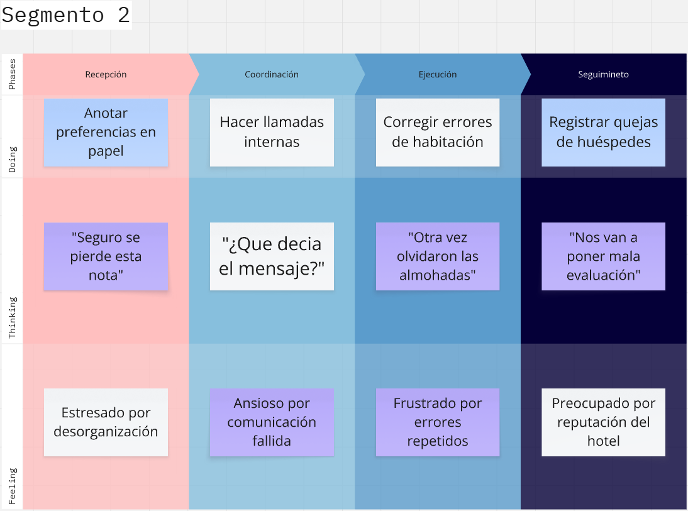  
*Mapa de escenario actual del Personal del Hotel*

## 2.4. Ubiquitous Language

Con el propósito de garantizar una comunicación clara entre todos los involucrados en el desarrollo de Custom Host (desde el equipo técnico hasta los stakeholders), se ha definido un conjunto de términos compartidos bajo el concepto de **Ubiquitous Language**, utilizado comúnmente en arquitecturas basadas en *Domain Driven Design*. Este vocabulario común asegura que tanto el equipo de desarrollo como los clientes comprendan los conceptos y funcionalidades del sistema con el mismo significado, reduciendo ambigüedades y facilitando la toma de decisiones técnicas y funcionales.

| Término | Definición |
|---------|------------|
| **Vacant (Disponible)** | Estado de una habitación que se encuentra libre y lista para ser ocupada por un nuevo huésped. |
| **InService (En Servicio)** | Estado en el que una habitación se encuentra en proceso de limpieza, mantenimiento o reposición de productos. Durante este estado, la habitación no está disponible para huéspedes. |
| **Occupied (Ocupada)** | Estado de una habitación que actualmente está siendo utilizada por un huésped registrado. |
| **Manager (Gerente)** | Persona encargada de supervisar y coordinar las tareas, el personal y la gestión de habitaciones e inventario del hotel. |
| **Employees (Empleados)** | Personal operativo del hotel cuya función puede variar entre limpieza, atención a la habitación (room service) o reposición de insumos (restocking). Reciben y ejecutan tareas asignadas por el gerente. |
| **Tasks (Tareas)** | Actividades operativas asignadas a los empleados, como la limpieza de habitaciones, el restocking de productos consumibles, o el mantenimiento de instalaciones. |
| **Items (Ítems o Productos)** | Bienes consumibles utilizados en las habitaciones, como jabones, toallas, champú, entre otros. Cada ítem debe estar registrado en el inventario con su respectivo nivel de stock para facilitar su control y reposición. |
| **Provider (Proveedor)** | Entidad que suministra los ítems al hotel. Cada ítem está asociado a un proveedor, lo cual permite realizar filtros y gestiones según el origen del producto. |
| **Guest (Huésped)** | Usuario final que realiza una reserva, ingresa al sistema y puede configurar preferencias personales para su estadía. |
| **Room Preferences (Preferencias de Habitación)** | Configuraciones establecidas por el huésped para personalizar su experiencia (ej.: temperatura, iluminación, tipo de almohada). |
| **IoT Device (Dispositivo IoT)** | Tecnología conectada dentro de la habitación que permite el control remoto de elementos como luces, termostatos, cerraduras biométricas, etc. |
| **Dashboard (Panel de Control)** | Interfaz centralizada que muestra el estado de las habitaciones, solicitudes pendientes y otras métricas relevantes para el personal del hotel. |
| **Check-in Digital** | Proceso automatizado mediante el cual el huésped confirma su llegada y recibe acceso a la aplicación y la habitación. |
| **Solicitudes de Servicio** | Acciones solicitadas por el huésped desde la app, como room service, limpieza o soporte técnico. |
| **Alerta de Emergencia** | Notificación crítica que se envía al personal del hotel ante situaciones urgentes dentro del establecimiento. |
| **Habitación Inteligente** | Habitación equipada con dispositivos IoT que permiten personalización automática según las preferencias del huésped. |

Este lenguaje compartido será fundamental durante todo el ciclo de desarrollo del proyecto, ayudando a mantener la coherencia en la documentación, reuniones, historias de usuario y modelos del dominio.


---

# Capítulo III: Requirements Specification
## 3.1. To-Be Scenario Mapping

El presente **To-Be Scenario Mapping** ha sido elaborado como parte del proceso de *Requirements Analysis* y bajo los principios del **Design Thinking**, siguiendo un enfoque centrado en el usuario tal como se propone en la metodología del curso.

El objetivo de este artefacto es visualizar la **experiencia futura deseada** por nuestros usuarios objetivo: **huéspedes potenciales** y **personal administrativo del hotel**. Esta representación se basa en los insights recolectados durante las fases anteriores del proceso UX, especialmente a partir de los mapas de empatía (*Empathy Maps*), las *User Personas* y, de forma crítica, el análisis del escenario actual (*As-is Scenario Mapping*).

Este ejercicio permite anticipar una solución funcional y emocionalmente satisfactoria, integrando mejoras específicas que atienden los puntos de fricción previamente identificados. El flujo diseñado busca alinearse con las necesidades reales de ambos segmentos, proponiendo una experiencia más intuitiva, conectada y eficiente gracias al uso de tecnología IoT y biometría.

### Estructura del To-Be Scenario Mapping

Cada mapa fue construido sobre cinco dimensiones clave:

- **Phases:** Fases estructuradas del nuevo proceso propuesto.
- **Doing:** Acciones que el usuario realizaría en cada etapa.
- **Thinking:** Pensamientos asociados a cada paso del recorrido.
- **Saying:** Expresiones verbales o intenciones comunicadas por el usuario durante la interacción.
- **Feeling:** Emociones experimentadas en cada fase del proceso.

Estas dimensiones ayudan a proyectar cómo podría ser la experiencia ideal del usuario con Custom Host, destacando cómo la tecnología puede transformar positivamente su interacción con el entorno hotelero.

---

### Segmentos Objetivo y Escenarios Futuros

#### Segmento Objetivo #1: Huéspedes Potenciales
Representa a viajeros que buscan comodidad, personalización y facilidad de uso al hospedarse en un hotel inteligente. En este escenario futuro:
- Pueden configurar sus preferencias antes de llegar mediante una aplicación móvil.
- Reciben notificaciones sobre el estado de sus solicitudes.
- Disfrutan de acceso biométrico y control remoto de dispositivos IoT en su habitación.

#### Segmento Objetivo #2: Personal Administrativo del Hotel
Incluye a gerentes, recepcionistas y coordinadores operativos que gestionan las estadías y servicios del hotel. En este escenario:
- Tienen acceso a un dashboard centralizado donde ven el estado de todas las habitaciones y las preferencias de los huéspedes.
- Pueden asignar tareas y recibir alertas proactivas sobre mantenimiento de dispositivos.
- Mejoran la comunicación interna y reducen errores gracias a la digitalización de procesos.

---

### Hallazgos y Valor Agregado

Las funcionalidades integradas en este escenario permiten:
- Resolver los principales puntos de fricción detectados en el As-Is Mapping.
- Generar una experiencia más fluida, autónoma y confiable tanto para huéspedes como para el staff.
- Aumentar la percepción de control, seguridad y personalización en la estadía.
- Optimizar tiempos operativos y mejorar la trazabilidad de las tareas del personal.

Además, se garantiza una **mayor coherencia entre expectativas del huésped y la capacidad operativa del hotel**, lo cual refuerza la propuesta de valor de Custom Host.

---

> 📎 **Anexo:** Diagramas completos del To-be Scenario Mapping disponibles en las imágenes adjuntas.
> 📄 [Accede aquí para ver los to-be Scenario ](https://drive.google.com/drive/folders/1cdQ6BnepErumE2qZ8C0i9HQJ8Z6AYgyh?usp=sharing)


  
*Experiencia futura del Huésped con Custom Host*

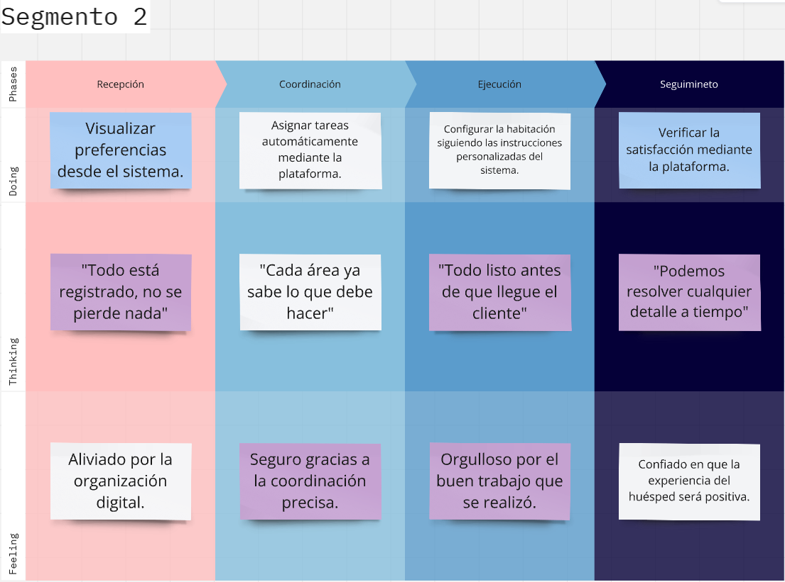  
*Experiencia futura del Personal Administrativo del Hotel*


## 3.2. User Stories

Para el desarrollo de la plataforma *Custom Host, se identificaron **10 épicas fundamentales* que cubren el ciclo completo de interacción entre los usuarios y el sistema: desde el registro y personalización de preferencias hasta la gestión operativa por parte del staff y el mantenimiento de dispositivos IoT. Estas épicas fueron definidas bajo el enfoque de Domain-Driven Design, estableciendo bounded contexts claros que facilitan la modularidad, escalabilidad y trazabilidad del sistema.

Cada épica representa un conjunto de funcionalidades que abordan necesidades específicas de los distintos roles definidos en nuestro *Ubiquitous Language: **Huésped, **Personal Administrativo, **Gerente, **Proveedor de Domótica* y *Desarrollador/Arquitecto del Sistema*.

Las *User Stories* fueron elaboradas aplicando los principios de arquitectura hexagonal, diseño centrado en la experiencia del usuario (UX) y servicios RESTful para comunicación entre capas. Cada historia está compuesta por:

- *Funcional:* Define qué desea lograr el usuario, por qué y cómo se relaciona con su rol.
- *Técnica:* Detalla cómo debe implementarse la funcionalidad, considerando componentes de frontend (Vue), backend (Node.js), o interoperabilidad (API RESTful, base de datos, etc.).

Se usaron criterios como:
- Consistencia semántica
- Trazabilidad
- Claridad de propósito
- Separación de preocupaciones
- Reutilización de código
- Seguridad y privacidad en el flujo de datos


| Epic / Story ID | Título                                      | Descripción                                                                                                                 | Criterios de Aceptación | Relacionado con (Epic ID) |
| --------------- | ------------------------------------------- | --------------------------------------------------------------------------------------------------------------------------- | ----------------------- | ------------------------- |
| EP01            | Crear cuenta                                | Como huésped o personal administrativo, quiero crear una cuenta para acceder a funcionalidades de la aplicación.            |                         |                           |
| EP02            | Configuración de preferencias del huésped   | Como huésped, quiero establecer preferencias de iluminación y temperatura para que la habitación se adapte automáticamente. |                         |                           |
| EP03            | Gestión de solicitudes de servicios         | Como huésped, quiero solicitar servicios desde la aplicación para recibir atención personalizada.                           |                         |                           |
| EP04            | Panel de control                            | Como personal administrativo, quiero un dashboard con información en tiempo real sobre solicitudes.                         |                         |                           |
| EP05            | Gestión de habitaciones                     | Como desarrollador, quiero implementar gestión de habitaciones para asignar espacios según reservas.                        |                         |                           |
| EP06            | Implementación de landing page              | Como huésped, quiero plataforma web para conocer servicios del hotel.                                                       |                         |                           |
| EP07            | Gestión de reservas                         | Como desarrollador, quiero desarrollar gestión de reservas para crear, modificar o cancelar reservas.                       |                         |                           |
| EP08            | Evaluación de la experiencia del huésped    | Como huésped, quiero calificar mi experiencia para compartir opiniones sobre el servicio recibido.                          |                         |                           |
| EP09            | Seguridad y privacidad de datos             | Como desarrollador, quiero implementar seguridad para proteger datos sensibles.                                             |                         |                           |
| EP10            | Soporte en línea para el usuario            | Como huésped, quiero soporte inmediato para resolver mis dudas al instante.                                                 |                         |                           |
| EP11            | Gestión de perfiles                         | Como desarrollador, quiero gestionar perfiles para una experiencia personalizada.                                           |                         |                           |
| EP12            | Notificaciones en tiempo real para huésped  | Como huésped, quiero recibir notificaciones sobre eventos o cambios importantes.                                            |                         |                           |
| EP13            | Notificaciones en tiempo real para personal | Como personal administrativo, quiero notificaciones sobre nuevas solicitudes y eventos críticos.                            |                         |                           |
| EP14            | Asignación de dispositivos IoT a reservas   | Como personal administrativo, quiero asignar dispositivos IoT a reservas según preferencias.                                |                         |                           |
| EP15            | Gestión de datos personales                 | Como usuario autenticado, quiero actualizar mis datos personales para mantener mi perfil al día.                            |                         |                           |
| EP16            | Gestión de roles y permisos                 | Como administrador, quiero asignar roles específicos para controlar acceso.                                                 |                         |                           |
| EP17            | Sitio web estático                          | Como visitante, quiero información del hotel sin autenticarme para decidir reservar.                                        |                         |                           |
| US01 | Visualización del Formulario de Registro               | Como huésped, quiero ver un formulario de registro bien estructurado, para poder registrarme en el sistema.             | **Funcionalidad: Formulario de registro claro**<br><br>**Escenario 1: Mostrar formulario completo**<br>Dado que un nuevo huésped accede a registrarse,<br>Cuando carga el formulario,<br>Entonces el formulario presenta todos los campos requeridos para el registro.<br><br>**Escenario 2: Validar campos obligatorios**<br>Dado que el huésped deja un campo obligatorio vacío,<br>Cuando envía el formulario,<br>Entonces el sistema indica qué campos obligatorios no han sido completados.                                                                                                                                                                                                                                                                                                        | EP01                      |
| US02 | Validación de Datos de Registro                        | Como huésped, quiero que el sistema valide mis datos al registrarme, para evitar errores en mi cuenta.                  | **Funcionalidad: Validación de registro**<br><br>**Escenario 1: Registro exitoso**<br>Dado que todos los datos son válidos y el correo no existe,<br>Cuando envía el formulario,<br>Entonces el sistema crea la cuenta y redirige a confirmación.<br><br>**Escenario 2: Correo ya registrado**<br>Dado que el correo ingresado ya existe,<br>Cuando intenta registrarse,<br>Entonces el sistema informa que el correo ya está registrado y ofrece la opción de recuperación de contraseña.                                                                                                                                                                                                                                                                                                                                  | EP01                      |
| US03 | Configuración de Preferencias de Habitación            | Como huésped, quiero seleccionar mis preferencias de habitación desde la plataforma web, para personalizar mi estadía.  | **Funcionalidad: Gestión de preferencias**<br><br>**Escenario 1: Guardar preferencias**<br>Dado que el huésped elige temperatura y luz,<br>Cuando pulsa “Guardar”,<br>Entonces almacena las preferencias y muestra “Guardado correctamente”.<br><br>**Escenario 2: Restablecer valores**<br>Dado que el huésped solicita restablecer las preferencias,<br>Cuando confirma la acción,<br>Entonces el sistema restablece las preferencias a los valores predeterminados.                                                                                                                                                                                                                                                                                                                                                   | EP02                      |
| US04 | Personalización de Horarios de Servicio                | Como huésped, quiero establecer mis horarios de preferencia para servicios como limpieza o desayuno.                    | **Funcionalidad: Horarios de servicios**<br><br>**Escenario 1: Selección de limpieza**<br>Dado que el huésped selecciona “Limpieza mañana”,<br>Cuando pulsa “Guardar”,<br>Entonces actualiza su preferencia y confirma.<br><br>**Escenario 2: Selección de desayuno**<br>Dado que el huésped elige hora de desayuno,<br>Cuando guarda los cambios,<br>Entonces recibe confirmación de la actualización.                                                                                                                                                                                                                                                                                                                                                                                            | EP02                      |
| US05 | Solicitud de Servicios de Limpieza                     | Como huésped, quiero solicitar un servicio de limpieza desde la plataforma web, para mantener mi habitación limpia.     | **Funcionalidad: Solicitud de limpieza**<br><br>**Escenario 1: En horario**<br>Dado que el huésped está dentro del horario permitido,<br>Cuando selecciona “Solicitar limpieza” y confirma,<br>Entonces envía la petición y muestra “Solicitud recibida”.<br><br>**Escenario 2: Fuera de horario**<br>Dado que solicita fuera del horario,<br>Cuando pulsa “Solicitar limpieza”,<br>Entonces muestra “Servicio no disponible en este horario”.                                                                                                                                                                                                                                                                                                                                                     | EP03                      |
| US06 | Solicitud de Desayuno en la Habitación                 | Como huésped, quiero solicitar un desayuno en mi habitación a través de la plataforma web.                              | **Funcionalidad: Solicitud de desayuno**<br><br>**Escenario 1: Solicitud válida**<br>Dado que el huésped elige “Desayuno en habitación” y hora válida,<br>Cuando confirma,<br>Entonces procesa la solicitud y confirma “Desayuno programado”.<br><br>**Escenario 2: Hora no disponible**<br>Dado que selecciona un horario fuera de rango,<br>Cuando intenta confirmar,<br>Entonces muestra “Horario no disponible para desayuno”.                                                                                                                                                                                                                                                                                                                                                                 | EP03                      |
| US07 | Gestión de Solicitudes Pendientes                      | Como personal administrativo, quiero ver las solicitudes pendientes para atenderlas rápidamente.                        | **Funcionalidad: Listado de solicitudes**<br><br>**Escenario 1: Ver solicitudes ordenadas**<br>Dado que accede a “Solicitudes”,<br>Cuando carga la lista,<br>Entonces muestra solicitudes ordenadas por urgencia y fecha.<br><br>**Escenario 2: Ver detalles**<br>Dado que hay una solicitud nueva,<br>Cuando pulsa “Ver detalles”,<br>Entonces ve la información completa.                                                                                                                                                                                                                                                                                                                                                                                                                        | EP04                      |
| US08 | Modificación de Estado de la Solicitud                 | Como personal administrativo, quiero cambiar el estado de una solicitud, para gestionarla mejor.                        | **Funcionalidad: Cambio de estado**<br><br>**Escenario 1: Marcar como atendida**<br>Dado que la solicitud está “Pendiente”,<br>Cuando selecciona “Atendida”,<br>Entonces cambia el estado y confirma.<br><br>**Escenario 2: Reabrir solicitud**<br>Dado que la solicitud está “Atendida”,<br>Cuando selecciona “Pendiente”,<br>Entonces confirma el cambio a “Pendiente”.                                                                                                                                                                                                                                                                                                                                                                                                                          | EP04                      |
| US09 | Gráfico de Pagos por Mes y Año                         | Como miembro del staff, quiero un gráfico de pagos por mes y año, para analizar el desempeño financiero del hotel.      | **Funcionalidad: Gráfico de pagos mensuales**<br><br>**Escenario 1: Año actual**<br>Dado que carga el dashboard,<br>Cuando se muestra el gráfico,<br>Entonces presenta barras con totales de cada mes del año en curso.<br><br>**Escenario 2: Error de datos**<br>Dado que falla la carga,<br>Cuando intenta renderizar,<br>Entonces muestra “No se pudo cargar el gráfico de pagos”.                                                                                                                                                                                                                                                                                                                                                                                                              | EP04                      |
| US10 | Selección de Año para Pagos                            | Como miembro del staff, quiero seleccionar el año de los pagos, para comparar ingresos de diferentes periodos.          | **Funcionalidad: Filtro de año**<br><br>**Escenario 1: Actualizar gráfico**<br>Dado que cambia el selector a “2024”,<br>Cuando aplica el filtro,<br>Entonces el gráfico se refresca con datos de 2024.<br><br>**Escenario 2: Año sin datos**<br>Dado que selecciona un año sin registros,<br>Cuando aplica,<br>Entonces muestra “No hay datos de pagos para este año”.                                                                                                                                                                                                                                                                                                                                                                                                                             | EP04                      |
| US11 | Gráfico de Pagos Individuales                          | Como miembro del staff, quiero un gráfico de pagos individuales, para analizar tendencias y detectar pagos atípicos.    | **Funcionalidad: Gráfico de transacciones**<br><br>**Escenario 1: Mostrar transacciones**<br>Dado que carga el dashboard,<br>Cuando selecciona la vista de pagos individuales,<br>Entonces muestra un gráfico de líneas con cada transacción.<br><br>**Escenario 2: Sin transacciones**<br>Dado que no hay pagos,<br>Cuando intenta mostrar,<br>Entonces muestra “No hay transacciones para graficar”.                                                                                                                                                                                                                                                                                                                                                                                             | EP04                      |
| US12 | Exportar Informe de Pagos                              | Como miembro del staff, quiero exportar el informe de pagos a CSV o PDF, para compartirlo con contabilidad.             | **Funcionalidad: Exportación**<br><br>**Escenario 1: Exportar CSV**<br>Dado que pulsa “Exportar CSV”,<br>Cuando finaliza la generación,<br>Entonces descarga `pagos.csv` con los datos.<br><br>**Escenario 2: Error al exportar PDF**<br>Dado que pulsa “Exportar PDF”,<br>Cuando falla la generación,<br>Entonces muestra “Error al generar el PDF”.                                                                                                                                                                                                                                                                                                                                                                                                                                              | EP04                      |
| US13 | Tasa de Ocupación del Hotel                            | Como miembro del staff, quiero ver un tablero de ocupación, para conocer el porcentaje de habitaciones ocupadas.        | **Funcionalidad: Dashboard de ocupación**<br><br>**Escenario 1: Mostrar porcentaje**<br>Dado que carga el dashboard,<br>Cuando consulta ocupación,<br>Entonces muestra “75% habitaciones ocupadas” con un gráfico circular.<br><br>**Escenario 2: Filtrar por periodo**<br>Dado que cambia filtro a “Semana” o “Mes”,<br>Cuando aplica,<br>Entonces actualiza porcentaje y gráfico según periodo.                                                                                                                                                                                                                                                                                                                                                                                                  | EP04                      |
| US14 | Filtrar Solicitudes de Servicio                        | Como miembro del staff, quiero filtrar solicitudes por tipo y prioridad, para gestionarlas eficientemente.              | **Funcionalidad: Filtro de solicitudes**<br><br>**Escenario 1: Filtrar por tipo**<br>Dado que selecciona “Limpieza”,<br>Cuando aplica el filtro,<br>Entonces muestra sólo solicitudes de limpieza.<br><br>**Escenario 2: Filtrar por prioridad**<br>Dado que elige “Urgente”,<br>Cuando aplica,<br>Entonces muestra sólo solicitudes urgentes.<br><br>**Escenario 3: Sin resultados**<br>Dado que no hay coincidencias,<br>Entonces muestra “No hay solicitudes para estos criterios”.                                                                                                                                                                                                                                                                                                             | EP04                      |
| US15 | Notificación de Solicitud Atendida                     | Como huésped, quiero recibir alertas cuando mi solicitud se atienda, para estar informado.                              | **Funcionalidad: Notificación al huésped**<br><br>**Escenario 1: Notificar atención**<br>Dado que el personal marca como “Atendida”,<br>Cuando cambia el estado,<br>Entonces el huésped recibe notificación push y en la app.<br><br>**Escenario 2: Error al notificar**<br>Dado que falla la notificación,<br>Cuando no se envía,<br>Entonces registra el error y reintenta según política.                                                                                                                                                                                                                                                                                                                                                                                                       | EP05                      |
| US16 | Alerta de Emergencia en el Hotel                       | Como personal, quiero recibir alertas inmediatas sobre emergencias, para reaccionar rápido.                             | **Funcionalidad: Alertas críticas**<br><br>**Escenario 1: Alerta real**<br>Dado que se detecta incendio,<br>Cuando el sistema emite la alerta,<br>Entonces todo el personal recibe notificación urgente.<br><br>**Escenario 2: Simulación**<br>Dado que se activa un test,<br>Cuando lanza la alerta,<br>Entonces indica “Simulación de emergencia” y no dispara planes reales.                                                                                                                                                                                                                                                                                                                                                                                                                    | EP05                      |
| US17 | Lista de Habitaciones Disponibles                      | Como miembro del staff, quiero ver una lista de habitaciones disponibles, para saber cuáles puedo asignar o limpiar.    | **Funcionalidad: Listado de habitaciones**<br><br>**Escenario 1: Mostrar disponibles**<br>Dado que accede a “Habitaciones”,<br>Cuando carga la lista,<br>Entonces muestra sólo las con estado “Disponible”.<br><br>**Escenario 2: Sin libres**<br>Dado que no hay libres,<br>Cuando carga la lista,<br>Entonces muestra “No hay habitaciones disponibles”.                                                                                                                                                                                                                                                                                                                                                                                                                                         | EP07                      |
| US18 | Filtrar Habitaciones por Estado                        | Como miembro del staff, quiero filtrar la lista de habitaciones por estado, para enfocarme en cada categoría.           | **Funcionalidad: Filtro de habitaciones**<br><br>**Escenario 1: Filtrar “Ocupado”**<br>Dado que selecciona “Ocupado”,<br>Cuando aplica,<br>Entonces muestra sólo ocupadas.<br><br>**Escenario 2: Filtrar “Mantenimiento”**<br>Dado que elige “Mantenimiento”,<br>Cuando aplica,<br>Entonces muestra sólo en mantenimiento.                                                                                                                                                                                                                                                                                                                                                                                                                                                                         | EP07                      |
| US19 | Historial de Asignación de Habitaciones                | Como miembro del staff, quiero ver el historial de asignación de habitaciones por huésped, para rastrear cambios.       | **Funcionalidad: Historial de asignaciones**<br><br>**Escenario 1: Mostrar historial**<br>Dado que consulta una habitación,<br>Cuando pide su historial,<br>Entonces muestra fechas y huéspedes anteriores.<br><br>**Escenario 2: Sin historial**<br>Dado que no hay historial,<br>Cuando consulta,<br>Entonces muestra “No hay historial de asignación”.                                                                                                                                                                                                                                                                                                                                                                                                                                          | EP07                      |
| US20 | Visualización de Información de Servicios              | Como visitante, quiero ver los servicios que ofrece el hotel, para evaluar antes de reservar.                           | **Funcionalidad: Listado de servicios**<br><br>**Escenario:**<br>Dado que accede a la landing,<br>Cuando navega a “Servicios”,<br>Entonces muestra un listado claro de los principales servicios.                                                                                                                                                                                                                                                                                                                                                                                                                                                                                                                                                                                                  | EP08                      |
| US21 | Acceso a Información de Contacto (estática)            | Como visitante, quiero acceder fácilmente a los datos de contacto del hotel, para comunicarme si tengo dudas.           | **Funcionalidad: Sección estática de contacto**<br><br>**Escenario 1:**<br>Dado que llega al pie de página,<br>Cuando ve la sección,<br>Entonces muestra dirección, teléfono, correo y redes.<br><br>**Escenario 2:**<br>Dado que navega por la landing,<br>Cuando hace scroll,<br>Entonces la sección sigue accesible sin recargar.                                                                                                                                                                                                                                                                                                                                                                                                                                                               | EP08                      |
| US22 | Envío de Consultas mediante Formulario Emergente       | Como visitante, quiero enviar consultas rápidas mediante un formulario emergente, para no abandonar la página.          | **Funcionalidad: Formulario emergente**<br><br>**Escenario 1:**<br>Dado que hace clic en el ícono de contacto,<br>Cuando aparece el modal,<br>Entonces puede completar y enviar su mensaje.<br><br>**Escenario 2:**<br>Dado que completa todos los campos,<br>Cuando pulsa “Enviar”,<br>Entonces confirma recepción y cierra el modal.                                                                                                                                                                                                                                                                                                                                                                                                                                                             | EP08                      |
| US23 | Acceso a Testimonios de Huéspedes                      | Como visitante, quiero leer opiniones de otros huéspedes, para ganar confianza al reservar.                             | **Funcionalidad: Paginación de testimonios**<br><br>**Escenario 1:**<br>Dado que carga la sección de testimonios,<br>Cuando se muestra,<br>Entonces presenta los primeros 5 con nombre, fecha y comentario.<br><br>**Escenario 2:**<br>Dado que hay más,<br>Cuando pulsa “Ver más”,<br>Entonces carga dinámicamente sin recargar la página.                                                                                                                                                                                                                                                                                                                                                                                                                                                        | EP08                      |
| US24 | Acceso Rápido al Formulario de Reserva                 | Como visitante, quiero encontrar un botón fijo para reservar, para iniciar el proceso de forma rápida.                  | **Funcionalidad: Botón fijo “Reservar ahora”**<br><br>**Escenario:**<br>Dado que navega por la landing,<br>Cuando llega a servicios o pie de página,<br>Entonces ve un botón fijo que permanece visible al hacer scroll y redirige al formulario.                                                                                                                                                                                                                                                                                                                                                                                                                                                                                                                                                  | EP08                      |
| US25 | Sección "Sobre Nosotros"                               | Como visitante, quiero conocer la historia y valores del hotel, para conectar con la empresa.                           | **Funcionalidad: Presentación “Sobre Nosotros”**<br><br>**Escenario 1:**<br>Dado que hace scroll hasta esa sección,<br>Cuando ve el contenido,<br>Entonces muestra texto con historia y fotos del equipo.<br><br>**Escenario 2:**<br>Dado que hay un video,<br>Cuando hace clic en él,<br>Entonces reproduce inline sin redirigir.                                                                                                                                                                                                                                                                                                                                                                                                                                                                 | EP08                      |
| US26 | Ver Lista de Reservas Activas                          | Como huésped, quiero ver la lista de mis reservas activas, para gestionar mis estancias.                                | **Funcionalidad: Listado de reservas**<br><br>**Escenario 1:**<br>Dado que tiene reservas,<br>Cuando accede a “Mis Reservas”,<br>Entonces muestra cada reserva activa (fecha, habitación, estado).<br><br>**Escenario 2:**<br>Dado que no hay reservas,<br>Cuando accede,<br>Entonces muestra “No tienes reservas activas en este momento”.                                                                                                                                                                                                                                                                                                                                                                                                                                                        | EP09                      |
| US27 | Crear Nueva Reserva desde la Página Principal          | Como huésped, quiero crear una reserva desde la página principal, para agilizar el proceso.                             | **Funcionalidad: Atajo “Nueva Reserva”**<br><br>**Escenario 1:**<br>Dado que está en la página principal,<br>Cuando pulsa “Nueva Reserva”,<br>Entonces abre el formulario de reserva.<br><br>**Escenario 2:**<br>Dado que completa datos inválidos,<br>Cuando confirma,<br>Entonces resalta errores y no envía hasta corregirlos.                                                                                                                                                                                                                                                                                                                                                                                                                                                                  | EP09                      |
| US28 | Mensaje Claro si No Hay Reservas o Notificaciones      | Como huésped, quiero un mensaje claro si no tengo datos, para saber mi estado actual.                                   | **Funcionalidad: Mensaje de estado**<br><br>**Escenario 1:**<br>Dado que no hay reservas,<br>Cuando accede a “Mis Reservas”,<br>Entonces muestra “No tienes reservas activas en este momento”.<br><br>**Escenario 2:**<br>Dado que no hay notificaciones,<br>Cuando accede a “Notificaciones”,<br>Entonces muestra “No tienes avisos nuevos”.                                                                                                                                                                                                                                                                                                                                                                                                                                                      | EP09                      |
| US29 | Enviar Evaluación de Estadía                           | Como huésped, quiero calificar mi experiencia al final de la estadía, para dar retroalimentación al hotel.              | **Funcionalidad: Evaluación post-estadía**<br><br>**Escenario 1:**<br>Dado que la estancia ha terminado,<br>Cuando completa estrellas y comentarios y envía,<br>Entonces guarda la evaluación y muestra “Gracias por tu opinión”.<br><br>**Escenario 2:**<br>Dado que faltan datos,<br>Cuando intenta enviar,<br>Entonces impide el envío y resalta los campos faltantes.                                                                                                                                                                                                                                                                                                                                                                                                                          | EP10                      |
| US30 | Ver Historial de Evaluaciones                          | Como personal administrativo, quiero consultar las evaluaciones recibidas, para mejorar la calidad del servicio.        | **Funcionalidad: Consulta de evaluaciones**<br><br>**Escenario 1:**<br>Dado que selecciona un rango de fechas,<br>Cuando aplica el filtro,<br>Entonces muestra evaluaciones de ese periodo.<br><br>**Escenario 2:**<br>Dado que no hay evaluaciones,<br>Cuando aplica el filtro,<br>Entonces muestra “No se encontraron evaluaciones en este periodo”.                                                                                                                                                                                                                                                                                                                                                                                                                                             | EP10                      |
| US31 | Gráfico de Calificaciones de Huéspedes                 | Como miembro del staff, quiero ver un gráfico de calificaciones, para analizar la satisfacción general.                 | **Funcionalidad: Gráfico de valoraciones**<br><br>**Escenario 1:**<br>Dado que carga el dashboard,<br>Cuando accede a “Satisfacción”,<br>Entonces muestra un gráfico de líneas con el promedio mensual.<br><br>**Escenario 2:**<br>Dado que no hay valoraciones,<br>Cuando intenta mostrar,<br>Entonces muestra “No hay datos de calificaciones”.                                                                                                                                                                                                                                                                                                                                                                                                                                                  | EP10                      |
| US32 | Cambiar Idioma de la Interfaz                          | Como huésped internacional, quiero cambiar el idioma de la interfaz, para comprender mejor la plataforma web.           | **Funcionalidad: Cambio de idioma de la interfaz**<br><br>**Escenario 1: Actualizar contenido tras selección**<br>Dado que el visitante está en cualquier página de la plataforma,<br>Cuando selecciona un idioma del selector de idioma,<br>Entonces todo el contenido de la interfaz se actualiza al idioma seleccionado.<br><br>**Escenario 2: Mantener idioma al navegar**<br>Dado que el usuario ya seleccionó un idioma,<br>Cuando navega a otra sección o pantalla,<br>Entonces la plataforma mantiene la interfaz en el idioma elegido.<br><br>**Escenario 3: Persistir idioma entre sesiones**<br>Dado que el usuario seleccionó un idioma en una sesión anterior,<br>Cuando ingresa nuevamente a la aplicación,<br>Entonces la interfaz se carga automáticamente en su idioma preferido. | EP11                      |
| US33 | Recordar Idioma Seleccionado                           | Como huésped, quiero que la plataforma recuerde mi idioma preferido, para no tener que cambiarlo cada vez.              | **Funcionalidad: Persistencia de idioma**<br><br>**Escenario 1: Sesión activa**<br>Dado que el huésped configuró su idioma en su perfil,<br>Cuando inicia sesión nuevamente,<br>Entonces la interfaz se muestra en ese idioma automáticamente.<br><br>**Escenario 2: Manejo de error al cargar**<br>Dado que falla la carga de las preferencias de idioma,<br>Cuando inicia sesión,<br>Entonces la interfaz se muestra en el idioma predeterminado y el error se registra.                                                                                                                                                                                                                                                                                                                         | EP11                      |
| US34 | Iniciar Chat con Soporte                               | Como huésped, quiero iniciar un chat con soporte, para resolver dudas rápidamente.                                      | **Funcionalidad: Chat en tiempo real**<br><br>**Escenario 1: Agente disponible**<br>Dado que hay agentes conectados,<br>Cuando el huésped hace clic en “Iniciar chat”,<br>Entonces se abre la ventana de chat y se conecta con un agente disponible.<br><br>**Escenario 2: Sin agentes disponibles**<br>Dado que no hay agentes en línea,<br>Cuando intenta iniciar el chat,<br>Entonces la plataforma muestra “No hay agentes disponibles, por favor deje un mensaje” y presenta formulario de contacto.                                                                                                                                                                                                                                                                                          | EP13                      |
| US35 | Consultar Preguntas Frecuentes                         | Como huésped, quiero revisar preguntas frecuentes, para resolver dudas sin contactar soporte.                           | **Funcionalidad: Búsqueda en FAQ**<br><br>**Escenario 1: Encontrar artículos**<br>Dado que el huésped ingresa una consulta en la barra de búsqueda de FAQ,<br>Cuando pulsa “Buscar”,<br>Entonces se muestran artículos relevantes a la consulta.<br><br>**Escenario 2: Sin resultados exactos**<br>Dado que no se encuentran coincidencias exactas,<br>Cuando ejecuta la búsqueda,<br>Entonces la plataforma sugiere preguntas relacionadas y muestra “¿Te refieres a…?”.                                                                                                                                                                                                                                                                                                                          | EP13                      |
| US36 | Saludo Personalizado de Huésped                        | Como huésped, quiero ver un saludo personalizado al ingresar, para sentirme bienvenido en la plataforma.                | **Funcionalidad: Saludo personalizado**<br><br>**Escenario 1: Mostrar nombre**<br>Dado que el huésped inicia sesión con su cuenta,<br>Cuando carga la pantalla principal,<br>Entonces muestra “¡Bienvenido, \[Nombre]!” en la cabecera.<br><br>**Escenario 2: Fallback genérico**<br>Dado que no se pudo recuperar el nombre del usuario,<br>Cuando carga la pantalla principal,<br>Entonces muestra “¡Bienvenido de nuevo!” en la cabecera.                                                                                                                                                                                                                                                                                                                                                       | EP14                      |
| US37 | Abrir formulario modal para nuevo miembro del personal | Como administrador, quiero abrir un formulario modal para agregar un nuevo miembro, para gestionar el equipo del hotel. | **Funcionalidad: Modal creación de personal**<br><br>**Escenario 1: Desplegar formulario**<br>Dado que el administrador está en la sección de gestión de equipo,<br>Cuando solicita agregar un nuevo miembro,<br>Entonces el sistema presenta el formulario para ingresar los datos del nuevo miembro<br><br>**Escenario 2: Enfoque inicial**<br>Dado que el formulario de registro de personal se muestra,<br>Cuando el formulario está disponible para su uso,<br>Entonces el primer campo del formulario está listo para recibir la entrada de datos.                                                                                                                                                                                                                                                                                                                                             | EP14                      |
| US38 | Ingresar datos completos del nuevo personal            | Como administrador, quiero ingresar nombre, apellido, teléfono, email, departamento y contraseña del nuevo personal.    | **Funcionalidad: Campos del formulario**<br><br>**Escenario 1: Visibilidad de campos**<br>Dado que el modal de creación está abierto,<br>Cuando se muestra el formulario,<br>Entonces aparecen campos para Nombre, Apellido, Teléfono, Email, Departamento (select) y Contraseña.<br><br>**Escenario 2: Registro de entrada**<br>Dado que el administrador ingresa datos en los campos,<br>Cuando escribe texto o selecciona opciones,<br>Entonces los campos muestran correctamente los valores ingresados.                                                                                                                                                                                                                                                                                       | EP14                      |
| US39 | Seleccionar departamento desde lista                   | Como administrador, quiero seleccionar el departamento desde una lista, para asegurar la asignación de roles.           | **Funcionalidad: Selector de departamento**<br><br>**Escenario 1: Mostrar opciones**<br>Dado que el administrador hace clic en el campo “Departamento”,<br>Cuando se despliega el dropdown,<br>Entonces se listan todos los departamentos disponibles.<br><br>**Escenario 2: Relleno del campo**<br>Dado que el administrador selecciona un departamento del dropdown,<br>Cuando hace clic en la opción “Recepción”,<br>Entonces el campo se rellena con “Recepción”.                                                                                                                                                                                                                                                                                                                              | EP14                      |
| US40 | Alertar si faltan campos obligatorios                  | Como administrador, quiero recibir una alerta si guardo con campos vacíos, para evitar registros incompletos.           | **Funcionalidad: Validación de formulario**<br><br>**Escenario 1: Campos faltantes**<br>Dado que uno o más campos obligatorios están vacíos,<br>Cuando el administrador pulsa “Guardar”,<br>Entonces el sistema muestra “Por favor, complete todos los campos obligatorios” y no cierra el modal.<br><br>**Escenario 2: Campos completos**<br>Dado que todos los campos obligatorios están llenos,<br>Cuando pulsa “Guardar”,<br>Entonces el modal se cierra y procede con el registro.                                                                                                                                                                                                                                                                                                            | EP14                      |
| US41 | Cancelar registro sin guardar cambios                  | Como administrador, quiero cancelar el registro en cualquier momento, para cerrar el formulario sin guardar.            | **Funcionalidad: Cancelar formulario**<br><br>**Escenario 1: Cerrar modal**<br>Dado que el administrador pulsa “Cancelar”,<br>Cuando confirma la acción,<br>Entonces el modal se cierra sin guardar datos.<br><br>**Escenario 2: Restablecer estado**<br>Dado que el modal se vuelve a abrir después de cerrarse,<br>Cuando se carga,<br>Entonces todos los campos están vacíos.                                                                                                                                                                                                                                                                                                                                                                                                                   | EP14                      |
| US42 | Validar campos obligatorios en formulario de personal  | Como desarrollador, quiero validar que los campos obligatorios estén completos, para evitar registros incompletos.      | **Funcionalidad: Validación de campos obligatorios**<br><br>**Escenario 1: Faltan datos**<br>Dado que un campo obligatorio está vacío,<br>Cuando pulsa “Guardar”,<br>Entonces no se emite el evento `save` y aparece “Por favor, complete los campos obligatorios”.<br><br>**Escenario 2: Todos los datos completos**<br>Dado que todos los campos obligatorios tienen datos válidos,<br>Cuando pulsa “Guardar”,<br>Entonces se emite el evento `save` con los datos del formulario.                                                                                                                                                                                                                                                                                                               | EP14                      |
| US43 | Emitir eventos personalizados al guardar o cancelar    | Como desarrollador, quiero emitir eventos personalizados, para que el padre controle visibilidad y flujo de datos.      | **Funcionalidad: Emisión de eventos**<br><br>**Escenario 1: Guardar válido**<br>Dado que la validación es exitosa,<br>Cuando pulsa “Guardar”,<br>Entonces emite `save` con los datos.<br><br>**Escenario 2: Cancelar o cerrar modal**<br>Dado que pulsa “Cancelar” o cierra el modal,<br>Cuando la acción se ejecuta,<br>Entonces emite `update:visible` con `false`.                                                                                                                                                                                                                                                                                                                                                                                                                              | EP14                      |
| US44 | Desacoplar select de departamentos mediante prop       | Como desarrollador, quiero recibir departamentos como prop, para desacoplar y facilitar pruebas.                        | **Funcionalidad: Recepción de prop**<br><br>**Escenario 1: Prop con datos**<br>Dado que la prop `departments` contiene una lista de nombres,<br>Cuando el componente se renderiza,<br>Entonces el select muestra esas opciones.<br><br>**Escenario 2: Prop vacía o null**<br>Dado que la prop `departments` está vacía o es `null`,<br>Cuando renderiza el componente,<br>Entonces el select aparece vacío y deshabilitado.                                                                                                                                                                                                                                                                                                                                                                        | EP14                      |
| US45 | Estructurar formulario con clases CSS responsivas      | Como desarrollador, quiero usar filas y columnas con clases CSS, para asegurar una interfaz adaptable.                  | **Funcionalidad: Layout con grid**<br><br>**Escenario 1: Pantalla ancha (>768px)**<br>Dado que la pantalla tiene ancho mayor a 768px,<br>Cuando se muestra el formulario,<br>Entonces los campos se distribuyen en dos columnas para facilitar la visualización.<br><br>**Escenario 2: Pantalla móvil (<768px)**<br>Dado que la pantalla es menor a 768px,<br>Cuando se muestra el formulario,<br>Entonces los campos se presentan en una sola columna para facilitar la visualización.                                                                                                                                                                                                                                                                                                                              | EP14                      |
| US46 | Facilitar extensión futura del formulario              | Como desarrollador, quiero que el formulario sea extensible, para soportar nuevos campos en el futuro.                  | **Funcionalidad: Arquitectura modular**<br><br>**Escenario 1: Añadir nuevo campo**<br>Dado que el desarrollador inserta un nuevo `<FormField>`,<br>Cuando se renderiza el formulario,<br>Entonces el diseño y las validaciones existentes funcionan sin romperse.<br><br>**Escenario 2: Documentación clara**<br>Dado que un desarrollador consulta la documentación,<br>Cuando lee comentarios y guía en el código,<br>Entonces encuentra instrucciones claras para agregar campos.                                                                                                                                                                                                                                                                                                               | EP14                      |
| US47 | Manejo de estado de carga en registro                  | Como desarrollador, quiero manejar el estado de carga durante el registro, para mostrar feedback visual.                | **Funcionalidad: Indicador de carga**<br><br>**Escenario 1: Inicio de carga**<br>Dado que pulsa “Guardar”,<br>Cuando se envía la solicitud al servidor,<br>Entonces `loading = true`, el botón se deshabilita y aparece spinner.<br><br>**Escenario 2: Fin de carga**<br>Dado que el servidor responde (éxito o error),<br>Cuando llega la respuesta,<br>Entonces `loading = false`, el spinner desaparece y el botón se habilita.<br><br>**Escenario 3: Prevención de reenvío**<br>Dado que `loading = true`,<br>Cuando el usuario intenta pulsar “Guardar” de nuevo,<br>Entonces no se envía una nueva petición.                                                                                                                                                                                 | EP14                      |
| US48 | Mostrar mensajes de error generales en registro        | Como desarrollador, quiero mostrar mensajes de error generales si el registro falla, para informar al usuario.          | **Funcionalidad: Error en registro**<br><br>**Escenario 1: Error 500 o de red**<br>Dado que la petición retorna un error 500 o de red,<br>Cuando procesa la respuesta,<br>Entonces muestra “Ha ocurrido un error. Intenta de nuevo más tarde.” en la parte superior del modal.<br><br>**Escenario 2: Error general de API**<br>Dado que la API devuelve un mensaje de error (ej. “Usuario ya existe”),<br>Cuando procesa la respuesta,<br>Entonces muestra ese mensaje en un banner de error dentro del modal.<br><br>**Escenario 3: Limpieza del mensaje**<br>Dado que el usuario modifica cualquier campo del formulario,<br>Cuando cambia el valor de un input,<br>Entonces el mensaje de error general se oculta automáticamente.                                                              | EP14                      |
| US49 | Notificaciones en Tiempo Real para Huésped             | Como huésped, quiero recibir notificaciones en tiempo real sobre eventos importantes o cambios de estado.               | **Funcionalidad: Notificaciones push al huésped**<br><br>**Escenario 1: Evento de promoción**<br>Dado que se crea una nueva promoción,<br>Cuando el huésped está conectado a la aplicación,<br>Entonces recibe una notificación push con los detalles de la oferta.<br><br>**Escenario 2: Cambio de estado de solicitud**<br>Dado que su solicitud cambia a “En proceso” o “Completada”,<br>Cuando el sistema actualiza el estado,<br>Entonces recibe alerta inmediata en su dispositivo.                                                                                                                                                                                                                                                                                                          | EP15                      |
| US50 | Notificaciones en Tiempo Real para Personal            | Como personal administrativo, quiero recibir notificaciones en tiempo real sobre nuevas solicitudes y eventos críticos. | **Funcionalidad: Notificaciones push al personal**<br><br>**Escenario 1: Nueva solicitud recibida**<br>Dado que un huésped envía una solicitud,<br>Cuando llega la petición al CRM,<br>Entonces el personal recibe una notificación inmediata.<br><br>**Escenario 2: Emergencia crítica**<br>Dado que se detecta una emergencia (ej. incendio),<br>Cuando el sistema emite la alerta,<br>Entonces todo el personal recibe una notificación urgente.                                                                                                                                                                                                                                                                                                                                                | EP16                      |
| US51 | Lista de Dispositivos IoT en Mantenimiento o Inactivos | Como miembro del staff, quiero ver los dispositivos IoT en mantenimiento o inactivos, para dar seguimiento técnico.     | **Funcionalidad: Listado de IoT en estado crítico**<br><br>**Escenario 1:**<br>Dado que accede a la sección de “Dispositivos IoT”,<br>Cuando filtra por estado “Inactivo” o “Mantenimiento”,<br>Entonces muestra sólo los dispositivos correspondientes.<br><br>**Escenario 2:**<br>Dado que no hay dispositivos con esos estados,<br>Cuando aplica el filtro,<br>Entonces muestra “No hay dispositivos en mantenimiento o inactivos”.                                                                                                                                                                                                                                                                                                                                                             | EP17                      |
| US52 | Lista de Tareas Pendientes de Mantenimiento IoT        | Como miembro del staff, quiero ver las tareas de mantenimiento IoT asignadas, para priorizar intervenciones.            | **Funcionalidad: Listado de tareas IoT**<br><br>**Escenario 1:**<br>Dado que accede a “Mantenimiento IoT”,<br>Cuando carga la lista,<br>Entonces muestra sólo las tareas abiertas.<br><br>**Escenario 2:**<br>Dado que no hay tareas asignadas,<br>Cuando carga la lista,<br>Entonces muestra “No hay tareas de mantenimiento pendientes”.                                                                                                                                                                                                                                                                                                                                                                                                                                                         | EP17                      |
| US53 | Actualizar Estado de Dispositivo IoT                   | Como miembro del staff, quiero marcar un dispositivo IoT como “Activo” o “En mantenimiento”.                            | **Funcionalidad: Cambio de estado IoT**<br><br>**Escenario 1: Marcar como Activo**<br>Dado que selecciona un dispositivo inactivo,<br>Cuando elige “Marcar como Activo” y confirma,<br>Entonces actualiza el estado a “Activo” y muestra “Estado actualizado”.<br><br>**Escenario 2: Marcar como En mantenimiento**<br>Dado que selecciona un dispositivo activo,<br>Cuando elige “Marcar como En mantenimiento” y confirma,<br>Entonces actualiza el estado a “Mantenimiento” y muestra “En mantenimiento”.                                                                                                                                                                                                                                                                                       | EP17                      |
| US54 | Gestión de Datos Personales                            | Como usuario autenticado, quiero actualizar mis datos personales, para mantener mi perfil al día.                       | **Funcionalidad: Actualización de perfil de usuario**<br><br>**Escenario 1: Validación y guardado**<br>Dado que el usuario edita su nombre o correo,<br>Cuando pulsa “Guardar cambios”,<br>Entonces actualiza la información en la base de datos y muestra confirmación.<br><br>**Escenario 2: Correo duplicado**<br>Dado que intenta usar un correo ya existente,<br>Cuando pulsa “Guardar cambios”,<br>Entonces el sistema rechaza la acción y muestra “El correo ya está en uso”.                                                                                                                                                                                                                                                                                                               | EP18                      |
| US55 | Gestión de Roles y Permisos                            | Como administrador, quiero asignar y gestionar roles y permisos de usuarios, para controlar accesos y funcionalidades.  | **Funcionalidad: Administración de roles**<br><br>**Escenario 1: Asignar rol**<br>Dado que un administrador selecciona un usuario y un rol,<br>Cuando confirma la asignación,<br>Entonces guarda el rol en la base de datos y aplica los permisos.<br><br>**Escenario 2: Revocar rol**<br>Dado que un administrador revoca un rol a un usuario,<br>Cuando confirma la acción,<br>Entonces bloquea el acceso a las áreas correspondientes y registra el cambio.                                                                                                                                                                                                                                                                                                                                     | EP19                      |


## 3.3. Impact Mapping

El *Impact Mapping* es una técnica estratégica utilizada para alinear los objetivos del negocio con las decisiones técnicas y funcionales del producto. Esta metodología permite visualizar de forma clara y estructurada cómo cada funcionalidad del sistema puede generar un impacto específico en los usuarios y, por ende, en los resultados del proyecto.

En el caso de *Custom Host, el Impact Mapping se desarrolló utilizando la herramienta colaborativa **Miro, siguiendo buenas prácticas del diseño centrado en el usuario y la metodología Lean UX. Este mapa ayudó a conectar los objetivos del negocio con los actores clave del sistema: **Huéspedes Potenciales, **Personal Administrativo del Hotel* y *Proveedores de Domótica*.

### Estructura del Impact Mapping

Cada mapa fue elaborado considerando los siguientes elementos:

1. *Business Goals SMART:*  
   Objetivos claros, medibles y alcanzables definidos como parte de la estrategia de negocio. Ejemplo: "Aumentar la satisfacción del huésped en un 20% mediante personalización anticipada".

2. *Actors / Personas clave:*  
   Usuarios objetivo identificados durante las fases de investigación y empatía:
   - Huéspedes tecnológicos.
   - Personal operativo y administrativo del hotel.
   - Proveedores de dispositivos IoT.

3. *Impacts esperados:*  
   Cambios en el comportamiento o percepción del usuario que deben ocurrir para lograr los objetivos del negocio. Por ejemplo:
   - Que el huésped configure su habitación antes de llegar.
   - Que el staff gestione solicitudes más rápido gracias a una interfaz centralizada.
   - Que los proveedores monitoreen sus dispositivos y realicen mantenimiento proactivo.

4. *Deliverables funcionales:*  
   Funcionalidades específicas del sistema que permiten habilitar dichos impactos:
   - App móvil con personalización anticipada.
   - Dashboard de gestión de solicitudes.
   - Sistema de alertas proactivas para dispositivos fallando.

### Aplicación en Custom Host

Este Impact Mapping sirvió como puente entre la visión del producto y su implementación técnica, asegurando que cada historia de usuario y cada entrega técnica tenga un propósito claro dentro del modelo de negocio.

Los dos mapas principales fueron desarrollados para:
- *Huéspedes*: Mostrando cómo la tecnología mejora la experiencia del cliente.
- *Personal del Hotel*: Visualizando cómo Custom Host optimiza la gestión operativa.

> 📎 *Anexo:* Diagramas completos del Impact Mapping disponibles en las imágenes adjuntas.
> 📄 [Accede aquí para ver los impact mapping ](https://drive.google.com/drive/folders/1iMtzq4cDapnSmC3aA4UNHzT_x6aRuzaR?usp=sharing)


  
Mapa de impacto orientado al Huésped

  
Mapa de impacto orientado al Personal Administrativo

## 3.4. Product Backlog.

Link Trello: https://trello.com/invite/b/6807e09feff6aab74b684127/ATTI98b87d9f903a3b4af1efa73604221d6aE9912258/customhost-product-backlog

| Id | StoryID | Title                                                  | Description                                                                                                             | Story Points |
| -- | ------- | ------------------------------------------------------ | ----------------------------------------------------------------------------------------------------------------------- | ------------ |
| 1  | US01    | Visualización del Formulario de Registro               | Como huésped, quiero ver un formulario de registro bien estructurado, para poder registrarme en el sistema.             | 2            |
| 2  | US02    | Validación de Datos de Registro                        | Como huésped, quiero que el sistema valide mis datos al registrarme, para evitar errores en mi cuenta.                  | 3            |
| 3  | US03    | Configuración de Preferencias de Habitación            | Como huésped, quiero seleccionar mis preferencias de habitación desde la plataforma web, para personalizar mi estadía.  | 3            |
| 4  | US04    | Personalización de Horarios de Servicio                | Como huésped, quiero establecer mis horarios de preferencia para servicios como limpieza o desayuno.                    | 2            |
| 5  | US05    | Solicitud de Servicios de Limpieza                     | Como huésped, quiero solicitar un servicio de limpieza desde la plataforma web, para mantener mi habitación limpia.     | 3            |
| 6  | US06    | Solicitud de Desayuno en la Habitación                 | Como huésped, quiero solicitar un desayuno en mi habitación a través de la plataforma web.                              | 3            |
| 7  | US07    | Gestión de Solicitudes Pendientes                      | Como personal administrativo, quiero ver las solicitudes pendientes para atenderlas rápidamente.                        | 3            |
| 8  | US08    | Modificación de Estado de la Solicitud                 | Como personal administrativo, quiero cambiar el estado de una solicitud, para gestionarla mejor.                        | 3            |
| 9  | US09    | Gráfico de Pagos por Mes y Año                         | Como miembro del staff, quiero un gráfico de pagos por mes y año, para analizar el desempeño financiero del hotel.      | 5            |
| 10 | US10    | Selección de Año para Pagos                            | Como miembro del staff, quiero seleccionar el año de los pagos, para comparar ingresos de diferentes periodos.          | 3            |
| 11 | US11    | Gráfico de Pagos Individuales                          | Como miembro del staff, quiero un gráfico de pagos individuales, para detectar tendencias y pagos atípicos.             | 5            |
| 12 | US12    | Exportar Informe de Pagos                              | Como miembro del staff, quiero exportar el informe de pagos a CSV o PDF, para compartirlo con contabilidad.             | 5            |
| 13 | US13    | Tasa de Ocupación del Hotel                            | Como miembro del staff, quiero ver un tablero de ocupación, para conocer el porcentaje de habitaciones ocupadas.        | 5            |
| 14 | US14    | Filtrar Solicitudes de Servicio                        | Como miembro del staff, quiero filtrar solicitudes por tipo y prioridad, para gestionarlas eficientemente.              | 3            |
| 15 | US15    | Notificación de Solicitud Atendida                     | Como huésped, quiero recibir alertas cuando mi solicitud se atienda, para estar informado.                              | 3            |
| 16 | US16    | Alerta de Emergencia en el Hotel                       | Como personal, quiero recibir alertas inmediatas sobre emergencias, para reaccionar rápido.                             | 3            |
| 17 | US17    | Lista de Habitaciones Disponibles                      | Como miembro del staff, quiero ver una lista de habitaciones disponibles, para saber cuáles puedo asignar o limpiar.    | 3            |
| 18 | US18    | Filtrar Habitaciones por Estado                        | Como miembro del staff, quiero filtrar la lista de habitaciones por estado, para enfocarme en cada categoría.           | 3            |
| 19 | US19    | Historial de Asignación de Habitaciones                | Como miembro del staff, quiero ver el historial de asignación de habitaciones por huésped, para rastrear cambios.       | 5            |
| 20 | US20    | Visualización de Información de Servicios              | Como visitante, quiero ver los servicios que ofrece el hotel, para evaluar antes de reservar.                           | 2            |
| 21 | US21    | Acceso a Información de Contacto (estática)            | Como visitante, quiero acceder fácilmente a los datos de contacto del hotel, para comunicarme si tengo dudas.           | 2            |
| 22 | US22    | Envío de Consultas mediante Formulario Emergente       | Como visitante, quiero enviar consultas rápidas mediante un formulario emergente, para no abandonar la página.          | 2            |
| 23 | US23    | Acceso a Testimonios de Huéspedes                      | Como visitante, quiero leer opiniones de otros huéspedes, para ganar confianza al reservar.                             | 3            |
| 24 | US24    | Acceso Rápido al Formulario de Reserva                 | Como visitante, quiero encontrar un botón fijo para reservar, para iniciar el proceso de forma rápida.                  | 2            |
| 25 | US25    | Sección “Sobre Nosotros”                               | Como visitante, quiero conocer la historia y valores del hotel, para conectar con la empresa.                           | 2            |
| 26 | US26    | Ver Lista de Reservas Activas                          | Como huésped, quiero ver la lista de mis reservas activas, para gestionar mis estancias.                                | 3            |
| 27 | US27    | Crear Nueva Reserva desde la Página Principal          | Como huésped, quiero crear una reserva desde la página principal, para agilizar el proceso.                             | 3            |
| 28 | US28    | Mensaje Claro si No Hay Reservas o Notificaciones      | Como huésped, quiero un mensaje claro si no tengo datos, para saber mi estado actual.                                   | 1            |
| 29 | US29    | Enviar Evaluación de Estadía                           | Como huésped, quiero calificar mi experiencia al final de la estadía, para dar retroalimentación al hotel.              | 3            |
| 30 | US30    | Ver Historial de Evaluaciones                          | Como personal administrativo, quiero consultar las evaluaciones recibidas, para mejorar la calidad del servicio.        | 3            |
| 31 | US31    | Gráfico de Calificaciones de Huéspedes                 | Como miembro del staff, quiero ver un gráfico de calificaciones, para analizar la satisfacción general.                 | 5            |
| 32 | US32    | Cambiar Idioma de la Interfaz                          | Como huésped internacional, quiero cambiar el idioma de la interfaz, para comprender mejor la plataforma web.           | 5            |
| 33 | US33    | Recordar Idioma Seleccionado                           | Como huésped, quiero que la plataforma recuerde mi idioma preferido, para no tener que cambiarlo cada vez.              | 3            |
| 34 | US34    | Iniciar Chat con Soporte                               | Como huésped, quiero iniciar un chat con soporte, para resolver dudas rápidamente.                                      | 3            |
| 35 | US35    | Consultar Preguntas Frecuentes                         | Como huésped, quiero revisar preguntas frecuentes, para resolver dudas sin contactar soporte.                           | 3            |
| 36 | US36    | Saludo Personalizado de Huésped                        | Como huésped, quiero ver un saludo personalizado al ingresar, para sentirme bienvenido en la plataforma.                | 1            |
| 37 | US37    | Abrir formulario modal para nuevo miembro del personal | Como administrador, quiero abrir un formulario modal para agregar un nuevo miembro, para gestionar el equipo.           | 2            |
| 38 | US38    | Ingresar datos completos del nuevo personal            | Como administrador, quiero ingresar nombre, apellido, teléfono, email, departamento y contraseña del nuevo personal.    | 3            |
| 39 | US39    | Seleccionar departamento desde lista                   | Como administrador, quiero seleccionar el departamento desde una lista, para asegurar la asignación de roles.           | 2            |
| 40 | US40    | Alertar si faltan campos obligatorios                  | Como administrador, quiero recibir una alerta si guardo con campos vacíos, para evitar registros incompletos.           | 2            |
| 41 | US41    | Cancelar registro sin guardar cambios                  | Como administrador, quiero cancelar el registro en cualquier momento, para cerrar el formulario sin guardar.            | 2            |
| 42 | US42    | Validar campos obligatorios en formulario de personal  | Como desarrollador, quiero validar que los campos obligatorios estén completos, para evitar registros incompletos.      | 3            |
| 43 | US43    | Emitir eventos personalizados al guardar o cancelar    | Como desarrollador, quiero emitir eventos personalizados, para que el padre controle visibilidad y flujo de datos.      | 3            |
| 44 | US44    | Desacoplar select de departamentos mediante prop       | Como desarrollador, quiero recibir departamentos como prop, para desacoplar y facilitar pruebas.                        | 2            |
| 45 | US45    | Estructurar formulario con clases CSS responsivas      | Como desarrollador, quiero usar filas y columnas con clases CSS, para asegurar una interfaz adaptable.                  | 3            |
| 46 | US46    | Facilitar extensión futura del formulario              | Como desarrollador, quiero que el formulario sea extensible, para soportar nuevos campos en el futuro.                  | 3            |
| 47 | US47    | Manejo de estado de carga en registro                  | Como desarrollador, quiero manejar el estado de carga durante el registro, para mostrar feedback visual.                | 2            |
| 48 | US48    | Mostrar mensajes de error generales en registro        | Como desarrollador, quiero mostrar mensajes de error generales si el registro falla, para informar al usuario.          | 3            |
| 49 | US49    | Notificaciones en Tiempo Real para Huésped             | Como huésped, quiero recibir notificaciones en tiempo real sobre eventos importantes o cambios de estado.               | 5            |
| 50 | US50    | Notificaciones en Tiempo Real para Personal            | Como personal administrativo, quiero recibir notificaciones en tiempo real sobre nuevas solicitudes y eventos críticos. | 5            |
| 51 | US51    | Lista de Dispositivos IoT en Mantenimiento o Inactivos | Como miembro del staff, quiero ver los dispositivos IoT en mantenimiento o inactivos, para dar seguimiento técnico.     | 5            |
| 52 | US52    | Lista de Tareas Pendientes de Mantenimiento IoT        | Como miembro del staff, quiero ver las tareas de mantenimiento IoT asignadas, para priorizar intervenciones.            | 5            |
| 53 | US53    | Actualizar Estado de Dispositivo IoT                   | Como miembro del staff, quiero marcar un dispositivo IoT como “Activo” o “En mantenimiento”.                            | 3            |
| 54 | US54    | Gestión de Datos Personales                            | Como usuario autenticado, quiero actualizar mis datos personales, para mantener mi perfil al día.                       | 3            |
| 55 | US55    | Gestión de Roles y Permisos                            | Como administrador, quiero asignar y gestionar roles y permisos de usuarios, para controlar accesos y funcionalidades.  | 5            |

## 3.5. Entity Diagram.

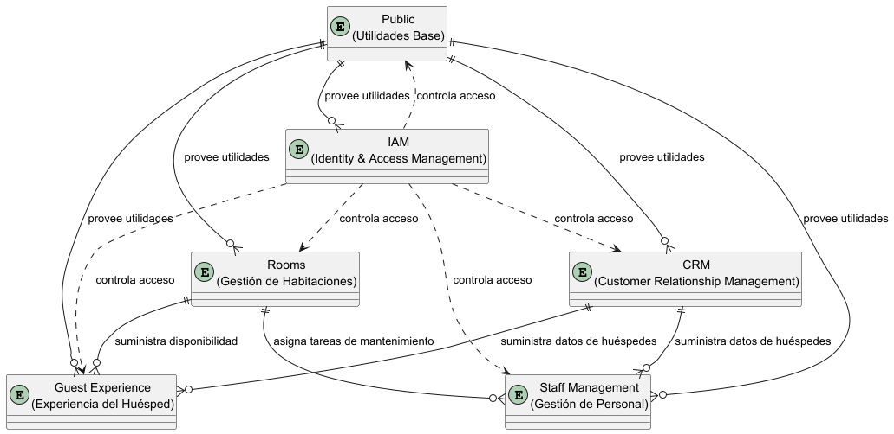

## 3.5. Entity Diagram.


# Capítulo IV: Product Design
## 4.1. Style Guidelines.
### 4.1.1. General Style Guidelines.

#### **Tipografía (Inter)**
La tipografía elegida para nuestra marca es Inter, por su estilo moderno, funcional y altamente legible. Su diseño limpio se adapta a distintos formatos, tanto digitales como impresos, garantizando una comunicación clara y profesional.

Gracias a su versatilidad, Inter funciona bien en títulos y textos extensos, reflejando los valores de innovación y accesibilidad de nuestra marca. Al ser de código abierto, también refuerza nuestro compromiso con soluciones sostenibles y colaborativas en un entorno digital dinámico.

#### **Colores**
La selección de nuestra paleta de colores para nuestro proyecto responde a una estrategia visual cuidadosamente diseñada para transmitir tecnología, confianza y sofisticación, elementos esenciales en la propuesta de valor de SoftCore.

- **Landing Page** <br>
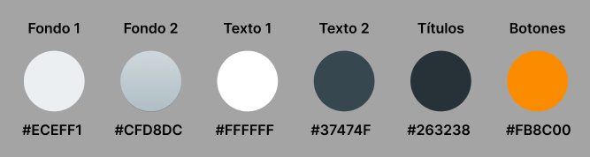

En la pantalla de inicio, el blanco puro **(#FFFFFF)** se emplea estratégicamente para los textos que necesitan máxima claridad y contraste, especialmente cuando se superponen sobre fondos oscuros. Su neutralidad transmite limpieza, simplicidad y enfoque, permitiendo que el mensaje principal resalte sin distracciones y facilite la primera interacción del usuario con la aplicación.

Complementando esto, se incorpora el azul grafito **(#263238)** en los títulos principales, tanto en la pantalla de bienvenida como en otras áreas destacadas. Este tono oscuro proyecta autoridad y estructura, guiando visualmente al usuario con jerarquía clara y coherente. Su alto contraste con los fondos claros permite marcar secciones clave y transmitir una sensación de profesionalismo desde el primer momento.

En el cuerpo general, el azul grisáceo **(#37474F)** asume un rol protagonista en los textos informativos y títulos secundarios. Este color mantiene una legibilidad excelente sin resultar demasiado rígido, lo que lo convierte en una opción ideal para contenidos extensos. Su carácter neutro aporta equilibrio y favorece una estética sobria y tecnológica, ajustándose perfectamente a entornos que requieren claridad y funcionalidad.

Como color de acento, el naranja vibrante **(#FB8C00)** aporta dinamismo y atención. Se reserva para botones principales, notificaciones urgentes y elementos que requieren una acción inmediata por parte del usuario. Su brillo genera un contraste fuerte con el resto de la paleta, facilitando la toma de decisiones rápidas sin romper la armonía visual.

Para estructurar visualmente el fondo de la aplicación web, se utilizan dos tonos complementarios. El gris azulado **(#ECEFF1)** funciona como base principal en pantallas, tarjetas y formularios, generando una atmósfera limpia, aireada y sin distracciones. Este fondo neutral mejora la legibilidad y permite que los componentes destacados brillen con claridad. Por su parte, el gris claro **(#CFD8DC)**, ligeramente más oscuro, se emplea para crear contraste entre secciones, encabezados secundarios o áreas informativas. Esta variación sutil mantiene la jerarquía y el orden visual, aportando dinamismo sin romper la cohesión estética general.

Finalmente, el uso coordinado de estos seis colores garantiza una experiencia visual agradable, estructurada y efectiva. La combinación de tonos neutros, contrastes cuidadosamente definidos y acentos vibrantes permite construir una interfaz clara, moderna y adaptable, que guía al usuario con naturalidad mientras transmite profesionalismo, eficiencia y confianza.

- **Front-End** <br>
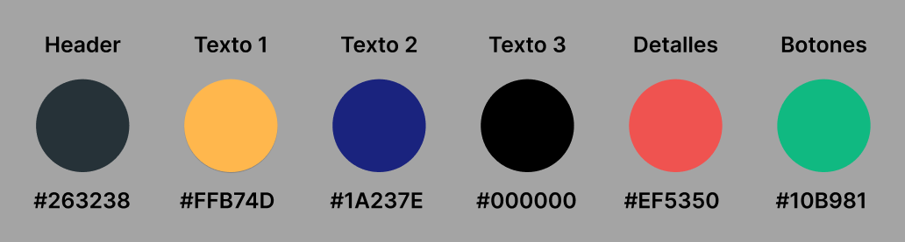

En la pantalla de inicio, el azul grafito profundo **(#263238)** se emplea estratégicamente como color de fondo del encabezado, aportando una sensación de solidez, enfoque y profesionalismo desde el primer momento. Su intensidad transmite autoridad y seriedad, lo que permite estructurar visualmente la interfaz con jerarquía clara y coherente.

Complementando esta base, el naranja suave **(#FFB74D)** destaca como color principal en los títulos, el nombre de usuario y el pie de página. Este tono cálido y luminoso introduce cercanía y vitalidad, equilibrando la sobriedad del fondo con una energía accesible. Su presencia aporta dinamismo sin resultar invasiva, ayudando a guiar la atención del usuario hacia elementos clave de navegación e identidad.

Para los subtítulos y elementos secundarios, se recurre al azul oscuro intenso **(#1A237E)**, un color que proyecta estabilidad y profundidad. Este tono se emplea en encabezados intermedios, etiquetas y bloques de contenido que necesitan diferenciarse sin competir visualmente con los títulos principales. Gracias a su contraste y elegancia, mantiene la coherencia visual y refuerza la sensación de estructura.

El negro absoluto **(#000000)** se reserva para el texto general en la interfaz. Su claridad sobre fondos claros o coloridos garantiza una lectura nítida y sin esfuerzo, facilitando la comprensión de información extensa o técnica. Esta elección subraya la importancia del contenido textual en la experiencia del usuario.

Como color de acento, el rojo coral vibrante **(#EF5350)** se aplica a detalles relevantes como íconos de advertencia, enlaces activos o indicadores visuales. Su intensidad introduce contraste y urgencia cuando es necesario captar la atención del usuario rápidamente, sin saturar la interfaz ni romper la armonía cromática general.

Finalmente, el verde esmeralda **(#10B981)** se utiliza en botones interactivos y llamadas a la acción. Este color transmite una sensación de progreso, aprobación y accesibilidad, invitando al usuario a interactuar con confianza. Su luminosidad y frescura lo convierten en un acento funcional que estimula la acción sin imponerse.


#### **Lenguaje**
En SoftCore, utilizaremos un lenguaje que refleje nuestra visión y dedicación para transformar la experiencia hotelera mediante tecnología inteligente. Buscamos conectar tanto con huéspedes como con profesionales del sector, manteniendo una comunicación clara, cercana y profesional. La combinación de tonos que emplearemos es la siguiente:

1. **Profesional pero accesible:** Queremos transmitir seriedad y conocimiento en el desarrollo de soluciones tecnológicas aplicadas a la hotelería, sin dejar de ser comprensibles para todos los usuarios. Nuestra comunicación mostrará dominio técnico, pero con un lenguaje claro y cercano que invite a explorar nuestra propuesta sin barreras.
2. **Formal pero cálido:** Aunque mantenemos un tono formal que refleje el compromiso y la confiabilidad de nuestra marca, también nos dirigimos a nuestros usuarios con cercanía. Nuestra intención es establecer una conexión humana y auténtica, transmitiendo confianza y empatía desde el primer contacto.
3. **Respetuoso y empático:** Nos comunicamos con respeto hacia todos nuestros usuarios, reconociendo la diversidad de necesidades de huéspedes, administradores y personal hotelero. Nuestro lenguaje será inclusivo y considerado, promoviendo una relación de colaboración y apoyo constante.
4. **Inspirador y optimista:** En SoftCore creemos que la tecnología puede mejorar profundamente la experiencia de hospedaje. Por ello, hablaremos con entusiasmo y convicción, motivando a nuestros usuarios a imaginar y vivir una nueva forma de hospedarse: más cómoda, personalizada e inteligente.

### 4.1.2. Web Style Guidelines.

#### **Descripción General**
Este diseño corresponde a la aplicación web de CustomHost, una plataforma inteligente que permite a los huéspedes personalizar su estadía y a los hoteles optimizar su gestión mediante tecnologías como domótica y biometría. El diseño incluye la pantalla de inicio, la cual mantiene un estilo visual coherente utilizando una paleta de colores sobrios y tecnológicos como el azul petróleo y el verde oscuro. Además, se aplica una tipografía definida que refuerza la imagen moderna y profesional de la marca.
<br>

#### **1. Pantalla de Inicio**
**Header:**
- Logo (esquina superior izquierda).
- Menú de navegación con las opciones: Nosotros, For Hotels, For guets, testimonios y Soporte.
- Selector de idioma (inglés y español), número y correo de contacto.
- Botones "Inicia sesión" y "Registrate".


<br>

**Home:**
- Frase de bienvedida a nuestra aplicación web junto al botón "Ver habitaciones" que te mostrará el tipo de habitaciones con las que contamos.
- Menú horizontal donde podrás elegir el hotel en el que te ospedarás, fecha de llegada y salida, cantidad de adultos y niños que se ospedarán, código promocional y el botón de "Reservar ahora".


<br>

**About Us:** En esta sección se presenta una pequeña introducción a Custom Host. También se encontrará a nosotros como miembros del CEO.


<br>

Aquí puedes visualizar la historia de nuestra aplicación:

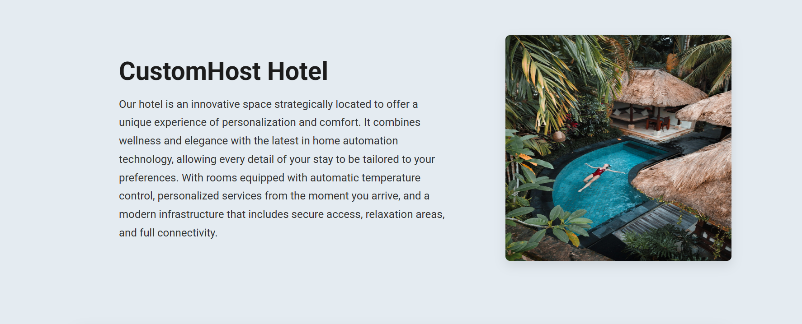
<br>

En la imagen se muestra una sección titulada "About the team" (Acerca del equipo), que destaca a los miembros clave de un equipo. La parte superior de la imagen contiene iconos representativos, como Wi-Fi, sistema 24/7, sistema personalizado y piscina, lo que sugiere que esta organización ofrece servicios o productos innovadores con características destacadas, como conectividad constante, disponibilidad las 24 horas del día, personalización y comodidad adicional.

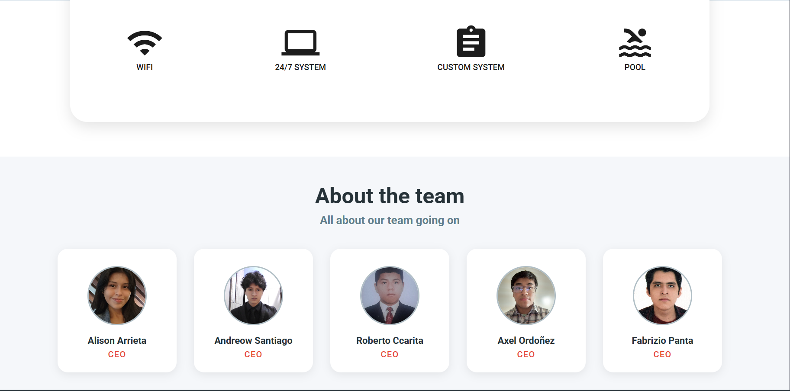
<br>

**For-Hotel:** En esta sección podemos visualizar los servicios que nuestra aplicacion brinda a los hoteles que quieran contar con nosotros.

.png)
<br>

Aqui podemos visualizar detalladamente que servicios ofrecemos a los hoteles

.png)
<br>

Mostramos los diferentes precios de nuestros servicios:

.png)
<br>

Ademas invitamos a registrarse que no tarda mas de 5 minutos

.png)
<br>

**For-guests:** En esta sección podemos visualizar los servicios que nuestra aplicacion brinda a los huéspedes que quieran contar con nosotros.

.png)
<br>

Aquí podemos visualizar detalladamente que servicios ofrecemos a los huéspedes

.png)

Aqui podemos visual la diferente variedad de hoteles que puede reservar el huesped

.png)

Aqui podemos visual los diferentes tipos de cuarto que el huesped puede reservar

.png)


**Statements** En esta sección se encuentran las opiniones y comentarios de los usuarios que usaron nuestra aplicación web para que futuros huespedes tengan información del servicio brindado.

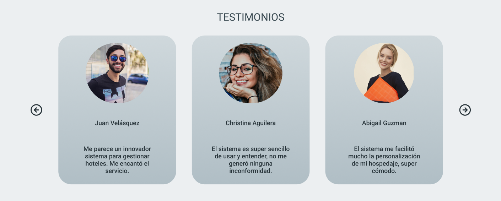
<br>

**Support** Esta seccion está dividida en dos pequeñas secciones, en la primera sección encontrarán las preguntas frecuentes y en segunda sección encontrarán la forma de contactarno como el chat con el soporte del hotel.

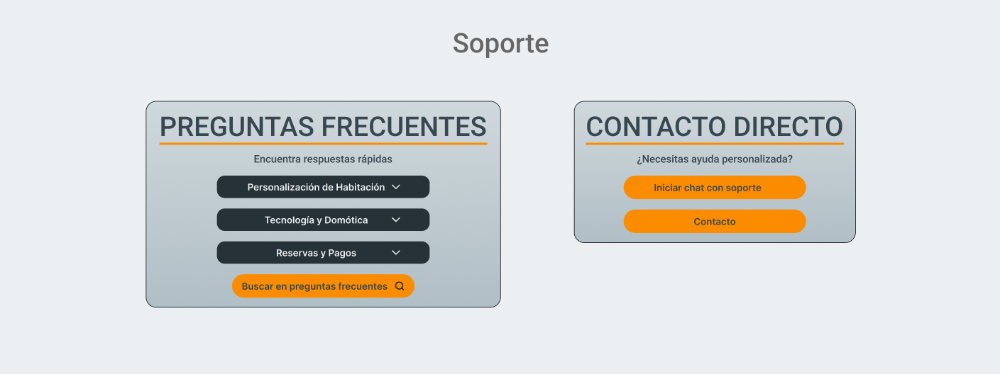
<br>

**Footer**
- El logo junto con correo y numero de contacto.
- Secciones de partes de CustomHost como "Home", "SmartStay" y "About Us".
- Ayuda el usuario como "Contacto", "Preguntas frecuentes", "Términos de servicio" y "Política de privacidad".
- Las redes sociales con las que cuenta Custom Host.


<br>

#### **2. Pantalla Home Staff**
- En la primera sección de esta pantalla se pueden ver las cards las cuales muestran información importante para el hotel como la cantidad de habitaciones ocupadas, el grafico de pagos del año y los dispositivos IoT inactivos.
- En la siguiente sección tenemos una gráfica que muestra la cantidad de pagos individuales.
.png)
.png)
.png)

#### **2. Pantalla Home Guest**
- En la primera sección de esta pantalla se pueden ver las notificaciones y mis y mis reservaciones.
  .png)
  .png)

#### **3. Pantalla Rooms Managment**
- En esta página vemos una tabla con las habitaciones que hay en el hotel, mostrando el número de la habitación, el tipo (Suite, Deluxe o Familiar), el status (disponible, ocupado o en limpieza), el precio, el piso en el que se encuentra y las opciones de editar o borra.<br>
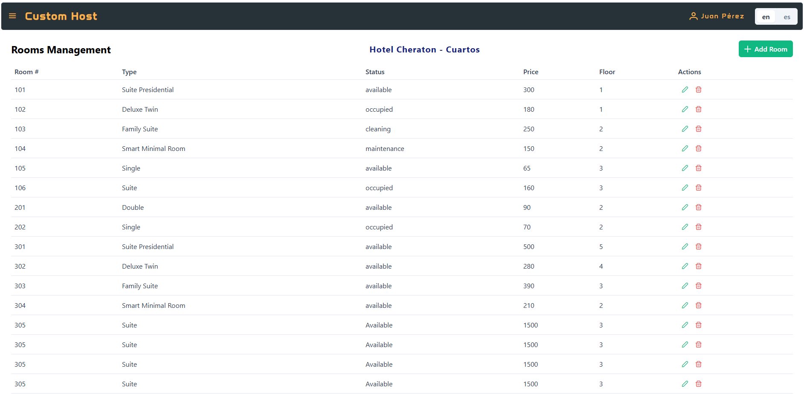
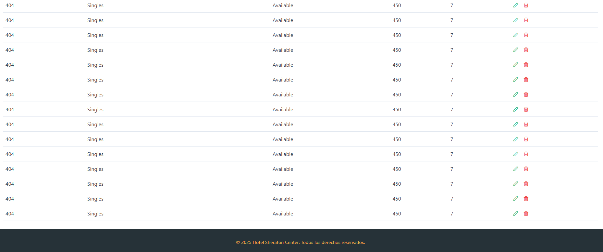

#### **4. Pantalla Iot Device**
- En esta pantalla tenemos cards en las que nos dice con que dispositivos IoT cuenta cada habitación, tambipen nos muestra si los dispositivos están encendidos, apagados o en mantenimiento.<br>
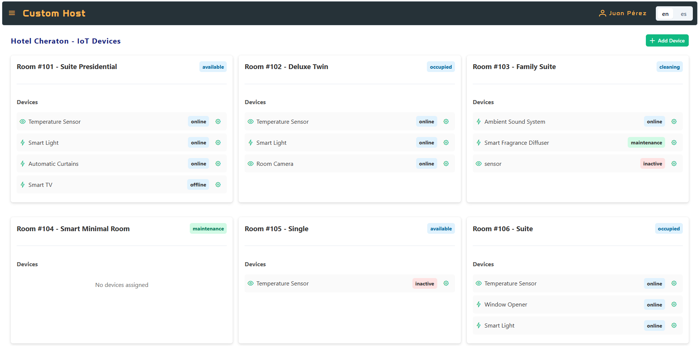
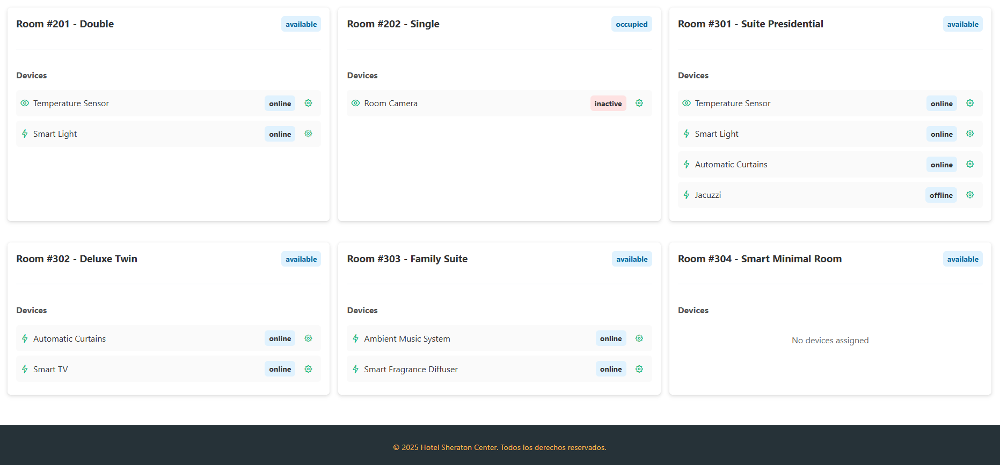

#### **5. Pantalla Customer Request**
- En esta página tenemos dos tablas, la primera muestra que habitaciones están en mantenimiento o están ocupadas y la cantidad de peticiones que han hecho los huespedes de esa habitación.
- En la segunta tabla, nos muestra las peticiones pendientes.<br> 
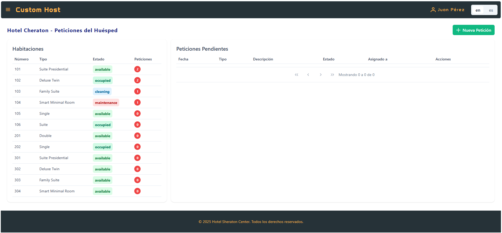

#### **6. Pantalla Booking Tracker**
- En esta pantalla tenemos una tabla con los húespedes actuales, mostrando su habitación, nombre, las fechas de check-in y check-out y las opciones de editar o borrar. <br>
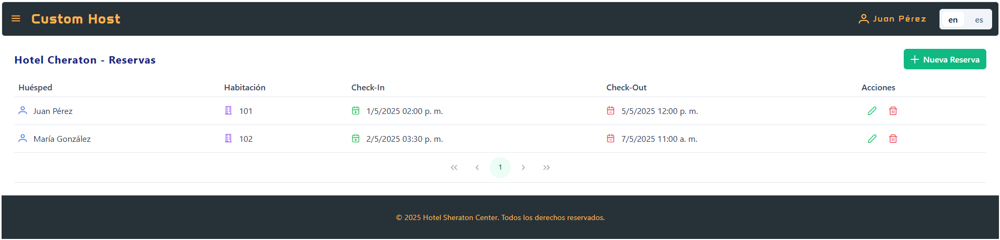

#### **7. Pantalla Request Staff**
- En esta pantalla hay una tabla el nombre de un trabajador del hotel asignadole una solicitu realizado por un huésped. <br>
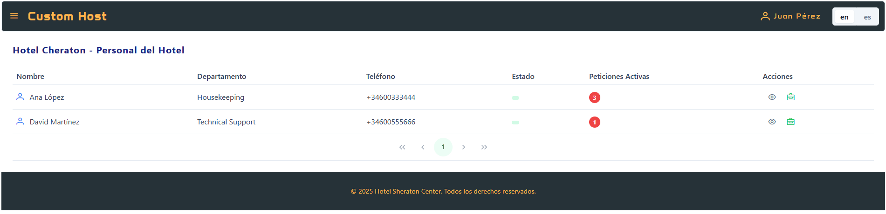

#### **8. Pantalla Profile**
- En esta página tenemos dos cards mostrando los datos personales del administrador y el hotel que trabaja con nosotros. <br>
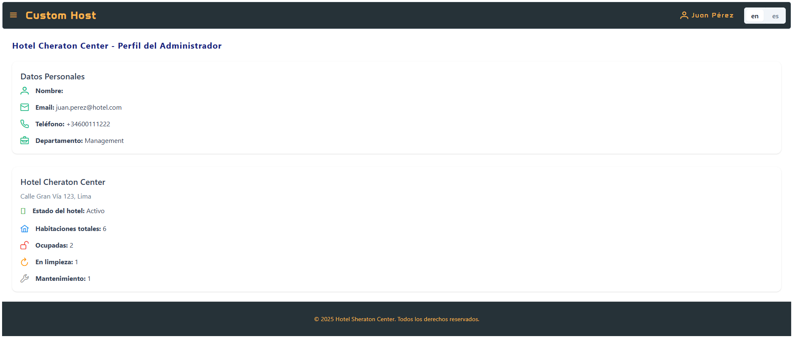

#### **9. Pantalla Book now**

El huesped puede reservar una habitación desde la aplicación web, para ello debe ingresar a la sección de Book now, donde podrá ver las habitaciones disponibles y los precios de cada una. Una vez que elige la habitación, se le pedirá que ingrese sus datos personales y de pago para completar la reserva.

.png)

El huesped puede visualizar en el calendario las fechas disponibles para reservar una habitación, y también puede ver las habitaciones que ya ha reservado anteriormente. Además, puede cancelar o modificar sus reservas si es necesario.

.png)

El huesped puede pagar su reserva a través de la aplicación web, utilizando diferentes métodos de pago como tarjeta de crédito, débito o PayPal. Una vez que se completa el pago, recibirá una confirmación de su reserva por correo electrónico.

.png)

#### **10. Pantalla Preferemces**

El huesped puede personalizar su experiencia de hospedaje a través de la sección de Preferences, donde puede ajustar la temperatura de la habitación, la iluminación, el nivel de ruido y otros aspectos del ambiente. También puede seleccionar sus preferencias de limpieza y servicios adicionales.


#### **11. Pantalla My bookings**

El huesped puede ver sus reservas actuales y pasadas en la sección de My bookings, donde podrá consultar los detalles de cada reserva, como las fechas de check-in y check-out, el tipo de habitación y los servicios adicionales que ha solicitado. También puede cancelar o modificar sus reservas desde esta sección.


#### **12. Pantalla Customer Service**

El huesped puede acceder a la sección de Customer Service para obtener asistencia en caso de problemas o preguntas sobre su estadía. Aquí podrá encontrar información de contacto, como números telefónicos y correos electrónicos, así como un formulario para enviar consultas directamente al personal del hotel.


#### **13. Pantalla Notifications**

El huesped puede ver las notificaciones importantes relacionadas con su estadía en la sección de Notifications. Aquí recibirá alertas sobre eventos relevantes, como cambios en su reserva, promociones especiales o recordatorios de servicios solicitados. Las notificaciones se mostrarán de manera clara y accesible para que el huésped esté siempre informado.


## 4.2. Information Architecture.
La arquitectura de información que se emplea en CustomHost está diseñada para ofrecer una navegación fluida y lógica tanto para huéspedes como para personal administrativo de hoteles. Esta estructura permitirá a los usuarios personalizar su experiencia de hospedaje, controlar su entorno y al personal del hotel gestionar de manera eficiente las preferencias y el estado de cada habitación, todo desde una plataforma centralizada.

La arquitectura de información que se emplea en CustomHost está diseñada para ofrecer una navegación fluida y lógica tanto para huéspedes como para personal administrativo de hoteles. Esta estructura permitirá a los usuarios personalizar su experiencia de hospedaje, controlar su entorno y al personal del hotel gestionar de manera eficiente las preferencias y el estado de cada habitación, todo desde una plataforma centralizada.

### 4.2.1. Organization Systems.
*Organización visual del contenido*
Se empleará una estructura jerárquica visual clara en la Landing Page y en cada sección de la plataformaweb. Se priorizará la presentación de información clave como el panel de preferencias del huésped, el estado de las habitaciones, y accesos rápidos a funciones como check-in, control domótico o comunicación con el personal.

### 4.2.2. Labeling Systems.
Estos son los principios de etiquetado aplicados en la plataforma:

**Claridad y simplicidad:** Se emplea un lenguaje accesible para los usuarios, evitando tecnicismos innecesarios en la interfaz del huésped. En el caso del personal técnico y administrativo, se mantienen ciertos términos específicos, especialmente en la gestión de dispositivos inteligentes y mantenimiento.

**Brevedad:** Las etiquetas de botones, menús y opciones se mantienen breves y directas, facilitando la navegación ágil desde cualquier dispositivo.

### 4.2.3. SEO Tags and Meta Tags
- Título: ```<title> CustomHost | Personaliza tu estadía con tecnología inteligente </title>```
- Descripción: ```<meta name = "description" content = "Plataforma que permite a huéspedes y hoteles personalizar habitaciones con domótica, IoT y acceso biométrico. Vive una experiencia única e inteligente."/>```
- Palabras Clave: ```<meta name = "keyword" content = "Hoteles inteligentes, domótica hotelera, IoT en hoteles, personalización de estadía, check-in digital, habitaciones automatizadas"/>```

### 4.2.4. Searching Systems.
Al ingresar, el usuario será recibido con una pantalla de bienvenida donde se encontrará con dos botones en la parte superior derecha, uno para registrarse y otro para inicar sesión. Una vez iniciada la sesión, la navegación dentro de la aplicación estará organizada para facilitar una experiencia fluida e intuitiva.

Los usuarios contarán con una barra de navegación superior que les permitirá acceder fácilmente a las principales funciones. Desde allí podrán personalizar su estadía, controlar su entorno, solicitar ayuda o gestionar su salida del hotel.

La navegación estará reforzada con íconos, etiquetas breves y estados activos visuales, para garantizar que los usuarios siempre sepan dónde están y cómo volver o avanzar en sus acciones.
Al ingresar, el usuario será recibido con una pantalla de bienvenida donde se encontrará con dos botones en la parte superior derecha, uno para registrarse y otro para inicar sesión. Una vez iniciada la sesión, la navegación dentro de la aplicación estará organizada para facilitar una experiencia fluida e intuitiva.

Los usuarios contarán con una barra de navegación superior que les permitirá acceder fácilmente a las principales funciones. Desde allí podrán personalizar su estadía, controlar su entorno, solicitar ayuda o gestionar su salida del hotel.

La navegación estará reforzada con íconos, etiquetas breves y estados activos visuales, para garantizar que los usuarios siempre sepan dónde están y cómo volver o avanzar en sus acciones.

### 4.2.5. Navigation Systems.
Al ingresar al sitio web de CustomHost, el usuario visualizará una barra de navegación fija en la parte superior de la pantalla, la cual facilitará el acceso directo a las secciones más importantes del sitio.


Esta barra permanecerá visible durante toda la navegación, sin importar la sección visitada, asegurando así un acceso ágil y constante a todos los servicios y recursos que ofrece CustomHost.

## 4.3. Landing Page UI Design.
En esta sección se presentan los diseños correspondientes a nuestra Landing Page, los cuales se encuentran divididos en dos partes: por un lado, los wireframes que muestran una estructura simplificada de la interfaz, y por otro, el mock-up visual que servirá como referencia estética y funcional para el desarrollo final de la página.

### 4.3.1. Landing Page Wireframe.
[Link en Figma]https://www.figma.com/design/3laD7dXkyOejl98KTsmxjj/Aplicaciones-Web?node-id=0-1&t=H1oZeP90awe925yF-1

el wireframe de la Landing Page de CustomHost se ha diseñado para ofrecer una estructura clara y funcional que guíe al usuario a través de la información y servicios disponibles. A continuación, se detallan las principales secciones y elementos incluidos en el wireframe:

.png)
.png)
.png)
.png)
.png)
.png)
.png)


### 4.3.2. Landing Page Mock-up.
[Link en Figma]https://www.figma.com/design/3laD7dXkyOejl98KTsmxjj/Aplicaciones-Web?node-id=0-1&t=H1oZeP90awe925yF-1

.png)
.png)
.png)
.png)
.png)
.png)


## 4.4. Web Applications UX/UI Design.
### 4.4.1. Web Applications Wireframes.


### 4.4.2. Web Applications Wireflow Diagrams.
### Segmento objetivo: Guest


### Segmento objetivo: Staff


### 4.4.2. Web Applications Mock-ups.


### 4.4.3. Web Applications User Flow Diagrams.
### **Huésped:**

La presente sección describe el flujo ideal diseñado para el segmento de huéspedes de hotel dentro de la plataforma, centrado en ofrecer una experiencia de reserva y estancia fluida, personalizada y sin fricciones. Este recorrido cubre desde el primer contacto hasta la finalización de la estadía, garantizando que el usuario encuentre opciones adaptadas a sus necesidades y pueda gestionar todos los aspectos de su viaje de manera intuitiva.

El huésped inicia su interacción accediendo a la plataforma mediante Login/Register (disponible en versión web o móvil), donde es dirigido a la página de inicio. Desde allí, puede explorar opciones de alojamiento mediante filtros personalizables (fechas, tipo de habitación, ubicación, comodidades) y seleccionar la que mejor se ajuste a sus preferencias. Durante el proceso de reserva, el sistema valida en tiempo real la disponibilidad y permite añadir servicios complementarios (como desayuno, spa o traslados), asegurando que toda la información requerida (datos personales y de pago) esté completa y correctamente formateada antes de confirmar.

Una vez completada la reserva, el huésped recibe una confirmación automática (vía email y notificación en la app) y puede acceder a su sección "Mis Reservas" para gestionar detalles o modificaciones. Previo a su llegada, tiene la opción de realizar un check-in digital, subiendo documentos y seleccionando horarios, lo que agiliza su ingreso al hotel. Durante la estancia, la plataforma le permite solicitar servicios adicionales (room service, limpieza), consultar información del establecimiento o actividades disponibles, e incluso contactar al personal ante cualquier necesidad.

Al finalizar, el huésped realiza un check-out automático desde la app, recibe un resumen de su estadía y es invitado a dejar una valoración. Este flujo no solo optimiza el tiempo y reduce interacciones manuales, sino que también recopila datos clave para mejorar el servicio.<br>


### **Staff:**

El flujo diseñado para el equipo administrativo del hotel está optimizado para garantizar una gestión operativa eficiente y una atención al huésped excepcional. Este recorrido integral permite al personal administrativo realizar todas sus funciones clave de manera sistematizada, asegurando la coordinación entre departamentos y manteniendo altos estándares de servicio.

El proceso comienza cuando el miembro del staff accede al sistema mediante credenciales seguras con permisos específicos según su rol (recepción, housekeeping, gestión, etc.). Al ingresar, encuentra un dashboard centralizado que muestra información crítica en tiempo real: reservas pendientes, check-ins programados, solicitudes de huéspedes y alertas operativas prioritarias. Desde este panel de control, el personal puede gestionar todo el ciclo del huésped de manera eficaz.

Para las reservas, el sistema permite visualizar y filtrar todas las solicitudes entrantes, con opción de asignación automática de habitaciones o manual para casos especiales. Durante este proceso, se validan todos los datos del huésped, incluyendo documentación requerida y preferencias específicas, generando automáticamente una confirmación que se envía al huésped. En el momento del check-in, el staff verifica la identidad del visitante (con posibilidad de integración con sistemas de escaneo de documentos), asigna las llaves correspondientes (digitales o físicas) y proporciona información personalizada sobre servicios y amenidades.

Durante la estancia, la plataforma facilita la coordinación interna mediante un sistema de solicitudes y alertas. El personal puede comunicar requerimientos especiales (como pedidos de amenities o solicitudes de limpieza urgente) directamente a los departamentos correspondientes, mientras actualiza constantemente el estado de las habitaciones (disponible, en limpieza o en mantenimiento) en el sistema central. Para el check-out, el proceso incluye la revisión del estado de la habitación, la verificación de cargos adicionales y la emisión automática de facturación electrónica, además del registro de feedback del huésped.

El flujo administrativo culmina con la generación de reportes detallados que incluyen métricas de ocupación, ingresos diarios, incidencias relevantes y niveles de satisfacción de los huéspedes. Estos datos permiten al equipo gerencial realizar ajustes operativos y estratégicos para mejorar continuamente el servicio.<br>


## 4.5. Web Applications Prototyping.
URL del Prototipo https://www.figma.com/design/Rti8LYhQHMeIjsfMIQYIdr/Open-Source?node-id=0-1&p=f&t=XYETOEAUmnls4kjW-0

## 4.6. Domain-Driven Software Architecture.
### 4.6.1. Software Architecture Context Diagram.


   
### 4.6.2. Software Architecture Container Diagrams.
web.png)


### 4.6.3. Software Architecture Components Diagrams.


## 4.7. Software Object-Oriented Design.
### 4.7.1. Class Diagrams.

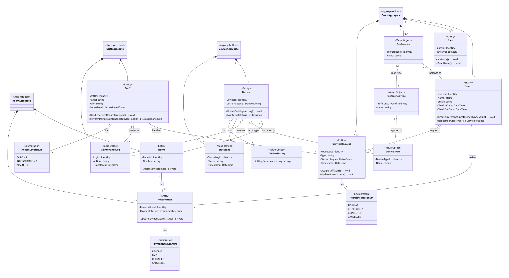

[> Click aquí para acceder al diagrama <](https://lucid.app/lucidchart/0b48881b-37af-4d3f-81f0-5c48f44eff2d/edit?invitationId=inv_e14a7c8d-7849-467d-99ab-528f2398e183&page=0_0#)

### 4.7.2. Class Dictionary.

# Class Dictionary

## 1. GuestAggregate
- **Type**: Aggregate Root
- **Description**: Raíz del agregado relacionado con los huéspedes.
- **Relationships**:
  - Contiene `Guest` (1:1).
  - Contiene `Card` (0..1).
  - Contiene `Preference` (0..*).
  - Contiene `ServiceRequest` (0..*).

---

## 2. Guest
- **Type**: Entity
- **Attributes**:
  - `GuestId`: Identity (Identificador único del huésped).
  - `Name`: string (Nombre del huésped).
  - `Email`: string (Correo electrónico del huésped).
  - `CheckInDate`: DateTime (Fecha de entrada).
  - `CheckOutDate`: DateTime (Fecha de salida).
- **Methods**:
  - `CreatePreference(preferenceType, value)`: Crea una nueva preferencia para el huésped.
  - `RequestService(type)`: Solicita un servicio para el huésped.
- **Relationships**:
  - Pertenece a `GuestAggregate`.
  - Tiene `Reservation` (0..*).
  - Tiene `ServiceRequest` (0..*).
  - Tiene `Preference` (0..*).

---

## 3. Card
- **Type**: Entity
- **Attributes**:
  - `CardId`: Identity (Identificador único de la tarjeta).
  - `IsActive`: boolean (Indica si la tarjeta está activa).
- **Methods**:
  - `Activate()`: Activa la tarjeta.
  - `Deactivate()`: Desactiva la tarjeta.
- **Relationships**:
  - Pertenece a `GuestAggregate`.

---

## 4. RoomAggregate
- **Type**: Aggregate Root
- **Description**: Raíz del agregado relacionado con las habitaciones.
- **Relationships**:
  - Contiene `Room` (1:1).
  - Contiene `Reservation` (0..*).

---

## 5. Room
- **Type**: Entity
- **Attributes**:
  - `RoomId`: Identity (Identificador único de la habitación).
  - `Number`: string (Número de la habitación).
- **Methods**:
  - `AssignDevice(device)`: Asigna un dispositivo a la habitación.
- **Relationships**:
  - Pertenece a `RoomAggregate`.
  - Tiene `Reservation` (0..*).
  - Tiene `Device` (0..*).

---

## 6. Reservation
- **Type**: Entity
- **Attributes**:
  - `ReservationId`: Identity (Identificador único de la reserva).
  - `PaymentStatus`: PaymentStatusEnum (Estado de pago de la reserva).
- **Methods**:
  - `UpdatePaymentStatus(status)`: Actualiza el estado de pago de la reserva.
- **Relationships**:
  - Pertenece a `RoomAggregate`.
  - Está relacionada con `Guest` (1:0..*).
  - Está relacionada con `Room` (1:0..*).

---

## 7. StaffAggregate
- **Type**: Aggregate Root
- **Description**: Raíz del agregado relacionado con el personal.
- **Relationships**:
  - Contiene `Staff` (1:1).
  - Contiene `MaintenanceLog` (0..*).

---

## 8. Staff
- **Type**: Entity
- **Attributes**:
  - `StaffId`: Identity (Identificador único del miembro del personal).
  - `Name`: string (Nombre del miembro del personal).
  - `Role`: string (Rol del miembro del personal).
  - `AccessLevel`: AccessLevelEnum (Nivel de acceso del miembro del personal).
- **Methods**:
  - `HandleServiceRequest(request)`: Maneja una solicitud de servicio.
  - `PerformDeviceMaintenance(device, action)`: Realiza mantenimiento en un dispositivo.
- **Relationships**:
  - Pertenece a `StaffAggregate`.
  - Tiene `MaintenanceLog` (0..*).
  - Maneja `ServiceRequest` (0..*).

---

## 9. DeviceAggregate
- **Type**: Aggregate Root
- **Description**: Raíz del agregado relacionado con los dispositivos.
- **Relationships**:
  - Contiene `Device` (1:1).
  - Contiene `StatusLog` (0..*).

---

## 10. Device
- **Type**: Entity
- **Attributes**:
  - `DeviceId`: Identity (Identificador único del dispositivo).
  - `CurrentSetting`: DeviceSetting (Configuración actual del dispositivo).
- **Methods**:
  - `UpdateSetting(setting)`: Actualiza la configuración del dispositivo.
  - `LogStatus(status)`: Registra el estado del dispositivo.
- **Relationships**:
  - Pertenece a `DeviceAggregate`.
  - Está instalado en `Room` (1:0..*).
  - Tiene `DeviceType` (1:1).
  - Tiene `MaintenanceLog` (0..*).
  - Tiene `StatusLog` (0..*).

---

## 11. ServiceRequest
- **Type**: Entity
- **Attributes**:
  - `RequestId`: Identity (Identificador único de la solicitud de servicio).
  - `Type`: string (Tipo de solicitud de servicio).
  - `Status`: RequestStatusEnum (Estado de la solicitud de servicio).
  - `Timestamp`: DateTime (Marca de tiempo de la solicitud).
- **Methods**:
  - `AssignStaff(staff)`: Asigna un miembro del personal a la solicitud.
  - `UpdateStatus(status)`: Actualiza el estado de la solicitud.
- **Relationships**:
  - Pertenece a `GuestAggregate`.
  - Es manejada por `Staff` (0..1).

---

## 12. DeviceType
- **Type**: Value Object
- **Attributes**:
  - `DeviceTypeId`: Identity (Identificador único del tipo de dispositivo).
  - `Name`: string (Nombre del tipo de dispositivo).
- **Relationships**:
  - Está relacionado con `Device` (1:0..*).
  - Aplica a `PreferenceType` (0..*).

---

## 13. PreferenceType
- **Type**: Value Object
- **Attributes**:
  - `PreferenceTypeId`: Identity (Identificador único del tipo de preferencia).
  - `Name`: string (Nombre del tipo de preferencia).
- **Relationships**:
  - Está relacionado con `Preference` (1:0..*).
  - Se aplica a `DeviceType` (0..*).

---

## 14. Preference
- **Type**: Value Object
- **Attributes**:
  - `PreferenceId`: Identity (Identificador único de la preferencia).
  - `Value`: string (Valor de la preferencia).
- **Relationships**:
  - Pertenece a `Guest` (1:0..*).
  - Está relacionado con `PreferenceType` (1:1).

---

## 15. DeviceSetting
- **Type**: Value Object
- **Attributes**:
  - `SettingData`: Map<string, string> (Datos de configuración del dispositivo).
- **Relationships**:
  - Es utilizado por `Device` (1:1).

---

## 16. MaintenanceLog
- **Type**: Value Object
- **Attributes**:
  - `LogId`: Identity (Identificador único del registro de mantenimiento).
  - `Action`: string (Acción realizada durante el mantenimiento).
  - `Timestamp`: DateTime (Marca de tiempo del registro).
- **Relationships**:
  - Es realizado por `Staff` (1:0..*).
  - Es recibido por `Device` (1:0..*).

---

## 17. StatusLog
- **Type**: Value Object
- **Attributes**:
  - `StatusLogId`: Identity (Identificador único del registro de estado).
  - `Status`: string (Estado registrado).
  - `Timestamp`: DateTime (Marca de tiempo del registro).
- **Relationships**:
  - Es registrado por `Device` (1:0..*).

---

## 18. AccessLevelEnum
- **Type**: Enumeration
- **Values**:
  - `BASIC = 1`
  - `INTERMEDIATE = 2`
  - `ADMIN = 3`

---

## 19. RequestStatusEnum
- **Type**: Enumeration
- **Values**:
  - `PENDING`
  - `IN_PROGRESS`
  - `COMPLETED`
  - `CANCELLED`

---

## 20. PaymentStatusEnum
- **Type**: Enumeration
- **Values**:
  - `PENDING`
  - `PAID`
  - `REFUNDED`
  - `CANCELLED`

## 4.8. Database Design.
### 4.8.1. Database Diagram.

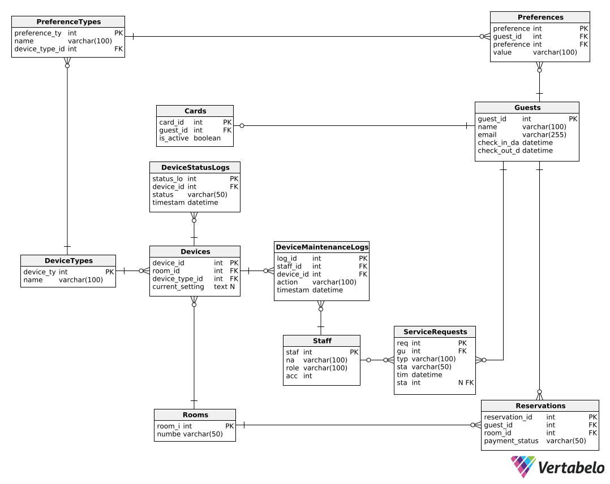

[> Click aquí para acceder al diagrama <](https://my.vertabelo.com/public-model-view/n0NImX9sR1voJyd33Hr1iawsHgx7swpzz7jOBxA2VjOTE3i8WLuZf64ZQlNCyCLB?x=2736&y=2923&zoom=0.4375)
# Capítulo V: Product Implementation, Validation & Deployment
En este último capítulo, nos centraremos en la implementación, validación y despliegue de nuestro proyecto. Al igual que explicar los puntos y pasos necesarios que hemos tomado para lograr su realización.
## 5.1. Software Configuration Management.
Durante el desarrollo del proyecto utilizaremos las siguientes convenciones o reglas para mantener consistencia en todo momento:
|Contexto|Convención|
|-|-|
|Nombre de archivos|Todos los archivos tendrán nombres en minúscula, sin espacios, usando kebab-case.|
|Convenciones de nomenclatura| Variables y funciones: lowerCamelCase; clases y componentes: PascalCase; constantes: UPPER_SNAKE_CASE; archivos: kebab-case.|
|Estructura del código|Usar estructura modular siguiendo el patrón feature/module, con carpetas como components/, assets/, pages/, services/, etc. Separar por responsabilidades.|
|Estilo de codificación|Seguir las reglas de ESLint y Prettier: Sangría de 2 espacios; comillas simples; punto y coma obligatorio; y orden alfabético en CSS.|
|Documentación|Comentar solo en funciones complejas o integraciones externas. Usar formato descripción y mantener el README.md claro y actualizado.|
|Control de versiones|GitHub Flow: ramas por feature, uso de Pull Requests, revisiones antes de merge. Formato de commits: feat, fix, chore, etc.|
|Gestión de dependencias|	Usar npm. Mantener package.json ordenado y actualizado. Preferir dependencias estables y con comunidad activa. Ejecutar npm audit regularmente.|
|Convenciones de prueba|Tests en archivos .spec.js si aplica. Enfoque en pruebas visuales/manuales en componentes clave como BookingForm, RoomCard, ServiceRequest.|
|Convenciones de seguridad|Validación de entradas en frontend. Autenticación vía tokens (JWT). No incluir secretos en el código. Usar sanitización para evitar XSS.|
|Convenciones de colaboración| Comunicación por Discord o Teams. Gestión en Trello o GitHub Projects. Documentar avances, pedir feedback constante y promover buenas prácticas. |
### 5.1.1. Software Development Environment Configuration.
|Producto|Descripción|Próposito de Uso
|-|-|-|
|Rider (JetBrains)|Entorno de desarrollo especializado en .NET, ideal para construir aplicaciones robustas de escritorio, móviles y servicios web.|Se emplea para el desarrollo de WebServices en C# y tecnología .NET, aprovechando su rendimiento, seguridad y compatibilidad multiplataforma.|
|MySQL|Sistema de gestión de bases de datos relacional, de código abierto y ampliamente soportado.|Brinda una base de datos confiable para manejar reservas, huéspedes, dispositivos y servicios del hotel, con capacidad de gestión local o en la nube.|
|Postman	|Plataforma de colaboración para pruebas de APIs REST. Permite simular, probar y documentar endpoints rápidamente.|Ideal para probar servicios de la web como reservas, preferencias de usuario, solicitudes de habitación y más.|
|Git|Sistema de control de versiones distribuido, esencial para llevar un historial organizado del desarrollo del software.|Administra cambios en el código, facilita el trabajo colaborativo y permite restaurar versiones anteriores si se requiere.|
### 5.1.2. Source Code Management.
El gitjab donde tengamos el proyecto
### 5.1.3. Source Code Style Guide & Conventions.
Que usamos con css (en caso usemos software para SASS)
supongo q tmbn cositas de como hacemo el code capas algun tipo de codigo para comunicarse entre comments
### 5.1.4. Software Deployment Configuration.
Configuraciones de donde y como deployeamos el proyecto
## 5.2. Landing Page, Services & Applications Implementation.
### 5.2.1. Sprint 1
#### 5.2.1.1. Sprint Planning 1.
A continuación, se presentará el sprint planning 1 donde se mostrarán las evidencias de planificación e implementación
del landing page.

**Sprint Backlog 1**
<table>
    <thead>
        <tr>
            <th> Sprint #</th>
            <th> Sprint 1</th>
        </tr>
    </thead>
    <tbody>
        <tr>
            <td style="font-weight: bold; text-align: center" colspan="2"> Sprint Planing Background</td>
        </tr>
        <tr>
            <td style="font-weight: bold;"> Date</td>
            <td> 15/04/2024 </td>
        </tr>
        <tr>
            <td style="font-weight: bold;"> Time</td>
            <td> 17:00 horas (GMT-5)</td>
        </tr>
        <tr>
            <td style="font-weight: bold;"> Location</td>
            <td> Modalidad remota por Discord.
            <td>
        </tr>
        <tr>
            <td style="font-weight: bold;"> Prepared By</td>
            <td> Softcore team
            <td>
        </tr>
        <tr>
            <td style="font-weight: bold;"> Attendees (to planning meeting)</td>
            <td> Todos los miembros del equipo Softcore.
            <td>
        </tr>
        <tr>
            <td style="font-weight: bold;"> Sprint n – 0 Review Summary</td>
            <td> Debido a que es el primer sprint que se ha hecho, no existen sprints pasados a este.
            <td>
        </tr>
        <tr>
            <td style="font-weight: bold;"> Sprint n – 1 Retrospective Summary</td>
            <td>
        Durante este sprint, se creó el landing page empleando HTML, CSS y JavaScript. También se abordaron las conversaciones sobre el contenido textual que se integró en el landing page, así como el diseño previamente establecido en Figma. Al finalizar este sprint, el landing page se subió a GitHub Pages , permitiendo que cualquier usuario pueda acceder y visualizar la página a través del enlace proporcionado. Además, se realizaron pruebas exhaustivas para asegurar que el sitio esté completamente funcional y se vea correctamente en cualquier dispositivo, garantizando una experiencia óptima tanto en computadoras de escritorio como en tablets y teléfonos móviles.
            <td>
        </tr>
        <tr>
            <td style="font-weight: bold; text-align: center" colspan="2"> Sprint Goal & User Stories</td>
        </tr>
        <tr>
            <td style="font-weight: bold;"> Sprint 1 Velocity</td>
            <td> 14
            <td>
        </tr>
        <tr>
            <td style="font-weight: bold;"> Sum of Story Points</td>
            <td> 14
            <td>
        </tr>
    </tbody>
</table>

#### 5.2.1.2. Aspect Leaders and Collaborators.

|Team Member|GitHub Username|UX-UI<br>Leader(L)/Collaborator(C)| 
|-|-|-|
|Arrieta Quispe, Alison Jimena|alisoft08|C|L|C|
|Ccarita Cruz, Roberto Brayan|hallzyx|C|C|L|
|Ordoñez Ricaldi, Axel Randall|nOOmzzzz|C|C|C|
|Panta Castro, Fabrizio Martin|F4brizio24|C|C|C|
|Santiago Peña, Andreow Jomark|andrew65411|L|C|C|

#### 5.2.1.3. Sprint Backlog 1.


#### 5.2.1.4. Development Evidence for Sprint Review.

#### 5.2.1.5. Execution Evidence for Sprint Review.
Sprint 1: En este entregable, hemos logrado desarrollar la Landing Page para nuestra StartUp Sweet Manager. El link de la Landing Page es el siguiente: https://softcore-app-web-1asi0730-2510-4395.github.io/CustomHost/.

#### 5.2.1.6. Services Documentation Evidence for Sprint Review.
En este sprint se cumplió el objetivo de desarrollar la Landing Page; sin embargo, al ser Landing Page no requiere de documentación relacionada a Web Services
#### 5.2.1.7. Software Deployment Evidence for Sprint Review.
En este sprint, se completó el desarrollo del landing page y se utilizó un conjunto de herramientas para su despliegue:

- Git: Utilizado como sistema de control de versiones para facilitar el trabajo en equipo durante el desarrollo del landing page.
- GitFlow: Implementado como flujo de trabajo para gestionar el progreso individual de cada miembro del equipo en el desarrollo del landing page.
- GitHub: Empleado como plataforma colaborativa para almacenar las versiones del proyecto y facilitar el desarrollo conjunto del equipo.
- Github pages: Utilizado como plataforma para automatizar la hospedaje y despliegue del landing page, especialmente diseñada para sitios web estáticos.

#### 5.2.1.8. Team Collaboration Insights during Sprint.
El equipo desarrolló el sistema de gestión hotelera utilizando una estrategia basada en ramas para cada componente o funcionalidad. Esta metodología permitió que cada miembro del equipo trabajara de forma independiente en elementos como la página de inicio, el selector de idioma, la gestión de peticiones y el panel de administración, sin interferir con el trabajo de los demás. Una vez finalizada cada funcionalidad, se verificó que no existieran conflictos con la rama principal (main) y se generó una pull request para integrar los cambios de forma controlada. A continuación, se adjunta una imagen que evidencia la colaboración del equipo en GitHub.
 


### 5.2.2. Sprint 2

En este sprint como equipo nos hemos enfocado en el desarrollo frontend de la aplicación.


#### 5.2.2.1.Sprint Planning 2.

A continuación se presenta los detalles de la planificación del segundo sprint.
<table>
    <thead>
        <tr>
            <th> Sprint #</th>
            <th> Sprint 2</th>
        </tr>
    </thead>
    <tbody>
        <tr>
            <td style="font-weight: bold; text-align: center" colspan="2"> Sprint Planing Background</td>
        </tr>
        <tr>
            <td style="font-weight: bold;"> Date</td>
            <td> 07/05/2025 </td>
        </tr>
        <tr>
            <td style="font-weight: bold;"> Time</td>
            <td> 14:00 horas (GMT-5)</td>
        </tr>
        <tr>
            <td style="font-weight: bold;"> Location</td>
            <td> Lima, Reunion virtual por Discord
            <td>
        </tr>
        <tr>
            <td style="font-weight: bold;"> Prepared By</td>
            <td> Softcore team
            <td>
        </tr>
        <tr>
            <td style="font-weight: bold;"> Attendees (to planning meeting)</td>
            <td> Roberto Brayan Ccarita Cruz <br> Andreow Jomark Santiago Peña <br> Alison Jimena Arrieta Quispe <br> Fabrizio Martin Panta Castro <br> Axel Randall Ordoñez Ricaldi
            <td>
        </tr>
        <tr>
            <td style="font-weight: bold;"> Sprint n – 1 Review Summary</td>
            <td> Sprint 1: En el anterior sprint hemos diseñado un langing page con seccion hero, beneficios, introduccion, valores y contacto. Hemos cumplido con todas las historias de usuario formuladas.
            <td>
        </tr>
        <tr>
            <td style="font-weight: bold;"> Sprint n – 1 Retrospective Summary</td>
            <td>
                Sprint 1: En el anterior sprint hemos diseñado una landing page, tuvimos algunos problemas al incio pero luego supimos manejar y ordenar todo por branches y lograr llegar a un buen resultado con uso de html, css y js.  
            <td>
        </tr>
        <tr>
            <td style="font-weight: bold;"> Sprint Goal & User Stories</td>
<td> Desarrollar y completar el frontend de la aplicación, asegurando una interfaz de usuario intuitiva y funcional que cumpla con los requisitos y especificaciones establecidas.
            <td>
        </tr>
        <tr>
            <td style="font-weight: bold;"> Sprint 2 Velocity</td>
            <td> 15
            <td>
        </tr>
        <tr>
            <td style="font-weight: bold;"> Sum of Story Points</td>
            <td> 23
            <td>
        </tr>
    </tbody>
</table>

#### 5.2.2.2. Aspect Leaders and Collaborators.

|Team Member|GitHub Username|Performance<br>Leader(L)/Collaborator(C)|UX-UI<br>Leader(L)/Collaborator(C)|Funcionalidad<br>Leader(L)/Collaborator(C)| 
|-|-|-|-|-|
|Arrieta Quispe, Alison Jimena|alisoft08|C|L|C|
|Ccarita Cruz, Roberto Brayan|hallzyx|C|C|L|
|Ordoñez Ricaldi, Axel Randall|nOOmzzzz|C|C|C|
|Panta Castro, Fabrizio Martin|F4brizio24|C|C|C|
|Santiago Peña, Andreow Jomark|andrew65411|L|C|C|

#### 5.2.2.3. Sprint Backlog 2.

Aquí se presenta el backlog desarrollado a partir del Sprint 2.


#### 5.2.2.4. Development Evidence for Sprint Review.
Esta sección registra las evidencias del desarrollo del Sprint.


| Repository     | Branch                    | Commit Message                          | Committed on (Date) |
|----------------|----------------------------|------------------------------------------|---------------------|
| customhost     | develop                    | Merge pull request #5 from feature/home-page | 13/05/2024          |
| customhost     | feature/basic-routing      | feat: added Angular basic routing module | 10/05/2024          |
| customhost     | feature/i18n               | feat: integrated ngx-translate and language switcher | 11/05/2024          |
| customhost     | feature/json               | feat: added assets json for dynamic data | 11/05/2024          |
| customhost     | feature/guest-experience   | feat: created guest experience component | 12/05/2024          |
| customhost     | feature/home-page          | feat: designed and structured homepage layout | 13/05/2024          |

#### 5.2.2.5. Execution Evidence for Sprint Review.
Sprint 2: En este entregable, hemos logrado desarrollar el Frontend de la aplicación para nuestra StartUp Sweet Manager. El link de la aplicación es el siguiente: https://aaaavue-hallzyxs-projects.vercel.app/rooms


#### 5.2.2.6. Services Documentation Evidence for Sprint Review.
Durante este sprint se avanzó en el desarrollo de la interfaz de usuario de la aplicación utilizando Vue como lenguaje de front end, enfocándose principalmente en la construcción de componentes visuales y estructurales.
En esta fase no se integraron servicios reales (API REST), ya que los datos utilizados en los componentes fueron simulados localmente para efectos de diseño y validación visual.

La integración con servicios back-end está prevista para un sprint posterior, una vez finalizada la implementación de la estructura base de la aplicación. Por ello, no se incluye evidencia de documentación de servicios en esta etapa.
#### 5.2.2.7. Software Deployment Evidence for Sprint Review.
En este sprint, se completó el desarrollo del landing page y se utilizó un conjunto de herramientas para su despliegue:

- Git: Utilizado como sistema de control de versiones para facilitar el trabajo en equipo durante el desarrollo del front-end application.
- GitFlow: Implementado como flujo de trabajo para gestionar el progreso individual de cada miembro del equipo en el desarrollo del front-end application.
- GitHub: Empleado como plataforma colaborativa para almacenar las versiones del proyecto y facilitar el desarrollo conjunto del front-end application.
- Vercel: Utilizado como plataforma para automatizar el despliegue del front-end application.


#### 5.2.2.8. Team Collaboration Insights during Sprint.


# Bibliografía

``` 
MINCETUR. (2024). Arribos, pernoctaciones y oferta hotelera en establecimientos de hospedaje. https://datosturismo.mincetur.gob.pe/appdatosturismo/content3.html

Cántaro Márquez, A. L., Miranda Vásquez, G. F., & Ángeles Barrantes, D. (2023). Análisis de las eco-innovaciones en establecimientos de hospedaje peruanos. Sustainability, 15(8), 6700. https://doi.org/10.3390/su15086700

```

# Anexos

Entrevista 1 - Segmento 1 (Huéspedes): [https://bit.ly/entrevista-1-segmento-1](https://bit.ly/entrevista-1-segmento-1)

Entrevista 2 - Segmento 1 (Huéspedes): [https://bit.ly/entrevista-2-segmento-1](https://bit.ly/entrevista-2-segmento-1)

Entrevista 3 - Segmento 1 (Huéspedes): [https://bit.ly/entrevista-3-segmento-1](https://bit.ly/entrevista-3-segmento-1)

Entrevista 4 - Segmento 2 (Dueños de Hoteles): [https://tinyurl.com/entrevista-4-segmento-2](https://tinyurl.com/entrevista-4-segmento-2)
<!-- 
video 5: [https://upcedupe-my.sharepoint.com/personal/u202317362_upc_edu_pe/_layouts/15/stream.aspx?id=%2Fpersonal%2Fu202317362%5Fupc%5Fedu%5Fpe%2FDocuments%2FSegmento%201%20%2D%20Luis%20Cordova%2Emp4&nav=eyJyZWZlcnJhbEluZm8iOnsicmVmZXJyYWxBcHAiOiJTdHJlYW1XZWJBcHAiLCJyZWZlcnJhbFZpZXciOiJTaGFyZURpYWxvZy1MaW5rIiwicmVmZXJyYWxBcHBQbGF0Zm9ybSI6IldlYiIsInJlZmVycmFsTW9kZSI6InZpZXcifX0&ga=1&referrer=StreamWebApp%2EWeb&referrerScenario=AddressBarCopied%2Eview%2Ee82cd9e2%2D078e%2D4cb0%2D80cf%2D3200ebfdab04](https://upcedupe-my.sharepoint.com/personal/u202317362_upc_edu_pe/_layouts/15/stream.aspx?id=%2Fpersonal%2Fu202317362%5Fupc%5Fedu%5Fpe%2FDocuments%2FSegmento%201%20%2D%20Luis%20Cordova%2Emp4&nav=eyJyZWZlcnJhbEluZm8iOnsicmVmZXJyYWxBcHAiOiJTdHJlYW1XZWJBcHAiLCJyZWZlcnJhbFZpZXciOiJTaGFyZURpYWxvZy1MaW5rIiwicmVmZXJyYWxBcHBQbGF0Zm9ybSI6IldlYiIsInJlZmVycmFsTW9kZSI6InZpZXcifX0&ga=1&referrer=StreamWebApp%2EWeb&referrerScenario=AddressBarCopied%2Eview%2Ee82cd9e2%2D078e%2D4cb0%2D80cf%2D3200ebfdab04) -->


<!-- TODO: Falta acortar Entrevista 5 y 6-->

Entrevista 5 - Segmento 2 (Dueños de Hoteles): [https://tinyurl.com/entrevista-5-segmento-2](https://tinyurl.com/entrevista-5-segmento-2)


Entrevista 6 - Segmento 2 (Dueños de Hoteles): [https://tinyurl.com/entrevista-6-segmento-2](https://tinyurl.com/entrevista-6-segmento-2)


