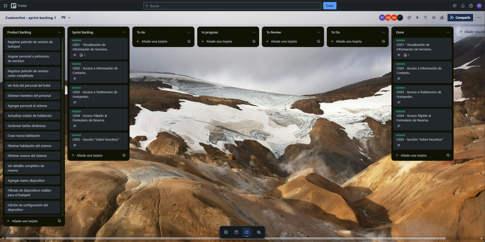
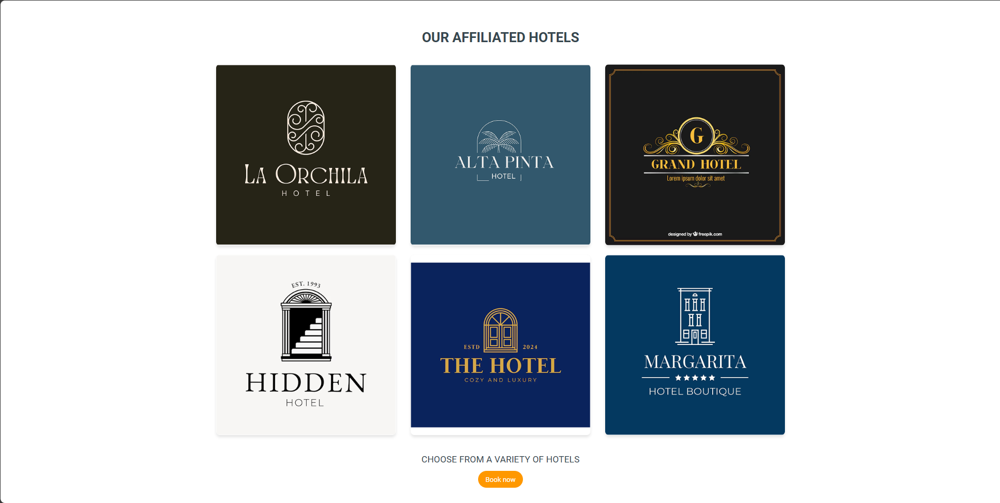
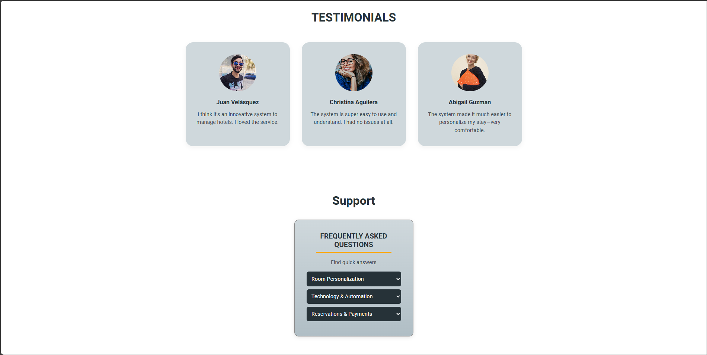
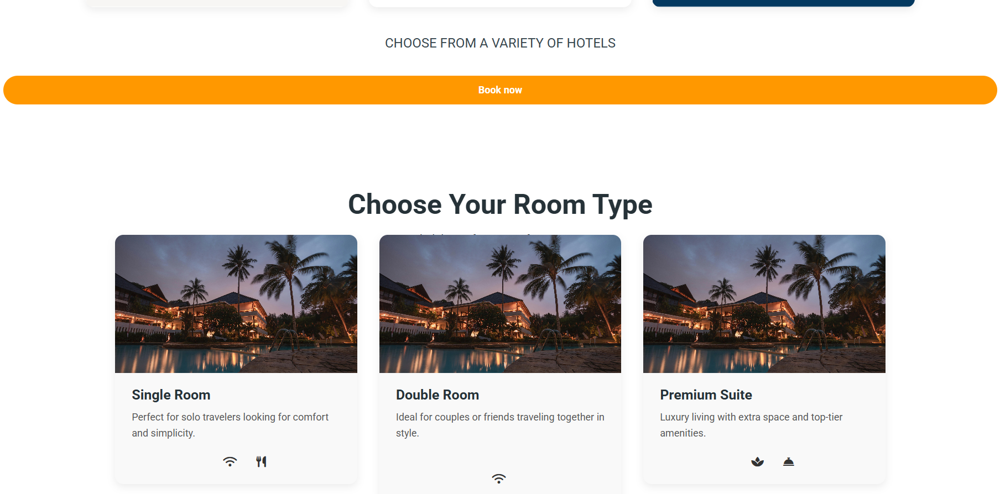
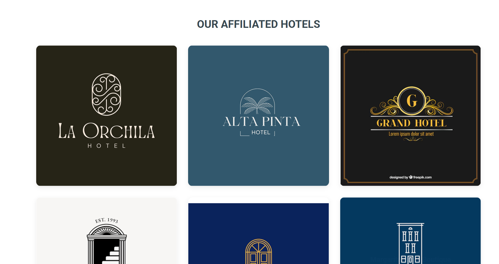
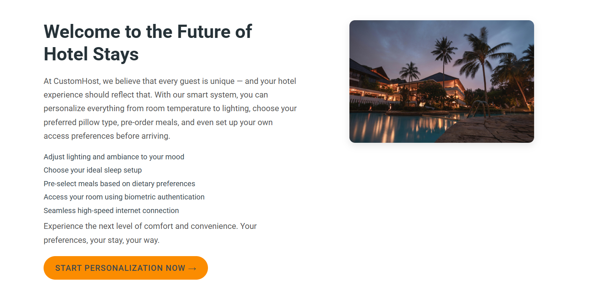
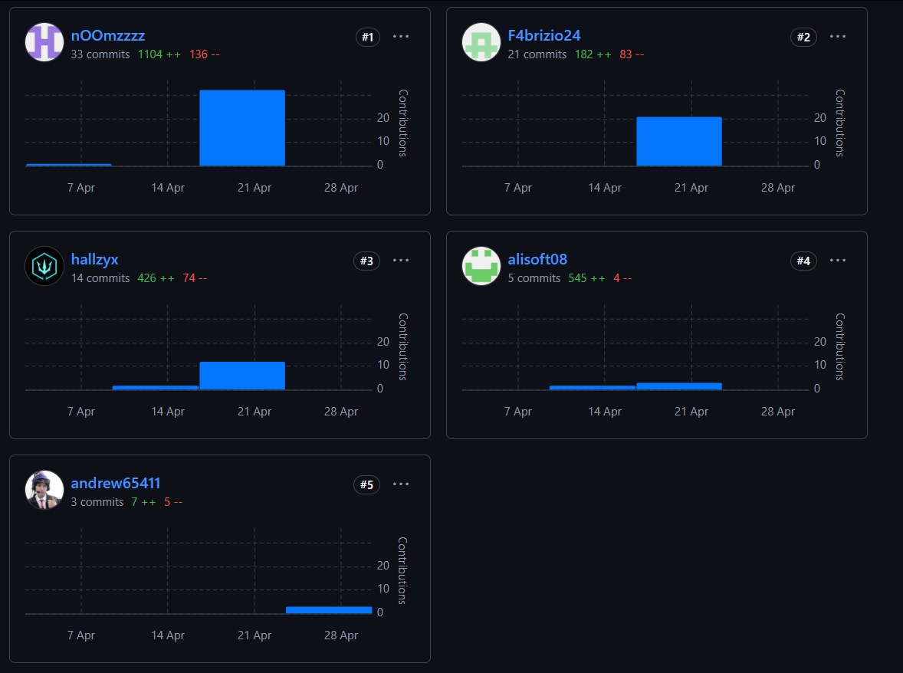
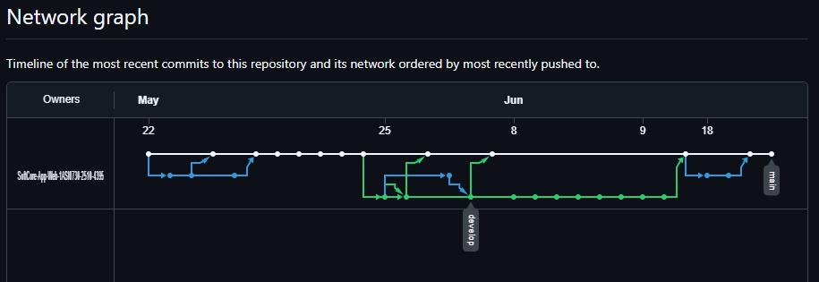
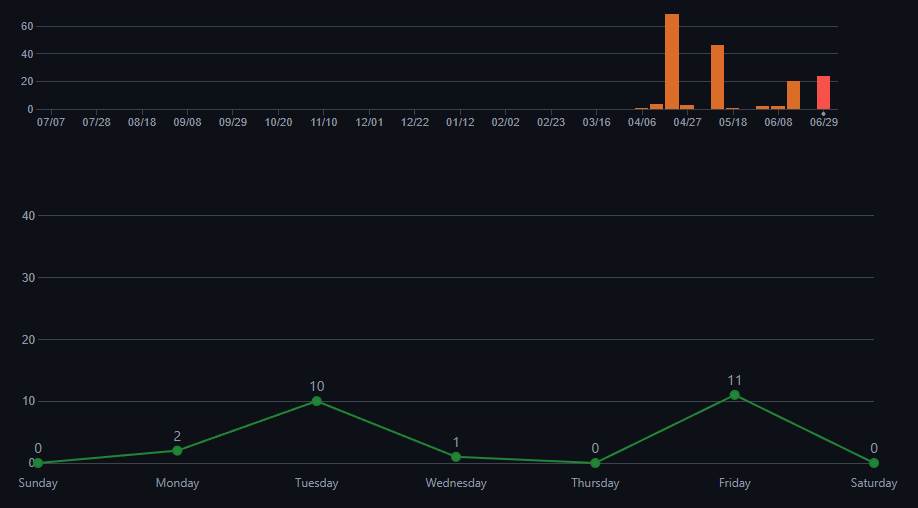

### 5.2.1 Sprint 1

#### 5.2.1.1. Sprint Planning 1

Aquí se registran los detalles de la planeación del Sprint 1.

| **Sprint #** | Sprint 1 |
|---|---|
| **Sprint Planning Background** |                                  |
| **Fecha** | 04/04/2024 |
| **Hora** | 16:00 pm (GMT-5) |
| **Ubicación** | Lima, Reunión virtual por Discord |
| **Preparado por** | SoftCore Team |
| **Participantes (reunión de planificación)** | Arrieta Quispe, Alison Jimena / Ordoñez Ricaldi, Axel Randall / Ccarita Cruz, Brayan Roberto / Santiago Peña, Andreow Jomark / Panta Castro, Fabrizio Martin |
| **Sprint Goal & User Stories** | Nuestro enfoque es diseñar, desarrollar y desplegar una landing page efectiva que comunique claramente el valor de Custom Host y motive a los visitantes a solicitar demostraciones o registrarse. Creemos que una landing page bien estructurada generará confianza en nuestra marca y aumentará las conversiones. Esto se confirmará cuando los usuarios puedan explorar las secciones principales de la plataforma utilizando tanto herramientas visuales como tecnologías de asistencia. |
| **Velocidad del Sprint 1** | 14 |   
| **Suma de Puntos de Historia** | 14 |

#### 5.2.1.2. Aspect Leaders and Collaborators

En este apartado se detallan los elementos funcionales más relevantes abordados durante el primer Sprint de desarrollo de la plataforma Custom Host.

Para cada uno de estos aspectos, se ha designado:
- **Un Líder (L):** responsable principal de su ejecución.
- **Colaboradores (C):** miembros del equipo que participaron en la implementación, revisión o soporte de las tareas.

| Team Member                         | GitHub Username   | UX-UI | Home Page   | About Us | Services | Internationalization |
|-------------------------------------|-------------------|-------|-------------|----------|----------|----------------------|
| Arrieta Quispe, Alison Jimena       | alisoft08         | C     | C           | L        | C        | C                    |
| Ccarita Cruz, Roberto Brayan        | hallzyx           | C     | C           | C        | C        | L                    |
| Ordoñez Ricaldi, Axel Randall       | nOOmzzzz          | C     | L           | C        | C        | C                    |
| Panta Castro, Fabrizio Martin       | F4brizio24        | C     | C           | C        | L        | C                    |
| Santiago Peña, Andreow Jomark       | andrew65411       | L     | C           | C        | C        | C                    |

 

#### 5.2.1.3 Sprint Backlog 1
En esta sección se presentará el sprint backlog del sprint 1, administrado principalmente por la plataforma de Trello. Se mostrará un tablero que se ha utilizado para organizar y gestionar las tareas del equipo en el sprint, permitiendo una visualización clara del progreso y la asignación de responsabilidades. 

**Link al trello:** <https://trello.com/b/b6T8Leob/customhot-sprint-backlog-1>

#### 5.2.1.4. Development Evidence for Sprint Review

| Repository | Branch | Commit Message | Committed on (Date) |
|------------|--------|----------------|---------------------|
| github.com/SoftCore-App-Web-1ASI0730-2510-4395 | main                                     | chroe: initial commit | May 22, 2025 |
| github.com/SoftCore-App-Web-1ASI0730-2510-4395 | feature/index                            | chore: add pages | May 22, 2025 |
| github.com/SoftCore-App-Web-1ASI0730-2510-4395 | feature/index                            | chore: update | May 22, 2025 |
| github.com/SoftCore-App-Web-1ASI0730-2510-4395 | main                                     | Merge pull request #1 from SoftCore-App-Web-1ASI0730-2510-4395/feature/index | May 22, 2025 |
| github.com/SoftCore-App-Web-1ASI0730-2510-4395 | feature/index                            | chore: update | May 22, 2025 |
| github.com/SoftCore-App-Web-1ASI0730-2510-4395 | main                                     | Merge pull request #2 from SoftCore-App-Web-1ASI0730-2510-4395/feature/index | May 22, 2025 |
| github.com/SoftCore-App-Web-1ASI0730-2510-4395 | main                                     | Update about-us.html | May 22, 2025 |
| github.com/SoftCore-App-Web-1ASI0730-2510-4395 | main                                     | Update styles.css | May 22, 2025 |
| github.com/SoftCore-App-Web-1ASI0730-2510-4395 | main                                     | refactor: update about us css | May 22, 2025 |
| github.com/SoftCore-App-Web-1ASI0730-2510-4395 | main                                     | fix: refactor code | May 22, 2025 |
| github.com/SoftCore-App-Web-1ASI0730-2510-4395 | feature/i18n                             | feat: i18n toggle and translate | May 25, 2025 |
| github.com/SoftCore-App-Web-1ASI0730-2510-4395 | main                                     | Merge pull request #3 from SoftCore-App-Web-1ASI0730-2510-4395/feature/i18n | May 25, 2025 |
| github.com/SoftCore-App-Web-1ASI0730-2510-4395 | develop                                  | Merge pull request #4 from SoftCore-App-Web-1ASI0730-2510-4395/develop | May 25, 2025 |
| github.com/SoftCore-App-Web-1ASI0730-2510-4395 | feature/i18n                             | fix: translation missing | May 25, 2025 |
| github.com/SoftCore-App-Web-1ASI0730-2510-4395 | main                                     | Merge pull request #5 from SoftCore-App-Web-1ASI0730-2510-4395/feature/i18n | May 25, 2025 |
| github.com/SoftCore-App-Web-1ASI0730-2510-4395 | develop                                  | Merge pull request #6 from SoftCore-App-Web-1ASI0730-2510-4395/develop | May 25, 2025 |
| github.com/SoftCore-App-Web-1ASI0730-2510-4395 | feature/split-services                   | feat: split services into for-hotels and for-guests pages | June 08, 2025 |
| github.com/SoftCore-App-Web-1ASI0730-2510-4395 | feature/split-services                   | feat(header): update navigation with new sections For Hotels and For Guests | June 08, 2025 |
| github.com/SoftCore-App-Web-1ASI0730-2510-4395 | feature/split-services                   | feat(for-guests): improve HTML structure and add enhanced CSS styles | June 08, 2025 |
| github.com/SoftCore-App-Web-1ASI0730-2510-4395 | feature/split-services                   | feat(header): remove Services section from all headers | June 08, 2025 |
| github.com/SoftCore-App-Web-1ASI0730-2510-4395 | feature/split-services                   | chore: delete services.html and associated CSS files | June 08, 2025 |
| github.com/SoftCore-App-Web-1ASI0730-2510-4395 | feature/split-services                   | fix(styles): correct hero section background color in styles.css | June 08, 2025 |
| github.com/SoftCore-App-Web-1ASI0730-2510-4395 | feature/split-services                   | fix(for-guests): remove flickering in hero section and optimize hotel card hover effects | June 09, 2025 |
| github.com/SoftCore-App-Web-1ASI0730-2510-4395 | feature/split-services                   | feat(for-hotels): improve layout and styling for better user experience | June 09, 2025 |
| github.com/SoftCore-App-Web-1ASI0730-2510-4395 | main                                     | Merge pull request #7 from SoftCore-App-Web-1ASI0730-2510-4395/feature/split-services | June 09, 2025 |
| github.com/SoftCore-App-Web-1ASI0730-2510-4395 | feature/about-us-integrants-landingpage | feat(about-us): add photo to assets and update CSS and HTML styling | June 18, 2025 |
| github.com/SoftCore-App-Web-1ASI0730-2510-4395 |  feature/about-us-integrants-landingpage | feat(images): add images to HTML content | June 18, 2025 |
| github.com/SoftCore-App-Web-1ASI0730-2510-4395 | main                                     | Merge pull request #8 from SoftCore-App-Web-1ASI0730-2510-4395/feature/about-us-integrants-landingpage | June 18, 2025 |
| github.com/SoftCore-App-Web-1ASI0730-2510-4395 | main                                     | fix(guest): correct services for guest functionality | June 18, 2025 |

#### 5.2.1.5. Execution Evidence for Sprint Review

**Sprint 1:** En este entregable, hemos logrado desarrollar la Landing Page para nuestra StartUp SoftCore. El link de la Landing Page es el siguiente: <https://shorturl.at/MrwZA>

<h3>SHome Pageervices</h3>

 

<h3>About Us</h3>

 

<h3>Services</h3>

 

#### 5.2.1.6. Services Documentation Evidence for Sprint Review
**Resultados del Sprint 1: Desarrollo de la Landing Page**

Durante este sprint, el equipo completó con éxito el desarrollo e implementación de la Landing Page de Custom Host. Al tratarse de un sitio estático enfocado en presentar información clave, no requirió la integración de Web Services ni documentación técnica compleja. Este enfoque permitió optimizar recursos y cumplir con los plazos establecidos.

**Gestión del Proyecto**

El desarrollo se gestionó bajo metodología Scrum, con reuniones diarias para monitorear el progreso y resolver obstáculos. Git fue la herramienta principal para el control de versiones, mientras que GitHub facilitó la colaboración remota entre los miembros del equipo. Para mantener un flujo de trabajo organizado, se implementó GitFlow, lo que permitió manejar eficientemente las contribuciones individuales sin afectar la estabilidad del proyecto.

**Herramientas Clave**

GitHub Pages resultó especialmente útil para el despliegue automatizado, eliminando la necesidad de configuración manual de servidores. Otras herramientas complementarias incluyeron Figma para el diseño de interfaces, donde se validaron prototipos antes de su implementación, y ESLint para mantener la calidad del código JavaScript.

#### 5.2.1.7. Software Deployment Evidence for Sprint Review

Durante este sprint, se finalizó el desarrollo del landing page y se implementó su despliegue utilizando las siguientes herramientas:

- **Git:** Utilizado como sistema de control de versiones para facilitar el trabajo en equipo durante el desarrollo del landing page.
- **GitFlow:** Implementado como flujo de trabajo para gestionar el progreso individual de cada miembro del equipo en el desarrollo del landing page.
- **GitHub:** Empleado como plataforma colaborativa para almacenar las versiones del proyecto y facilitar el desarrollo conjunto del equipo.
- **Github Pages:** Utilizado como plataforma para automatizar la hospedaje y despliegue del landing page, especialmente diseñada para sitios web estáticos.

**Video del Sprint 1:** <https://shorturl.at/y2jj2>

#### 5.2.1.8. Team Collaboration Insights during Sprint

El equipo desarrolló el sistema de gestión hotelera utilizando una estrategia basada en ramas para cada componente o funcionalidad. Esta metodología permitió que cada miembro del equipo trabajara de forma independiente en elementos como la página de inicio, el selector de idioma, la gestión de peticiones y el panel de administración, sin interferir con el trabajo de los demás. Una vez finalizada cada funcionalidad, se verificó que no existieran conflictos con la rama principal (main) y se generó una pull request para integrar los cambios de forma controlada. A continuación, se adjunta una imagen que evidencia la colaboración del equipo en GitHub.

- En la siguiente imagen se muestra el número de commits hechos por cada miembro del equipo en el repositorio:

- En la siguiente imagen se muestra el network de los commits del repositorio:

- En la siguiente imagen se muestra la cantidad de commits hechos en los últimos días:

