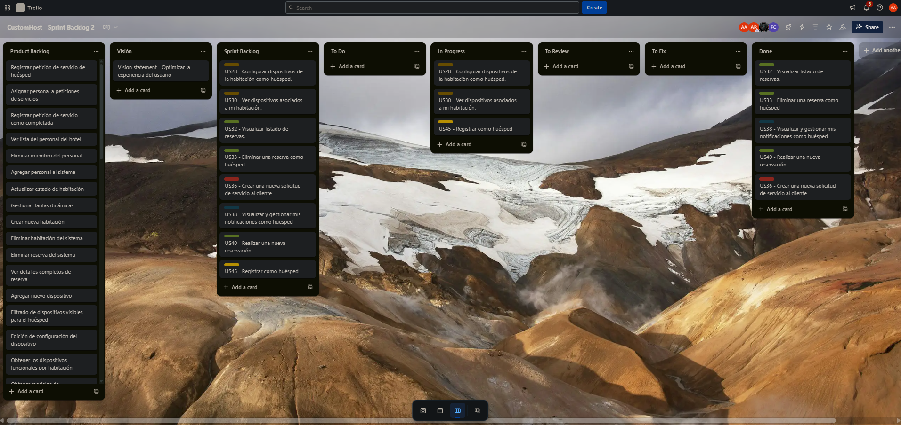

### 5.2.2 Sprint 2

#### 5.2.2.1. Sprint Planning 2

Aquí se registran los detalles de la planeación del Sprint 2.

| **Sprint #** | Sprint 2 |
|---|---|
| **Sprint Planning Background** |                                  |
| **Fecha** | 07/05/2025 |
| **Hora** | 14:00 horas (GMT-5) |
| **Ubicación** | Lima, Reunión virtual por Discord |
| **Preparado por** | SoftCore Team |
| **Participantes (reunión de planificación)** | Arrieta Quispe, Alison Jimena / Ordoñez Ricaldi, Axel Randall / Ccarita Cruz, Brayan Roberto / Santiago Peña, Andreow Jomark / Panta Castro, Fabrizio Martin |
| **Resumen del Sprint n – 1 Review** | Sprint 1: En el anterior sprint hemos diseñado un landing page con seccion hero, beneficios, introduccion, valores y contacto. Hemos cumplido con todas las historias de usuario formuladas. |
| **Resumen del Sprint n – 1 Retrospective** | Sprint 1: En el anterior sprint hemos diseñado una landing page, tuvimos algunos problemas al inicio pero luego supimos manejar y ordenar todo por branches y lograr llegar a un buen resultado con uso de html, css y js. |
| **Sprint Goal & User Stories** | Desarrollar y completar el frontend de la aplicación, asegurando una interfaz de usuario intuitiva y funcional que cumpla con los requisitos y especificaciones establecidas. |
| **Velocidad del Sprint 1** |  15|
| **Suma de Puntos de Historia** | 23 |

#### 5.2.2.2. Aspect Leaders and Collaborators

| Team Member                      | GitHub Username | Performance Leader(L)/Collaborator(C) | UX-UI Leader(L)/Collaborator(C) | Funcionalidad Leader(L)/Collaborator(C) |
|-----------------------------------|----------------|------------------------------------------|-------------------------------------|--------------------------------------------|
| Arrieta Quispe, Alison Jimena     | alisoft08      | C                                        | L                                   | C                                          |
| Ccarita Cruz, Roberto Brayan      | hallzyx        | C                                        | C                                   | L                                          |
| Ordoñez Ricaldi, Axel Randall     | nOOmzzzz       | C                                        | C                                   | C                                          |
| Panta Castro, Fabrizio Martin     | F4brizio24     | C                                        | C                                   | C                                          |
| Santiago Peña, Andreow Jomark     | andrew65411    | L                                        | C                                   | C                                          |

#### 5.2.2.3 Sprint Backlog 2

**Link al trello:** <https://trello.com/b/DsZNhyHA/customhost-sprint-backlog-2>

#### 5.2.2.4. Development Evidence for Sprint Review

| Repository     | Branch                    | Commit Message                          | Committed on (Date) |
|----------------|----------------------------|------------------------------------------|---------------------|
| customhost     | develop                    | Merge pull request #5 from feature/home-page | 13/05/2024          |
| customhost     | feature/basic-routing      | feat: added Angular basic routing module | 10/05/2024          |
| customhost     | feature/i18n               | feat: integrated ngx-translate and language switcher | 11/05/2024          |
| customhost     | feature/json               | feat: added assets json for dynamic data | 11/05/2024          |
| customhost     | feature/guest-experience   | feat: created guest experience component | 12/05/2024          |
| customhost     | feature/home-page          | feat: designed and structured homepage layout | 13/05/2024          |

#### 5.2.2.5. Execution Evidence for Sprint Review

**Sprint 2:** En este entregable, hemos logrado desarrollar el Frontend de la aplicación para nuestra StartUp SoftCore. El link del Frontend Application es el siguiente: <https://customhost-app.vercel.app>

**Página de Administración de Habitaciones:** En esta sección, se ha implementado una página de administración de habitaciones que permite al staff del hotel gestionar las habitaciones del hotel. Esta página incluye funcionalidades para agregar, editar y eliminar habitaciones, así como para visualizar la lista de habitaciones disponibles.

**Página de Administración de Peticiones del Huésped:** En esta sección, se ha implementado una página de administración de peticiones del huésped que permite al staff del hotel gestionar las peticiones realizadas por los huéspedes. Esta página incluye funcionalidades para agregar, editar el estado y eliminar peticiones, así como para visualizar la lista de peticiones realizadas.

**Página de administración del Personal del Hotel**: En esta sección, se ha implementado una página de administración del personal del hotel que permite al administrador del hotel gestionar la información del personal. Esta página incluye funcionalidades para agregar, editar datos y eliminar personal, así como para visualizar la lista de personal registrado.

#### 5.2.2.6. Services Documentation Evidence for Sprint Review

En este sprint se cumplió el objetivo de desarrollar la Front-End Applications; sin embargo, al ser Front-End Applications no requiere de documentación relacionada a Web Services.

#### 5.2.1.7. Software Deployment Evidence for Sprint Review

En este sprint, se completó el desarrollo de la Frontend Application y se utilizó un conjunto de herramientas para su despliegue:

- **Git:** Utilizado como sistema de control de versiones para facilitar el trabajo en equipo durante el desarrollo de la Frontend Application.
- **GitFlow:** Implementado como flujo de trabajo para gestionar el progreso individual de cada miembro del equipo en el desarrollo de la Frontend Application.
- **GitHub:** Empleado como plataforma colaborativa para almacenar las versiones del proyecto y facilitar el desarrollo conjunto del equipo.
- **Vercel:** Utilizado como plataforma para automatizar el despliegue del front-end application.

**Video del Sprint 2:** <https://tinyurl.com/sprint-video-2>

#### 5.2.1.8. Team Collaboration Insights during Sprint

Las siguientes capturas se sacaron del repositorio front-end de la Organización Github: <https://github.com/SoftCore-App-Web-1ASI0730-2510-4395/customhost-frontend>

