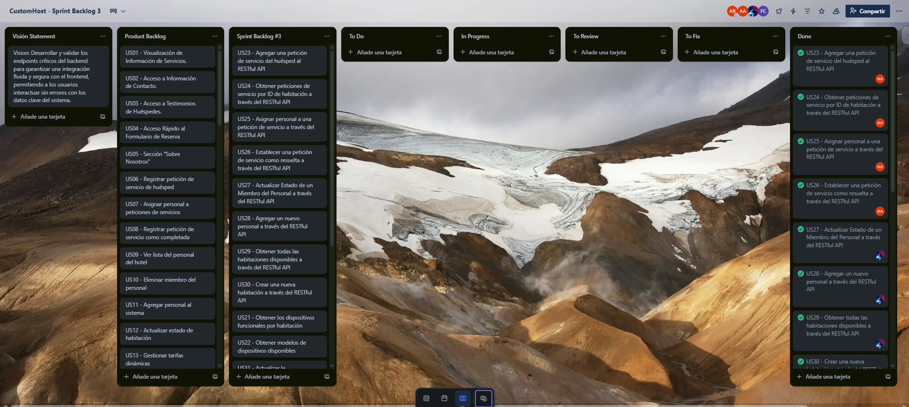
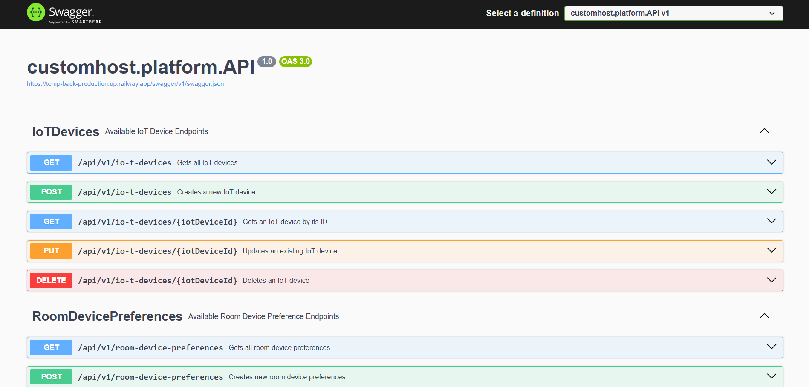
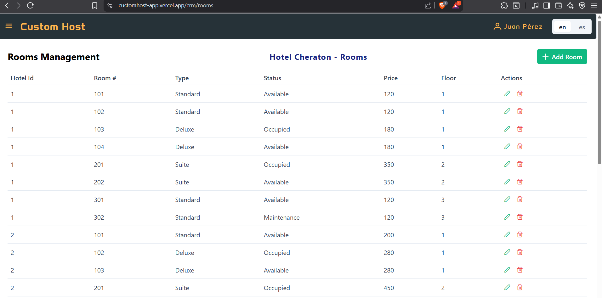

### 5.2.3 Sprint 3

#### 5.2.3.1. Sprint Planning 3

A continuación, se presenta el planificación detallada del Sprint 3, centrado en el desarrollo técnico y la integración del backend con el frontend previamente construido.

| **Sprint #** | Sprint 3 |
|---|---|
| **Sprint Planning Background** |                                  |
| **Fecha de inicio** | 08/06/2025 |
| **Fecha de finalización** | 19/06/2025 |
| **Duración estimada** | 12 días laborales |
| **Ubicación** | Lima, Reunión virtual por la plataforma Discord |
| **Preparado por** | SoftCore Team |
| **Participantes (reunión de planificación)** | Arrieta Quispe, Alison Jimena / Ordoñez Ricaldi, Axel Randall / Ccarita Cruz, Brayan Roberto / Santiago Peña, Andreow Jomark / Panta Castro, Fabrizio Martin |
| **Revisión de entregables anteriores** | Sprint 1: Desarrollo de la landing page Sprint 2: Implementación del frontend funcional |
| **Resumen del Sprint 2 Retrospective** | Sprint 2: Se validó la importancia de un diseño UX/UI sólido y se avanzó significativamente en componentes visuales, pero se identificó la necesidad de desarrollar e integrar funcionalidades técnicas mediante un backend robusto. |
| **Sprint Goal & User Stories:**|"Nuestro enfoque está en que los usuarios vean reflejados sus datos clave en la interfaz de CustomHost. Creemos que esto les dará confianza en que el sistema funciona correctamente. Esto se confirmará cuando mas del 90% de las interacciones con los datos no generen errores."|
|**Velocidad del Sprint 1**|60 sp|
|**Suma de Puntos de Historia**|60 sp|

#### 5.2.3.2. Aspect Leaders and Collaborators
En CustomHost implementamos la matriz LACX para asignar claramente líderes (L) y colaboradores (C) en cada aspecto clave del Sprint 3, garantizando una ejecución eficiente de nuestros objetivos. Esta herramienta nos permite optimizar la coordinación entre los equipos de frontend y backend asegurando que cada feature priorizada tenga un responsable directo y el apoyo necesario, lo que fortalece nuestra capacidad para entregar valor de manera consistente y alineada con los requerimientos del proyecto.

| Miembro del Equipo        | GitHub Username   |Endpoints Backend (L/C)|Integración Frontend-Backend (L/C)|Validación de Calidad (L/C)|
|--------------------------|-------------------|----------------------------------------|-|-|
| **Axel Ordoñez**         | nOOmzzzz          |C|L|C|
| **Fabrizio Panta**       | F4brizio24        |C|C|L|
| **Brayan Ccarita**       | hallzyx           |L|C|C|
| **Alison Arrieta**       | alisoft08         |C|C|C|
| **Andreow Santiago**     | andrew65411       |C|C|C|

#### 5.2.3.3 Sprint Backlog 3

Para el Sprint 3 de CustomHost, enfocado en el desarrollo del backend y la integración con el frontend, gestionamos nuestro backlog en Trello, donde priorizamos y estimamos las caracteristicas clave como el desarrollo de endpoints y las pruebas de integración. Completamos el 100% de las tarjetas planificadas, cumpliendo con los criterios de aceptación: endpoints 100% funcionales. Esta organización en Trello con listas como "To-Do", "In Progress", "To Review", "To Fix" y "Done" nos permitió alinear al equipo backend/frontend y garantizar que cada componente cumpla con los requisitos del sistema.

**Link del trello:** [sprint backlog 3 trello](https://trello.com/b/ZnYqLXJN/customhost-sprint-backlog-3)

#### 5.2.3.4. Development Evidence for Sprint Review

Para el Sprint 3 implementamos una estrategia de desarrollo colaborativo utilizando Git y GitHub como herramientas centrales. Seguimos el flujo GitFlow, creando ramas específicas para cada funcionalidad desde la rama develop. Todos los commits siguieron el estándar de Conventional Commits para mantener un historial claro y comprensible.

Cada cambio requirió la creación de Pull Requests que fueron revisados y aprobados por al menos un compañero del equipo, garantizando calidad y consistencia en el código. Esta metodología nos permitió integrar progresivamente los endpoints del backend.

El proceso de revisión colaborativa facilitó la detección temprana de errores. Como resultado, logramos una integración exitosa con el 100% de los endpoints funcionando correctamente, cumpliendo así con los objetivos del sprint y demostrando nuestra capacidad para trabajar en un entorno colaborativo de desarrollo de software.

A continuación, se detallan los enlaces a los repositorios utilizados durante el Sprint 3:

Frontend: https://github.com/SoftCore-App-Web-1ASI0730-2510-4395/customhost-frontend

Backend: https://github.com/SoftCore-App-Web-1ASI0730-2510-4395/customhost-backend

|Repository|Branch|Commit Id|Commit Message|Commited on|
|-|-|-|-|-|
|SoftCore-App-Web-1ASI0730-2510-4395/customhost-backend|feature/crm|cb05494|feat: Add Room endpoints|19/06/2025|
|SoftCore-App-Web-1ASI0730-2510-4395/customhost-backend|feature/crm|2fabf99|feat: add request service endpoint|19/06/2025|
|SoftCore-App-Web-1ASI0730-2510-4395/customhost-backend|feature/crm|7e2d1e5|feat(crm): Add command and resource for assigning staff to service requests|19/06/2025|
|SoftCore-App-Web-1ASI0730-2510-4395/customhost-backend|feature/crm|2b7882c|feat(crm): Update CreateRoomResource and assembler to include additional properties and improve transformation logic|19/06/2025|
|SoftCore-App-Web-1ASI0730-2510-4395/customhost-backend|develop|45f1cc4|Merge pull request #10 from SoftCore-App-Web-1ASI0730-2510-4395/feature/crm|19/06/2025|
|SoftCore-App-Web-1ASI0730-2510-4395/customhost-backend|feature/guest-experience|d29306f|feat: create guest-experience command services.|19/06/2025|
|SoftCore-App-Web-1ASI0730-2510-4395/customhost-backend|feature/guest-experience|be053e4|feat: create guest experience query services.|19/06/2025|
|SoftCore-App-Web-1ASI0730-2510-4395/customhost-backend|feature/guest-experience|cde8a84|feat: create guest experience configuration.|19/06/2025|
|SoftCore-App-Web-1ASI0730-2510-4395/customhost-backend|feature/guest-experience|479a0c5|feat: create guest experience controllers.|19/06/2025|
|SoftCore-App-Web-1ASI0730-2510-4395/customhost-backend|develop|d5b0822|Merge pull request #9 from SoftCore-App-Web-1ASI0730-2510-4395/feat/guest-experience|19/06/2025|
|SoftCore-App-Web-1ASI0730-2510-4395/customhost-backend|feature/analytics|d325ed0|feat(analytics): Domain layer added|19/06/2025|
|SoftCore-App-Web-1ASI0730-2510-4395/customhost-backend|feature/analytics|e95258a|feat(analytics): Application layer added|19/06/2025|
|SoftCore-App-Web-1ASI0730-2510-4395/customhost-backend|develop|a1e601b|Merge pull request #7 from SoftCore-App-Web-1ASI0730-2510-4395/feature/analytics-bounded-context|19/06/2025|
|SoftCore-App-Web-1ASI0730-2510-4395/customhost-backend|feature/billings|e802093|feat(billings): Add EPaymentStatus enum and extend ERoomStatus for enhanced status management|19/06/2025|
|SoftCore-App-Web-1ASI0730-2510-4395/customhost-backend|feature/billings|6fa2d0b|feat(billings): Add EmailAddress value object and EPaymentMethod enum for improved data handling|19/06/2025|
|SoftCore-App-Web-1ASI0730-2510-4395/customhost-backend|feature/billings|e4adcf4|feat(billings): Add Payment aggregate root and command/query services with repository interfaces|19/06/2025|
|SoftCore-App-Web-1ASI0730-2510-4395/customhost-backend|feature/profiles|59955b4|feat(profile): create profile folders structure|19/06/2025|
|SoftCore-App-Web-1ASI0730-2510-4395/customhost-backend|feature/profiles|f66ab9c|feat(profiles): implement IUserCommandService interface|19/06/2025|
|SoftCore-App-Web-1ASI0730-2510-4395/customhost-backend|develop|9d830c9|Merge pull request #8 from SoftCore-App-Web-1ASI0730-2510-4395/config/profiles-setup|19/06/2025|
|-|-|-|-|-|

Estos commits reflejan el trabajo técnico constante y distribuido entre todos los miembros del equipo, enfocado en el backend, integración con frontend, despliegue y revisión final del informe.

#### 5.2.3.5. Execution Evidence for Sprint Review
En el Sprint 3 implementamos con éxito las siguientes funcionalidades clave en el sistema CustomHost:

- Endpoints críticos del backend completamente funcionales para:

  - Configuración de preferencias

  - Dashboard administrativo

- Integración frontend-backend con:

  - Consumo estable de APIs mediante Axios

  - Manejo de errores y loading states

  - Validación de respuestas HTTP y formatos JSON

Captura del backend ejecutándose en Railway:

Captura del frontend ejecutándose en vercel:

URL del sistema funcional (Frontend + Backend): <https://customhost-app.vercel.app/guest-home>

#### 5.2.3.6. Services Documentation Evidence for Sprint Review

Durante este sprint se avanzó en la implementación técnica del sistema, por lo que se generaron documentos esenciales relacionados con:

- Estructura e interfaz de APIs RESTful.
- Endpoints funcionales para gestión de usuarios, reservas, preferencias y dispositivos IoT.
- Documentación técnica del backend y su configuración segura.
- Especificaciones OpenAPI (Swagger) para documentación y pruebas.
- Diagramas C4 Model actualizados.
- Guiones para entrevistas de validación de usuario.

Todo esto se complementó con el análisis de resultados obtenidos en las entrevistas de validación y su aplicación directa al diseño final del sistema.

#### 5.2.3.7. Software Deployment Evidence for Sprint Review

Para el Sprint 3 implementamos con éxito el despliegue continuo de nuestros servicios backend en Railway, garantizando la disponibilidad de los endpoints desarrollados. Configuramos la integración directa con nuestro repositorio GitHub, lo que permitió despliegues automáticos con cada push a la rama main, asegurando que las últimas actualizaciones estuvieran siempre disponibles en producción. El despliegue incluyó la creación de ambientes separados para staging y producción, facilitando las pruebas de integración antes del lanzamiento final. Esta implementación nos permitió validar que todos los endpoints funcionaran correctamente en un entorno colaborativo real.

Video del Sprint 3: [sprint 3 - video](https://upcedupe-my.sharepoint.com/personal/u202317362_upc_edu_pe/_layouts/15/stream.aspx?id=%2Fpersonal%2Fu202317362_upc_edu_pe%2FDocuments%2Fvideo2798432421%2Emp4&referrer=StreamWebApp%2EWeb&referrerScenario=AddressBarCopied%2Eview%2E3e0a06d8-3cbe-4574-9316-b337c5788c56&isDarkMode=true)

#### 5.2.3.8. Team Collaboration Insights during Sprint

Bajo el liderazgo de Roberto Ccarita Cruz, el equipo implementó una estrategia estructurada para el desarrollo del backend y su integración con el frontend. La organización se centró en tres pilares:

- Distribución de responsabilidades:

  - Se coordinó el desarrollo de endpoints críticos.

  - Los miembros del equipo asumieron roles específicos: desarrollo de APIs, pruebas de integración y soporte frontend.

- Gestión de código con GitFlow:

  - Cada funcionalidad se desarrolló en ramas feature/, creadas desde develop.

  - Se implementaron Pull Requests con revisión obligatoria y verificaciones automáticas.

- Métricas de colaboración en GitHub:

- Commits estructurados: Mensajes siguiendo Conventional Commits.

- Trazabilidad: 100% de las tareas vinculadas a issues cerrados, con participación balanceada

- Resultados clave:

  - Todos los endpoints se integraron exitosamente con el frontend.

  - Cumplimiento del 100% de los criterios de aceptación.

La dinámica colaborativa durante el Sprint 3 fue muy activa, con roles bien definidos y participación constante de todos los miembros del equipo: [Repositorio Backend](https://github.com/SoftCore-App-Web-1ASI0730-2510-4395/customhost-backend)

- **Commits frecuentes y distribuidos:**  
  

- **Network Graph:**  
  

Este flujo de trabajo permitió un desarrollo ordenado, controlado y orientado a calidad, escalabilidad y mantenimiento futuro del sistema.

